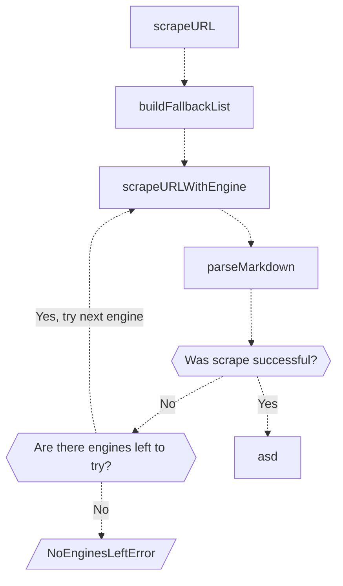

<file_map>
├── firecrawl-plus
│   ├── .github
│   ├── apps
│   │   ├── api
│   │   │   ├── sharedLibs
│   │   │   │   ├── go-html-to-md
│   │   │   │   │   ├── go.mod
│   │   │   │   │   ├── go.sum
│   │   │   │   │   ├── html-to-markdown.go
│   │   │   │   │   └── README.md
│   │   │   │   └── html-transformer
│   │   │   │       ├── src
│   │   │   │       │   └── lib.rs
│   │   │   │       ├── Cargo.lock
│   │   │   │       └── Cargo.toml
│   │   │   ├── src
│   │   │   │   ├── __tests__
│   │   │   │   ├── controllers
│   │   │   │   │   ├── __tests__
│   │   │   │   │   │   └── crawl.test.ts
│   │   │   │   │   ├── v0
│   │   │   │   │   │   ├── admin
│   │   │   │   │   │   │   ├── acuc-cache-clear.ts
│   │   │   │   │   │   │   ├── check-fire-engine.ts
│   │   │   │   │   │   │   ├── queue.ts
│   │   │   │   │   │   │   └── redis-health.ts
│   │   │   │   │   │   ├── crawl-cancel.ts
│   │   │   │   │   │   ├── crawl-status.ts
│   │   │   │   │   │   ├── crawl.ts
│   │   │   │   │   │   ├── crawlPreview.ts
│   │   │   │   │   │   ├── keyAuth.ts
│   │   │   │   │   │   ├── liveness.ts
│   │   │   │   │   │   ├── readiness.ts
│   │   │   │   │   │   ├── scrape.ts
│   │   │   │   │   │   ├── search.ts
│   │   │   │   │   │   └── status.ts
│   │   │   │   │   ├── v1
│   │   │   │   │   │   ├── __tests__
│   │   │   │   │   │   │   ├── crawl.test.ts.WIP
│   │   │   │   │   │   │   └── urlValidation.test.ts
│   │   │   │   │   │   ├── batch-scrape.ts
│   │   │   │   │   │   ├── concurrency-check.ts
│   │   │   │   │   │   ├── crawl-cancel.ts
│   │   │   │   │   │   ├── crawl-errors.ts
│   │   │   │   │   │   ├── crawl-status-ws.ts
│   │   │   │   │   │   ├── crawl-status.ts
│   │   │   │   │   │   ├── crawl.ts
│   │   │   │   │   │   ├── credit-usage.ts
│   │   │   │   │   │   ├── extract-status.ts
│   │   │   │   │   │   ├── extract.ts
│   │   │   │   │   │   ├── liveness.ts
│   │   │   │   │   │   ├── map.ts
│   │   │   │   │   │   ├── readiness.ts
│   │   │   │   │   │   ├── scrape-status.ts
│   │   │   │   │   │   ├── scrape.ts
│   │   │   │   │   │   ├── search.ts
│   │   │   │   │   │   └── types.ts
│   │   │   │   │   └── auth.ts
│   │   │   │   ├── lib
│   │   │   │   │   ├── __tests__
│   │   │   │   │   ├── extract
│   │   │   │   │   │   ├── archive
│   │   │   │   │   │   │   └── crawling-index.ts
│   │   │   │   │   │   ├── completions
│   │   │   │   │   │   │   ├── analyzeSchemaAndPrompt.ts
│   │   │   │   │   │   │   ├── batchExtract.ts
│   │   │   │   │   │   │   ├── checkShouldExtract.ts
│   │   │   │   │   │   │   └── singleAnswer.ts
│   │   │   │   │   │   ├── helpers
│   │   │   │   │   │   │   ├── __tests__
│   │   │   │   │   │   │   │   └── source-tracker.test.ts
│   │   │   │   │   │   │   ├── cached-docs.ts
│   │   │   │   │   │   │   ├── deduplicate-objs-array.ts
│   │   │   │   │   │   │   ├── dereference-schema.ts
│   │   │   │   │   │   │   ├── dump-to-file.ts
│   │   │   │   │   │   │   ├── merge-null-val-objs.ts
│   │   │   │   │   │   │   ├── mix-schema-objs.ts
│   │   │   │   │   │   │   ├── source-tracker.ts
│   │   │   │   │   │   │   ├── spread-schemas.ts
│   │   │   │   │   │   │   └── transform-array-to-obj.ts
│   │   │   │   │   │   ├── index
│   │   │   │   │   │   │   └── pinecone.ts
│   │   │   │   │   │   ├── usage
│   │   │   │   │   │   │   ├── llm-cost.ts
│   │   │   │   │   │   │   └── model-prices.ts
│   │   │   │   │   │   ├── build-document.ts
│   │   │   │   │   │   ├── build-prompts.ts
│   │   │   │   │   │   ├── completions.ts
│   │   │   │   │   │   ├── config.ts
│   │   │   │   │   │   ├── document-scraper.ts
│   │   │   │   │   │   ├── extract-redis.ts
│   │   │   │   │   │   ├── extraction-service.ts
│   │   │   │   │   │   ├── reranker.ts
│   │   │   │   │   │   ├── team-id-sync.ts
│   │   │   │   │   │   └── url-processor.ts
│   │   │   │   │   ├── LLM-extraction
│   │   │   │   │   │   ├── helpers.ts
│   │   │   │   │   │   ├── index.ts
│   │   │   │   │   │   └── models.ts
│   │   │   │   │   ├── batch-process.ts
│   │   │   │   │   ├── cache.ts
│   │   │   │   │   ├── canonical-url.test.ts
│   │   │   │   │   ├── canonical-url.ts
│   │   │   │   │   ├── concurrency-limit.ts
│   │   │   │   │   ├── crawl-redis.test.ts
│   │   │   │   │   ├── crawl-redis.ts
│   │   │   │   │   ├── custom-error.ts
│   │   │   │   │   ├── default-values.ts
│   │   │   │   │   ├── entities.ts
│   │   │   │   │   ├── html-to-markdown.ts
│   │   │   │   │   ├── html-transformer.ts
│   │   │   │   │   ├── job-priority.ts
│   │   │   │   │   ├── logger.ts
│   │   │   │   │   ├── map-cosine.ts
│   │   │   │   │   ├── parse-mode.ts
│   │   │   │   │   ├── parseApi.ts
│   │   │   │   │   ├── ranker.test.ts
│   │   │   │   │   ├── ranker.ts
│   │   │   │   │   ├── scrape-events.ts
│   │   │   │   │   ├── strings.ts
│   │   │   │   │   ├── supabase-jobs.ts
│   │   │   │   │   ├── timeout.ts
│   │   │   │   │   ├── validate-country.ts
│   │   │   │   │   ├── validateUrl.test.ts
│   │   │   │   │   ├── validateUrl.ts
│   │   │   │   │   └── withAuth.ts
│   │   │   │   ├── main
│   │   │   │   │   └── runWebScraper.ts
│   │   │   │   ├── routes
│   │   │   │   │   ├── admin.ts
│   │   │   │   │   ├── v0.ts
│   │   │   │   │   └── v1.ts
│   │   │   │   ├── scraper
│   │   │   │   │   ├── scrapeURL
│   │   │   │   │   │   ├── engines
│   │   │   │   │   │   │   ├── cache
│   │   │   │   │   │   │   │   └── index.ts
│   │   │   │   │   │   │   ├── docx
│   │   │   │   │   │   │   │   └── index.ts
│   │   │   │   │   │   │   ├── fetch
│   │   │   │   │   │   │   │   └── index.ts
│   │   │   │   │   │   │   ├── fire-engine
│   │   │   │   │   │   │   │   ├── checkStatus.ts
│   │   │   │   │   │   │   │   ├── delete.ts
│   │   │   │   │   │   │   │   ├── index.ts
│   │   │   │   │   │   │   │   └── scrape.ts
│   │   │   │   │   │   │   ├── pdf
│   │   │   │   │   │   │   │   └── index.ts
│   │   │   │   │   │   │   ├── playwright
│   │   │   │   │   │   │   │   └── index.ts
│   │   │   │   │   │   │   ├── scrapingbee
│   │   │   │   │   │   │   │   └── index.ts
│   │   │   │   │   │   │   ├── utils
│   │   │   │   │   │   │   │   ├── downloadFile.ts
│   │   │   │   │   │   │   │   ├── safeFetch.ts
│   │   │   │   │   │   │   │   └── specialtyHandler.ts
│   │   │   │   │   │   │   └── index.ts
│   │   │   │   │   │   ├── lib
│   │   │   │   │   │   │   ├── extractLinks.ts
│   │   │   │   │   │   │   ├── extractMetadata.ts
│   │   │   │   │   │   │   ├── fetch.ts
│   │   │   │   │   │   │   ├── mock.ts
│   │   │   │   │   │   │   ├── removeUnwantedElements.ts
│   │   │   │   │   │   │   └── urlSpecificParams.ts
│   │   │   │   │   │   ├── transformers
│   │   │   │   │   │   │   ├── cache.ts
│   │   │   │   │   │   │   ├── index.ts
│   │   │   │   │   │   │   ├── llmExtract.test.ts
│   │   │   │   │   │   │   ├── llmExtract.ts
│   │   │   │   │   │   │   ├── removeBase64Images.ts
│   │   │   │   │   │   │   └── uploadScreenshot.ts
│   │   │   │   │   │   ├── error.ts
│   │   │   │   │   │   ├── index.ts
│   │   │   │   │   │   ├── README.md
│   │   │   │   │   │   └── scrapeURL.test.ts
│   │   │   │   │   └── WebScraper
│   │   │   │   │       ├── __tests__
│   │   │   │   │       │   ├── crawler.test.ts
│   │   │   │   │       │   └── dns.test.ts
│   │   │   │   │       ├── custom
│   │   │   │   │       │   └── handleCustomScraping.ts
│   │   │   │   │       ├── utils
│   │   │   │   │       │   ├── __tests__
│   │   │   │   │       │   │   ├── blocklist.test.ts
│   │   │   │   │       │   │   └── maxDepthUtils.test.ts
│   │   │   │   │       │   ├── blocklist.ts
│   │   │   │   │       │   ├── maxDepthUtils.ts
│   │   │   │   │       │   └── removeBase64Images.ts
│   │   │   │   │       ├── crawler.ts
│   │   │   │   │       ├── sitemap-index.ts
│   │   │   │   │       └── sitemap.ts
│   │   │   │   ├── search
│   │   │   │   │   ├── fireEngine.ts
│   │   │   │   │   ├── googlesearch.ts
│   │   │   │   │   ├── index.ts
│   │   │   │   │   ├── searchapi.ts
│   │   │   │   │   └── serper.ts
│   │   │   │   ├── services
│   │   │   │   │   ├── alerts
│   │   │   │   │   │   ├── index.ts
│   │   │   │   │   │   └── slack.ts
│   │   │   │   │   ├── billing
│   │   │   │   │   │   ├── auto_charge.ts
│   │   │   │   │   │   ├── credit_billing.ts
│   │   │   │   │   │   ├── issue_credits.ts
│   │   │   │   │   │   └── stripe.ts
│   │   │   │   │   ├── idempotency
│   │   │   │   │   │   ├── create.ts
│   │   │   │   │   │   └── validate.ts
│   │   │   │   │   ├── indexing
│   │   │   │   │   │   ├── crawl-maps-index.ts
│   │   │   │   │   │   └── index-worker.ts
│   │   │   │   │   ├── logging
│   │   │   │   │   │   ├── crawl_log.ts
│   │   │   │   │   │   ├── log_job.ts
│   │   │   │   │   │   └── scrape_log.ts
│   │   │   │   │   ├── notification
│   │   │   │   │   │   ├── email_notification.ts
│   │   │   │   │   │   └── notification_string.ts
│   │   │   │   │   ├── posthog.ts
│   │   │   │   │   ├── queue-jobs.ts
│   │   │   │   │   ├── queue-service.ts
│   │   │   │   │   ├── queue-worker.ts
│   │   │   │   │   ├── rate-limiter.test.ts
│   │   │   │   │   ├── rate-limiter.ts
│   │   │   │   │   ├── redis.ts
│   │   │   │   │   ├── redlock.ts
│   │   │   │   │   ├── sentry.ts
│   │   │   │   │   ├── supabase.ts
│   │   │   │   │   ├── system-monitor.ts
│   │   │   │   │   └── webhook.ts
│   │   │   │   ├── control.ts
│   │   │   │   ├── index.ts
│   │   │   │   ├── run-req.ts
│   │   │   │   ├── strings.ts
│   │   │   │   ├── supabase_types.ts
│   │   │   │   └── types.ts
│   │   │   ├── utils
│   │   │   │   ├── logview.js
│   │   │   │   ├── urldump-redis.js
│   │   │   │   └── urldump.js
│   │   │   ├── .dockerignore
│   │   │   ├── .env.example
│   │   │   ├── .gitattributes
│   │   │   ├── .prettierrc
│   │   │   ├── docker-entrypoint.sh
│   │   │   ├── Dockerfile
│   │   │   ├── fly.staging.toml
│   │   │   ├── fly.toml
│   │   │   ├── jest.config.js
│   │   │   ├── jest.setup.js
│   │   │   ├── openapi-v0.json
│   │   │   ├── openapi.json
│   │   │   ├── package.json
│   │   │   ├── pnpm-lock.yaml
│   │   │   ├── requests.http
│   │   │   ├── tsconfig.json
│   │   │   └── v1-openapi.json
│   │   ├── js-sdk
│   │   ├── playwright-service
│   │   │   ├── Dockerfile
│   │   │   ├── get_error.py
│   │   │   ├── main.py
│   │   │   ├── README.md
│   │   │   ├── requests.http
│   │   │   ├── requirements.txt
│   │   │   └── runtime.txt
│   │   ├── playwright-service-ts
│   │   │   ├── helpers
│   │   │   │   └── get_error.ts
│   │   │   ├── api.ts
│   │   │   ├── Dockerfile
│   │   │   ├── package.json
│   │   │   ├── README.md
│   │   │   └── tsconfig.json
│   │   ├── python-sdk
│   │   ├── redis
│   │   │   ├── scripts
│   │   │   │   ├── bump_version.sh
│   │   │   │   ├── semver
│   │   │   │   └── version.sh
│   │   │   ├── .dockerignore
│   │   │   ├── Dockerfile
│   │   │   ├── fly.toml
│   │   │   ├── Procfile
│   │   │   ├── README.md
│   │   │   └── start-redis-server.sh
│   │   ├── rust-sdk
│   │   ├── test-suite
│   │   ├── ui
│   │   │   └── ingestion-ui
│   │   │       ├── public
│   │   │       │   ├── favicon.ico
│   │   │       │   └── vite.svg
│   │   │       ├── src
│   │   │       │   ├── components
│   │   │       │   │   ├── ui
│   │   │       │   │   │   ├── button.tsx
│   │   │       │   │   │   ├── card.tsx
│   │   │       │   │   │   ├── checkbox.tsx
│   │   │       │   │   │   ├── collapsible.tsx
│   │   │       │   │   │   ├── input.tsx
│   │   │       │   │   │   ├── label.tsx
│   │   │       │   │   │   └── radio-group.tsx
│   │   │       │   │   ├── ingestion.tsx
│   │   │       │   │   └── ingestionV1.tsx
│   │   │       │   ├── lib
│   │   │       │   │   └── utils.ts
│   │   │       │   ├── App.tsx
│   │   │       │   ├── index.css
│   │   │       │   ├── main.tsx
│   │   │       │   └── vite-env.d.ts
│   │   │       ├── .eslintrc.cjs
│   │   │       ├── components.json
│   │   │       ├── index.html
│   │   │       ├── LICENSE
│   │   │       ├── package.json
│   │   │       ├── postcss.config.js
│   │   │       ├── README.md
│   │   │       ├── tailwind.config.js
│   │   │       ├── tsconfig.app.json
│   │   │       ├── tsconfig.json
│   │   │       ├── tsconfig.node.json
│   │   │       └── vite.config.ts
│   │   └── www
│   │       └── README.md
│   ├── examples
│   ├── img
│   │   ├── firecrawl_logo.png
│   │   └── open-source-cloud.png
│   ├── .gitattributes
│   ├── .gitmodules
│   ├── CONTRIBUTING.md
│   ├── docker-compose.yaml
│   ├── LICENSE
│   ├── README.md
│   └── SELF_HOST.md


<Referenced APIs>
Path: /Users/sudea/Documents/projects/firecrawl-plus/apps/rust-sdk/src/scrape.rs

---
Classes:
  Class: ExtractOptions
  Class: ScrapeOptions
  Class: ScrapeRequestBody
  Class: ScrapeResponse
    Methods:
      - pub async fn scrape_url(
 &self, url: impl AsRef<str>, options: impl Into<Option<ScrapeOptions>>,
      - pub async fn scrape_url(
 &self, url: impl AsRef<str>, options: impl Into<Option<ScrapeOptions>>,

Enums:
  - ScrapeFormats
    Cases:
      - Markdown
      - HTML
      - RawHTML
      - Links
      - Screenshot
      - ScreenshotFullPage
      - Extract
---


Path: /Users/sudea/Documents/projects/firecrawl-plus/apps/rust-sdk/src/document.rs

---
Classes:
  Class: DocumentMetadata
  Class: Document
---


Path: /Users/sudea/Documents/projects/firecrawl-plus/apps/rust-sdk/src/crawl.rs

---
Classes:
  Class: crawl
    Methods:
      - fn from(value: CrawlScrapeFormats) -> Self {
      - fn from(value: CrawlScrapeFormats) -> Self {
  Class: CrawlScrapeOptions
    Methods:
      - fn from(value: CrawlScrapeOptions) -> Self {
      - fn from(value: CrawlScrapeOptions) -> Self {
  Class: CrawlOptions
  Class: CrawlRequestBody
  Class: CrawlResponse
  Class: CrawlStatus
  Class: CrawlAsyncResponse
    Methods:
      - pub async fn crawl_url_async(
 &self, url: impl AsRef<str>, options: Option<CrawlOptions>,
      - pub async fn crawl_url_async(
 &self, url: impl AsRef<str>, options: Option<CrawlOptions>,
      - pub async fn crawl_url(
 &self, url: impl AsRef<str>, options: impl Into<Option<CrawlOptions>>,
      - async fn check_crawl_status_next(&self, next: impl AsRef<str>) -> Result<CrawlStatus, FirecrawlError> {
      - pub async fn check_crawl_status(&self, id: impl AsRef<str>) -> Result<CrawlStatus, FirecrawlError> {
      - async fn monitor_job_status(
 &self, id: &str, poll_interval: u64,

Enums:
  - CrawlScrapeFormats
    Cases:
      - Markdown
      - HTML
      - RawHTML
      - Links
      - Screenshot
      - ScreenshotFullPage
  - CrawlStatusTypes
    Cases:
      - Scraping
      - Completed
      - Failed
      - Cancelled
---


Path: /Users/sudea/Documents/projects/firecrawl-plus/examples/scrape_and_analyze_airbnb_data_e2b/model.ts

---
Classes:
  Class: model
    Properties:
      - export const MODEL_NAME = 'claude-3-opus-20240229'
      - export const SYSTEM_PROMPT = `
      - export const tools: Tool[] = [
---


Path: /Users/sudea/Documents/projects/firecrawl-plus/apps/playwright-service-ts/api.ts

---
Classes:
  Class: api
    Properties:
      - const app = express();
      - const port = process.env.PORT || 3003;
      - const BLOCK_MEDIA = (process.env.BLOCK_MEDIA || 'False').toUpperCase() === 'TRUE';
      - const PROXY_SERVER = process.env.PROXY_SERVER || null;
      - const PROXY_USERNAME = process.env.PROXY_USERNAME || null;
      - const PROXY_PASSWORD = process.env.PROXY_PASSWORD || null;
      - const AD_SERVING_DOMAINS = [
 'doubleclick.net', 'adservice.google.com', 'googlesyndication.com', 'googletagservices.com', 'googletagmanager.com', 'google-analytics.com', 'adsystem.com', 'adservice.com', 'adnxs.com', 'ads-twitter.com', 'facebook.net', 'fbcdn.net', 'amazon-adsystem.com'
      - let browser: Browser;
      - let context: BrowserContext;
      - const initializeBrowser = async () => {
      - const userAgent = new UserAgent().toString();
      - const viewport = {
      - const contextOptions: any = {
      - const requestUrl = new URL(request.url());
      - const hostname = requestUrl.hostname;
      - const shutdownBrowser = async () => {
      - const isValidUrl = (urlString: string): boolean => {
      - const scrapePage = async (page: any, url: string, waitUntil: 'load' | 'networkidle', waitAfterLoad: number, timeout: number, checkSelector: string | undefined) => {
      - const response = await page.goto(url, {
      - const page = await context.newPage();
      - let pageContent;
      - let pageStatusCode: number | null = null;
      - const result = await scrapePage(page, url, 'load', wait_after_load, timeout, check_selector);
      - const result = await scrapePage(page, url, 'networkidle', wait_after_load, timeout, check_selector);
      - const pageError = pageStatusCode !== 200 ? getError(pageStatusCode) : undefined;
    Methods:
      - const initializeBrowser = async () => {
      - const shutdownBrowser = async () => {
      - const isValidUrl = (urlString: string): boolean => {
      - const scrapePage = async (page: any, url: string, waitUntil: 'load' | 'networkidle', waitAfterLoad: number, timeout: number, checkSelector: string | undefined) => {
---

</Referenced APIs>
</file_map>

<file_contents>
File: apps/api/sharedLibs/go-html-to-md/go.mod
```mod
module html-to-markdown.go

go 1.19

require github.com/tomkosm/html-to-markdown v0.0.0-20250128162844-2f19490e042d

require (
	github.com/PuerkitoBio/goquery v1.9.2 // indirect
	github.com/andybalholm/cascadia v1.3.2 // indirect
	github.com/kr/pretty v0.3.0 // indirect
	golang.org/x/net v0.25.0 // indirect
	gopkg.in/check.v1 v1.0.0-20201130134442-10cb98267c6c // indirect
	gopkg.in/yaml.v2 v2.4.0 // indirect
)

replace github.com/JohannesKaufmann/html-to-markdown => github.com/tomkosm/html-to-markdown v0.0.0-20250128162844-2f19490e042d

```

File: apps/api/sharedLibs/html-transformer/src/lib.rs
```rs
use std::{collections::HashMap, ffi::{CStr, CString}};

use kuchikiki::{parse_html, traits::TendrilSink};
use serde::Deserialize;
use serde_json::Value;
use url::Url;

/// Extracts links from HTML
/// 
/// # Safety
/// Input options must be a C HTML string. Output will be a JSON string array. Output string must be freed with free_string.
#[no_mangle]
pub unsafe extern "C" fn extract_links(html: *const libc::c_char) -> *mut libc::c_char {
    let html = unsafe { CStr::from_ptr(html) }.to_str().unwrap();

    let document = parse_html().one(html);

    let mut out: Vec<String> = Vec::new();

    let anchors: Vec<_> = document.select("a[href]").unwrap().collect();
    for anchor in anchors {
        let mut href = anchor.attributes.borrow().get("href").unwrap().to_string();
        
        if href.starts_with("http:/") && !href.starts_with("http://") {
            href = format!("http://{}", &href[6..]);
        } else if href.starts_with("https:/") && !href.starts_with("https://") {
            href = format!("https://{}", &href[7..]);
        }

        out.push(href);
    }

    CString::new(serde_json::ser::to_string(&out).unwrap()).unwrap().into_raw()
}

macro_rules! insert_meta_name {
    ($out:ident, $document:ident, $metaName:expr, $outName:expr) => {
        if let Some(x) = $document.select(&format!("meta[name=\"{}\"]", $metaName)).unwrap().next().and_then(|description| description.attributes.borrow().get("content").map(|x| x.to_string())) {
            $out.insert(($outName).to_string(), Value::String(x));
        }
    };
}

macro_rules! insert_meta_property {
    ($out:ident, $document:ident, $metaName:expr, $outName:expr) => {
        if let Some(x) = $document.select(&format!("meta[property=\"{}\"]", $metaName)).unwrap().next().and_then(|description| description.attributes.borrow().get("content").map(|x| x.to_string())) {
            $out.insert(($outName).to_string(), Value::String(x));
        }
    };
}

/// Extracts metadata from HTML
/// 
/// # Safety
/// Input options must be a C HTML string. Output will be a JSON object. Output string must be freed with free_string.
#[no_mangle]
pub unsafe extern "C" fn extract_metadata(html: *const libc::c_char) -> *mut libc::c_char {
    let html = unsafe { CStr::from_ptr(html) }.to_str().unwrap();

    let document = parse_html().one(html);
    let mut out = HashMap::<String, Value>::new();

    if let Some(title) = document.select("title").unwrap().next() {
        out.insert("title".to_string(), Value::String(title.text_contents()));
    }
    // insert_meta_name!(out, document, "description", "description");

    if let Some(favicon_link) = document.select("link[rel=\"icon\"]").unwrap().next()
        .and_then(|x| x.attributes.borrow().get("href").map(|x| x.to_string()))
        .or_else(|| document.select("link[rel*=\"icon\"]").unwrap().next()
            .and_then(|x| x.attributes.borrow().get("href").map(|x| x.to_string()))) {
        out.insert("favicon".to_string(), Value::String(favicon_link));
    }

    if let Some(lang) = document.select("html[lang]").unwrap().next().and_then(|x| x.attributes.borrow().get("lang").map(|x| x.to_string())) {
        out.insert("language".to_string(), Value::String(lang));
    }

    // insert_meta_name!(out, document, "keywords", "keywords");
    // insert_meta_name!(out, document, "robots", "robots");
    insert_meta_property!(out, document, "og:title", "ogTitle");
    insert_meta_property!(out, document, "og:description", "ogDescription");
    insert_meta_property!(out, document, "og:url", "ogUrl");
    insert_meta_property!(out, document, "og:image", "ogImage");
    insert_meta_property!(out, document, "og:audio", "ogAudio");
    insert_meta_property!(out, document, "og:determiner", "ogDeterminer");
    insert_meta_property!(out, document, "og:locale", "ogLocale");

    for meta in document.select("meta[property=\"og:locale:alternate\"]").unwrap() {
        let attrs = meta.attributes.borrow();

        if let Some(content) = attrs.get("content") {
            if let Some(v) = out.get_mut("og:locale:alternate") {
                match v {
                    Value::Array(x) => {
                        x.push(Value::String(content.to_string()));
                    },
                    _ => unreachable!(),
                }
            } else {
                out.insert("og:locale:alternate".to_string(), Value::Array(vec! [Value::String(content.to_string())]));
            }
        }
    }

    insert_meta_property!(out, document, "og:site_name", "ogSiteName");
    insert_meta_property!(out, document, "og:video", "ogVideo");
    insert_meta_name!(out, document, "article:section", "articleSection");
    insert_meta_name!(out, document, "article:tag", "articleTag");
    insert_meta_property!(out, document, "article:published_time", "publishedTime");
    insert_meta_property!(out, document, "article:modified_time", "modifiedTime");
    insert_meta_name!(out, document, "dcterms.keywords", "dcTermsKeywords");
    insert_meta_name!(out, document, "dc.description", "dcDescription");
    insert_meta_name!(out, document, "dc.subject", "dcSubject");
    insert_meta_name!(out, document, "dcterms.subject", "dcTermsSubject");
    insert_meta_name!(out, document, "dcterms.audience", "dcTermsAudience");
    insert_meta_name!(out, document, "dc.type", "dcType");
    insert_meta_name!(out, document, "dcterms.type", "dcTermsType");
    insert_meta_name!(out, document, "dc.date", "dcDate");
    insert_meta_name!(out, document, "dc.date.created", "dcDateCreated");
    insert_meta_name!(out, document, "dcterms.created", "dcTermsCreated");

    for meta in document.select("meta").unwrap() {
        let meta = meta.as_node().as_element().unwrap();
        let attrs = meta.attributes.borrow();

        if let Some(name) = attrs.get("name").or_else(|| attrs.get("property")) {
            if let Some(content) = attrs.get("content") {
                if let Some(v) = out.get(name) {
                    match v {
                        Value::String(_) => {
                            if name != "title" { // preserve title tag in metadata
                                out.insert(name.to_string(), Value::Array(vec! [v.clone(), Value::String(content.to_string())]));
                            }
                        },
                        Value::Array(_) => {
                            match out.get_mut(name) {
                                Some(Value::Array(x)) => {
                                    x.push(Value::String(content.to_string()));
                                },
                                _ => unreachable!(),
                            }
                        },
                        _ => unreachable!(),
                    }
                } else {
                    out.insert(name.to_string(), Value::String(content.to_string()));
                }
            }
        }
    }

    CString::new(serde_json::ser::to_string(&out).unwrap()).unwrap().into_raw()
}

const EXCLUDE_NON_MAIN_TAGS: [&str; 41] = [
    "header",
    "footer",
    "nav",
    "aside",
    ".header",
    ".top",
    ".navbar",
    "#header",
    ".footer",
    ".bottom",
    "#footer",
    ".sidebar",
    ".side",
    ".aside",
    "#sidebar",
    ".modal",
    ".popup",
    "#modal",
    ".overlay",
    ".ad",
    ".ads",
    ".advert",
    "#ad",
    ".lang-selector",
    ".language",
    "#language-selector",
    ".social",
    ".social-media",
    ".social-links",
    "#social",
    ".menu",
    ".navigation",
    "#nav",
    ".breadcrumbs",
    "#breadcrumbs",
    ".share",
    "#share",
    ".widget",
    "#widget",
    ".cookie",
    "#cookie",
];

const FORCE_INCLUDE_MAIN_TAGS: [&str; 1] = [
    "#main"
];

#[derive(Deserialize)]
struct TranformHTMLOptions {
    html: String,
    url: String,
    include_tags: Vec<String>,
    exclude_tags: Vec<String>,
    only_main_content: bool,
}

struct ImageSource {
    url: String,
    size: i32,
    is_x: bool,
}

fn _transform_html_inner(opts: TranformHTMLOptions) -> Result<String, ()> {
    let mut document = parse_html().one(opts.html);
    
    if !opts.include_tags.is_empty() {
        let new_document = parse_html().one("<div></div>");
        let root = new_document.select_first("div")?;

        for x in opts.include_tags.iter() {
            let matching_nodes: Vec<_> = document.select(x)?.collect();
            for tag in matching_nodes {
                root.as_node().append(tag.as_node().clone());
            }
        }

        document = new_document;
    }

    while let Ok(x) = document.select_first("head") {
        x.as_node().detach();
    }

    while let Ok(x) = document.select_first("meta") {
        x.as_node().detach();
    }

    while let Ok(x) = document.select_first("noscript") {
        x.as_node().detach();
    }

    while let Ok(x) = document.select_first("style") {
        x.as_node().detach();
    }

    while let Ok(x) = document.select_first("script") {
        x.as_node().detach();
    }

    for x in opts.exclude_tags.iter() {
        // TODO: implement weird version
        while let Ok(x) = document.select_first(x) {
            x.as_node().detach();
        }
    }

    if opts.only_main_content {
        for x in EXCLUDE_NON_MAIN_TAGS.iter() {
            let x: Vec<_> = document.select(x)?.collect();
            for tag in x {
                if !FORCE_INCLUDE_MAIN_TAGS.iter().any(|x| tag.as_node().select(x).is_ok_and(|mut x| x.next().is_some())) {
                    tag.as_node().detach();
                }
            }
        }
    }

    let srcset_images: Vec<_> = document.select("img[srcset]")?.collect();
    for img in srcset_images {
        let mut sizes: Vec<ImageSource> = img.attributes.borrow().get("srcset").ok_or(())?.split(",").filter_map(|x| {
            let tok: Vec<&str> = x.trim().split(" ").collect();
            let tok_1 = if tok.len() > 1 && !tok[1].is_empty() {
                tok[1]
            } else {
                "1x"
            };
            if let Ok(parsed_size) = tok_1[..tok_1.len()-1].parse() {
                Some(ImageSource {
                    url: tok[0].to_string(),
                    size: parsed_size,
                    is_x: tok_1.ends_with("x")
                })
            } else {
                None
            }
        }).collect();

        if sizes.iter().all(|x| x.is_x) {
            if let Some(src) = img.attributes.borrow().get("src").map(|x| x.to_string()) {
                sizes.push(ImageSource {
                    url: src,
                    size: 1,
                    is_x: true,
                });
            }
        }

        sizes.sort_by(|a, b| b.size.cmp(&a.size));

        if let Some(biggest) = sizes.first() {
            img.attributes.borrow_mut().insert("src", biggest.url.clone());
        }
    }

    let url = Url::parse(&opts.url).map_err(|_| ())?;
    
    let src_images: Vec<_> = document.select("img[src]")?.collect();
    for img in src_images {
        let old = img.attributes.borrow().get("src").map(|x| x.to_string()).ok_or(())?;
        if let Ok(new) = url.join(&old) {
            img.attributes.borrow_mut().insert("src", new.to_string());            
        }
    }

    let href_anchors: Vec<_> = document.select("a[href]")?.collect();
    for anchor in href_anchors {
        let old = anchor.attributes.borrow().get("href").map(|x| x.to_string()).ok_or(())?;
        if let Ok(new) = url.join(&old) {
            anchor.attributes.borrow_mut().insert("href", new.to_string());            
        }
    }

    Ok(document.to_string())
}

/// Transforms rawHtml to html (formerly removeUnwantedElements)
/// 
/// # Safety
/// Input options must be a C JSON string. Output will be an HTML string. Output string must be freed with free_string.
#[no_mangle]
pub unsafe extern "C" fn transform_html(opts: *const libc::c_char) -> *mut libc::c_char {
    let opts: TranformHTMLOptions = match unsafe { CStr::from_ptr(opts) }.to_str().map_err(|_| ()).and_then(|x| serde_json::de::from_str(x).map_err(|_| ())) {
        Ok(x) => x,
        Err(_) => {
            return CString::new("RUSTFC:ERROR").unwrap().into_raw();
        }
    };

    let out = match _transform_html_inner(opts) {
        Ok(x) => x,
        Err(_) => "RUSTFC:ERROR".to_string(),
    };

    CString::new(out).unwrap().into_raw()
}

fn _get_inner_json(html: &str) -> Result<String, ()> {
    Ok(parse_html().one(html).select_first("body")?.text_contents())
}

/// For JSON pages retrieved by browser engines, this function can be used to transform it back into valid JSON.
/// 
/// # Safety
/// Input must be a C HTML string. Output will be an HTML string. Output string must be freed with free_string.
#[no_mangle]
pub unsafe extern "C" fn get_inner_json(html: *const libc::c_char) -> *mut libc::c_char {
    let html = unsafe { CStr::from_ptr(html) }.to_str().unwrap();

    let out = match _get_inner_json(html) {
        Ok(x) => x,
        Err(_) => "RUSTFC:ERROR".to_string(),
    };

    CString::new(out).unwrap().into_raw()
}

/// Frees a string allocated in Rust-land.
/// 
/// # Safety
/// ptr must be a non-freed string pointer returned by Rust code.
#[no_mangle]
pub unsafe extern "C" fn free_string(ptr: *mut libc::c_char) {
    drop(unsafe { CString::from_raw(ptr) })
}

```

File: apps/api/sharedLibs/html-transformer/Cargo.toml
```toml
[package]
name = "html-transformer"
version = "0.1.0"
edition = "2021"

[dependencies]
libc = "0.2.0"
lol_html = "2.2.0"
kuchikiki = "0.8.2"
serde = { version = "1.0", features = ["derive"] }
serde_json = "1.0"
url = "2.5.4"

[lib]
crate-type = ["cdylib"]

```

File: apps/api/sharedLibs/go-html-to-md/html-to-markdown.go
```go
package main

import (
	"C"
	// "log"

	md "github.com/tomkosm/html-to-markdown"
	"github.com/tomkosm/html-to-markdown/plugin"
)

//export ConvertHTMLToMarkdown
func ConvertHTMLToMarkdown(html *C.char) *C.char {
	converter := md.NewConverter("", true, nil)
	converter.Use(plugin.GitHubFlavored())

	markdown, err := converter.ConvertString(C.GoString(html))
	if err != nil {
		// log.Fatal(err)
	}
	return C.CString(markdown)
}

func main() {
	// This function is required for the main package
}


```

File: apps/api/src/controllers/v0/admin/acuc-cache-clear.ts
```ts
import { Request, Response } from "express";
import { supabase_service } from "../../../services/supabase";
import { clearACUC } from "../../auth";
import { logger } from "../../../lib/logger";

export async function acucCacheClearController(req: Request, res: Response) {
  try {
    const team_id: string = req.body.team_id;

    const keys = await supabase_service
      .from("api_keys")
      .select("*")
      .eq("team_id", team_id);

    await Promise.all((keys.data ?? []).map((x) => clearACUC(x.key)));

    logger.info(`ACUC cache cleared for team ${team_id}`);
    res.json({ ok: true });
  } catch (error) {
    logger.error(`Error clearing ACUC cache via API route: ${error}`);
    res.status(500).json({ error: "Internal server error" });
  }
}

```

File: apps/api/src/controllers/v0/admin/queue.ts
```ts
import { Request, Response } from "express";

import { Job } from "bullmq";
import { logger } from "../../../lib/logger";
import { getScrapeQueue } from "../../../services/queue-service";
import { checkAlerts } from "../../../services/alerts";
import { sendSlackWebhook } from "../../../services/alerts/slack";

export async function cleanBefore24hCompleteJobsController(
  req: Request,
  res: Response,
) {
  logger.info("🐂 Cleaning jobs older than 24h");
  try {
    const scrapeQueue = getScrapeQueue();
    const batchSize = 10;
    const numberOfBatches = 9; // Adjust based on your needs
    const completedJobsPromises: Promise<Job[]>[] = [];
    for (let i = 0; i < numberOfBatches; i++) {
      completedJobsPromises.push(
        scrapeQueue.getJobs(
          ["completed"],
          i * batchSize,
          i * batchSize + batchSize,
          true,
        ),
      );
    }
    const completedJobs: Job[] = (
      await Promise.all(completedJobsPromises)
    ).flat();
    const before24hJobs =
      completedJobs.filter(
        (job) =>
          job.finishedOn !== undefined &&
          job.finishedOn < Date.now() - 24 * 60 * 60 * 1000,
      ) || [];

    let count = 0;

    if (!before24hJobs) {
      return res.status(200).send(`No jobs to remove.`);
    }

    for (const job of before24hJobs) {
      try {
        await job.remove();
        count++;
      } catch (jobError) {
        logger.error(`🐂 Failed to remove job with ID ${job.id}: ${jobError}`);
      }
    }
    return res.status(200).send(`Removed ${count} completed jobs.`);
  } catch (error) {
    logger.error(`🐂 Failed to clean last 24h complete jobs: ${error}`);
    return res.status(500).send("Failed to clean jobs");
  }
}

export async function checkQueuesController(req: Request, res: Response) {
  try {
    await checkAlerts();
    return res.status(200).send("Alerts initialized");
  } catch (error) {
    logger.debug(`Failed to initialize alerts: ${error}`);
    return res.status(500).send("Failed to initialize alerts");
  }
}

// Use this as a "health check" that way we dont destroy the server
export async function queuesController(req: Request, res: Response) {
  try {
    const scrapeQueue = getScrapeQueue();

    const [webScraperActive] = await Promise.all([
      scrapeQueue.getActiveCount(),
    ]);

    const noActiveJobs = webScraperActive === 0;
    // 200 if no active jobs, 503 if there are active jobs
    return res.status(noActiveJobs ? 200 : 500).json({
      webScraperActive,
      noActiveJobs,
    });
  } catch (error) {
    logger.error(error);
    return res.status(500).json({ error: error.message });
  }
}

export async function autoscalerController(req: Request, res: Response) {
  try {
    const maxNumberOfMachines = 80;
    const minNumberOfMachines = 20;

    const scrapeQueue = getScrapeQueue();

    const [webScraperActive, webScraperWaiting, webScraperPriority] =
      await Promise.all([
        scrapeQueue.getActiveCount(),
        scrapeQueue.getWaitingCount(),
        scrapeQueue.getPrioritizedCount(),
      ]);

    let waitingAndPriorityCount = webScraperWaiting + webScraperPriority;

    // get number of machines active
    const request = await fetch(
      "https://api.machines.dev/v1/apps/firecrawl-scraper-js/machines",
      {
        headers: {
          Authorization: `Bearer ${process.env.FLY_API_TOKEN}`,
        },
      },
    );
    const machines = await request.json();

    // Only worker machines
    const activeMachines = machines.filter(
      (machine) =>
        (machine.state === "started" ||
          machine.state === "starting" ||
          machine.state === "replacing") &&
        machine.config.env["FLY_PROCESS_GROUP"] === "worker",
    ).length;

    let targetMachineCount = activeMachines;

    const baseScaleUp = 10;
    // Slow scale down
    const baseScaleDown = 2;

    // Scale up logic
    if (webScraperActive > 9000 || waitingAndPriorityCount > 2000) {
      targetMachineCount = Math.min(
        maxNumberOfMachines,
        activeMachines + baseScaleUp * 3,
      );
    } else if (webScraperActive > 5000 || waitingAndPriorityCount > 1000) {
      targetMachineCount = Math.min(
        maxNumberOfMachines,
        activeMachines + baseScaleUp * 2,
      );
    } else if (webScraperActive > 1000 || waitingAndPriorityCount > 500) {
      targetMachineCount = Math.min(
        maxNumberOfMachines,
        activeMachines + baseScaleUp,
      );
    }

    // Scale down logic
    if (webScraperActive < 100 && waitingAndPriorityCount < 50) {
      targetMachineCount = Math.max(
        minNumberOfMachines,
        activeMachines - baseScaleDown * 3,
      );
    } else if (webScraperActive < 500 && waitingAndPriorityCount < 200) {
      targetMachineCount = Math.max(
        minNumberOfMachines,
        activeMachines - baseScaleDown * 2,
      );
    } else if (webScraperActive < 1000 && waitingAndPriorityCount < 500) {
      targetMachineCount = Math.max(
        minNumberOfMachines,
        activeMachines - baseScaleDown,
      );
    }

    if (targetMachineCount !== activeMachines) {
      logger.info(
        `🐂 Scaling from ${activeMachines} to ${targetMachineCount} - ${webScraperActive} active, ${webScraperWaiting} waiting`,
      );

      if (targetMachineCount > activeMachines) {
        sendSlackWebhook(
          `🐂 Scaling from ${activeMachines} to ${targetMachineCount} - ${webScraperActive} active, ${webScraperWaiting} waiting - Current DateTime: ${new Date().toISOString()}`,
          false,
          process.env.SLACK_AUTOSCALER ?? "",
        );
      } else {
        sendSlackWebhook(
          `🐂 Scaling from ${activeMachines} to ${targetMachineCount} - ${webScraperActive} active, ${webScraperWaiting} waiting - Current DateTime: ${new Date().toISOString()}`,
          false,
          process.env.SLACK_AUTOSCALER ?? "",
        );
      }
      return res.status(200).json({
        mode: "scale-descale",
        count: targetMachineCount,
      });
    }

    return res.status(200).json({
      mode: "normal",
      count: activeMachines,
    });
  } catch (error) {
    logger.error(error);
    return res.status(500).send("Failed to initialize autoscaler");
  }
}

```

File: apps/api/src/controllers/v0/admin/check-fire-engine.ts
```ts
import { logger } from "../../../lib/logger";
import * as Sentry from "@sentry/node";
import { Request, Response } from "express";

export async function checkFireEngine(req: Request, res: Response) {
  try {
    if (!process.env.FIRE_ENGINE_BETA_URL) {
      logger.warn("Fire engine beta URL not configured");
      return res.status(500).json({
        success: false,
        error: "Fire engine beta URL not configured",
      });
    }

    const controller = new AbortController();
    const timeout = setTimeout(() => controller.abort(), 30000);

    const urls = ["https://roastmywebsite.ai", "https://example.com"];
    let lastError: string | null = null;

    for (const url of urls) {
      try {
        const response = await fetch(
          `${process.env.FIRE_ENGINE_BETA_URL}/scrape`,
          {
            method: "POST",
            headers: {
              "Content-Type": "application/json",
              "X-Disable-Cache": "true",
            },
            body: JSON.stringify({
              url,
            }),
            signal: controller.signal,
          },
        );

        clearTimeout(timeout);

        if (response.ok) {
          const responseData = await response.json();
          return res.status(200).json({
            data: responseData,
          });
        }
        lastError = `Fire engine returned status ${response.status}`;
      } catch (error) {
        if (error.name === "AbortError") {
          return res.status(504).json({
            success: false,
            error: "Request timed out after 30 seconds",
          });
        }
        lastError = error;
      }
    }

    // If we get here, all retries failed
    logger.error(lastError);
    Sentry.captureException(lastError);
    return res.status(500).json({
      success: false,
      error: "Internal server error - all retry attempts failed",
    });
  } catch (error) {
    logger.error(error);
    Sentry.captureException(error);
    return res.status(500).json({
      success: false,
      error: "Internal server error",
    });
  }
}

```

File: apps/api/src/controllers/v0/admin/redis-health.ts
```ts
import { Request, Response } from "express";
import Redis from "ioredis";
import { logger } from "../../../lib/logger";
import { redisRateLimitClient } from "../../../services/rate-limiter";

export async function redisHealthController(req: Request, res: Response) {
  const retryOperation = async (operation, retries = 3) => {
    for (let attempt = 1; attempt <= retries; attempt++) {
      try {
        return await operation();
      } catch (error) {
        if (attempt === retries) throw error;
        logger.warn(`Attempt ${attempt} failed: ${error.message}. Retrying...`);
        await new Promise((resolve) => setTimeout(resolve, 2000)); // Wait 2 seconds before retrying
      }
    }
  };

  try {
    const queueRedis = new Redis(process.env.REDIS_URL!);

    const testKey = "test";
    const testValue = "test";

    // Test queueRedis
    let queueRedisHealth;
    try {
      await retryOperation(() => queueRedis.set(testKey, testValue));
      queueRedisHealth = await retryOperation(() => queueRedis.get(testKey));
      await retryOperation(() => queueRedis.del(testKey));
    } catch (error) {
      logger.error(`queueRedis health check failed: ${error}`);
      queueRedisHealth = null;
    }

    // Test redisRateLimitClient
    let redisRateLimitHealth;
    try {
      await retryOperation(() => redisRateLimitClient.set(testKey, testValue));
      redisRateLimitHealth = await retryOperation(() =>
        redisRateLimitClient.get(testKey),
      );
      await retryOperation(() => redisRateLimitClient.del(testKey));
    } catch (error) {
      logger.error(`redisRateLimitClient health check failed: ${error}`);
      redisRateLimitHealth = null;
    }

    const healthStatus = {
      queueRedis: queueRedisHealth === testValue ? "healthy" : "unhealthy",
      redisRateLimitClient:
        redisRateLimitHealth === testValue ? "healthy" : "unhealthy",
    };

    if (
      healthStatus.queueRedis === "healthy" &&
      healthStatus.redisRateLimitClient === "healthy"
    ) {
      logger.info("Both Redis instances are healthy");
      return res.status(200).json({ status: "healthy", details: healthStatus });
    } else {
      logger.info(
        `Redis instances health check: ${JSON.stringify(healthStatus)}`,
      );
      // await sendSlackWebhook(
      //   `[REDIS DOWN] Redis instances health check: ${JSON.stringify(
      //     healthStatus
      //   )}`,
      //   true
      // );
      return res
        .status(500)
        .json({ status: "unhealthy", details: healthStatus });
    }
  } catch (error) {
    logger.error(`Redis health check failed: ${error}`);
    // await sendSlackWebhook(
    //   `[REDIS DOWN] Redis instances health check: ${error.message}`,
    //   true
    // );
    return res
      .status(500)
      .json({ status: "unhealthy", message: error.message });
  }
}

```

File: apps/api/src/controllers/v0/crawl.ts
```ts
import { Request, Response } from "express";
import { checkTeamCredits } from "../../../src/services/billing/credit_billing";
import { authenticateUser } from "../auth";
import { RateLimiterMode } from "../../../src/types";
import { addScrapeJob } from "../../../src/services/queue-jobs";
import { isUrlBlocked } from "../../../src/scraper/WebScraper/utils/blocklist";
import { logCrawl } from "../../../src/services/logging/crawl_log";
import { validateIdempotencyKey } from "../../../src/services/idempotency/validate";
import { createIdempotencyKey } from "../../../src/services/idempotency/create";
import {
  defaultCrawlPageOptions,
  defaultCrawlerOptions,
  defaultOrigin,
} from "../../../src/lib/default-values";
import { v4 as uuidv4 } from "uuid";
import { logger } from "../../../src/lib/logger";
import {
  addCrawlJob,
  addCrawlJobs,
  crawlToCrawler,
  finishCrawlKickoff,
  lockURL,
  lockURLs,
  saveCrawl,
  StoredCrawl,
} from "../../../src/lib/crawl-redis";
import { getScrapeQueue, redisConnection } from "../../../src/services/queue-service";
import { checkAndUpdateURL } from "../../../src/lib/validateUrl";
import * as Sentry from "@sentry/node";
import { getJobPriority } from "../../lib/job-priority";
import { fromLegacyScrapeOptions, url as urlSchema } from "../v1/types";
import { ZodError } from "zod";
import { BLOCKLISTED_URL_MESSAGE } from "../../lib/strings";

export async function crawlController(req: Request, res: Response) {
  try {
    const auth = await authenticateUser(req, res, RateLimiterMode.Crawl);
    if (!auth.success) {
      return res.status(auth.status).json({ error: auth.error });
    }

    const { team_id, plan, chunk } = auth;

    redisConnection.sadd("teams_using_v0", team_id)
      .catch(error => logger.error("Failed to add team to teams_using_v0", { error, team_id }));

    if (req.headers["x-idempotency-key"]) {
      const isIdempotencyValid = await validateIdempotencyKey(req);
      if (!isIdempotencyValid) {
        return res.status(409).json({ error: "Idempotency key already used" });
      }
      try {
        createIdempotencyKey(req);
      } catch (error) {
        logger.error(error);
        return res.status(500).json({ error: error.message });
      }
    }

    const crawlerOptions = {
      ...defaultCrawlerOptions,
      ...req.body.crawlerOptions,
    };
    const pageOptions = { ...defaultCrawlPageOptions, ...req.body.pageOptions };

    if (Array.isArray(crawlerOptions.includes)) {
      for (const x of crawlerOptions.includes) {
        try {
          new RegExp(x);
        } catch (e) {
          return res.status(400).json({ error: e.message });
        }
      }
    }

    if (Array.isArray(crawlerOptions.excludes)) {
      for (const x of crawlerOptions.excludes) {
        try {
          new RegExp(x);
        } catch (e) {
          return res.status(400).json({ error: e.message });
        }
      }
    }

    const limitCheck = req.body?.crawlerOptions?.limit ?? 1;
    const {
      success: creditsCheckSuccess,
      message: creditsCheckMessage,
      remainingCredits,
    } = await checkTeamCredits(chunk, team_id, limitCheck);

    if (!creditsCheckSuccess) {
      return res.status(402).json({
        error:
          "Insufficient credits. You may be requesting with a higher limit than the amount of credits you have left. If not, upgrade your plan at https://firecrawl.dev/pricing or contact us at help@firecrawl.com",
      });
    }

    // TODO: need to do this to v1
    crawlerOptions.limit = Math.min(remainingCredits, crawlerOptions.limit);

    let url = urlSchema.parse(req.body.url);
    if (!url) {
      return res.status(400).json({ error: "Url is required" });
    }
    if (typeof url !== "string") {
      return res.status(400).json({ error: "URL must be a string" });
    }
    try {
      url = checkAndUpdateURL(url).url;
    } catch (e) {
      return res
        .status(e instanceof Error && e.message === "Invalid URL" ? 400 : 500)
        .json({ error: e.message ?? e });
    }

    if (isUrlBlocked(url)) {
      return res.status(403).json({
        error: BLOCKLISTED_URL_MESSAGE,
      });
    }

    // if (mode === "single_urls" && !url.includes(",")) { // NOTE: do we need this?
    //   try {
    //     const a = new WebScraperDataProvider();
    //     await a.setOptions({
    //       jobId: uuidv4(),
    //       mode: "single_urls",
    //       urls: [url],
    //       crawlerOptions: { ...crawlerOptions, returnOnlyUrls: true },
    //       pageOptions: pageOptions,
    //     });

    //     const docs = await a.getDocuments(false, (progress) => {
    //       job.updateProgress({
    //         current: progress.current,
    //         total: progress.total,
    //         current_step: "SCRAPING",
    //         current_url: progress.currentDocumentUrl,
    //       });
    //     });
    //     return res.json({
    //       success: true,
    //       documents: docs,
    //     });
    //   } catch (error) {
    //     logger.error(error);
    //     return res.status(500).json({ error: error.message });
    //   }
    // }

    const id = uuidv4();

    await logCrawl(id, team_id);

    const { scrapeOptions, internalOptions } = fromLegacyScrapeOptions(
      pageOptions,
      undefined,
      undefined,
    );
    internalOptions.disableSmartWaitCache = true; // NOTE: smart wait disabled for crawls to ensure contentful scrape, speed does not matter

    delete (scrapeOptions as any).timeout;

    const sc: StoredCrawl = {
      originUrl: url,
      crawlerOptions,
      scrapeOptions,
      internalOptions,
      team_id,
      plan,
      createdAt: Date.now(),
    };

    const crawler = crawlToCrawler(id, sc);

    try {
      sc.robots = await crawler.getRobotsTxt();
    } catch (_) {}

    await saveCrawl(id, sc);

    await finishCrawlKickoff(id);

    const sitemap = sc.crawlerOptions.ignoreSitemap
      ? 0
      : await crawler.tryGetSitemap(async (urls) => {
          if (urls.length === 0) return;

          let jobPriority = await getJobPriority({
            plan,
            team_id,
            basePriority: 21,
          });
          const jobs = urls.map((url) => {
            const uuid = uuidv4();
            return {
              name: uuid,
              data: {
                url,
                mode: "single_urls",
                crawlerOptions,
                scrapeOptions,
                internalOptions,
                team_id,
                plan,
                origin: req.body.origin ?? defaultOrigin,
                crawl_id: id,
                sitemapped: true,
              },
              opts: {
                jobId: uuid,
                priority: jobPriority,
              },
            };
          });

          await lockURLs(
            id,
            sc,
            jobs.map((x) => x.data.url),
          );
          await addCrawlJobs(
            id,
            jobs.map((x) => x.opts.jobId),
          );
          for (const job of jobs) {
            // add with sentry instrumentation
            await addScrapeJob(job.data as any, {}, job.opts.jobId);
          }
        });

    if (sitemap === 0) {
      await lockURL(id, sc, url);

      // Not needed, first one should be 15.
      // const jobPriority = await getJobPriority({plan, team_id, basePriority: 10})

      const jobId = uuidv4();
      await addScrapeJob(
        {
          url,
          mode: "single_urls",
          crawlerOptions,
          scrapeOptions,
          internalOptions,
          team_id,
          plan: plan!,
          origin: req.body.origin ?? defaultOrigin,
          crawl_id: id,
        },
        {
          priority: 15, // prioritize request 0 of crawl jobs same as scrape jobs
        },
        jobId,
      );
      await addCrawlJob(id, jobId);
    }

    res.json({ jobId: id });
  } catch (error) {
    Sentry.captureException(error);
    logger.error(error);
    return res.status(500).json({
      error: error instanceof ZodError ? "Invalid URL" : error.message,
    });
  }
}

```

File: apps/api/src/controllers/v0/crawl-cancel.ts
```ts
import { Request, Response } from "express";
import { authenticateUser } from "../auth";
import { RateLimiterMode } from "../../../src/types";
import { supabase_service } from "../../../src/services/supabase";
import { logger } from "../../../src/lib/logger";
import { getCrawl, saveCrawl } from "../../../src/lib/crawl-redis";
import * as Sentry from "@sentry/node";
import { configDotenv } from "dotenv";
import { redisConnection } from "../../services/queue-service";
configDotenv();

export async function crawlCancelController(req: Request, res: Response) {
  try {
    const useDbAuthentication = process.env.USE_DB_AUTHENTICATION === "true";

    const auth = await authenticateUser(req, res, RateLimiterMode.CrawlStatus);
    if (!auth.success) {
      return res.status(auth.status).json({ error: auth.error });
    }

    const { team_id } = auth;

    redisConnection.sadd("teams_using_v0", team_id)
      .catch(error => logger.error("Failed to add team to teams_using_v0", { error, team_id }));

    const sc = await getCrawl(req.params.jobId);
    if (!sc) {
      return res.status(404).json({ error: "Job not found" });
    }

    // check if the job belongs to the team
    if (useDbAuthentication) {
      const { data, error: supaError } = await supabase_service
        .from("bulljobs_teams")
        .select("*")
        .eq("job_id", req.params.jobId)
        .eq("team_id", team_id);
      if (supaError) {
        return res.status(500).json({ error: supaError.message });
      }

      if (data.length === 0) {
        return res.status(403).json({ error: "Unauthorized" });
      }
    }

    try {
      sc.cancelled = true;
      await saveCrawl(req.params.jobId, sc);
    } catch (error) {
      logger.error(error);
    }

    res.json({
      status: "cancelled",
    });
  } catch (error) {
    Sentry.captureException(error);
    logger.error(error);
    return res.status(500).json({ error: error.message });
  }
}

```

File: apps/api/src/controllers/v0/crawl-status.ts
```ts
import { Request, Response } from "express";
import { authenticateUser } from "../auth";
import { RateLimiterMode } from "../../../src/types";
import { getScrapeQueue, redisConnection } from "../../../src/services/queue-service";
import { logger } from "../../../src/lib/logger";
import { getCrawl, getCrawlJobs } from "../../../src/lib/crawl-redis";
import { supabaseGetJobsByCrawlId } from "../../../src/lib/supabase-jobs";
import * as Sentry from "@sentry/node";
import { configDotenv } from "dotenv";
import { Job } from "bullmq";
import { toLegacyDocument } from "../v1/types";
import type { DBJob, PseudoJob } from "../v1/crawl-status";
configDotenv();

export async function getJobs(crawlId: string, ids: string[]): Promise<PseudoJob<any>[]> {
   const [bullJobs, dbJobs] = await Promise.all([
      Promise.all(ids.map((x) => getScrapeQueue().getJob(x))).then(x => x.filter(x => x)) as Promise<(Job<any, any, string> & { id: string })[]>,
      process.env.USE_DB_AUTHENTICATION === "true" ? await supabaseGetJobsByCrawlId(crawlId) : [],
    ]);
  
    const bullJobMap = new Map<string, PseudoJob<any>>();
    const dbJobMap = new Map<string, DBJob>();
  
    for (const job of bullJobs) {
      bullJobMap.set(job.id, job);
    }
  
    for (const job of dbJobs) {
      dbJobMap.set(job.job_id, job);
    }
  
    const jobs: PseudoJob<any>[] = [];
  
    for (const id of ids) {
      const bullJob = bullJobMap.get(id);
      const dbJob = dbJobMap.get(id);
  
      if (!bullJob && !dbJob) continue;
  
      const data = dbJob?.docs ?? bullJob?.returnvalue;
  
      const job: PseudoJob<any> = {
        id,
        getState: bullJob ? (() => bullJob.getState()) : (() => dbJob!.success ? "completed" : "failed"),
        returnvalue: Array.isArray(data)
          ? data[0]
          : data,
        data: {
          scrapeOptions: bullJob ? bullJob.data.scrapeOptions : dbJob!.page_options,
        },
        timestamp: bullJob ? bullJob.timestamp : new Date(dbJob!.date_added).valueOf(),
        failedReason: (bullJob ? bullJob.failedReason : dbJob!.message) || undefined,
      }
  
      jobs.push(job);
    }
  
    return jobs;
}

export async function crawlStatusController(req: Request, res: Response) {
  try {
    const auth = await authenticateUser(req, res, RateLimiterMode.CrawlStatus);
    if (!auth.success) {
      return res.status(auth.status).json({ error: auth.error });
    }

    const { team_id } = auth;

    redisConnection.sadd("teams_using_v0", team_id)
      .catch(error => logger.error("Failed to add team to teams_using_v0", { error, team_id }));

    const sc = await getCrawl(req.params.jobId);
    if (!sc) {
      return res.status(404).json({ error: "Job not found" });
    }

    if (sc.team_id !== team_id) {
      return res.status(403).json({ error: "Forbidden" });
    }
    let jobIDs = await getCrawlJobs(req.params.jobId);
    let jobs = await getJobs(req.params.jobId, jobIDs);
    let jobStatuses = await Promise.all(jobs.map((x) => x.getState()));

    // Combine jobs and jobStatuses into a single array of objects
    let jobsWithStatuses = jobs.map((job, index) => ({
      job,
      status: jobStatuses[index],
    }));

    // Filter out failed jobs
    jobsWithStatuses = jobsWithStatuses.filter(
      (x) => x.status !== "failed" && x.status !== "unknown",
    );

    // Sort jobs by timestamp
    jobsWithStatuses.sort((a, b) => a.job.timestamp - b.job.timestamp);

    // Extract sorted jobs and statuses
    jobs = jobsWithStatuses.map((x) => x.job);
    jobStatuses = jobsWithStatuses.map((x) => x.status);

    const jobStatus = sc.cancelled
      ? "failed"
      : jobStatuses.every((x) => x === "completed")
        ? "completed"
        : "active";

    const data = jobs
      .filter(
        (x) =>
          x.failedReason !== "Concurreny limit hit" && x.returnvalue !== null,
      )
      .map((x) =>
        Array.isArray(x.returnvalue) ? x.returnvalue[0] : x.returnvalue,
      );

    if (
      jobs.length > 0 &&
      jobs[0].data &&
      jobs[0].data.scrapeOptions &&
      jobs[0].data.scrapeOptions.formats &&
      !jobs[0].data.scrapeOptions.formats.includes("rawHtml")
    ) {
      data.forEach((item) => {
        if (item) {
          delete item.rawHtml;
        }
      });
    }

    res.json({
      status: jobStatus,
      current: jobStatuses.filter((x) => x === "completed" || x === "failed")
        .length,
      total: jobs.length,
      data:
        jobStatus === "completed"
          ? data.map((x) => toLegacyDocument(x, sc.internalOptions))
          : null,
      partial_data:
        jobStatus === "completed"
          ? []
          : data
              .filter((x) => x !== null)
              .map((x) => toLegacyDocument(x, sc.internalOptions)),
    });
  } catch (error) {
    Sentry.captureException(error);
    logger.error(error);
    return res.status(500).json({ error: error.message });
  }
}

```

File: apps/api/src/controllers/v0/crawlPreview.ts
```ts
import { Request, Response } from "express";
import { authenticateUser } from "../auth";
import { RateLimiterMode } from "../../../src/types";
import { isUrlBlocked } from "../../../src/scraper/WebScraper/utils/blocklist";
import { v4 as uuidv4 } from "uuid";
import { logger } from "../../../src/lib/logger";
import {
  addCrawlJob,
  crawlToCrawler,
  finishCrawlKickoff,
  lockURL,
  saveCrawl,
  StoredCrawl,
} from "../../../src/lib/crawl-redis";
import { addScrapeJob } from "../../../src/services/queue-jobs";
import { checkAndUpdateURL } from "../../../src/lib/validateUrl";
import * as Sentry from "@sentry/node";
import { fromLegacyScrapeOptions } from "../v1/types";
import { BLOCKLISTED_URL_MESSAGE } from "../../lib/strings";

export async function crawlPreviewController(req: Request, res: Response) {
  try {
    const auth = await authenticateUser(req, res, RateLimiterMode.Preview);

    const incomingIP = (req.headers["x-forwarded-for"] ||
      req.socket.remoteAddress) as string;
    const iptoken = incomingIP + "this_is_just_a_preview_token";
    const team_id = `preview_${iptoken}`;

    if (!auth.success) {
      return res.status(auth.status).json({ error: auth.error });
    }

    const { plan } = auth;

    let url = req.body.url;
    if (!url) {
      return res.status(400).json({ error: "Url is required" });
    }
    try {
      url = checkAndUpdateURL(url).url;
    } catch (e) {
      return res
        .status(e instanceof Error && e.message === "Invalid URL" ? 400 : 500)
        .json({ error: e.message ?? e });
    }

    if (isUrlBlocked(url)) {
      return res.status(403).json({
        error: BLOCKLISTED_URL_MESSAGE,
      });
    }

    const crawlerOptions = req.body.crawlerOptions ?? {};
    const pageOptions = req.body.pageOptions ?? {
      onlyMainContent: false,
      includeHtml: false,
      removeTags: [],
    };

    // if (mode === "single_urls" && !url.includes(",")) { // NOTE: do we need this?
    //   try {
    //     const a = new WebScraperDataProvider();
    //     await a.setOptions({
    //       jobId: uuidv4(),
    //       mode: "single_urls",
    //       urls: [url],
    //       crawlerOptions: { ...crawlerOptions, returnOnlyUrls: true },
    //       pageOptions: pageOptions,
    //     });

    //     const docs = await a.getDocuments(false, (progress) => {
    //       job.updateProgress({
    //         current: progress.current,
    //         total: progress.total,
    //         current_step: "SCRAPING",
    //         current_url: progress.currentDocumentUrl,
    //       });
    //     });
    //     return res.json({
    //       success: true,
    //       documents: docs,
    //     });
    //   } catch (error) {
    //     logger.error(error);
    //     return res.status(500).json({ error: error.message });
    //   }
    // }

    const id = uuidv4();

    let robots;

    try {
      robots = await this.getRobotsTxt();
    } catch (_) {}

    const { scrapeOptions, internalOptions } = fromLegacyScrapeOptions(
      pageOptions,
      undefined,
      undefined,
    );

    const sc: StoredCrawl = {
      originUrl: url,
      crawlerOptions,
      scrapeOptions,
      internalOptions,
      team_id,
      plan,
      robots,
      createdAt: Date.now(),
    };

    await saveCrawl(id, sc);

    const crawler = crawlToCrawler(id, sc);

    await finishCrawlKickoff(id);

    const sitemap = sc.crawlerOptions?.ignoreSitemap
      ? 0
      : await crawler.tryGetSitemap(async (urls) => {
          for (const url of urls) {
            await lockURL(id, sc, url);
            const jobId = uuidv4();
            await addScrapeJob(
              {
                url,
                mode: "single_urls",
                team_id,
                plan: plan!,
                crawlerOptions,
                scrapeOptions,
                internalOptions,
                origin: "website-preview",
                crawl_id: id,
                sitemapped: true,
              },
              {},
              jobId,
            );
            await addCrawlJob(id, jobId);
          }
        });

    if (sitemap === 0) {
      await lockURL(id, sc, url);
      const jobId = uuidv4();
      await addScrapeJob(
        {
          url,
          mode: "single_urls",
          team_id,
          plan: plan!,
          crawlerOptions,
          scrapeOptions,
          internalOptions,
          origin: "website-preview",
          crawl_id: id,
        },
        {},
        jobId,
      );
      await addCrawlJob(id, jobId);
    }

    res.json({ jobId: id });
  } catch (error) {
    Sentry.captureException(error);
    logger.error(error);
    return res.status(500).json({ error: error.message });
  }
}

```

File: apps/api/src/controllers/v0/keyAuth.ts
```ts
import { AuthResponse, RateLimiterMode } from "../../types";

import { Request, Response } from "express";
import { authenticateUser } from "../auth";
import { redisConnection } from "../../services/queue-service";
import { logger } from "../../lib/logger";

export const keyAuthController = async (req: Request, res: Response) => {
  try {
    // make sure to authenticate user first, Bearer <token>
    const auth = await authenticateUser(req, res);
    if (!auth.success) {
      return res.status(auth.status).json({ error: auth.error });
    }

    redisConnection.sadd("teams_using_v0", auth.team_id)
      .catch(error => logger.error("Failed to add team to teams_using_v0", { error, team_id: auth.team_id }));

    // if success, return success: true
    return res.status(200).json({ success: true });
  } catch (error) {
    return res.status(500).json({ error: error.message });
  }
};

```

File: apps/api/src/controllers/v0/liveness.ts
```ts
import { Request, Response } from "express";

export async function livenessController(req: Request, res: Response) {
  //TODO: add checks if the application is live and healthy like checking the redis connection
  res.status(200).json({ status: "ok" });
}

```

File: apps/api/src/controllers/v0/readiness.ts
```ts
import { Request, Response } from "express";

export async function readinessController(req: Request, res: Response) {
  // TODO: add checks when the application is ready to serve traffic
  res.status(200).json({ status: "ok" });
}

```

File: apps/api/src/controllers/v0/search.ts
```ts
import { Request, Response } from "express";
import {
  billTeam,
  checkTeamCredits,
} from "../../services/billing/credit_billing";
import { authenticateUser } from "../auth";
import { PlanType, RateLimiterMode } from "../../types";
import { logJob } from "../../services/logging/log_job";
import { PageOptions, SearchOptions } from "../../lib/entities";
import { search } from "../../search";
import { isUrlBlocked } from "../../scraper/WebScraper/utils/blocklist";
import { v4 as uuidv4 } from "uuid";
import { logger } from "../../lib/logger";
import { getScrapeQueue, redisConnection } from "../../services/queue-service";
import { addScrapeJob, waitForJob } from "../../services/queue-jobs";
import * as Sentry from "@sentry/node";
import { getJobPriority } from "../../lib/job-priority";
import { Job } from "bullmq";
import {
  Document,
  fromLegacyCombo,
  fromLegacyScrapeOptions,
  toLegacyDocument,
} from "../v1/types";

export async function searchHelper(
  jobId: string,
  req: Request,
  team_id: string,
  subscription_id: string | null | undefined,
  crawlerOptions: any,
  pageOptions: PageOptions,
  searchOptions: SearchOptions,
  plan: PlanType | undefined,
): Promise<{
  success: boolean;
  error?: string;
  data?: any;
  returnCode: number;
}> {
  const query = req.body.query;
  const advanced = false;
  if (!query) {
    return { success: false, error: "Query is required", returnCode: 400 };
  }

  const tbs = searchOptions.tbs ?? undefined;
  const filter = searchOptions.filter ?? undefined;
  let num_results = Math.min(searchOptions.limit ?? 7, 10);

  if (team_id === "d97c4ceb-290b-4957-8432-2b2a02727d95") {
    num_results = 1;
  }

  const num_results_buffer = Math.floor(num_results * 1.5);

  let res = await search({
    query: query,
    advanced: advanced,
    num_results: num_results_buffer,
    tbs: tbs,
    filter: filter,
    lang: searchOptions.lang ?? "en",
    country: searchOptions.country ?? "us",
    location: searchOptions.location,
  });

  let justSearch = pageOptions.fetchPageContent === false;

  const { scrapeOptions, internalOptions } = fromLegacyCombo(
    pageOptions,
    undefined,
    60000,
    crawlerOptions,
  );

  if (justSearch) {
    billTeam(team_id, subscription_id, res.length).catch((error) => {
      logger.error(
        `Failed to bill team ${team_id} for ${res.length} credits: ${error}`,
      );
      // Optionally, you could notify an admin or add to a retry queue here
    });
    return { success: true, data: res, returnCode: 200 };
  }

  res = res.filter((r) => !isUrlBlocked(r.url));
  if (res.length > num_results) {
    res = res.slice(0, num_results);
  }

  if (res.length === 0) {
    return { success: true, error: "No search results found", returnCode: 200 };
  }

  const jobPriority = await getJobPriority({ plan, team_id, basePriority: 20 });

  // filter out social media links

  const jobDatas = res.map((x) => {
    const url = x.url;
    const uuid = uuidv4();
    return {
      name: uuid,
      data: {
        url,
        mode: "single_urls",
        team_id: team_id,
        scrapeOptions,
        internalOptions,
      },
      opts: {
        jobId: uuid,
        priority: jobPriority,
      },
    };
  });

  // TODO: addScrapeJobs
  for (const job of jobDatas) {
    await addScrapeJob(job.data as any, {}, job.opts.jobId, job.opts.priority);
  }

  const docs = (
    await Promise.all(
      jobDatas.map((x) => waitForJob<Document>(x.opts.jobId, 60000)),
    )
  ).map((x) => toLegacyDocument(x, internalOptions));

  if (docs.length === 0) {
    return { success: true, error: "No search results found", returnCode: 200 };
  }

  const sq = getScrapeQueue();
  await Promise.all(jobDatas.map((x) => sq.remove(x.opts.jobId)));

  // make sure doc.content is not empty
  const filteredDocs = docs.filter(
    (doc: any) => doc && doc.content && doc.content.trim().length > 0,
  );

  if (filteredDocs.length === 0) {
    return {
      success: true,
      error: "No page found",
      returnCode: 200,
      data: docs,
    };
  }

  return {
    success: true,
    data: filteredDocs,
    returnCode: 200,
  };
}

export async function searchController(req: Request, res: Response) {
  try {
    // make sure to authenticate user first, Bearer <token>
    const auth = await authenticateUser(req, res, RateLimiterMode.Search);
    if (!auth.success) {
      return res.status(auth.status).json({ error: auth.error });
    }
    const { team_id, plan, chunk } = auth;

    redisConnection.sadd("teams_using_v0", team_id)
      .catch(error => logger.error("Failed to add team to teams_using_v0", { error, team_id }));
    
    const crawlerOptions = req.body.crawlerOptions ?? {};
    const pageOptions = req.body.pageOptions ?? {
      includeHtml: req.body.pageOptions?.includeHtml ?? false,
      onlyMainContent: req.body.pageOptions?.onlyMainContent ?? false,
      fetchPageContent: req.body.pageOptions?.fetchPageContent ?? true,
      removeTags: req.body.pageOptions?.removeTags ?? [],
      fallback: req.body.pageOptions?.fallback ?? false,
    };
    const origin = req.body.origin ?? "api";

    const searchOptions = req.body.searchOptions ?? { limit: 5 };

    const jobId = uuidv4();

    try {
      const { success: creditsCheckSuccess, message: creditsCheckMessage } =
        await checkTeamCredits(chunk, team_id, 1);
      if (!creditsCheckSuccess) {
        return res.status(402).json({ error: "Insufficient credits" });
      }
    } catch (error) {
      Sentry.captureException(error);
      logger.error(error);
      return res.status(500).json({ error: "Internal server error" });
    }
    const startTime = new Date().getTime();
    const result = await searchHelper(
      jobId,
      req,
      team_id,
      chunk?.sub_id,
      crawlerOptions,
      pageOptions,
      searchOptions,
      plan,
    );
    const endTime = new Date().getTime();
    const timeTakenInSeconds = (endTime - startTime) / 1000;
    logJob({
      job_id: jobId,
      success: result.success,
      message: result.error,
      num_docs: result.data ? result.data.length : 0,
      docs: result.data,
      time_taken: timeTakenInSeconds,
      team_id: team_id,
      mode: "search",
      url: req.body.query,
      crawlerOptions: crawlerOptions,
      origin: origin,
    });
    return res.status(result.returnCode).json(result);
  } catch (error) {
    if (
      error instanceof Error &&
      (error.message.startsWith("Job wait") || error.message === "timeout")
    ) {
      return res.status(408).json({ error: "Request timed out" });
    }

    Sentry.captureException(error);
    logger.error("Unhandled error occurred in search", { error });
    return res.status(500).json({ error: error.message });
  }
}

```

File: apps/api/src/controllers/v0/scrape.ts
```ts
import { ExtractorOptions, PageOptions } from "./../../lib/entities";
import { Request, Response } from "express";
import {
  billTeam,
  checkTeamCredits,
} from "../../services/billing/credit_billing";
import { authenticateUser } from "../auth";
import { PlanType, RateLimiterMode } from "../../types";
import { logJob } from "../../services/logging/log_job";
import {
  fromLegacyCombo,
  toLegacyDocument,
  url as urlSchema,
} from "../v1/types";
import { isUrlBlocked } from "../../scraper/WebScraper/utils/blocklist"; // Import the isUrlBlocked function
import { numTokensFromString } from "../../lib/LLM-extraction/helpers";
import {
  defaultPageOptions,
  defaultExtractorOptions,
  defaultTimeout,
  defaultOrigin,
} from "../../lib/default-values";
import { addScrapeJob, waitForJob } from "../../services/queue-jobs";
import { getScrapeQueue, redisConnection } from "../../services/queue-service";
import { v4 as uuidv4 } from "uuid";
import { logger } from "../../lib/logger";
import * as Sentry from "@sentry/node";
import { getJobPriority } from "../../lib/job-priority";
import { fromLegacyScrapeOptions } from "../v1/types";
import { ZodError } from "zod";
import { Document as V0Document } from "./../../lib/entities";
import { BLOCKLISTED_URL_MESSAGE } from "../../lib/strings";

export async function scrapeHelper(
  jobId: string,
  req: Request,
  team_id: string,
  crawlerOptions: any,
  pageOptions: PageOptions,
  extractorOptions: ExtractorOptions,
  timeout: number,
  plan?: PlanType,
): Promise<{
  success: boolean;
  error?: string;
  data?: V0Document | { url: string };
  returnCode: number;
}> {
  const url = urlSchema.parse(req.body.url);
  if (typeof url !== "string") {
    return { success: false, error: "Url is required", returnCode: 400 };
  }

  if (isUrlBlocked(url)) {
    return {
      success: false,
      error: BLOCKLISTED_URL_MESSAGE,
      returnCode: 403,
    };
  }

  const jobPriority = await getJobPriority({ plan, team_id, basePriority: 10 });

  const { scrapeOptions, internalOptions } = fromLegacyCombo(
    pageOptions,
    extractorOptions,
    timeout,
    crawlerOptions,
  );

  await addScrapeJob(
    {
      url,
      mode: "single_urls",
      team_id,
      scrapeOptions,
      internalOptions,
      plan: plan!,
      origin: req.body.origin ?? defaultOrigin,
      is_scrape: true,
    },
    {},
    jobId,
    jobPriority,
  );

  let doc;

  const err = await Sentry.startSpan(
    {
      name: "Wait for job to finish",
      op: "bullmq.wait",
      attributes: { job: jobId },
    },
    async (span) => {
      try {
        doc = await waitForJob<Document>(jobId, timeout);
      } catch (e) {
        if (
          e instanceof Error &&
          (e.message.startsWith("Job wait") || e.message === "timeout")
        ) {
          span.setAttribute("timedOut", true);
          return {
            success: false,
            error: "Request timed out",
            returnCode: 408,
          };
        } else if (
          typeof e === "string" &&
          (e.includes("Error generating completions: ") ||
            e.includes("Invalid schema for function") ||
            e.includes(
              "LLM extraction did not match the extraction schema you provided.",
            ))
        ) {
          return {
            success: false,
            error: e,
            returnCode: 500,
          };
        } else {
          throw e;
        }
      }
      span.setAttribute("result", JSON.stringify(doc));
      return null;
    },
  );

  if (err !== null) {
    return err;
  }

  await getScrapeQueue().remove(jobId);

  if (!doc) {
    console.error("!!! PANIC DOC IS", doc);
    return {
      success: true,
      error: "No page found",
      returnCode: 200,
      data: doc,
    };
  }

  delete doc.index;
  delete doc.provider;

  // Remove rawHtml if pageOptions.rawHtml is false and extractorOptions.mode is llm-extraction-from-raw-html
  if (
    !pageOptions.includeRawHtml &&
    extractorOptions.mode == "llm-extraction-from-raw-html"
  ) {
    if (doc.rawHtml) {
      delete doc.rawHtml;
    }
  }

  if (!pageOptions.includeHtml) {
    if (doc.html) {
      delete doc.html;
    }
  }

  return {
    success: true,
    data: toLegacyDocument(doc, internalOptions),
    returnCode: 200,
  };
}

export async function scrapeController(req: Request, res: Response) {
  try {
    let earlyReturn = false;
    // make sure to authenticate user first, Bearer <token>
    const auth = await authenticateUser(req, res, RateLimiterMode.Scrape);
    if (!auth.success) {
      return res.status(auth.status).json({ error: auth.error });
    }

    const { team_id, plan, chunk } = auth;

    redisConnection.sadd("teams_using_v0", team_id)
      .catch(error => logger.error("Failed to add team to teams_using_v0", { error, team_id }));

    const crawlerOptions = req.body.crawlerOptions ?? {};
    const pageOptions = { ...defaultPageOptions, ...req.body.pageOptions };
    const extractorOptions = {
      ...defaultExtractorOptions,
      ...req.body.extractorOptions,
    };
    const origin = req.body.origin ?? defaultOrigin;
    let timeout = req.body.timeout ?? defaultTimeout;

    if (extractorOptions.mode.includes("llm-extraction")) {
      if (
        typeof extractorOptions.extractionSchema !== "object" ||
        extractorOptions.extractionSchema === null
      ) {
        return res.status(400).json({
          error:
            "extractorOptions.extractionSchema must be an object if llm-extraction mode is specified",
        });
      }

      pageOptions.onlyMainContent = true;
      timeout = req.body.timeout ?? 90000;
    }

    // checkCredits
    try {
      const { success: creditsCheckSuccess, message: creditsCheckMessage } =
        await checkTeamCredits(chunk, team_id, 1);
      if (!creditsCheckSuccess) {
        earlyReturn = true;
        return res.status(402).json({
          error:
            "Insufficient credits. For more credits, you can upgrade your plan at https://firecrawl.dev/pricing",
        });
      }
    } catch (error) {
      logger.error(error);
      earlyReturn = true;
      return res.status(500).json({
        error:
          "Error checking team credits. Please contact help@firecrawl.com for help.",
      });
    }

    const jobId = uuidv4();

    const startTime = new Date().getTime();
    const result = await scrapeHelper(
      jobId,
      req,
      team_id,
      crawlerOptions,
      pageOptions,
      extractorOptions,
      timeout,
      plan,
    );
    const endTime = new Date().getTime();
    const timeTakenInSeconds = (endTime - startTime) / 1000;
    const numTokens =
      result.data && (result.data as V0Document).markdown
        ? numTokensFromString(
            (result.data as V0Document).markdown!,
            "gpt-3.5-turbo",
          )
        : 0;

    if (result.success) {
      let creditsToBeBilled = 1;
      const creditsPerLLMExtract = 4;

      if (extractorOptions.mode.includes("llm-extraction")) {
        // creditsToBeBilled = creditsToBeBilled + (creditsPerLLMExtract * filteredDocs.length);
        creditsToBeBilled += creditsPerLLMExtract;
      }

      let startTimeBilling = new Date().getTime();

      if (earlyReturn) {
        // Don't bill if we're early returning
        return;
      }
      if (creditsToBeBilled > 0) {
        // billing for doc done on queue end, bill only for llm extraction
        billTeam(team_id, chunk?.sub_id, creditsToBeBilled, logger).catch(
          (error) => {
            logger.error(
              `Failed to bill team ${team_id} for ${creditsToBeBilled} credits`,
              { error },
            );
            // Optionally, you could notify an admin or add to a retry queue here
          },
        );
      }
    }

    let doc = result.data;
    if (!pageOptions || !pageOptions.includeRawHtml) {
      if (doc && (doc as V0Document).rawHtml) {
        delete (doc as V0Document).rawHtml;
      }
    }

    if (pageOptions && pageOptions.includeExtract) {
      if (!pageOptions.includeMarkdown && doc && (doc as V0Document).markdown) {
        delete (doc as V0Document).markdown;
      }
    }

    const { scrapeOptions } = fromLegacyScrapeOptions(
      pageOptions,
      extractorOptions,
      timeout,
    );

    logJob({
      job_id: jobId,
      success: result.success,
      message: result.error,
      num_docs: 1,
      docs: [doc],
      time_taken: timeTakenInSeconds,
      team_id: team_id,
      mode: "scrape",
      url: req.body.url,
      crawlerOptions: crawlerOptions,
      scrapeOptions,
      origin: origin,
      num_tokens: numTokens,
    });

    return res.status(result.returnCode).json(result);
  } catch (error) {
    Sentry.captureException(error);
    logger.error("Scrape error occcurred", { error });
    return res.status(500).json({
      error:
        error instanceof ZodError
          ? "Invalid URL"
          : typeof error === "string"
            ? error
            : (error?.message ?? "Internal Server Error"),
    });
  }
}

```

File: apps/api/src/controllers/v0/status.ts
```ts
import { Request, Response } from "express";
import { logger } from "../../../src/lib/logger";
import { getCrawl, getCrawlJobs } from "../../../src/lib/crawl-redis";
import { getJobs } from "./crawl-status";
import * as Sentry from "@sentry/node";

export async function crawlJobStatusPreviewController(
  req: Request,
  res: Response,
) {
  try {
    const sc = await getCrawl(req.params.jobId);
    if (!sc) {
      return res.status(404).json({ error: "Job not found" });
    }

    const jobIDs = await getCrawlJobs(req.params.jobId);

    // let data = job.returnvalue;
    // if (process.env.USE_DB_AUTHENTICATION === "true") {
    //   const supabaseData = await supabaseGetJobById(req.params.jobId);

    //   if (supabaseData) {
    //     data = supabaseData.docs;
    //   }
    // }

    const jobs = (await getJobs(req.params.jobId, jobIDs)).sort(
      (a, b) => a.timestamp - b.timestamp,
    );
    const jobStatuses = await Promise.all(jobs.map((x) => x.getState()));
    const jobStatus = sc.cancelled
      ? "failed"
      : jobStatuses.every((x) => x === "completed")
        ? "completed"
        : jobStatuses.some((x) => x === "failed")
          ? "failed"
          : "active";

    const data = jobs.map((x) =>
      Array.isArray(x.returnvalue) ? x.returnvalue[0] : x.returnvalue,
    );

    res.json({
      status: jobStatus,
      current: jobStatuses.filter((x) => x === "completed" || x === "failed")
        .length,
      total: jobs.length,
      data: jobStatus === "completed" ? data : null,
      partial_data:
        jobStatus === "completed" ? [] : data.filter((x) => x !== null),
    });
  } catch (error) {
    Sentry.captureException(error);
    logger.error(error);
    return res.status(500).json({ error: error.message });
  }
}

```

File: apps/api/src/controllers/v1/__tests__/crawl.test.ts.WIP
```WIP
import { crawlController } from '../crawl'
import { Request, Response } from 'express';
import { authenticateUser } from '../auth'; // Ensure this import is correct
import { createIdempotencyKey } from '../../services/idempotency/create';
import { validateIdempotencyKey } from '../../services/idempotency/validate';
import { v4 as uuidv4 } from 'uuid';

jest.mock('../auth', () => ({
  authenticateUser: jest.fn().mockResolvedValue({
    success: true,
    team_id: 'team123',
    error: null,
    status: 200
  }),
  reduce: jest.fn()
}));
jest.mock('../../services/idempotency/validate');

describe('crawlController', () => {
  it('should prevent duplicate requests using the same idempotency key', async () => {
    const req = {
      headers: {
        'x-idempotency-key': await uuidv4(),
        'Authorization': `Bearer ${process.env.TEST_API_KEY}`
      },
      body: {
        url: 'https://mendable.ai'
      }
    } as unknown as Request;
    const res = {
      status: jest.fn().mockReturnThis(),
      json: jest.fn()
    } as unknown as Response;

    // Mock the idempotency key validation to return false for the second call
    (validateIdempotencyKey as jest.Mock).mockResolvedValueOnce(true).mockResolvedValueOnce(false);

    // First request should succeed
    await crawlController(req, res);
    expect(res.status).not.toHaveBeenCalledWith(409);

    // Second request with the same key should fail
    await crawlController(req, res);
    expect(res.status).toHaveBeenCalledWith(409);
    expect(res.json).toHaveBeenCalledWith({ error: 'Idempotency key already used' });
  });
});
```

File: apps/api/src/controllers/v1/__tests__/urlValidation.test.ts
```ts
import { url } from "../types";
import { BLOCKLISTED_URL_MESSAGE } from "../../../lib/strings";

describe("URL Schema Validation", () => {
  beforeEach(() => {
    jest.resetAllMocks();
  });

  it("should prepend http:// to URLs without a protocol", () => {
    const result = url.parse("example.com");
    expect(result).toBe("http://example.com");
  });

  it("should allow valid URLs with http or https", () => {
    expect(() => url.parse("http://example.com")).not.toThrow();
    expect(() => url.parse("https://example.com")).not.toThrow();
  });

  it("should allow valid URLs with http or https", () => {
    expect(() => url.parse("example.com")).not.toThrow();
  });

  it("should reject URLs with unsupported protocols", () => {
    expect(() => url.parse("ftp://example.com")).toThrow("Invalid URL");
  });

  it("should reject URLs without a valid top-level domain", () => {
    expect(() => url.parse("http://example")).toThrow(
      "URL must have a valid top-level domain or be a valid path",
    );
  });

  it("should reject blocked URLs", () => {
    expect(() => url.parse("https://facebook.com")).toThrow(
      BLOCKLISTED_URL_MESSAGE,
    );
  });

  it("should handle URLs with subdomains correctly", () => {
    expect(() => url.parse("http://sub.example.com")).not.toThrow();
    expect(() => url.parse("https://blog.example.com")).not.toThrow();
  });

  it("should handle URLs with paths correctly", () => {
    expect(() => url.parse("http://example.com/path")).not.toThrow();
    expect(() => url.parse("https://example.com/another/path")).not.toThrow();
  });

  it("should handle URLs with subdomains that are blocked", () => {
    expect(() => url.parse("https://sub.facebook.com")).toThrow(
      BLOCKLISTED_URL_MESSAGE,
    );
  });

  it("should handle URLs with paths that are blocked", () => {
    expect(() => url.parse("http://facebook.com/path")).toThrow(
      BLOCKLISTED_URL_MESSAGE,
    );
    expect(() => url.parse("https://facebook.com/another/path")).toThrow(
      BLOCKLISTED_URL_MESSAGE,
    );
  });

  it("should reject malformed URLs starting with 'http://http'", () => {
    expect(() => url.parse("http://http://example.com")).toThrow(
      "Invalid URL. Invalid protocol.",
    );
  });

  it("should reject malformed URLs containing multiple 'http://'", () => {
    expect(() =>
      url.parse("http://example.com/http://example.com"),
    ).not.toThrow();
  });

  it("should reject malformed URLs containing multiple 'http://'", () => {
    expect(() => url.parse("http://ex ample.com/")).toThrow("Invalid URL");
  });
});

```

File: apps/api/src/controllers/v1/concurrency-check.ts
```ts
import { authenticateUser } from "../auth";
import {
  ConcurrencyCheckParams,
  ConcurrencyCheckResponse,
  RequestWithAuth,
} from "./types";
import { RateLimiterMode, PlanType } from "../../types";
import { Response } from "express";
import { redisConnection } from "../../services/queue-service";
import { getConcurrencyLimitMax } from "../../services/rate-limiter";

// Basically just middleware and error wrapping
export async function concurrencyCheckController(
  req: RequestWithAuth<ConcurrencyCheckParams, undefined, undefined>,
  res: Response<ConcurrencyCheckResponse>,
) {
  const concurrencyLimiterKey = "concurrency-limiter:" + req.auth.team_id;
  const now = Date.now();
  const activeJobsOfTeam = await redisConnection.zrangebyscore(
    concurrencyLimiterKey,
    now,
    Infinity,
  );

  const maxConcurrency = getConcurrencyLimitMax(
    req.auth.plan as PlanType,
    req.auth.team_id,
  );

  return res.status(200).json({
    success: true,
    concurrency: activeJobsOfTeam.length,
    maxConcurrency: maxConcurrency,
  });
}

```

File: apps/api/src/controllers/v1/batch-scrape.ts
```ts
import { Response } from "express";
import { v4 as uuidv4 } from "uuid";
import {
  BatchScrapeRequest,
  batchScrapeRequestSchema,
  batchScrapeRequestSchemaNoURLValidation,
  url as urlSchema,
  RequestWithAuth,
  ScrapeOptions,
  BatchScrapeResponse,
} from "./types";
import {
  addCrawlJobs,
  finishCrawlKickoff,
  getCrawl,
  lockURLs,
  saveCrawl,
  StoredCrawl,
} from "../../lib/crawl-redis";
import { logCrawl } from "../../services/logging/crawl_log";
import { getJobPriority } from "../../lib/job-priority";
import { addScrapeJobs } from "../../services/queue-jobs";
import { callWebhook } from "../../services/webhook";
import { logger as _logger } from "../../lib/logger";

export async function batchScrapeController(
  req: RequestWithAuth<{}, BatchScrapeResponse, BatchScrapeRequest>,
  res: Response<BatchScrapeResponse>,
) {
  if (req.body?.ignoreInvalidURLs === true) {
    req.body = batchScrapeRequestSchemaNoURLValidation.parse(req.body);
  } else {
    req.body = batchScrapeRequestSchema.parse(req.body);
  }

  const id = req.body.appendToId ?? uuidv4();
  const logger = _logger.child({
    crawlId: id,
    batchScrapeId: id,
    module: "api/v1",
    method: "batchScrapeController",
    teamId: req.auth.team_id,
    plan: req.auth.plan,
  });

  let urls = req.body.urls;
  let invalidURLs: string[] | undefined = undefined;

  if (req.body.ignoreInvalidURLs) {
    invalidURLs = [];

    let pendingURLs = urls;
    urls = [];
    for (const u of pendingURLs) {
      try {
        const nu = urlSchema.parse(u);
        urls.push(nu);
      } catch (_) {
        invalidURLs.push(u);
      }
    }
  }

  logger.debug("Batch scrape " + id + " starting", {
    urlsLength: urls.length,
    appendToId: req.body.appendToId,
    account: req.account,
  });

  if (!req.body.appendToId) {
    await logCrawl(id, req.auth.team_id);
  }

  let { remainingCredits } = req.account!;
  const useDbAuthentication = process.env.USE_DB_AUTHENTICATION === "true";
  if (!useDbAuthentication) {
    remainingCredits = Infinity;
  }

  const sc: StoredCrawl = req.body.appendToId
    ? ((await getCrawl(req.body.appendToId)) as StoredCrawl)
    : {
        crawlerOptions: null,
        scrapeOptions: req.body,
        internalOptions: { disableSmartWaitCache: true }, // NOTE: smart wait disabled for batch scrapes to ensure contentful scrape, speed does not matter
        team_id: req.auth.team_id,
        createdAt: Date.now(),
        plan: req.auth.plan,
      };

  if (!req.body.appendToId) {
    await saveCrawl(id, sc);
  }

  let jobPriority = 20;

  // If it is over 1000, we need to get the job priority,
  // otherwise we can use the default priority of 20
  if (urls.length > 1000) {
    // set base to 21
    jobPriority = await getJobPriority({
      plan: req.auth.plan,
      team_id: req.auth.team_id,
      basePriority: 21,
    });
  }
  logger.debug("Using job priority " + jobPriority, { jobPriority });

  const scrapeOptions: ScrapeOptions = { ...req.body };
  delete (scrapeOptions as any).urls;
  delete (scrapeOptions as any).appendToId;

  const jobs = urls.map((x) => {
    return {
      data: {
        url: x,
        mode: "single_urls" as const,
        team_id: req.auth.team_id,
        plan: req.auth.plan!,
        crawlerOptions: null,
        scrapeOptions,
        origin: "api",
        crawl_id: id,
        sitemapped: true,
        v1: true,
        webhook: req.body.webhook,
      },
      opts: {
        jobId: uuidv4(),
        priority: 20,
      },
    };
  });

  await finishCrawlKickoff(id);

  logger.debug("Locking URLs...");
  await lockURLs(
    id,
    sc,
    jobs.map((x) => x.data.url),
  );
  logger.debug("Adding scrape jobs to Redis...");
  await addCrawlJobs(
    id,
    jobs.map((x) => x.opts.jobId),
  );
  logger.debug("Adding scrape jobs to BullMQ...");
  await addScrapeJobs(jobs);

  if (req.body.webhook) {
    logger.debug("Calling webhook with batch_scrape.started...", {
      webhook: req.body.webhook,
    });
    await callWebhook(
      req.auth.team_id,
      id,
      null,
      req.body.webhook,
      true,
      "batch_scrape.started",
    );
  }

  const protocol = process.env.ENV === "local" ? req.protocol : "https";

  return res.status(200).json({
    success: true,
    id,
    url: `${protocol}://${req.get("host")}/v1/batch/scrape/${id}`,
    invalidURLs,
  });
}

```

File: apps/api/src/controllers/v1/crawl-cancel.ts
```ts
import { Response } from "express";
import { supabase_service } from "../../services/supabase";
import { logger } from "../../lib/logger";
import { getCrawl, saveCrawl } from "../../lib/crawl-redis";
import * as Sentry from "@sentry/node";
import { configDotenv } from "dotenv";
import { RequestWithAuth } from "./types";
configDotenv();

export async function crawlCancelController(
  req: RequestWithAuth<{ jobId: string }>,
  res: Response,
) {
  try {
    const useDbAuthentication = process.env.USE_DB_AUTHENTICATION === "true";

    const sc = await getCrawl(req.params.jobId);
    if (!sc) {
      return res.status(404).json({ error: "Job not found" });
    }

    // check if the job belongs to the team
    if (useDbAuthentication) {
      const { data, error: supaError } = await supabase_service
        .from("bulljobs_teams")
        .select("*")
        .eq("job_id", req.params.jobId)
        .eq("team_id", req.auth.team_id);
      if (supaError) {
        return res.status(500).json({ error: supaError.message });
      }

      if (data.length === 0) {
        return res.status(403).json({ error: "Unauthorized" });
      }
    }

    try {
      sc.cancelled = true;
      await saveCrawl(req.params.jobId, sc);
    } catch (error) {
      logger.error(error);
    }

    res.json({
      status: "cancelled",
    });
  } catch (error) {
    Sentry.captureException(error);
    logger.error(error);
    return res.status(500).json({ error: error.message });
  }
}

```

File: apps/api/src/controllers/v1/crawl-errors.ts
```ts
import { Response } from "express";
import {
  CrawlErrorsResponse,
  CrawlStatusParams,
  RequestWithAuth,
} from "./types";
import {
  getCrawl,
  getCrawlJobs,
} from "../../lib/crawl-redis";
import { getScrapeQueue, redisConnection } from "../../services/queue-service";
import { configDotenv } from "dotenv";
import { Job } from "bullmq";
configDotenv();

export async function getJob(id: string) {
  const job = await getScrapeQueue().getJob(id);
  if (!job) return job;

  return job;
}

export async function getJobs(ids: string[]) {
  const jobs: (Job & { id: string })[] = (
    await Promise.all(ids.map((x) => getScrapeQueue().getJob(x)))
  ).filter((x) => x) as (Job & { id: string })[];

  return jobs;
}

export async function crawlErrorsController(
  req: RequestWithAuth<CrawlStatusParams, undefined, CrawlErrorsResponse>,
  res: Response<CrawlErrorsResponse>,
) {
  const sc = await getCrawl(req.params.jobId);
  if (!sc) {
    return res.status(404).json({ success: false, error: "Job not found" });
  }

  if (sc.team_id !== req.auth.team_id) {
    return res.status(403).json({ success: false, error: "Forbidden" });
  }

  let jobStatuses = await Promise.all(
    (await getCrawlJobs(req.params.jobId)).map(
      async (x) => [x, await getScrapeQueue().getJobState(x)] as const,
    ),
  );

  const failedJobIDs: string[] = [];

  for (const [id, status] of jobStatuses) {
    if (status === "failed") {
      failedJobIDs.push(id);
    }
  }

  res.status(200).json({
    errors: (await getJobs(failedJobIDs)).map((x) => ({
      id: x.id,
      timestamp:
        x.finishedOn !== undefined
          ? new Date(x.finishedOn).toISOString()
          : undefined,
      url: x.data.url,
      error: x.failedReason,
    })),
    robotsBlocked: await redisConnection.smembers(
      "crawl:" + req.params.jobId + ":robots_blocked",
    ),
  });
}

```

File: apps/api/src/controllers/v1/crawl-status-ws.ts
```ts
import { authMiddleware } from "../../routes/v1";
import { RateLimiterMode } from "../../types";
import { authenticateUser } from "../auth";
import {
  CrawlStatusParams,
  CrawlStatusResponse,
  Document,
  ErrorResponse,
  RequestWithAuth,
} from "./types";
import { WebSocket } from "ws";
import { v4 as uuidv4 } from "uuid";
import { logger } from "../../lib/logger";
import {
  getCrawl,
  getCrawlExpiry,
  getCrawlJobs,
  getDoneJobsOrdered,
  getDoneJobsOrderedLength,
  isCrawlFinished,
  isCrawlFinishedLocked,
} from "../../lib/crawl-redis";
import { getScrapeQueue } from "../../services/queue-service";
import { getJob, getJobs } from "./crawl-status";
import * as Sentry from "@sentry/node";
import { Job, JobState } from "bullmq";
import { getConcurrencyLimitedJobs } from "../../lib/concurrency-limit";

type ErrorMessage = {
  type: "error";
  error: string;
};

type CatchupMessage = {
  type: "catchup";
  data: CrawlStatusResponse;
};

type DocumentMessage = {
  type: "document";
  data: Document;
};

type DoneMessage = { type: "done" };

type Message = ErrorMessage | CatchupMessage | DoneMessage | DocumentMessage;

function send(ws: WebSocket, msg: Message) {
  if (ws.readyState === 1) {
    return new Promise((resolve, reject) => {
      ws.send(JSON.stringify(msg), (err) => {
        if (err) reject(err);
        else resolve(null);
      });
    });
  }
}

function close(ws: WebSocket, code: number, msg: Message) {
  if (ws.readyState <= 1) {
    ws.close(code, JSON.stringify(msg));
  }
}

async function crawlStatusWS(
  ws: WebSocket,
  req: RequestWithAuth<CrawlStatusParams, undefined, undefined>,
) {
  const sc = await getCrawl(req.params.jobId);
  if (!sc) {
    return close(ws, 1008, { type: "error", error: "Job not found" });
  }

  if (sc.team_id !== req.auth.team_id) {
    return close(ws, 3003, { type: "error", error: "Forbidden" });
  }

  let doneJobIDs: string[] = [];
  let finished = false;

  const loop = async () => {
    if (finished) return;

    const jobIDs = await getCrawlJobs(req.params.jobId);

    if (jobIDs.length === doneJobIDs.length) {
      return close(ws, 1000, { type: "done" });
    }

    const notDoneJobIDs = jobIDs.filter((x) => !doneJobIDs.includes(x));
    const jobStatuses = await Promise.all(
      notDoneJobIDs.map(async (x) => [
        x,
        await getScrapeQueue().getJobState(x),
      ]),
    );
    const newlyDoneJobIDs: string[] = jobStatuses
      .filter((x) => x[1] === "completed" || x[1] === "failed")
      .map((x) => x[0]);
    const newlyDoneJobs: Job[] = (
      await Promise.all(newlyDoneJobIDs.map((x) => getJob(x)))
    ).filter((x) => x !== undefined) as Job[];

    for (const job of newlyDoneJobs) {
      if (job.returnvalue) {
        send(ws, {
          type: "document",
          data: job.returnvalue,
        });
      } else {
        return close(ws, 3000, { type: "error", error: job.failedReason });
      }
    }

    doneJobIDs.push(...newlyDoneJobIDs);

    setTimeout(loop, 1000);
  };

  setTimeout(loop, 1000);

  doneJobIDs = await getDoneJobsOrdered(req.params.jobId);

  let jobIDs = await getCrawlJobs(req.params.jobId);
  let jobStatuses = await Promise.all(
    jobIDs.map(
      async (x) => [x, await getScrapeQueue().getJobState(x)] as const,
    ),
  );
  const throttledJobsSet = await getConcurrencyLimitedJobs(req.auth.team_id);
  
  const validJobStatuses: [string, JobState | "unknown"][] = [];
  const validJobIDs: string[] = [];

  for (const [id, status] of jobStatuses) {
    if (throttledJobsSet.has(id)) {
      validJobStatuses.push([id, "prioritized"]);
      validJobIDs.push(id);
    } else if (
      status !== "failed" &&
      status !== "unknown"
    ) {
      validJobStatuses.push([id, status]);
      validJobIDs.push(id);
    }
  }

  const status: Exclude<CrawlStatusResponse, ErrorResponse>["status"] =
    sc.cancelled
      ? "cancelled"
      : validJobStatuses.every((x) => x[1] === "completed")
        ? "completed"
        : "scraping";

  jobIDs = validJobIDs; // Use validJobIDs instead of jobIDs for further processing

  const doneJobs = await getJobs(doneJobIDs);
  const data = doneJobs.map((x) => x.returnvalue);

  await send(ws, {
    type: "catchup",
    data: {
      success: true,
      status,
      total: jobIDs.length,
      completed: doneJobIDs.length,
      creditsUsed: jobIDs.length,
      expiresAt: (await getCrawlExpiry(req.params.jobId)).toISOString(),
      data: data,
    },
  });

  if (status !== "scraping") {
    finished = true;
    return close(ws, 1000, { type: "done" });
  }
}

// Basically just middleware and error wrapping
export async function crawlStatusWSController(
  ws: WebSocket,
  req: RequestWithAuth<CrawlStatusParams, undefined, undefined>,
) {
  try {
    const auth = await authenticateUser(req, null, RateLimiterMode.CrawlStatus);

    if (!auth.success) {
      return close(ws, 3000, {
        type: "error",
        error: auth.error,
      });
    }

    const { team_id, plan } = auth;

    req.auth = { team_id, plan };

    await crawlStatusWS(ws, req);
  } catch (err) {
    Sentry.captureException(err);

    const id = uuidv4();
    let verbose = JSON.stringify(err);
    if (verbose === "{}") {
      if (err instanceof Error) {
        verbose = JSON.stringify({
          message: err.message,
          name: err.name,
          stack: err.stack,
        });
      }
    }

    logger.error(
      "Error occurred in WebSocket! (" +
        req.path +
        ") -- ID " +
        id +
        " -- " +
        verbose,
    );
    return close(ws, 1011, {
      type: "error",
      error:
        "An unexpected error occurred. Please contact help@firecrawl.com for help. Your exception ID is " +
        id,
    });
  }
}

```

File: apps/api/src/controllers/v1/crawl-status.ts
```ts
import { Response } from "express";
import {
  CrawlStatusParams,
  CrawlStatusResponse,
  ErrorResponse,
  RequestWithAuth,
} from "./types";
import {
  getCrawl,
  getCrawlExpiry,
  getCrawlJobs,
  getDoneJobsOrdered,
  getDoneJobsOrderedLength,
  isCrawlKickoffFinished,
} from "../../lib/crawl-redis";
import { getScrapeQueue } from "../../services/queue-service";
import {
  supabaseGetJobById,
  supabaseGetJobsById,
} from "../../lib/supabase-jobs";
import { configDotenv } from "dotenv";
import type { Job, JobState } from "bullmq";
import { logger } from "../../lib/logger";
import { supabase_service } from "../../services/supabase";
import { getConcurrencyLimitedJobs } from "../../lib/concurrency-limit";
configDotenv();

export type PseudoJob<T> = {
  id: string,
  getState(): Promise<JobState | "unknown"> | JobState | "unknown",
  returnvalue: T | null,
  timestamp: number,
  data: {
    scrapeOptions: any,
  },
  failedReason?: string,
}

export type DBJob = { docs: any, success: boolean, page_options: any, date_added: any, message: string | null }

export async function getJob(id: string): Promise<PseudoJob<any> | null> {
  const [bullJob, dbJob] = await Promise.all([
    getScrapeQueue().getJob(id),
    (process.env.USE_DB_AUTHENTICATION === "true" ? supabaseGetJobById(id) : null) as Promise<DBJob | null>,
  ]);

  if (!bullJob && !dbJob) return null;

  const data = dbJob?.docs ?? bullJob?.returnvalue;

  const job: PseudoJob<any> = {
    id,
    getState: bullJob ? bullJob.getState : (() => dbJob!.success ? "completed" : "failed"),
    returnvalue: Array.isArray(data)
      ? data[0]
      : data,
    data: {
      scrapeOptions: bullJob ? bullJob.data.scrapeOptions : dbJob!.page_options,
    },
    timestamp: bullJob ? bullJob.timestamp : new Date(dbJob!.date_added).valueOf(),
    failedReason: (bullJob ? bullJob.failedReason : dbJob!.message) || undefined,
  }

  return job;
}

export async function getJobs(ids: string[]): Promise<PseudoJob<any>[]> {
  const [bullJobs, dbJobs] = await Promise.all([
    Promise.all(ids.map((x) => getScrapeQueue().getJob(x))).then(x => x.filter(x => x)) as Promise<(Job<any, any, string> & { id: string })[]>,
    process.env.USE_DB_AUTHENTICATION === "true" ? supabaseGetJobsById(ids) : [],
  ]);

  const bullJobMap = new Map<string, PseudoJob<any>>();
  const dbJobMap = new Map<string, DBJob>();

  for (const job of bullJobs) {
    bullJobMap.set(job.id, job);
  }

  for (const job of dbJobs) {
    dbJobMap.set(job.job_id, job);
  }

  const jobs: PseudoJob<any>[] = [];

  for (const id of ids) {
    const bullJob = bullJobMap.get(id);
    const dbJob = dbJobMap.get(id);

    if (!bullJob && !dbJob) continue;

    const data = dbJob?.docs ?? bullJob?.returnvalue;

    const job: PseudoJob<any> = {
      id,
      getState: bullJob ? (() => bullJob.getState()) : (() => dbJob!.success ? "completed" : "failed"),
      returnvalue: Array.isArray(data)
        ? data[0]
        : data,
      data: {
        scrapeOptions: bullJob ? bullJob.data.scrapeOptions : dbJob!.page_options,
      },
      timestamp: bullJob ? bullJob.timestamp : new Date(dbJob!.date_added).valueOf(),
      failedReason: (bullJob ? bullJob.failedReason : dbJob!.message) || undefined,
    }

    jobs.push(job);
  }

  return jobs;
}

export async function crawlStatusController(
  req: RequestWithAuth<CrawlStatusParams, undefined, CrawlStatusResponse>,
  res: Response<CrawlStatusResponse>,
  isBatch = false,
) {
  const sc = await getCrawl(req.params.jobId);
  if (!sc) {
    return res.status(404).json({ success: false, error: "Job not found" });
  }

  if (sc.team_id !== req.auth.team_id) {
    return res.status(403).json({ success: false, error: "Forbidden" });
  }

  const start =
    typeof req.query.skip === "string" ? parseInt(req.query.skip, 10) : 0;
  const end =
    typeof req.query.limit === "string"
      ? start + parseInt(req.query.limit, 10) - 1
      : undefined;

  let jobIDs = await getCrawlJobs(req.params.jobId);
  let jobStatuses = await Promise.all(
    jobIDs.map(
      async (x) => [x, await getScrapeQueue().getJobState(x)] as const,
    ),
  );

  const throttledJobsSet = await getConcurrencyLimitedJobs(req.auth.team_id);

  const validJobStatuses: [string, JobState | "unknown"][] = [];
  const validJobIDs: string[] = [];

  for (const [id, status] of jobStatuses) {
    if (throttledJobsSet.has(id)) {
      validJobStatuses.push([id, "prioritized"]);
      validJobIDs.push(id);
    } else if (
      status !== "failed" &&
      status !== "unknown"
    ) {
      validJobStatuses.push([id, status]);
      validJobIDs.push(id);
    }
  }

  const status: Exclude<CrawlStatusResponse, ErrorResponse>["status"] =
    sc.cancelled
      ? "cancelled"
      : validJobStatuses.every((x) => x[1] === "completed") &&
          (sc.crawlerOptions
            ? await isCrawlKickoffFinished(req.params.jobId)
            : true)
        ? "completed"
        : "scraping";

  // Use validJobIDs instead of jobIDs for further processing
  jobIDs = validJobIDs;

  const doneJobsLength = await getDoneJobsOrderedLength(req.params.jobId);
  const doneJobsOrder = await getDoneJobsOrdered(
    req.params.jobId,
    start,
    end ?? -1,
  );

  let doneJobs: PseudoJob<any>[] = [];

  if (end === undefined) {
    // determine 10 megabyte limit
    let bytes = 0;
    const bytesLimit = 10485760; // 10 MiB in bytes
    const factor = 100; // chunking for faster retrieval

    for (
      let i = 0;
      i < doneJobsOrder.length && bytes < bytesLimit;
      i += factor
    ) {
      // get current chunk and retrieve jobs
      const currentIDs = doneJobsOrder.slice(i, i + factor);
      const jobs = await getJobs(currentIDs);

      // iterate through jobs and add them one them one to the byte counter
      // both loops will break once we cross the byte counter
      for (let ii = 0; ii < jobs.length && bytes < bytesLimit; ii++) {
        const job = jobs[ii];
        const state = await job.getState();

        if (state === "failed" || state === "active") {
          // TODO: why is active here? race condition? shouldn't matter tho - MG
          continue;
        }

        if (job.returnvalue === undefined || job.returnvalue === null) {
          logger.warn(
            "Job was considered done, but returnvalue is undefined!",
            { jobId: job.id, state, returnvalue: job.returnvalue },
          );
          continue;
        }
        doneJobs.push(job);
        bytes += JSON.stringify(job.returnvalue ?? null).length;
      }
    }

    // if we ran over the bytes limit, remove the last document, except if it's the only document
    if (bytes > bytesLimit && doneJobs.length !== 1) {
      doneJobs.splice(doneJobs.length - 1, 1);
    }
  } else {
    doneJobs = (
      await Promise.all(
        (await getJobs(doneJobsOrder)).map(async (x) =>
          (await x.getState()) === "failed" ? null : x,
        ),
      )
    ).filter((x) => x !== null) as PseudoJob<any>[];
  }

  const data = doneJobs.map((x) => x.returnvalue);

  const protocol = process.env.ENV === "local" ? req.protocol : "https";
  const nextURL = new URL(
    `${protocol}://${req.get("host")}/v1/${isBatch ? "batch/scrape" : "crawl"}/${req.params.jobId}`,
  );

  nextURL.searchParams.set("skip", (start + data.length).toString());

  if (typeof req.query.limit === "string") {
    nextURL.searchParams.set("limit", req.query.limit);
  }

  let totalCount = jobIDs.length;

  if (totalCount === 0) {
    const x = await supabase_service
      .from('firecrawl_jobs')
      .select('*', { count: 'exact', head: true })
      .eq("crawl_id", req.params.jobId)
      .eq("success", true)
    
    totalCount = x.count ?? 0;
  }

  res.status(200).json({
    success: true,
    status,
    completed: doneJobsLength,
    total: totalCount,
    creditsUsed: totalCount,
    expiresAt: (await getCrawlExpiry(req.params.jobId)).toISOString(),
    next:
      status !== "scraping" && start + data.length === doneJobsLength // if there's not gonna be any documents after this
        ? undefined
        : nextURL.href,
    data: data,
  });
}

```

File: apps/api/src/controllers/v1/crawl.ts
```ts
import { Response } from "express";
import { v4 as uuidv4 } from "uuid";
import {
  CrawlRequest,
  crawlRequestSchema,
  CrawlResponse,
  RequestWithAuth,
  toLegacyCrawlerOptions,
} from "./types";
import { crawlToCrawler, saveCrawl, StoredCrawl } from "../../lib/crawl-redis";
import { logCrawl } from "../../services/logging/crawl_log";
import { _addScrapeJobToBullMQ } from "../../services/queue-jobs";
import { logger as _logger } from "../../lib/logger";

export async function crawlController(
  req: RequestWithAuth<{}, CrawlResponse, CrawlRequest>,
  res: Response<CrawlResponse>,
) {
  const preNormalizedBody = req.body;
  req.body = crawlRequestSchema.parse(req.body);

  const id = uuidv4();
  const logger = _logger.child({
    crawlId: id,
    module: "api/v1",
    method: "crawlController",
    teamId: req.auth.team_id,
    plan: req.auth.plan,
  });
  logger.debug("Crawl " + id + " starting", {
    request: req.body,
    originalRequest: preNormalizedBody,
    account: req.account,
  });

  await logCrawl(id, req.auth.team_id);

  let { remainingCredits } = req.account!;
  const useDbAuthentication = process.env.USE_DB_AUTHENTICATION === "true";
  if (!useDbAuthentication) {
    remainingCredits = Infinity;
  }

  const crawlerOptions = {
    ...req.body,
    url: undefined,
    scrapeOptions: undefined,
  };
  const scrapeOptions = req.body.scrapeOptions;

  // TODO: @rafa, is this right? copied from v0
  if (Array.isArray(crawlerOptions.includePaths)) {
    for (const x of crawlerOptions.includePaths) {
      try {
        new RegExp(x);
      } catch (e) {
        return res.status(400).json({ success: false, error: e.message });
      }
    }
  }

  if (Array.isArray(crawlerOptions.excludePaths)) {
    for (const x of crawlerOptions.excludePaths) {
      try {
        new RegExp(x);
      } catch (e) {
        return res.status(400).json({ success: false, error: e.message });
      }
    }
  }

  const originalLimit = crawlerOptions.limit;
  crawlerOptions.limit = Math.min(remainingCredits, crawlerOptions.limit);
  logger.debug("Determined limit: " + crawlerOptions.limit, {
    remainingCredits,
    bodyLimit: originalLimit,
    originalBodyLimit: preNormalizedBody.limit,
  });

  const sc: StoredCrawl = {
    originUrl: req.body.url,
    crawlerOptions: toLegacyCrawlerOptions(crawlerOptions),
    scrapeOptions,
    internalOptions: { disableSmartWaitCache: true }, // NOTE: smart wait disabled for crawls to ensure contentful scrape, speed does not matter
    team_id: req.auth.team_id,
    createdAt: Date.now(),
    plan: req.auth.plan,
  };

  const crawler = crawlToCrawler(id, sc);

  try {
    sc.robots = await crawler.getRobotsTxt(scrapeOptions.skipTlsVerification);
  } catch (e) {
    logger.debug("Failed to get robots.txt (this is probably fine!)", {
      error: e,
    });
  }

  await saveCrawl(id, sc);

  await _addScrapeJobToBullMQ(
    {
      url: req.body.url,
      mode: "kickoff" as const,
      team_id: req.auth.team_id,
      plan: req.auth.plan,
      crawlerOptions,
      scrapeOptions: sc.scrapeOptions,
      internalOptions: sc.internalOptions,
      origin: "api",
      crawl_id: id,
      webhook: req.body.webhook,
      v1: true,
    },
    {},
    crypto.randomUUID(),
    10,
  );

  const protocol = process.env.ENV === "local" ? req.protocol : "https";

  return res.status(200).json({
    success: true,
    id,
    url: `${protocol}://${req.get("host")}/v1/crawl/${id}`,
  });
}

```

File: apps/api/src/controllers/v1/credit-usage.ts
```ts
import { Request, Response } from "express";
import { RequestWithAuth } from "./types";
import { getACUC } from "../auth";
import { logger } from "../../lib/logger";

export async function creditUsageController(
  req: RequestWithAuth,
  res: Response,
): Promise<void> {
  try {
    // If we already have the credit usage info from auth, use it
    if (req.acuc) {
      res.json({
        success: true,
        data: {
          remaining_credits: req.acuc.remaining_credits,
        },
      });
      return;
    }

    // Otherwise fetch fresh data
    const chunk = await getACUC(req.auth.team_id);
    if (!chunk) {
      res.status(404).json({
        success: false,
        error: "Could not find credit usage information",
      });
      return;
    }

    res.json({
      success: true,
      data: {
        remaining_credits: chunk.remaining_credits,
      },
    });
  } catch (error) {
    logger.error("Error in credit usage controller:", error);
    res.status(500).json({
      success: false,
      error: "Internal server error while fetching credit usage",
    });
  }
}

```

File: apps/api/src/controllers/v1/extract-status.ts
```ts
import { Response } from "express";
import { supabaseGetJobsById } from "../../lib/supabase-jobs";
import { RequestWithAuth } from "./types";
import { getExtract, getExtractExpiry } from "../../lib/extract/extract-redis";

export async function extractStatusController(
  req: RequestWithAuth<{ jobId: string }, any, any>,
  res: Response,
) {
  const extract = await getExtract(req.params.jobId);

  if (!extract) {
    return res.status(404).json({
      success: false,
      error: "Extract job not found",
    });
  }

  let data: any[] = [];

  if (extract.status === "completed") {
    const jobData = await supabaseGetJobsById([req.params.jobId]);
    if (!jobData || jobData.length === 0) {
      return res.status(404).json({
        success: false,
        error: "Job not found",
      });
    }

    data = jobData[0].docs;
  }

  // console.log(extract.sources);
  return res.status(200).json({
    success: extract.status === "failed" ? false : true,
    data: data,
    status: extract.status,
    error: extract?.error ?? undefined,
    expiresAt: (await getExtractExpiry(req.params.jobId)).toISOString(),
    steps: extract.showSteps ? extract.steps : undefined,
    llmUsage: extract.showLLMUsage ? extract.llmUsage : undefined,
    sources: extract.showSources ? extract.sources : undefined,
  });
}

```

File: apps/api/src/controllers/v1/extract.ts
```ts
import { Request, Response } from "express";
import {
  RequestWithAuth,
  ExtractRequest,
  extractRequestSchema,
  ExtractResponse,
} from "./types";
import { getExtractQueue } from "../../services/queue-service";
import * as Sentry from "@sentry/node";
import { saveExtract } from "../../lib/extract/extract-redis";
import { getTeamIdSyncB } from "../../lib/extract/team-id-sync";
import { performExtraction } from "../../lib/extract/extraction-service";

export async function oldExtract(
  req: RequestWithAuth<{}, ExtractResponse, ExtractRequest>,
  res: Response<ExtractResponse>,
  extractId: string,
) {
  // Means that are in the non-queue system
  // TODO: Remove this once all teams have transitioned to the new system
  try {
    const result = await performExtraction(extractId, {
      request: req.body,
      teamId: req.auth.team_id,
      plan: req.auth.plan ?? "free",
      subId: req.acuc?.sub_id ?? undefined,
    });

    return res.status(200).json(result);
  } catch (error) {
    return res.status(500).json({
      success: false,
      error: "Internal server error",
    });
  }
}
/**
 * Extracts data from the provided URLs based on the request parameters.
 * Currently in beta.
 * @param req - The request object containing authentication and extraction details.
 * @param res - The response object to send the extraction results.
 * @returns A promise that resolves when the extraction process is complete.
 */
export async function extractController(
  req: RequestWithAuth<{}, ExtractResponse, ExtractRequest>,
  res: Response<ExtractResponse>,
) {
  const selfHosted = process.env.USE_DB_AUTHENTICATION !== "true";
  req.body = extractRequestSchema.parse(req.body);

  const extractId = crypto.randomUUID();
  const jobData = {
    request: req.body,
    teamId: req.auth.team_id,
    plan: req.auth.plan,
    subId: req.acuc?.sub_id,
    extractId,
  };

  if (
    (await getTeamIdSyncB(req.auth.team_id)) &&
    req.body.origin !== "api-sdk" &&
    req.body.origin !== "website"
  ) {
    return await oldExtract(req, res, extractId);
  }

  await saveExtract(extractId, {
    id: extractId,
    team_id: req.auth.team_id,
    plan: req.auth.plan,
    createdAt: Date.now(),
    status: "processing",
    showSteps: req.body.__experimental_streamSteps,
    showLLMUsage: req.body.__experimental_llmUsage,
    showSources: req.body.__experimental_showSources || req.body.showSources,
  });

  if (Sentry.isInitialized()) {
    const size = JSON.stringify(jobData).length;
    await Sentry.startSpan(
      {
        name: "Add extract job",
        op: "queue.publish",
        attributes: {
          "messaging.message.id": extractId,
          "messaging.destination.name": getExtractQueue().name,
          "messaging.message.body.size": size,
        },
      },
      async (span) => {
        await getExtractQueue().add(extractId, {
          ...jobData,
          sentry: {
            trace: Sentry.spanToTraceHeader(span),
            baggage: Sentry.spanToBaggageHeader(span),
            size,
          },
        }, { jobId: extractId });
      },
    );
  } else {
    await getExtractQueue().add(extractId, jobData, {
      jobId: extractId,
    });
  }

  return res.status(200).json({
    success: true,
    id: extractId,
    urlTrace: [],
  });
}

```

File: apps/api/src/controllers/v1/liveness.ts
```ts
import { Request, Response } from "express";

export async function livenessController(req: Request, res: Response) {
  //TODO: add checks if the application is live and healthy like checking the redis connection
  res.status(200).json({ status: "ok" });
}

```

File: apps/api/src/controllers/v1/map.ts
```ts
import { Response } from "express";
import { v4 as uuidv4 } from "uuid";
import {
  MapDocument,
  mapRequestSchema,
  RequestWithAuth,
  scrapeOptions,
} from "./types";
import { crawlToCrawler, StoredCrawl } from "../../lib/crawl-redis";
import { MapResponse, MapRequest } from "./types";
import { configDotenv } from "dotenv";
import {
  checkAndUpdateURLForMap,
  isSameDomain,
  isSameSubdomain,
  removeDuplicateUrls,
} from "../../lib/validateUrl";
import { fireEngineMap } from "../../search/fireEngine";
import { billTeam } from "../../services/billing/credit_billing";
import { logJob } from "../../services/logging/log_job";
import { performCosineSimilarity } from "../../lib/map-cosine";
import { logger } from "../../lib/logger";
import Redis from "ioredis";
import { querySitemapIndex } from "../../scraper/WebScraper/sitemap-index";
import { getIndexQueue } from "../../services/queue-service";

configDotenv();
const redis = new Redis(process.env.REDIS_URL!);

// Max Links that /map can return
const MAX_MAP_LIMIT = 5000;
// Max Links that "Smart /map" can return
const MAX_FIRE_ENGINE_RESULTS = 500;

interface MapResult {
  success: boolean;
  links: string[];
  scrape_id?: string;
  job_id: string;
  time_taken: number;
  mapResults: MapDocument[];
}

export async function getMapResults({
  url,
  search,
  limit = MAX_MAP_LIMIT,
  ignoreSitemap = false,
  includeSubdomains = true,
  crawlerOptions = {},
  teamId,
  plan,
  origin,
  includeMetadata = false,
  allowExternalLinks,
}: {
  url: string;
  search?: string;
  limit?: number;
  ignoreSitemap?: boolean;
  includeSubdomains?: boolean;
  crawlerOptions?: any;
  teamId: string;
  plan?: string;
  origin?: string;
  includeMetadata?: boolean;
  allowExternalLinks?: boolean;
}): Promise<MapResult> {
  const id = uuidv4();
  let links: string[] = [url];
  let mapResults: MapDocument[] = [];

  const sc: StoredCrawl = {
    originUrl: url,
    crawlerOptions: {
      ...crawlerOptions,
      limit: crawlerOptions.sitemapOnly ? 10000000 : limit,
      scrapeOptions: undefined,
    },
    scrapeOptions: scrapeOptions.parse({}),
    internalOptions: {},
    team_id: teamId,
    createdAt: Date.now(),
    plan: plan,
  };

  const crawler = crawlToCrawler(id, sc);

  try {
    sc.robots = await crawler.getRobotsTxt();
    await crawler.importRobotsTxt(sc.robots);
  } catch (_) {}

  // If sitemapOnly is true, only get links from sitemap
  if (crawlerOptions.sitemapOnly) {
    const sitemap = await crawler.tryGetSitemap(
      (urls) => {
        urls.forEach((x) => {
          links.push(x);
        });
      },
      true,
      true,
      30000,
    );
    if (sitemap > 0) {
      links = links
        .slice(1)
        .map((x) => {
          try {
            return checkAndUpdateURLForMap(x).url.trim();
          } catch (_) {
            return null;
          }
        })
        .filter((x) => x !== null) as string[];
      // links = links.slice(1, limit); // don't slice, unnecessary
    }
  } else {
    let urlWithoutWww = url.replace("www.", "");

    let mapUrl =
      search && allowExternalLinks
        ? `${search} ${urlWithoutWww}`
        : search
          ? `${search} site:${urlWithoutWww}`
          : `site:${url}`;

    const resultsPerPage = 100;
    const maxPages = Math.ceil(
      Math.min(MAX_FIRE_ENGINE_RESULTS, limit) / resultsPerPage,
    );

    const cacheKey = `fireEngineMap:${mapUrl}`;
    const cachedResult = await redis.get(cacheKey);

    let allResults: any[] = [];
    let pagePromises: Promise<any>[] = [];

    if (cachedResult) {
      allResults = JSON.parse(cachedResult);
    } else {
      const fetchPage = async (page: number) => {
        return fireEngineMap(mapUrl, {
          numResults: resultsPerPage,
          page: page,
        });
      };

      pagePromises = Array.from({ length: maxPages }, (_, i) =>
        fetchPage(i + 1),
      );
      allResults = await Promise.all(pagePromises);

      await redis.set(cacheKey, JSON.stringify(allResults), "EX", 48 * 60 * 60); // Cache for 48 hours
    }

    // Parallelize sitemap index query with search results
    const [sitemapIndexResult, ...searchResults] = await Promise.all([
      querySitemapIndex(url),
      ...(cachedResult ? [] : pagePromises),
    ]);

    const twoDaysAgo = new Date();
    twoDaysAgo.setDate(twoDaysAgo.getDate() - 2);

    // If sitemap is not ignored and either we have few URLs (<100) or the data is stale (>2 days old), fetch fresh sitemap
    if (
      !ignoreSitemap &&
      (sitemapIndexResult.urls.length < 100 ||
        new Date(sitemapIndexResult.lastUpdated) < twoDaysAgo)
    ) {
      try {
        await crawler.tryGetSitemap(
          (urls) => {
            links.push(...urls);
          },
          true,
          false,
          30000,
        );
      } catch (e) {
        logger.warn("tryGetSitemap threw an error", { error: e });
      }
    }

    if (!cachedResult) {
      allResults = searchResults;
    }

    mapResults = allResults
      .flat()
      .filter((result) => result !== null && result !== undefined);

    const minumumCutoff = Math.min(MAX_MAP_LIMIT, limit);
    if (mapResults.length > minumumCutoff) {
      mapResults = mapResults.slice(0, minumumCutoff);
    }

    if (mapResults.length > 0) {
      if (search) {
        // Ensure all map results are first, maintaining their order
        links = [
          mapResults[0].url,
          ...mapResults.slice(1).map((x) => x.url),
          ...links,
        ];
      } else {
        mapResults.map((x) => {
          links.push(x.url);
        });
      }
    }

    // Add sitemap-index URLs
    links.push(...sitemapIndexResult.urls);

    // Perform cosine similarity between the search query and the list of links
    if (search) {
      const searchQuery = search.toLowerCase();
      links = performCosineSimilarity(links, searchQuery);
    }

    links = links
      .map((x) => {
        try {
          return checkAndUpdateURLForMap(x).url.trim();
        } catch (_) {
          return null;
        }
      })
      .filter((x) => x !== null) as string[];

    // allows for subdomains to be included
    links = links.filter((x) => isSameDomain(x, url));

    // if includeSubdomains is false, filter out subdomains
    if (!includeSubdomains) {
      links = links.filter((x) => isSameSubdomain(x, url));
    }

    // remove duplicates that could be due to http/https or www
    links = removeDuplicateUrls(links);
  }

  const linksToReturn = crawlerOptions.sitemapOnly
    ? links
    : links.slice(0, limit);

  //

  await getIndexQueue().add(
    id,
    {
      originUrl: url,
      visitedUrls: linksToReturn,
    },
    {
      priority: 10,
    },
  );

  return {
    success: true,
    links: linksToReturn,
    mapResults: mapResults,
    scrape_id: origin?.includes("website") ? id : undefined,
    job_id: id,
    time_taken: (new Date().getTime() - Date.now()) / 1000,
  };
}

export async function mapController(
  req: RequestWithAuth<{}, MapResponse, MapRequest>,
  res: Response<MapResponse>,
) {
  req.body = mapRequestSchema.parse(req.body);

  let result: Awaited<ReturnType<typeof getMapResults>>;
  try {
    result = await Promise.race([
      getMapResults({
        url: req.body.url,
        search: req.body.search,
        limit: req.body.limit,
        ignoreSitemap: req.body.ignoreSitemap,
        includeSubdomains: req.body.includeSubdomains,
        crawlerOptions: req.body,
        origin: req.body.origin,
        teamId: req.auth.team_id,
        plan: req.auth.plan,
      }),
      ...(req.body.timeout !== undefined ? [
        new Promise((resolve, reject) => setTimeout(() => reject("timeout"), req.body.timeout))
      ] : []),
    ]) as any;
  } catch (error) {
    if (error === "timeout") {
      return res.status(408).json({
        success: false,
        error: "Request timed out",
      });
    } else {
      throw error;
    }
  }

  // Bill the team
  billTeam(req.auth.team_id, req.acuc?.sub_id, 1).catch((error) => {
    logger.error(
      `Failed to bill team ${req.auth.team_id} for 1 credit: ${error}`,
    );
  });

  // Log the job
  logJob({
    job_id: result.job_id,
    success: result.links.length > 0,
    message: "Map completed",
    num_docs: result.links.length,
    docs: result.links,
    time_taken: result.time_taken,
    team_id: req.auth.team_id,
    mode: "map",
    url: req.body.url,
    crawlerOptions: {},
    scrapeOptions: {},
    origin: req.body.origin ?? "api",
    num_tokens: 0,
  });

  const response = {
    success: true as const,
    links: result.links,
    scrape_id: result.scrape_id,
  };

  return res.status(200).json(response);
}

```

File: apps/api/src/controllers/v1/readiness.ts
```ts
import { Request, Response } from "express";

export async function readinessController(req: Request, res: Response) {
  // TODO: add checks when the application is ready to serve traffic
  res.status(200).json({ status: "ok" });
}

```

File: apps/api/src/controllers/v1/scrape-status.ts
```ts
import { Response } from "express";
import { supabaseGetJobByIdOnlyData } from "../../lib/supabase-jobs";
import { scrapeStatusRateLimiter } from "../../services/rate-limiter";

export async function scrapeStatusController(req: any, res: any) {
  const allowedTeams = [
    "41bdbfe1-0579-4d9b-b6d5-809f16be12f5",
    "511544f2-2fce-4183-9c59-6c29b02c69b5",
    "1ec9a0b3-6e7d-49a9-ad6c-9c598ba824c8",
  ];

  if (!allowedTeams.includes(req.auth.team_id)) {
    return res.status(403).json({
      success: false,
      error: "Forbidden",
    });
  }

  const job = await supabaseGetJobByIdOnlyData(req.params.jobId);

  if (
    !allowedTeams.includes(job?.team_id) ||
    job?.team_id !== req.auth.team_id
  ) {
    return res.status(403).json({
      success: false,
      error: "You are not allowed to access this resource.",
    });
  }

  return res.status(200).json({
    success: true,
    data: job?.docs[0],
  });
}

```

File: apps/api/src/controllers/v1/scrape.ts
```ts
import { Response } from "express";
import { logger } from "../../lib/logger";
import {
  Document,
  RequestWithAuth,
  ScrapeRequest,
  scrapeRequestSchema,
  ScrapeResponse,
} from "./types";
import { billTeam } from "../../services/billing/credit_billing";
import { v4 as uuidv4 } from "uuid";
import { addScrapeJob, waitForJob } from "../../services/queue-jobs";
import { logJob } from "../../services/logging/log_job";
import { getJobPriority } from "../../lib/job-priority";
import { PlanType } from "../../types";
import { getScrapeQueue } from "../../services/queue-service";

export async function scrapeController(
  req: RequestWithAuth<{}, ScrapeResponse, ScrapeRequest>,
  res: Response<ScrapeResponse>,
) {
  req.body = scrapeRequestSchema.parse(req.body);
  let earlyReturn = false;

  const origin = req.body.origin;
  const timeout = req.body.timeout;
  const jobId = uuidv4();

  const startTime = new Date().getTime();
  const jobPriority = await getJobPriority({
    plan: req.auth.plan as PlanType,
    team_id: req.auth.team_id,
    basePriority: 10,
  });

  await addScrapeJob(
    {
      url: req.body.url,
      mode: "single_urls",
      team_id: req.auth.team_id,
      scrapeOptions: req.body,
      internalOptions: {},
      plan: req.auth.plan!,
      origin: req.body.origin,
      is_scrape: true,
    },
    {},
    jobId,
    jobPriority,
  );

  const totalWait =
    (req.body.waitFor ?? 0) +
    (req.body.actions ?? []).reduce(
      (a, x) => (x.type === "wait" ? (x.milliseconds ?? 0) : 0) + a,
      0,
    );

  let doc: Document;
  try {
    doc = await waitForJob<Document>(jobId, timeout + totalWait); // TODO: better types for this
  } catch (e) {
    logger.error(`Error in scrapeController: ${e}`, {
      jobId,
      scrapeId: jobId,
      startTime,
    });
    if (
      e instanceof Error &&
      (e.message.startsWith("Job wait") || e.message === "timeout")
    ) {
      return res.status(408).json({
        success: false,
        error: "Request timed out",
      });
    } else {
      return res.status(500).json({
        success: false,
        error: `(Internal server error) - ${e && e.message ? e.message : e}`,
      });
    }
  }

  await getScrapeQueue().remove(jobId);

  const endTime = new Date().getTime();
  const timeTakenInSeconds = (endTime - startTime) / 1000;
  const numTokens =
    doc && doc.extract
      ? // ? numTokensFromString(doc.markdown, "gpt-3.5-turbo")
        0 // TODO: fix
      : 0;

  let creditsToBeBilled = 1; // Assuming 1 credit per document
  if (earlyReturn) {
    // Don't bill if we're early returning
    return;
  }
  if (req.body.extract && req.body.formats.includes("extract")) {
    creditsToBeBilled = 5;
  }

  billTeam(req.auth.team_id, req.acuc?.sub_id, creditsToBeBilled).catch(
    (error) => {
      logger.error(
        `Failed to bill team ${req.auth.team_id} for ${creditsToBeBilled} credits: ${error}`,
      );
      // Optionally, you could notify an admin or add to a retry queue here
    },
  );

  if (!req.body.formats.includes("rawHtml")) {
    if (doc && doc.rawHtml) {
      delete doc.rawHtml;
    }
  }

  logJob({
    job_id: jobId,
    success: true,
    message: "Scrape completed",
    num_docs: 1,
    docs: [doc],
    time_taken: timeTakenInSeconds,
    team_id: req.auth.team_id,
    mode: "scrape",
    url: req.body.url,
    scrapeOptions: req.body,
    origin: origin,
    num_tokens: numTokens,
  });

  return res.status(200).json({
    success: true,
    data: doc,
    scrape_id: origin?.includes("website") ? jobId : undefined,
  });
}

```

File: apps/api/src/controllers/v1/search.ts
```ts
import { Response } from "express";
import { logger } from "../../lib/logger";
import {
  Document,
  RequestWithAuth,
  SearchRequest,
  SearchResponse,
  searchRequestSchema,
  ScrapeOptions,
} from "./types";
import { billTeam } from "../../services/billing/credit_billing";
import { v4 as uuidv4 } from "uuid";
import { addScrapeJob, waitForJob } from "../../services/queue-jobs";
import { logJob } from "../../services/logging/log_job";
import { getJobPriority } from "../../lib/job-priority";
import { PlanType, Mode } from "../../types";
import { getScrapeQueue } from "../../services/queue-service";
import { search } from "../../search";
import { isUrlBlocked } from "../../scraper/WebScraper/utils/blocklist";
import * as Sentry from "@sentry/node";
import { BLOCKLISTED_URL_MESSAGE } from "../../lib/strings";

async function scrapeSearchResult(
  searchResult: { url: string; title: string; description: string },
  options: {
    teamId: string;
    plan: PlanType | undefined;
    origin: string;
    timeout: number;
    scrapeOptions: ScrapeOptions;
  },
): Promise<Document> {
  const jobId = uuidv4();
  const jobPriority = await getJobPriority({
    plan: options.plan as PlanType,
    team_id: options.teamId,
    basePriority: 10,
  });

  try {
    if (isUrlBlocked(searchResult.url)) {
      throw new Error("Could not scrape url: " + BLOCKLISTED_URL_MESSAGE);
    }
    await addScrapeJob(
      {
        url: searchResult.url,
        mode: "single_urls" as Mode,
        team_id: options.teamId,
        scrapeOptions: options.scrapeOptions,
        internalOptions: {},
        plan: options.plan || "free",
        origin: options.origin,
        is_scrape: true,
      },
      {},
      jobId,
      jobPriority,
    );

    const doc = await waitForJob<Document>(jobId, options.timeout);
    await getScrapeQueue().remove(jobId);

    // Move SERP results to top level
    return {
      title: searchResult.title,
      description: searchResult.description,
      url: searchResult.url,
      ...doc,
    };
  } catch (error) {
    logger.error(`Error in scrapeSearchResult: ${error}`, {
      url: searchResult.url,
      teamId: options.teamId,
    });

    let statusCode = 0;
    if (error.message.includes("Could not scrape url")) {
      statusCode = 403;
    }
    // Return a minimal document with SERP results at top level
    return {
      title: searchResult.title,
      description: searchResult.description,
      url: searchResult.url,
      metadata: {
        statusCode,
        error: error.message,
      },
    };
  }
}

export async function searchController(
  req: RequestWithAuth<{}, SearchResponse, SearchRequest>,
  res: Response<SearchResponse>,
) {
  try {
    req.body = searchRequestSchema.parse(req.body);

    const jobId = uuidv4();
    const startTime = new Date().getTime();

    let limit = req.body.limit;

    // Buffer results by 50% to account for filtered URLs
    const num_results_buffer = Math.floor(limit * 1.5);

    let searchResults = await search({
      query: req.body.query,
      advanced: false,
      num_results: num_results_buffer,
      tbs: req.body.tbs,
      filter: req.body.filter,
      lang: req.body.lang,
      country: req.body.country,
      location: req.body.location,
    });

    // Filter blocked URLs early to avoid unnecessary billing
    if (searchResults.length > limit) {
      searchResults = searchResults.slice(0, limit);
    }

    if (searchResults.length === 0) {
      return res.status(200).json({
        success: true,
        data: [],
        warning: "No search results found",
      });
    }

    if (
      !req.body.scrapeOptions.formats ||
      req.body.scrapeOptions.formats.length === 0
    ) {
      billTeam(req.auth.team_id, req.acuc?.sub_id, searchResults.length).catch(
        (error) => {
          logger.error(
            `Failed to bill team ${req.auth.team_id} for ${searchResults.length} credits: ${error}`,
          );
        },
      );
      return res.status(200).json({
        success: true,
        data: searchResults.map((r) => ({
          url: r.url,
          title: r.title,
          description: r.description,
        })) as Document[],
      });
    }

    // Scrape each non-blocked result, handling timeouts individually
    const scrapePromises = searchResults.map((result) =>
      scrapeSearchResult(result, {
        teamId: req.auth.team_id,
        plan: req.auth.plan,
        origin: req.body.origin,
        timeout: req.body.timeout,
        scrapeOptions: req.body.scrapeOptions,
      }),
    );

    const docs = await Promise.all(scrapePromises);

    // Bill for successful scrapes only
    billTeam(req.auth.team_id, req.acuc?.sub_id, docs.length).catch((error) => {
      logger.error(
        `Failed to bill team ${req.auth.team_id} for ${docs.length} credits: ${error}`,
      );
    });

    // Filter out empty content but keep docs with SERP results
    const filteredDocs = docs.filter(
      (doc) =>
        doc.serpResults || (doc.markdown && doc.markdown.trim().length > 0),
    );

    if (filteredDocs.length === 0) {
      return res.status(200).json({
        success: true,
        data: docs,
        warning: "No content found in search results",
      });
    }

    const endTime = new Date().getTime();
    const timeTakenInSeconds = (endTime - startTime) / 1000;

    logJob({
      job_id: jobId,
      success: true,
      num_docs: filteredDocs.length,
      docs: filteredDocs,
      time_taken: timeTakenInSeconds,
      team_id: req.auth.team_id,
      mode: "search",
      url: req.body.query,
      origin: req.body.origin,
    });

    return res.status(200).json({
      success: true,
      data: filteredDocs,
    });
  } catch (error) {
    if (
      error instanceof Error &&
      (error.message.startsWith("Job wait") || error.message === "timeout")
    ) {
      return res.status(408).json({
        success: false,
        error: "Request timed out",
      });
    }

    Sentry.captureException(error);
    logger.error("Unhandled error occurred in search", { error });
    return res.status(500).json({
      success: false,
      error: error.message,
    });
  }
}

```

File: apps/api/src/controllers/v1/types.ts
```ts
import { Request, Response } from "express";
import { z } from "zod";
import { isUrlBlocked } from "../../scraper/WebScraper/utils/blocklist";
import { protocolIncluded, checkUrl } from "../../lib/validateUrl";
import { PlanType } from "../../types";
import { countries } from "../../lib/validate-country";
import {
  ExtractorOptions,
  PageOptions,
  ScrapeActionContent,
  Document as V0Document,
} from "../../lib/entities";
import { InternalOptions } from "../../scraper/scrapeURL";
import { BLOCKLISTED_URL_MESSAGE } from "../../lib/strings";

export type Format =
  | "markdown"
  | "html"
  | "rawHtml"
  | "links"
  | "screenshot"
  | "screenshot@fullPage"
  | "extract";

export const url = z.preprocess(
  (x) => {
    if (!protocolIncluded(x as string)) {
      return `http://${x}`;
    }
    return x;
  },
  z
    .string()
    .url()
    .regex(/^https?:\/\//, "URL uses unsupported protocol")
    .refine(
      (x) => /\.[a-zA-Z\u0400-\u04FF\u0500-\u052F\u2DE0-\u2DFF\uA640-\uA69F]{2,}(:\d+)?([\/?#]|$)/i.test(x),
      "URL must have a valid top-level domain or be a valid path",
    )
    .refine((x) => {
      try {
        checkUrl(x as string);
        return true;
      } catch (_) {
        return false;
      }
    }, "Invalid URL")
    .refine((x) => !isUrlBlocked(x as string), BLOCKLISTED_URL_MESSAGE),
);

const strictMessage =
  "Unrecognized key in body -- please review the v1 API documentation for request body changes";

export const extractOptions = z
  .object({
    mode: z.enum(["llm"]).default("llm"),
    schema: z.any().optional(),
    systemPrompt: z
      .string()
      .max(10000)
      .default(
        "Based on the information on the page, extract all the information from the schema in JSON format. Try to extract all the fields even those that might not be marked as required.",
      ),
    prompt: z.string().max(10000).optional(),
  })
  .strict(strictMessage);

export type ExtractOptions = z.infer<typeof extractOptions>;

const ACTIONS_MAX_WAIT_TIME = 60;
const MAX_ACTIONS = 50;
function calculateTotalWaitTime(actions: any[] = [], waitFor: number = 0): number {
  const actionWaitTime = actions.reduce((acc, action) => {
    if (action.type === "wait") {
      if (action.milliseconds) {
        return acc + action.milliseconds;
      }
      // Consider selector actions as 1 second
      if (action.selector) {
        return acc + 1000;
      }
    }
    return acc;
  }, 0);

  return waitFor + actionWaitTime;
}

export const actionsSchema = z.array(
  z.union([
    z
      .object({
        type: z.literal("wait"),
        milliseconds: z.number().int().positive().finite().optional(),
        selector: z.string().optional(),
      })
      .refine(
        (data) =>
          (data.milliseconds !== undefined || data.selector !== undefined) &&
          !(data.milliseconds !== undefined && data.selector !== undefined),
        {
          message:
            "Either 'milliseconds' or 'selector' must be provided, but not both.",
        },
      ),
    z.object({
      type: z.literal("click"),
      selector: z.string(),
    }),
    z.object({
      type: z.literal("screenshot"),
      fullPage: z.boolean().default(false),
    }),
    z.object({
      type: z.literal("write"),
      text: z.string(),
    }),
    z.object({
      type: z.literal("press"),
      key: z.string(),
    }),
    z.object({
      type: z.literal("scroll"),
      direction: z.enum(["up", "down"]).optional().default("down"),
      selector: z.string().optional(),
    }),
    z.object({
      type: z.literal("scrape"),
    }),
    z.object({
      type: z.literal("executeJavascript"),
      script: z.string(),
    }),
  ]),
).refine(
  (actions) => actions.length <= MAX_ACTIONS,
  {
    message: `Number of actions cannot exceed ${MAX_ACTIONS}`,
  },
).refine(
  (actions) => calculateTotalWaitTime(actions) <= ACTIONS_MAX_WAIT_TIME * 1000,
  {
    message: `Total wait time (waitFor + wait actions) cannot exceed ${ACTIONS_MAX_WAIT_TIME} seconds`,
  },
);

const baseScrapeOptions = z
  .object({
    formats: z
      .enum([
        "markdown",
        "html",
        "rawHtml",
        "links",
        "screenshot",
        "screenshot@fullPage",
        "extract",
        "json",
      ])
      .array()
      .optional()
      .default(["markdown"])
      .refine(
        (x) => !(x.includes("screenshot") && x.includes("screenshot@fullPage")),
        "You may only specify either screenshot or screenshot@fullPage",
      ),
    headers: z.record(z.string(), z.string()).optional(),
    includeTags: z.string().array().optional(),
    excludeTags: z.string().array().optional(),
    onlyMainContent: z.boolean().default(true),
    timeout: z.number().int().positive().finite().safe().optional(),
    waitFor: z.number().int().nonnegative().finite().safe().max(60000).default(0),
    // Deprecate this to jsonOptions
    extract: extractOptions.optional(),
    // New
    jsonOptions: extractOptions.optional(),
    mobile: z.boolean().default(false),
    parsePDF: z.boolean().default(true),
    actions: actionsSchema.optional(),
    // New
    location: z
      .object({
        country: z
          .string()
          .optional()
          .refine(
            (val) => !val || Object.keys(countries).includes(val.toUpperCase()) || val === "US-generic",
            {
              message:
                "Invalid country code. Please use a valid ISO 3166-1 alpha-2 country code.",
            },
          )
          .transform((val) => (val ? val.toUpperCase() : "US-generic")),
        languages: z.string().array().optional(),
      })
      .optional(),

    // Deprecated
    geolocation: z
      .object({
        country: z
          .string()
          .optional()
          .refine(
            (val) => !val || Object.keys(countries).includes(val.toUpperCase()),
            {
              message:
                "Invalid country code. Please use a valid ISO 3166-1 alpha-2 country code.",
            },
          )
          .transform((val) => (val ? val.toUpperCase() : "US-generic")),
        languages: z.string().array().optional(),
      })
      .optional(),
    skipTlsVerification: z.boolean().default(false),
    removeBase64Images: z.boolean().default(true),
    fastMode: z.boolean().default(false),
    useMock: z.string().optional(),
    blockAds: z.boolean().default(true),
  })
  .strict(strictMessage);

export const scrapeOptions = baseScrapeOptions.refine(
  (obj) => {
    if (!obj.actions) return true;
    return calculateTotalWaitTime(obj.actions, obj.waitFor) <= ACTIONS_MAX_WAIT_TIME * 1000;
  },
  {
    message: `Total wait time (waitFor + wait actions) cannot exceed ${ACTIONS_MAX_WAIT_TIME} seconds`,
  }
);

export type ScrapeOptions = z.infer<typeof baseScrapeOptions>;

import Ajv from "ajv";

const ajv = new Ajv();

export const extractV1Options = z
  .object({
    urls: url
      .array()
      .max(10, "Maximum of 10 URLs allowed per request while in beta."),
    prompt: z.string().max(10000).optional(),
    systemPrompt: z.string().max(10000).optional(),
    schema: z
      .any()
      .optional()
      .refine(
        (val) => {
          if (!val) return true; // Allow undefined schema
          try {
            const validate = ajv.compile(val);
            return typeof validate === "function";
          } catch (e) {
            return false;
          }
        },
        {
          message: "Invalid JSON schema.",
        },
      ),
    limit: z.number().int().positive().finite().safe().optional(),
    ignoreSitemap: z.boolean().default(false),
    includeSubdomains: z.boolean().default(true),
    allowExternalLinks: z.boolean().default(false),
    enableWebSearch: z.boolean().default(false),
    scrapeOptions: scrapeOptions.default({ onlyMainContent: false }).optional(),
    origin: z.string().optional().default("api"),
    urlTrace: z.boolean().default(false),
    timeout: z.number().int().positive().finite().safe().default(60000),
    __experimental_streamSteps: z.boolean().default(false),
    __experimental_llmUsage: z.boolean().default(false),
    __experimental_showSources: z.boolean().default(false),
    showSources: z.boolean().default(false),
    __experimental_cacheKey: z.string().optional(),
    __experimental_cacheMode: z.enum(["direct", "save", "load"]).default("direct").optional()
  })
  .strict(strictMessage)
  .transform((obj) => ({
    ...obj,
    allowExternalLinks: obj.allowExternalLinks || obj.enableWebSearch,
  }));

export type ExtractV1Options = z.infer<typeof extractV1Options>;
export const extractRequestSchema = extractV1Options;
export type ExtractRequest = z.infer<typeof extractRequestSchema>;

export const scrapeRequestSchema = baseScrapeOptions
  .omit({ timeout: true })
  .extend({
    url,
    origin: z.string().optional().default("api"),
    timeout: z.number().int().positive().finite().safe().default(30000),
  })
  .strict(strictMessage)
  .refine(
    (obj) => {
      const hasExtractFormat = obj.formats?.includes("extract");
      const hasExtractOptions = obj.extract !== undefined;
      const hasJsonFormat = obj.formats?.includes("json");
      const hasJsonOptions = obj.jsonOptions !== undefined;
      return (
        (hasExtractFormat && hasExtractOptions) ||
        (!hasExtractFormat && !hasExtractOptions) ||
        (hasJsonFormat && hasJsonOptions) ||
        (!hasJsonFormat && !hasJsonOptions)
      );
    },
    {
      message:
        "When 'extract' or 'json' format is specified, corresponding options must be provided, and vice versa",
    },
  )
  .transform((obj) => {
    // Handle timeout
    if (
      (obj.formats?.includes("extract") ||
        obj.extract ||
        obj.formats?.includes("json") ||
        obj.jsonOptions) &&
      !obj.timeout
    ) {
      obj = { ...obj, timeout: 60000 };
    }

    if (obj.formats?.includes("json")) {
      obj.formats.push("extract");
    }

    // Convert JSON options to extract options if needed
    if (obj.jsonOptions && !obj.extract) {
      obj = {
        ...obj,
        extract: {
          prompt: obj.jsonOptions.prompt,
          systemPrompt: obj.jsonOptions.systemPrompt,
          schema: obj.jsonOptions.schema,
          mode: "llm",
        },
      };
    }

    return obj;
  });

export type ScrapeRequest = z.infer<typeof scrapeRequestSchema>;
export type ScrapeRequestInput = z.input<typeof scrapeRequestSchema>;

export const webhookSchema = z.preprocess(
  (x) => {
    if (typeof x === "string") {
      return { url: x };
    } else {
      return x;
    }
  },
  z
    .object({
      url: z.string().url(),
      headers: z.record(z.string(), z.string()).default({}),
      metadata: z.record(z.string(), z.string()).default({}),
      events: z.array(z.enum(["completed", "failed", "page", "started"])).default(["completed", "failed", "page", "started"]),
    })
    .strict(strictMessage),
);

export const batchScrapeRequestSchema = baseScrapeOptions
  .extend({
    urls: url.array(),
    origin: z.string().optional().default("api"),
    webhook: webhookSchema.optional(),
    appendToId: z.string().uuid().optional(),
    ignoreInvalidURLs: z.boolean().default(false),
  })
  .strict(strictMessage)
  .refine(
    (obj) => {
      const hasExtractFormat = obj.formats?.includes("extract");
      const hasExtractOptions = obj.extract !== undefined;
      return (
        (hasExtractFormat && hasExtractOptions) ||
        (!hasExtractFormat && !hasExtractOptions)
      );
    },
    {
      message:
        "When 'extract' format is specified, 'extract' options must be provided, and vice versa",
    },
  );

export const batchScrapeRequestSchemaNoURLValidation = baseScrapeOptions
  .extend({
    urls: z.string().array(),
    origin: z.string().optional().default("api"),
    webhook: webhookSchema.optional(),
    appendToId: z.string().uuid().optional(),
    ignoreInvalidURLs: z.boolean().default(false),
  })
  .strict(strictMessage)
  .refine(
    (obj) => {
      const hasExtractFormat = obj.formats?.includes("extract");
      const hasExtractOptions = obj.extract !== undefined;
      return (
        (hasExtractFormat && hasExtractOptions) ||
        (!hasExtractFormat && !hasExtractOptions)
      );
    },
    {
      message:
        "When 'extract' format is specified, 'extract' options must be provided, and vice versa",
    },
  );

export type BatchScrapeRequest = z.infer<typeof batchScrapeRequestSchema>;

const crawlerOptions = z
  .object({
    includePaths: z.string().array().default([]),
    excludePaths: z.string().array().default([]),
    maxDepth: z.number().default(10), // default?
    limit: z.number().default(10000), // default?
    allowBackwardLinks: z.boolean().default(false), // >> TODO: CHANGE THIS NAME???
    allowExternalLinks: z.boolean().default(false),
    allowSubdomains: z.boolean().default(false),
    ignoreRobotsTxt: z.boolean().default(false),
    ignoreSitemap: z.boolean().default(false),
    deduplicateSimilarURLs: z.boolean().default(true),
    ignoreQueryParameters: z.boolean().default(false),
  })
  .strict(strictMessage);

// export type CrawlerOptions = {
//   includePaths?: string[];
//   excludePaths?: string[];
//   maxDepth?: number;
//   limit?: number;
//   allowBackwardLinks?: boolean; // >> TODO: CHANGE THIS NAME???
//   allowExternalLinks?: boolean;
//   ignoreSitemap?: boolean;
// };

export type CrawlerOptions = z.infer<typeof crawlerOptions>;

export const crawlRequestSchema = crawlerOptions
  .extend({
    url,
    origin: z.string().optional().default("api"),
    scrapeOptions: scrapeOptions.default({}),
    webhook: webhookSchema.optional(),
    limit: z.number().default(10000),
  })
  .strict(strictMessage);

// export type CrawlRequest = {
//   url: string;
//   crawlerOptions?: CrawlerOptions;
//   scrapeOptions?: Exclude<ScrapeRequest, "url">;
// };

// export type ExtractorOptions = {
//   mode: "markdown" | "llm-extraction" | "llm-extraction-from-markdown" | "llm-extraction-from-raw-html";
//   extractionPrompt?: string;
//   extractionSchema?: Record<string, any>;
// }

export type CrawlRequest = z.infer<typeof crawlRequestSchema>;

export const mapRequestSchema = crawlerOptions
  .extend({
    url,
    origin: z.string().optional().default("api"),
    includeSubdomains: z.boolean().default(true),
    search: z.string().optional(),
    ignoreSitemap: z.boolean().default(false),
    sitemapOnly: z.boolean().default(false),
    limit: z.number().min(1).max(5000).default(5000),
    timeout: z.number().positive().finite().optional(),
  })
  .strict(strictMessage);

// export type MapRequest = {
//   url: string;
//   crawlerOptions?: CrawlerOptions;
// };

export type MapRequest = z.infer<typeof mapRequestSchema>;
export type MapRequestInput = z.input<typeof mapRequestSchema>;

export type Document = {
  title?: string;
  description?: string;
  url?: string;
  markdown?: string;
  html?: string;
  rawHtml?: string;
  links?: string[];
  screenshot?: string;
  extract?: any;
  json?: any;
  warning?: string;
  actions?: {
    screenshots?: string[];
    scrapes?: ScrapeActionContent[];
  };
  metadata: {
    title?: string;
    description?: string;
    language?: string;
    keywords?: string;
    robots?: string;
    ogTitle?: string;
    ogDescription?: string;
    ogUrl?: string;
    ogImage?: string;
    ogAudio?: string;
    ogDeterminer?: string;
    ogLocale?: string;
    ogLocaleAlternate?: string[];
    ogSiteName?: string;
    ogVideo?: string;
    dcTermsCreated?: string;
    dcDateCreated?: string;
    dcDate?: string;
    dcTermsType?: string;
    dcType?: string;
    dcTermsAudience?: string;
    dcTermsSubject?: string;
    dcSubject?: string;
    dcDescription?: string;
    dcTermsKeywords?: string;
    modifiedTime?: string;
    publishedTime?: string;
    articleTag?: string;
    articleSection?: string;
    url?: string;
    sourceURL?: string;
    statusCode: number;
    scrapeId?: string;
    error?: string;
    [key: string]: string | string[] | number | undefined;
  };
  serpResults?: {
    title: string;
    description: string;
    url: string;
  };
};

export type ErrorResponse = {
  success: false;
  error: string;
  details?: any;
};

export type ScrapeResponse =
  | ErrorResponse
  | {
      success: true;
      warning?: string;
      data: Document;
      scrape_id?: string;
    };

export interface ScrapeResponseRequestTest {
  statusCode: number;
  body: ScrapeResponse;
  error?: string;
}

export interface URLTrace {
  url: string;
  status: "mapped" | "scraped" | "error";
  timing: {
    discoveredAt: string;
    scrapedAt?: string;
    completedAt?: string;
  };
  error?: string;
  warning?: string;
  contentStats?: {
    rawContentLength: number;
    processedContentLength: number;
    tokensUsed: number;
  };
  relevanceScore?: number;
  usedInCompletion?: boolean;
  extractedFields?: string[];
}

export interface ExtractResponse {
  success: boolean;
  error?: string;
  data?: any;
  scrape_id?: string;
  id?: string;
  warning?: string;
  urlTrace?: URLTrace[];
  sources?: {
    [key: string]: string[];
  };
}

export interface ExtractResponseRequestTest {
  statusCode: number;
  body: ExtractResponse;
  error?: string;
}

export type CrawlResponse =
  | ErrorResponse
  | {
      success: true;
      id: string;
      url: string;
    };

export type BatchScrapeResponse =
  | ErrorResponse
  | {
      success: true;
      id: string;
      url: string;
      invalidURLs?: string[];
    };

export type MapResponse =
  | ErrorResponse
  | {
      success: true;
      links: string[];
      scrape_id?: string;
    };

export type CrawlStatusParams = {
  jobId: string;
};

export type ConcurrencyCheckParams = {
  teamId: string;
};

export type ConcurrencyCheckResponse =
  | ErrorResponse
  | {
      success: true;
      concurrency: number;
      maxConcurrency: number;
    };

export type CrawlStatusResponse =
  | ErrorResponse
  | {
      success: true;
      status: "scraping" | "completed" | "failed" | "cancelled";
      completed: number;
      total: number;
      creditsUsed: number;
      expiresAt: string;
      next?: string;
      data: Document[];
    };

export type CrawlErrorsResponse =
  | ErrorResponse
  | {
      errors: {
        id: string;
        timestamp?: string;
        url: string;
        error: string;
      }[];
      robotsBlocked: string[];
    };

type AuthObject = {
  team_id: string;
  plan: PlanType | undefined;
};

type Account = {
  remainingCredits: number;
};

export type AuthCreditUsageChunk = {
  api_key: string;
  team_id: string;
  sub_id: string | null;
  sub_current_period_start: string | null;
  sub_current_period_end: string | null;
  price_id: string | null;
  price_credits: number; // credit limit with assoicated price, or free_credits (500) if free plan
  credits_used: number;
  coupon_credits: number; // do not rely on this number to be up to date after calling a billTeam
  coupons: any[];
  adjusted_credits_used: number; // credits this period minus coupons used
  remaining_credits: number;
  sub_user_id: string | null;
  total_credits_sum: number;
  is_extract?: boolean;
};

export interface RequestWithMaybeACUC<
  ReqParams = {},
  ReqBody = undefined,
  ResBody = undefined,
> extends Request<ReqParams, ReqBody, ResBody> {
  acuc?: AuthCreditUsageChunk;
}

export interface RequestWithACUC<
  ReqParams = {},
  ReqBody = undefined,
  ResBody = undefined,
> extends Request<ReqParams, ReqBody, ResBody> {
  acuc: AuthCreditUsageChunk;
}

export interface RequestWithAuth<
  ReqParams = {},
  ReqBody = undefined,
  ResBody = undefined,
> extends Request<ReqParams, ReqBody, ResBody> {
  auth: AuthObject;
  account?: Account;
}

export interface RequestWithMaybeAuth<
  ReqParams = {},
  ReqBody = undefined,
  ResBody = undefined,
> extends RequestWithMaybeACUC<ReqParams, ReqBody, ResBody> {
  auth?: AuthObject;
  account?: Account;
}

export interface RequestWithAuth<
  ReqParams = {},
  ReqBody = undefined,
  ResBody = undefined,
> extends RequestWithACUC<ReqParams, ReqBody, ResBody> {
  auth: AuthObject;
  account?: Account;
}

export interface ResponseWithSentry<ResBody = undefined>
  extends Response<ResBody> {
  sentry?: string;
}

export function toLegacyCrawlerOptions(x: CrawlerOptions) {
  return {
    includes: x.includePaths,
    excludes: x.excludePaths,
    maxCrawledLinks: x.limit,
    maxDepth: x.maxDepth,
    limit: x.limit,
    generateImgAltText: false,
    allowBackwardCrawling: x.allowBackwardLinks,
    allowExternalContentLinks: x.allowExternalLinks,
    allowSubdomains: x.allowSubdomains,
    ignoreRobotsTxt: x.ignoreRobotsTxt,
    ignoreSitemap: x.ignoreSitemap,
    deduplicateSimilarURLs: x.deduplicateSimilarURLs,
    ignoreQueryParameters: x.ignoreQueryParameters,
  };
}

export function fromLegacyCrawlerOptions(x: any): {
  crawlOptions: CrawlerOptions;
  internalOptions: InternalOptions;
} {
  return {
    crawlOptions: crawlerOptions.parse({
      includePaths: x.includes,
      excludePaths: x.excludes,
      limit: x.maxCrawledLinks ?? x.limit,
      maxDepth: x.maxDepth,
      allowBackwardLinks: x.allowBackwardCrawling,
      allowExternalLinks: x.allowExternalContentLinks,
      allowSubdomains: x.allowSubdomains,
      ignoreRobotsTxt: x.ignoreRobotsTxt,
      ignoreSitemap: x.ignoreSitemap,
      deduplicateSimilarURLs: x.deduplicateSimilarURLs,
      ignoreQueryParameters: x.ignoreQueryParameters,
    }),
    internalOptions: {
      v0CrawlOnlyUrls: x.returnOnlyUrls,
    },
  };
}

export interface MapDocument {
  url: string;
  title?: string;
  description?: string;
}
export function fromLegacyScrapeOptions(
  pageOptions: PageOptions,
  extractorOptions: ExtractorOptions | undefined,
  timeout: number | undefined,
): { scrapeOptions: ScrapeOptions; internalOptions: InternalOptions } {
  return {
    scrapeOptions: scrapeOptions.parse({
      formats: [
        (pageOptions.includeMarkdown ?? true) ? ("markdown" as const) : null,
        (pageOptions.includeHtml ?? false) ? ("html" as const) : null,
        (pageOptions.includeRawHtml ?? false) ? ("rawHtml" as const) : null,
        (pageOptions.screenshot ?? false) ? ("screenshot" as const) : null,
        (pageOptions.fullPageScreenshot ?? false)
          ? ("screenshot@fullPage" as const)
          : null,
        extractorOptions !== undefined &&
        extractorOptions.mode.includes("llm-extraction")
          ? ("extract" as const)
          : null,
        "links",
      ].filter((x) => x !== null),
      waitFor: pageOptions.waitFor,
      headers: pageOptions.headers,
      includeTags:
        typeof pageOptions.onlyIncludeTags === "string"
          ? [pageOptions.onlyIncludeTags]
          : pageOptions.onlyIncludeTags,
      excludeTags:
        typeof pageOptions.removeTags === "string"
          ? [pageOptions.removeTags]
          : pageOptions.removeTags,
      onlyMainContent: pageOptions.onlyMainContent ?? false,
      timeout: timeout,
      parsePDF: pageOptions.parsePDF,
      actions: pageOptions.actions,
      location: pageOptions.geolocation,
      skipTlsVerification: pageOptions.skipTlsVerification,
      removeBase64Images: pageOptions.removeBase64Images,
      extract:
        extractorOptions !== undefined &&
        extractorOptions.mode.includes("llm-extraction")
          ? {
              systemPrompt: extractorOptions.extractionPrompt,
              prompt: extractorOptions.userPrompt,
              schema: extractorOptions.extractionSchema,
            }
          : undefined,
      mobile: pageOptions.mobile,
      fastMode: pageOptions.useFastMode,
    }),
    internalOptions: {
      atsv: pageOptions.atsv,
      v0DisableJsDom: pageOptions.disableJsDom,
    },
    // TODO: fallback, fetchPageContent, replaceAllPathsWithAbsolutePaths, includeLinks
  };
}

export function fromLegacyCombo(
  pageOptions: PageOptions,
  extractorOptions: ExtractorOptions | undefined,
  timeout: number | undefined,
  crawlerOptions: any,
): { scrapeOptions: ScrapeOptions; internalOptions: InternalOptions } {
  const { scrapeOptions, internalOptions: i1 } = fromLegacyScrapeOptions(
    pageOptions,
    extractorOptions,
    timeout,
  );
  const { internalOptions: i2 } = fromLegacyCrawlerOptions(crawlerOptions);
  return { scrapeOptions, internalOptions: Object.assign(i1, i2) };
}

export function toLegacyDocument(
  document: Document,
  internalOptions: InternalOptions,
): V0Document | { url: string } {
  if (internalOptions.v0CrawlOnlyUrls) {
    return { url: document.metadata.sourceURL! };
  }

  return {
    content: document.markdown!,
    markdown: document.markdown!,
    html: document.html,
    rawHtml: document.rawHtml,
    linksOnPage: document.links,
    llm_extraction: document.extract,
    metadata: {
      ...document.metadata,
      error: undefined,
      statusCode: undefined,
      pageError: document.metadata.error,
      pageStatusCode: document.metadata.statusCode,
      screenshot: document.screenshot,
    },
    actions: document.actions,
    warning: document.warning,
  };
}

export const searchRequestSchema = z
  .object({
    query: z.string(),
    limit: z
      .number()
      .int()
      .positive()
      .finite()
      .safe()
      .max(20)
      .optional()
      .default(5),
    tbs: z.string().optional(),
    filter: z.string().optional(),
    lang: z.string().optional().default("en"),
    country: z.string().optional().default("us"),
    location: z.string().optional(),
    origin: z.string().optional().default("api"),
    timeout: z.number().int().positive().finite().safe().default(60000),
    scrapeOptions: baseScrapeOptions.extend({
        formats: z
          .array(
            z.enum([
              "markdown",
              "html",
              "rawHtml",
              "links",
              "screenshot",
              "screenshot@fullPage",
              "extract",
            ]),
          )
          .default([]),
      })
      .default({}),
  })
  .strict(
    "Unrecognized key in body -- please review the v1 API documentation for request body changes",
  );

export type SearchRequest = z.infer<typeof searchRequestSchema>;

export type SearchResponse =
  | ErrorResponse
  | {
      success: true;
      warning?: string;
      data: Document[];
    };

export type TokenUsage = {
  promptTokens: number;
  completionTokens: number;
  totalTokens: number;
  step?: string;
  model?: string;
};

```

File: apps/api/src/controllers/auth.ts
```ts
import { parseApi } from "../lib/parseApi";
import { getRateLimiter, isTestSuiteToken } from "../services/rate-limiter";
import {
  AuthResponse,
  NotificationType,
  PlanType,
  RateLimiterMode,
} from "../types";
import { supabase_service } from "../services/supabase";
import { withAuth } from "../lib/withAuth";
import { RateLimiterRedis } from "rate-limiter-flexible";
import { sendNotification } from "../services/notification/email_notification";
import { logger } from "../lib/logger";
import { redlock } from "../services/redlock";
import { deleteKey, getValue } from "../services/redis";
import { setValue } from "../services/redis";
import { validate } from "uuid";
import * as Sentry from "@sentry/node";
import { AuthCreditUsageChunk } from "./v1/types";
// const { data, error } = await supabase_service
//     .from('api_keys')
//     .select(`
//       key,
//       team_id,
//       teams (
//         subscriptions (
//           price_id
//         )
//       )
//     `)
//     .eq('key', normalizedApi)
//     .limit(1)
//     .single();
function normalizedApiIsUuid(potentialUuid: string): boolean {
  // Check if the string is a valid UUID
  return validate(potentialUuid);
}

export async function setCachedACUC(
  api_key: string,
  acuc:
    | AuthCreditUsageChunk
    | null
    | ((acuc: AuthCreditUsageChunk) => AuthCreditUsageChunk | null),
) {
  const cacheKeyACUC = `acuc_${api_key}`;
  const redLockKey = `lock_${cacheKeyACUC}`;

  try {
    await redlock.using([redLockKey], 10000, {}, async (signal) => {
      if (typeof acuc === "function") {
        acuc = acuc(JSON.parse((await getValue(cacheKeyACUC)) ?? "null"));

        if (acuc === null) {
          if (signal.aborted) {
            throw signal.error;
          }

          return;
        }
      }

      if (signal.aborted) {
        throw signal.error;
      }

      // Cache for 10 minutes. This means that changing subscription tier could have
      // a maximum of 10 minutes of a delay. - mogery
      await setValue(cacheKeyACUC, JSON.stringify(acuc), 600, true);
    });
  } catch (error) {
    logger.error(`Error updating cached ACUC ${cacheKeyACUC}: ${error}`);
  }
}

export async function getACUC(
  api_key: string,
  cacheOnly = false,
  useCache = true,
  mode?: RateLimiterMode,
): Promise<AuthCreditUsageChunk | null> {
  const cacheKeyACUC = `acuc_${api_key}_${mode}`;

  if (useCache) {
    const cachedACUC = await getValue(cacheKeyACUC);
    if (cachedACUC !== null) {
      return JSON.parse(cachedACUC);
    }
  }

  if (!cacheOnly) {
    let data;
    let error;
    let retries = 0;
    const maxRetries = 5;

    let isExtract =
      mode === RateLimiterMode.Extract ||
      mode === RateLimiterMode.ExtractStatus;
    let rpcName = isExtract
      ? "auth_credit_usage_chunk_extract"
      : "auth_credit_usage_chunk_test_22_credit_pack_n_extract";
    while (retries < maxRetries) {
      ({ data, error } = await supabase_service.rpc(
        rpcName,
        { input_key: api_key },
        { get: true },
      ));

      if (!error) {
        break;
      }

      logger.warn(
        `Failed to retrieve authentication and credit usage data after ${retries}, trying again...`,
      );
      retries++;
      if (retries === maxRetries) {
        throw new Error(
          "Failed to retrieve authentication and credit usage data after 3 attempts: " +
            JSON.stringify(error),
        );
      }

      // Wait for a short time before retrying
      await new Promise((resolve) => setTimeout(resolve, 200));
    }

    const chunk: AuthCreditUsageChunk | null =
      data.length === 0 ? null : data[0].team_id === null ? null : data[0];

    // NOTE: Should we cache null chunks? - mogery
    if (chunk !== null && useCache) {
      setCachedACUC(api_key, chunk);
    }

    return chunk ? { ...chunk, is_extract: isExtract } : null;
  } else {
    return null;
  }
}

export async function clearACUC(api_key: string): Promise<void> {
  // Delete cache for all rate limiter modes
  const modes = Object.values(RateLimiterMode);
  await Promise.all(
    modes.map(async (mode) => {
      const cacheKey = `acuc_${api_key}_${mode}`;
      await deleteKey(cacheKey);
    }),
  );

  // Also clear the base cache key
  await deleteKey(`acuc_${api_key}`);
}

export async function authenticateUser(
  req,
  res,
  mode?: RateLimiterMode,
): Promise<AuthResponse> {
  return withAuth(supaAuthenticateUser, {
    success: true,
    chunk: null,
    team_id: "bypass",
  })(req, res, mode);
}

export async function supaAuthenticateUser(
  req,
  res,
  mode?: RateLimiterMode,
): Promise<AuthResponse> {
  const authHeader =
    req.headers.authorization ??
    (req.headers["sec-websocket-protocol"]
      ? `Bearer ${req.headers["sec-websocket-protocol"]}`
      : null);
  if (!authHeader) {
    return { success: false, error: "Unauthorized", status: 401 };
  }
  const token = authHeader.split(" ")[1]; // Extract the token from "Bearer <token>"
  if (!token) {
    return {
      success: false,
      error: "Unauthorized: Token missing",
      status: 401,
    };
  }

  const incomingIP = (req.headers["x-forwarded-for"] ||
    req.socket.remoteAddress) as string;
  const iptoken = incomingIP + token;

  let rateLimiter: RateLimiterRedis;
  let subscriptionData: { team_id: string; plan: string } | null = null;
  let normalizedApi: string;

  let teamId: string | null = null;
  let priceId: string | null = null;
  let chunk: AuthCreditUsageChunk | null = null;
  let plan: PlanType = "free";
  if (token == "this_is_just_a_preview_token") {
    if (mode == RateLimiterMode.CrawlStatus) {
      rateLimiter = getRateLimiter(RateLimiterMode.CrawlStatus, token);
    } else if (mode == RateLimiterMode.ExtractStatus) {
      rateLimiter = getRateLimiter(RateLimiterMode.ExtractStatus, token);
    } else {
      rateLimiter = getRateLimiter(RateLimiterMode.Preview, token);
    }
    teamId = `preview_${iptoken}`;
    plan = "free";
  } else {
    normalizedApi = parseApi(token);
    if (!normalizedApiIsUuid(normalizedApi)) {
      return {
        success: false,
        error: "Unauthorized: Invalid token",
        status: 401,
      };
    }

    chunk = await getACUC(normalizedApi, false, true, mode);

    if (chunk === null) {
      return {
        success: false,
        error: "Unauthorized: Invalid token",
        status: 401,
      };
    }

    teamId = chunk.team_id;
    priceId = chunk.price_id;

    plan = getPlanByPriceId(priceId);
    subscriptionData = {
      team_id: teamId,
      plan,
    };
    switch (mode) {
      case RateLimiterMode.Crawl:
        rateLimiter = getRateLimiter(
          RateLimiterMode.Crawl,
          token,
          subscriptionData.plan,
        );
        break;
      case RateLimiterMode.Scrape:
        rateLimiter = getRateLimiter(
          RateLimiterMode.Scrape,
          token,
          subscriptionData.plan,
          teamId,
        );
        break;
      case RateLimiterMode.Search:
        rateLimiter = getRateLimiter(
          RateLimiterMode.Search,
          token,
          subscriptionData.plan,
        );
        break;
      case RateLimiterMode.Map:
        rateLimiter = getRateLimiter(
          RateLimiterMode.Map,
          token,
          subscriptionData.plan,
        );
        break;
      case RateLimiterMode.Extract:
        rateLimiter = getRateLimiter(
          RateLimiterMode.Extract,
          token,
          subscriptionData.plan,
        );
        break;
      case RateLimiterMode.ExtractStatus:
        rateLimiter = getRateLimiter(RateLimiterMode.ExtractStatus, token);
        break;
      case RateLimiterMode.CrawlStatus:
        rateLimiter = getRateLimiter(RateLimiterMode.CrawlStatus, token);
        break;

      case RateLimiterMode.Preview:
        rateLimiter = getRateLimiter(RateLimiterMode.Preview, token);
        break;
      default:
        rateLimiter = getRateLimiter(RateLimiterMode.Crawl, token);
        break;
      // case RateLimiterMode.Search:
      //   rateLimiter = await searchRateLimiter(RateLimiterMode.Search, token);
      //   break;
    }
  }

  const team_endpoint_token =
    token === "this_is_just_a_preview_token" ? iptoken : teamId;

  try {
    await rateLimiter.consume(team_endpoint_token);
  } catch (rateLimiterRes) {
    logger.error(`Rate limit exceeded: ${rateLimiterRes}`, {
      teamId,
      priceId,
      plan: subscriptionData?.plan,
      mode,
      rateLimiterRes,
    });
    const secs = Math.round(rateLimiterRes.msBeforeNext / 1000) || 1;
    const retryDate = new Date(Date.now() + rateLimiterRes.msBeforeNext);

    // We can only send a rate limit email every 7 days, send notification already has the date in between checking
    const startDate = new Date();
    const endDate = new Date();
    endDate.setDate(endDate.getDate() + 7);

    // await sendNotification(team_id, NotificationType.RATE_LIMIT_REACHED, startDate.toISOString(), endDate.toISOString());

    return {
      success: false,
      error: `Rate limit exceeded. Consumed (req/min): ${rateLimiterRes.consumedPoints}, Remaining (req/min): ${rateLimiterRes.remainingPoints}. Upgrade your plan at https://firecrawl.dev/pricing for increased rate limits or please retry after ${secs}s, resets at ${retryDate}`,
      status: 429,
    };
  }

  if (
    token === "this_is_just_a_preview_token" &&
    (mode === RateLimiterMode.Scrape ||
      mode === RateLimiterMode.Preview ||
      mode === RateLimiterMode.Map ||
      mode === RateLimiterMode.Crawl ||
      mode === RateLimiterMode.CrawlStatus ||
      mode === RateLimiterMode.Extract ||
      mode === RateLimiterMode.Search)
  ) {
    return {
      success: true,
      team_id: `preview_${iptoken}`,
      chunk: null,
      plan: "free",
    };
    // check the origin of the request and make sure its from firecrawl.dev
    // const origin = req.headers.origin;
    // if (origin && origin.includes("firecrawl.dev")){
    //   return { success: true, team_id: "preview" };
    // }
    // if(process.env.ENV !== "production") {
    //   return { success: true, team_id: "preview" };
    // }

    // return { success: false, error: "Unauthorized: Invalid token", status: 401 };
  }

  if (token && isTestSuiteToken(token)) {
    return {
      success: true,
      team_id: teamId ?? undefined,
      // Now we have a test suite plan
      plan: "testSuite",
      chunk,
    };
  }

  return {
    success: true,
    team_id: teamId ?? undefined,
    plan: (subscriptionData?.plan ?? "") as PlanType,
    chunk,
  };
}
function getPlanByPriceId(price_id: string | null): PlanType {
  switch (price_id) {
    case process.env.STRIPE_PRICE_ID_STARTER:
      return "starter";
    case process.env.STRIPE_PRICE_ID_STANDARD:
      return "standard";
    case process.env.STRIPE_PRICE_ID_SCALE:
      return "scale";
    case process.env.STRIPE_PRICE_ID_HOBBY:
    case process.env.STRIPE_PRICE_ID_HOBBY_YEARLY:
      return "hobby";
    case process.env.STRIPE_PRICE_ID_STANDARD_NEW:
    case process.env.STRIPE_PRICE_ID_STANDARD_NEW_YEARLY:
      return "standardnew";
    case process.env.STRIPE_PRICE_ID_GROWTH:
    case process.env.STRIPE_PRICE_ID_GROWTH_YEARLY:
    case process.env.STRIPE_PRICE_ID_SCALE_2M:
      return "growth";
    case process.env.STRIPE_PRICE_ID_GROWTH_DOUBLE_MONTHLY:
      return "growthdouble";
    case process.env.STRIPE_PRICE_ID_ETIER2C:
      return "etier2c";
    case process.env.STRIPE_PRICE_ID_ETIER1A_MONTHLY: //ocqh
      return "etier1a";
    case process.env.STRIPE_PRICE_ID_ETIER_SCALE_1_MONTHLY:
    case process.env.STRIPE_PRICE_ID_ETIER_SCALE_1_YEARLY:
    case process.env.STRIPE_PRICE_ID_ETIER_SCALE_1_YEARLY_FIRECRAWL:
      return "etierscale1";
    case process.env.STRIPE_PRICE_ID_ETIER_SCALE_2_YEARLY:
      return "etierscale2";
    case process.env.STRIPE_PRICE_ID_EXTRACT_STARTER_MONTHLY:
    case process.env.STRIPE_PRICE_ID_EXTRACT_STARTER_YEARLY:
      return "extract_starter";
    case process.env.STRIPE_PRICE_ID_EXTRACT_EXPLORER_MONTHLY:
    case process.env.STRIPE_PRICE_ID_EXTRACT_EXPLORER_YEARLY:
      return "extract_explorer";
    case process.env.STRIPE_PRICE_ID_EXTRACT_PRO_MONTHLY:
    case process.env.STRIPE_PRICE_ID_EXTRACT_PRO_YEARLY:
      return "extract_pro";
    default:
      return "free";
  }
}

```

File: apps/api/src/lib/__tests__/html-to-markdown.test.ts
```ts
import { parseMarkdown } from "../html-to-markdown";

describe("parseMarkdown", () => {
  it("should correctly convert simple HTML to Markdown", async () => {
    const html = "<p>Hello, world!</p>";
    const expectedMarkdown = "Hello, world!";
    await expect(parseMarkdown(html)).resolves.toBe(expectedMarkdown);
  });

  it("should convert complex HTML with nested elements to Markdown", async () => {
    const html =
      "<div><p>Hello <strong>bold</strong> world!</p><ul><li>List item</li></ul></div>";
    const expectedMarkdown = "Hello **bold** world!\n\n- List item";
    await expect(parseMarkdown(html)).resolves.toBe(expectedMarkdown);
  });

  it("should return empty string when input is empty", async () => {
    const html = "";
    const expectedMarkdown = "";
    await expect(parseMarkdown(html)).resolves.toBe(expectedMarkdown);
  });

  it("should handle null input gracefully", async () => {
    const html = null;
    const expectedMarkdown = "";
    await expect(parseMarkdown(html)).resolves.toBe(expectedMarkdown);
  });

  it("should handle various types of invalid HTML gracefully", async () => {
    const invalidHtmls = [
      { html: "<html><p>Unclosed tag", expected: "Unclosed tag" },
      {
        html: "<div><span>Missing closing div",
        expected: "Missing closing div",
      },
      {
        html: "<p><strong>Wrong nesting</em></strong></p>",
        expected: "**Wrong nesting**",
      },
      {
        html: '<a href="http://example.com">Link without closing tag',
        expected: "[Link without closing tag](http://example.com)",
      },
    ];

    for (const { html, expected } of invalidHtmls) {
      await expect(parseMarkdown(html)).resolves.toBe(expected);
    }
  });
});

```

File: apps/api/src/lib/__tests__/deduplicate-obs-array.test.ts
```ts
import { deduplicateObjectsArray } from "../extract/helpers/deduplicate-objs-array";

describe("deduplicateObjectsArray", () => {
  it("should deduplicate the array", async () => {
    const objArray = {
      lawyers: [
        {
          name: "James D. Schull",
          email: null,
          title: "Personal Injury Attorney",
          "phone-number": null,
          "practice-areas": [
            {
              area: "Personal Injury",
            },
          ],
        },
        {
          name: "James D. Schull",
          email: null,
          title: "Personal Injury Attorney",
          "phone-number": null,
          "practice-areas": [
            {
              area: "Personal Injury",
            },
          ],
        },
        {
          name: "James D. Schull",
          email: null,
          title: "Personal Injury Attorney",
          "phone-number": null,
          "practice-areas": [
            {
              area: "Personal Injury",
            },
          ],
        },
      ],
    };

    const expected = {
      lawyers: [
        {
          name: "James D. Schull",
          email: null,
          title: "Personal Injury Attorney",
          "phone-number": null,
          "practice-areas": [
            {
              area: "Personal Injury",
            },
          ],
        },
      ],
    };

    const result = await deduplicateObjectsArray(objArray);

    expect(result).toEqual(expected);
  });

  it("should not deduplicate if not necessary", async () => {
    const objArray = {
      lawyers: [
        {
          name: "James D. Schull",
          email: null,
          title: "Personal Injury Attorney",
          "phone-number": null,
          "practice-areas": [
            {
              area: "Personal Injury",
            },
          ],
        },
        {
          name: "John Doe",
          email: null,
          title: "Personal Injury Attorney",
          "phone-number": null,
          "practice-areas": [
            {
              area: "Personal Injury",
            },
          ],
        },
      ],
    };

    const result = await deduplicateObjectsArray(objArray);

    expect(result).toEqual(objArray);
  });

  it("should handle an empty array", async () => {
    const objArray = { lawyers: [] };

    const expected = { lawyers: [] };

    const result = await deduplicateObjectsArray(objArray);

    expect(result).toEqual(expected);
  });

  it("should handle objects with different properties", async () => {
    const objArray = {
      lawyers: [
        {
          name: "James D. Schull",
          email: "james@example.com",
          title: "Personal Injury Attorney",
        },
        {
          name: "James D. Schull",
          email: "james@example.com",
          title: "Personal Injury Attorney",
          "phone-number": "123-456-7890",
        },
      ],
    };

    const expected = {
      lawyers: [
        {
          name: "James D. Schull",
          email: "james@example.com",
          title: "Personal Injury Attorney",
        },
        {
          name: "James D. Schull",
          email: "james@example.com",
          title: "Personal Injury Attorney",
          "phone-number": "123-456-7890",
        },
      ],
    };

    const result = await deduplicateObjectsArray(objArray);

    expect(result).toEqual(expected);
  });

  it("should handle objects with same properties but different values", async () => {
    const objArray = {
      lawyers: [
        {
          name: "James D. Schull",
          email: "james1@example.com",
          title: "Personal Injury Attorney",
        },
        {
          name: "James D. Schull",
          email: "james2@example.com",
          title: "Personal Injury Attorney",
        },
      ],
    };

    const expected = {
      lawyers: [
        {
          name: "James D. Schull",
          email: "james1@example.com",
          title: "Personal Injury Attorney",
        },
        {
          name: "James D. Schull",
          email: "james2@example.com",
          title: "Personal Injury Attorney",
        },
      ],
    };

    const result = await deduplicateObjectsArray(objArray);

    expect(result).toEqual(expected);
  });

  it("should handle nested identical objects", async () => {
    const objArray = {
      lawyers: [
        {
          name: "James D. Schull",
          email: null,
          title: "Personal Injury Attorney",
          "practice-areas": [
            {
              area: "Personal Injury",
            },
          ],
        },
        {
          name: "James D. Schull",
          email: null,
          title: "Personal Injury Attorney",
          "practice-areas": [
            {
              area: "Personal Injury",
            },
          ],
        },
      ],
    };

    const expected = {
      lawyers: [
        {
          name: "James D. Schull",
          email: null,
          title: "Personal Injury Attorney",
          "practice-areas": [
            {
              area: "Personal Injury",
            },
          ],
        },
      ],
    };

    const result = await deduplicateObjectsArray(objArray);

    expect(result).toEqual(expected);
  });
});

```

File: apps/api/src/lib/extract/completions/batchExtract.ts
```ts
import { logger } from "../../../lib/logger";
import { generateOpenAICompletions } from "../../../scraper/scrapeURL/transformers/llmExtract";
import { buildDocument } from "../build-document";
import { ExtractResponse, TokenUsage } from "../../../controllers/v1/types";
import { Document } from "../../../controllers/v1/types";
import {
  buildBatchExtractPrompt,
  buildBatchExtractSystemPrompt,
} from "../build-prompts";

/**
 * Batch extract information from a list of URLs using a multi-entity schema.
 * @param multiEntitySchema - The schema for the multi-entity extraction
 * @param links - The URLs to extract information from
 * @param prompt - The prompt for the extraction
 * @param systemPrompt - The system prompt for the extraction
 * @param doc - The document to extract information from
 * @returns The completion promise
 */
export async function batchExtractPromise(
  multiEntitySchema: any,
  links: string[],
  prompt: string,
  systemPrompt: string,
  doc: Document,
): Promise<{
  extract: any;
  numTokens: number;
  totalUsage: TokenUsage;
  warning?: string;
  sources: string[];
}> {
  const completion = await generateOpenAICompletions(
    logger.child({
      method: "extractService/generateOpenAICompletions",
    }),
    {
      mode: "llm",
      systemPrompt: buildBatchExtractSystemPrompt(
        systemPrompt,
        multiEntitySchema,
        links,
      ),
      prompt: buildBatchExtractPrompt(prompt),
      schema: multiEntitySchema,
    },
    buildDocument(doc),
    undefined,
    true,
  );

  return {
    extract: completion.extract,
    numTokens: completion.numTokens,
    totalUsage: completion.totalUsage,
    sources: [doc.metadata.url || doc.metadata.sourceURL || ""]
  };
}

```

File: apps/api/src/lib/__tests__/transform-array-to-obj.test.ts
```ts
import { transformArrayToObject } from "../extract/helpers/transform-array-to-obj";

const originalSchema = {
  type: "object",
  properties: {
    products: {
      type: "array",
      items: {
        type: "object",
        properties: {
          name: { type: "string" },
          price: { type: "string" },
          description: { type: "string" },
        },
      },
    },
  },
};

describe("transformArrayToObject function", () => {
  it("shoud transform array to object (id: 26)", async () => {
    const res1 = {
      products: [
        {
          name: "סיר Neon 1",
          price: "99.90 ₪",
          description:
            "סיר מסדרת Neon גוף הכלי עשוי אלומיניום להולכת חום מהירה ואחידה ולחיסכון בזמן ואנרגיה סיר בציפוי נון סטיק למניעת הדבקות המזון, לשימוש מופחת בשמן ולניקוי קל ונוח. מתאים לכל סוגי הכיריים, מתאים לאינדוקציה מתאים לשטיפה במדיח. מתאים לשימוש כסיר אורז, סיר פסטה, סיר מרק, סיר למגוון תבשילים. סיר 28 ס”מ | 7.1 ליטר התמונה להמחשה בלבד. הצבע בתמונה עשוי להיות שונה מהמציאות",
        },
      ],
    };

    const res2 = {
      products: [
        {
          name: "סיר Neon 2",
          price: "99.90 ₪",
          description:
            "סיר מסדרת Neon גוף הכלי עשוי אלומיניום להולכת חום מהירה ואחידה ולחיסכון בזמן ואנרגיה סיר בציפוי נון סטיק למניעת הדבקות המזון, לשימוש מופחת בשמן ולניקוי קל ונוח. מתאים לכל סוגי הכיריים, מתאים לאינדוקציה מתאים לשטיפה במדיח. מתאים לשימוש כסיר אורז, סיר פסטה, סיר מרק, סיר למגוון תבשילים. סיר 28 ס”מ | 7.1 ליטר התמונה להמחשה בלבד. הצבע בתמונה עשוי להיות שונה מהמציאות",
        },
      ],
    };

    const res3 = {
      products: [
        {
          name: "סיר Neon 3",
          price: "99.90 ₪",
          description:
            "סיר מסדרת Neon גוף הכלי עשוי אלומיניום להולכת חום מהירה ואחידה ולחיסכון בזמן ואנרגיה סיר בציפוי נון סטיק למניעת הדבקות המזון, לשימוש מופחת בשמן ולניקוי קל ונוח. מתאים לכל סוגי הכיריים, מתאים לאינדוקציה מתאים לשטיפה במדיח. מתאים לשימוש כסיר אורז, סיר פסטה, סיר מרק, סיר למגוון תבשילים. סיר 28 ס”מ | 7.1 ליטר התמונה להמחשה בלבד. הצבע בתמונה עשוי להיות שונה מהמציאות",
        },
      ],
    };

    const res4 = {
      products: [
        {
          name: "סיר Neon 4",
          price: "99.90 ₪",
          description:
            "סיר מסדרת Neon גוף הכלי עשוי אלומיניום להולכת חום מהירה ואחידה ולחיסכון בזמן ואנרגיה סיר בציפוי נון סטיק למניעת הדבקות המזון, לשימוש מופחת בשמן ולניקוי קל ונוח. מתאים לכל סוגי הכיריים, מתאים לאינדוקציה מתאים לשטיפה במדיח. מתאים לשימוש כסיר אורז, סיר פסטה, סיר מרק, סיר למגוון תבשילים. סיר 28 ס”מ | 7.1 ליטר התמונה להמחשה בלבד. הצבע בתמונה עשוי להיות שונה מהמציאות",
        },
      ],
    };

    const res5 = {
      products: [
        {
          name: "סיר Neon 5",
          price: "99.90 ₪",
          description:
            "סיר מסדרת Neon גוף הכלי עשוי אלומיניום להולכת חום מהירה ואחידה ולחיסכון בזמן ואנרגיה סיר בציפוי נון סטיק למניעת הדבקות המזון, לשימוש מופחת בשמן ולניקוי קל ונוח. מתאים לכל סוגי הכיריים, מתאים לאינדוקציה מתאים לשטיפה במדיח. מתאים לשימוש כסיר אורז, סיר פסטה, סיר מרק, סיר למגוון תבשילים. סיר 28 ס”מ | 7.1 ליטר התמונה להמחשה בלבד. הצבע בתמונה עשוי להיות שונה מהמציאות",
        },
      ],
    };

    const res6 = {
      products: [
        {
          name: "סיר Neon 6",
          price: "99.90 ₪",
          description:
            "סיר מסדרת Neon גוף הכלי עשוי אלומיניום להולכת חום מהירה ואחידה ולחיסכון בזמן ואנרגיה סיר בציפוי נון סטיק למניעת הדבקות המזון, לשימוש מופחת בשמן ולניקוי קל ונוח. מתאים לכל סוגי הכיריים, מתאים לאינדוקציה מתאים לשטיפה במדיח. מתאים לשימוש כסיר אורז, סיר פסטה, סיר מרק, סיר למגוון תבשילים. סיר 28 ס”מ | 7.1 ליטר התמונה להמחשה בלבד. הצבע בתמונה עשוי להיות שונה מהמציאות",
        },
      ],
    };

    const res7 = {
      products: [
        {
          name: "סיר Neon 7",
          price: "99.90 ₪",
          description:
            "סיר מסדרת Neon גוף הכלי עשוי אלומיניום להולכת חום מהירה ואחידה ולחיסכון בזמן ואנרגיה סיר בציפוי נון סטיק למניעת הדבקות המזון, לשימוש מופחת בשמן ולניקוי קל ונוח. מתאים לכל סוגי הכיריים, מתאים לאינדוקציה מתאים לשטיפה במדיח. מתאים לשימוש כסיר אורז, סיר פסטה, סיר מרק, סיר למגוון תבשילים. סיר 28 ס”מ | 7.1 ליטר התמונה להמחשה בלבד. הצבע בתמונה עשוי להיות שונה מהמציאות",
        },
      ],
    };

    const results = [res1, res2, res3, res4, res5, res6, res7];

    const multiEntityResult = {
      products: [
        {
          name: "סיר Neon 1",
          price: "99.90 ₪",
          description:
            "סיר מסדרת Neon גוף הכלי עשוי אלומיניום להולכת חום מהירה ואחידה ולחיסכון בזמן ואנרגיה סיר בציפוי נון סטיק למניעת הדבקות המזון, לשימוש מופחת בשמן ולניקוי קל ונוח. מתאים לכל סוגי הכיריים, מתאים לאינדוקציה מתאים לשטיפה במדיח. מתאים לשימוש כסיר אורז, סיר פסטה, סיר מרק, סיר למגוון תבשילים. סיר 28 ס”מ | 7.1 ליטר התמונה להמחשה בלבד. הצבע בתמונה עשוי להיות שונה מהמציאות",
        },
        {
          name: "סיר Neon 2",
          price: "99.90 ₪",
          description:
            "סיר מסדרת Neon גוף הכלי עשוי אלומיניום להולכת חום מהירה ואחידה ולחיסכון בזמן ואנרגיה סיר בציפוי נון סטיק למניעת הדבקות המזון, לשימוש מופחת בשמן ולניקוי קל ונוח. מתאים לכל סוגי הכיריים, מתאים לאינדוקציה מתאים לשטיפה במדיח. מתאים לשימוש כסיר אורז, סיר פסטה, סיר מרק, סיר למגוון תבשילים. סיר 28 ס”מ | 7.1 ליטר התמונה להמחשה בלבד. הצבע בתמונה עשוי להיות שונה מהמציאות",
        },
        {
          name: "סיר Neon 3",
          price: "99.90 ₪",
          description:
            "סיר מסדרת Neon גוף הכלי עשוי אלומיניום להולכת חום מהירה ואחידה ולחיסכון בזמן ואנרגיה סיר בציפוי נון סטיק למניעת הדבקות המזון, לשימוש מופחת בשמן ולניקוי קל ונוח. מתאים לכל סוגי הכיריים, מתאים לאינדוקציה מתאים לשטיפה במדיח. מתאים לשימוש כסיר אורז, סיר פסטה, סיר מרק, סיר למגוון תבשילים. סיר 28 ס”מ | 7.1 ליטר התמונה להמחשה בלבד. הצבע בתמונה עשוי להיות שונה מהמציאות",
        },
        {
          name: "סיר Neon 4",
          price: "99.90 ₪",
          description:
            "סיר מסדרת Neon גוף הכלי עשוי אלומיניום להולכת חום מהירה ואחידה ולחיסכון בזמן ואנרגיה סיר בציפוי נון סטיק למניעת הדבקות המזון, לשימוש מופחת בשמן ולניקוי קל ונוח. מתאים לכל סוגי הכיריים, מתאים לאינדוקציה מתאים לשטיפה במדיח. מתאים לשימוש כסיר אורז, סיר פסטה, סיר מרק, סיר למגוון תבשילים. סיר 28 ס”מ | 7.1 ליטר התמונה להמחשה בלבד. הצבע בתמונה עשוי להיות שונה מהמציאות",
        },
        {
          name: "סיר Neon 5",
          price: "99.90 ₪",
          description:
            "סיר מסדרת Neon גוף הכלי עשוי אלומיניום להולכת חום מהירה ואחידה ולחיסכון בזמן ואנרגיה סיר בציפוי נון סטיק למניעת הדבקות המזון, לשימוש מופחת בשמן ולניקוי קל ונוח. מתאים לכל סוגי הכיריים, מתאים לאינדוקציה מתאים לשטיפה במדיח. מתאים לשימוש כסיר אורז, סיר פסטה, סיר מרק, סיר למגוון תבשילים. סיר 28 ס”מ | 7.1 ליטר התמונה להמחשה בלבד. הצבע בתמונה עשוי להיות שונה מהמציאות",
        },
        {
          name: "סיר Neon 6",
          price: "99.90 ₪",
          description:
            "סיר מסדרת Neon גוף הכלי עשוי אלומיניום להולכת חום מהירה ואחידה ולחיסכון בזמן ואנרגיה סיר בציפוי נון סטיק למניעת הדבקות המזון, לשימוש מופחת בשמן ולניקוי קל ונוח. מתאים לכל סוגי הכיריים, מתאים לאינדוקציה מתאים לשטיפה במדיח. מתאים לשימוש כסיר אורז, סיר פסטה, סיר מרק, סיר למגוון תבשילים. סיר 28 ס”מ | 7.1 ליטר התמונה להמחשה בלבד. הצבע בתמונה עשוי להיות שונה מהמציאות",
        },
        {
          name: "סיר Neon 7",
          price: "99.90 ₪",
          description:
            "סיר מסדרת Neon גוף הכלי עשוי אלומיניום להולכת חום מהירה ואחידה ולחיסכון בזמן ואנרגיה סיר בציפוי נון סטיק למניעת הדבקות המזון, לשימוש מופחת בשמן ולניקוי קל ונוח. מתאים לכל סוגי הכיריים, מתאים לאינדוקציה מתאים לשטיפה במדיח. מתאים לשימוש כסיר אורז, סיר פסטה, סיר מרק, סיר למגוון תבשילים. סיר 28 ס”מ | 7.1 ליטר התמונה להמחשה בלבד. הצבע בתמונה עשוי להיות שונה מהמציאות",
        },
      ],
    };

    expect(await transformArrayToObject(originalSchema, results)).toEqual(
      multiEntityResult,
    );
  });

  it("should transform array to object (id: 27)", async () => {
    const res1 = {
      products: [
        {
          name: "סיר Neon 1",
          price: "99.90 ₪",
          description:
            "סיר מסדרת Neon גוף הכלי עשוי אלומיניום להולכת חום מהירה ואחידה ולחיסכון בזמן ואנרגיה סיר בציפוי נון סטיק למניעת הדבקות המזון, לשימוש מופחת בשמן ולניקוי קל ונוח. מתאים לכל סוגי הכיריים, מתאים לאינדוקציה מתאים לשטיפה במדיח. מתאים לשימוש כסיר אורז, סיר פסטה, סיר מרק, סיר למגוון תבשילים. סיר 28 ס”מ | 7.1 ליטר התמונה להמחשה בלבד. הצבע בתמונה עשוי להיות שונה מהמציאות",
        },
      ],
    };

    const res3 = { products: [] };
    const res4 = { products: null };

    const results = [res1, res3, res4];

    const multiEntityResult = {
      products: [
        {
          name: "סיר Neon 1",
          price: "99.90 ₪",
          description:
            "סיר מסדרת Neon גוף הכלי עשוי אלומיניום להולכת חום מהירה ואחידה ולחיסכון בזמן ואנרגיה סיר בציפוי נון סטיק למניעת הדבקות המזון, לשימוש מופחת בשמן ולניקוי קל ונוח. מתאים לכל סוגי הכיריים, מתאים לאינדוקציה מתאים לשטיפה במדיח. מתאים לשימוש כסיר אורז, סיר פסטה, סיר מרק, סיר למגוון תבשילים. סיר 28 ס”מ | 7.1 ליטר התמונה להמחשה בלבד. הצבע בתמונה עשוי להיות שונה מהמציאות",
        },
      ],
    };

    expect(await transformArrayToObject(originalSchema, results)).toEqual(
      multiEntityResult,
    );
  });

  it("should transform array to object (id: 27)", async () => {
    const res1 = {
      products: [
        {
          name: "סיר Neon 1",
          price: "99.90 ₪",
          description:
            "סיר מסדרת Neon גוף הכלי עשוי אלומיניום להולכת חום מהירה ואחידה ולחיסכון בזמן ואנרגיה סיר בציפוי נון סטיק למניעת הדבקות המזון, לשימוש מופחת בשמן ולניקוי קל ונוח. מתאים לכל סוגי הכיריים, מתאים לאינדוקציה מתאים לשטיפה במדיח. מתאים לשימוש כסיר אורז, סיר פסטה, סיר מרק, סיר למגוון תבשילים. סיר 28 ס”מ | 7.1 ליטר התמונה להמחשה בלבד. הצבע בתמונה עשוי להיות שונה מהמציאות",
        },
      ],
    };

    const res3 = { products: [] };
    const res4 = {
      products: [
        {
          name: "סיר Neon 4",
          price: "99.90 ₪",
          description:
            "סיר מסדרת Neon גוף הכלי עשוי אלומיניום להולכת חום מהירה ואחידה ולחיסכון בזמן ואנרגיה סיר בציפוי נון סטיק למניעת הדבקות המזון, לשימוש מופחת בשמן ולניקוי קל ונוח. מתאים לכל סוגי הכיריים, מתאים לאינדוקציה מתאים לשטיפה במדיח. מתאים לשימוש כסיר אורז, סיר פסטה, סיר מרק, סיר למגוון תבשילים. סיר 28 ס”מ | 7.1 ליטר התמונה להמחשה בלבד. הצבע בתמונה עשוי להיות שונה מהמציאות",
        },
      ],
    };

    const results = [res1, res3, res4];

    const multiEntityResult = {
      products: [
        {
          name: "סיר Neon 1",
          price: "99.90 ₪",
          description:
            "סיר מסדרת Neon גוף הכלי עשוי אלומיניום להולכת חום מהירה ואחידה ולחיסכון בזמן ואנרגיה סיר בציפוי נון סטיק למניעת הדבקות המזון, לשימוש מופחת בשמן ולניקוי קל ונוח. מתאים לכל סוגי הכיריים, מתאים לאינדוקציה מתאים לשטיפה במדיח. מתאים לשימוש כסיר אורז, סיר פסטה, סיר מרק, סיר למגוון תבשילים. סיר 28 ס”מ | 7.1 ליטר התמונה להמחשה בלבד. הצבע בתמונה עשוי להיות שונה מהמציאות",
        },
        {
          name: "סיר Neon 4",
          price: "99.90 ₪",
          description:
            "סיר מסדרת Neon גוף הכלי עשוי אלומיניום להולכת חום מהירה ואחידה ולחיסכון בזמן ואנרגיה סיר בציפוי נון סטיק למניעת הדבקות המזון, לשימוש מופחת בשמן ולניקוי קל ונוח. מתאים לכל סוגי הכיריים, מתאים לאינדוקציה מתאים לשטיפה במדיח. מתאים לשימוש כסיר אורז, סיר פסטה, סיר מרק, סיר למגוון תבשילים. סיר 28 ס”מ | 7.1 ליטר התמונה להמחשה בלבד. הצבע בתמונה עשוי להיות שונה מהמציאות",
        },
      ],
    };

    expect(await transformArrayToObject(originalSchema, results)).toEqual(
      multiEntityResult,
    );
  });

  it("more complex schema", async () => {
    const originalSchema = {
      type: "object",
      properties: {
        ecommerce: {
          type: "object",
          properties: {
            name: { type: "string" },
            products: {
              type: "array",
              items: {
                type: "object",
                properties: {
                  name: { type: "string" },
                  price: { type: "string" },
                  description: { type: "string" },
                  categories: {
                    type: "array",
                    items: {
                      type: "string",
                    },
                  },
                },
              },
            },
          },
        },
      },
    };

    const res1 = {
      ecommerce: {
        name: "1",
        products: [
          {
            name: "סיר Neon 1",
            price: "99.90 ₪",
            description: "",
            categories: ["סירים", "something", "else"],
          },
        ],
      },
    };
    const res2 = {
      ecommerce: {
        name: "keep the first",
        products: [
          {
            name: "סיר Neon 2",
            price: "99.90 ₪",
            description: "",
            categories: ["סירים", "ajkshda", "something", "else"],
          },
        ],
      },
    };

    const res3 = { ecommerce: { products: [] } };
    const res4 = { ecommerce: { products: null } };

    const results = [res1, res2, res3, res4];

    const multiEntityResult = {
      ecommerce: {
        name: "1",
        products: [
          {
            name: "סיר Neon 1",
            price: "99.90 ₪",
            description: "",
            categories: ["סירים", "something", "else"],
          },
          {
            name: "סיר Neon 2",
            price: "99.90 ₪",
            description: "",
            categories: ["סירים", "ajkshda", "something", "else"],
          },
        ],
      },
    };

    console.log(await transformArrayToObject(originalSchema, results));

    expect(await transformArrayToObject(originalSchema, results)).toEqual(
      multiEntityResult,
    );
  });

  it("even more complex schema", async () => {
    const moreComplexSchema = {
      type: "object",
      properties: {
        name: { type: "string" },
        description: { type: "string" },
        products: {
          type: "array",
          items: {
            type: "object",
            properties: {
              name: { type: "string" },
              price: { type: "string" },
              description: { type: "string" },
            },
          },
        },
        categories: {
          type: "array",
          items: {
            type: "string",
          },
        },
      },
    };

    const res1 = {
      name: "1",
      description: "description",
      products: [
        {
          name: "Neon 1",
          price: "99.90 ₪",
          description: "neon 1 product",
        },
      ],
      categories: ["something", "else"],
    };

    const res4 = { products: [] };

    const res2 = {
      name: "keep first",
      description: "description",
      products: [
        {
          name: "Neon 2",
          price: "99.90 ₪",
          description: "neon 2 product",
        },
      ],
      categories: ["something"],
    };

    const res3 = {
      name: "keep the first",
      products: [
        {
          name: "Neon 3",
          price: "555.90 ₪",
          description: "neon 3 product",
        },
      ],
      categories: ["hey", "something", "other one"],
    };

    const res5 = { products: null };

    const results = [res1, res2, res3];

    const multiEntityResult = {
      name: "1",
      description: "description",
      products: [
        {
          name: "Neon 1",
          price: "99.90 ₪",
          description: "neon 1 product",
        },
        {
          name: "Neon 2",
          price: "99.90 ₪",
          description: "neon 2 product",
        },
        {
          name: "Neon 3",
          price: "555.90 ₪",
          description: "neon 3 product",
        },
      ],
      categories: ["something", "else", "hey", "other one"],
    };

    console.log(
      multiEntityResult,
      await transformArrayToObject(moreComplexSchema, results),
    );

    expect(await transformArrayToObject(moreComplexSchema, results)).toEqual(
      multiEntityResult,
    );
  });

  it("should transform array to object (id: 7)", async () => {
    const originalSchema = {
      type: "object",
      properties: {
        property_details: {
          properties: {
            title: {
              title: "Title",
              type: "string",
            },
            location: {
              title: "Location",
              type: "string",
            },
            property_type: {
              title: "Property Type",
              type: "string",
            },
            size: {
              title: "Size",
              type: "string",
            },
            rooms: {
              title: "Rooms",
              type: "string",
            },
            floor: {
              anyOf: [{ type: "string" }, { type: "null" }],
              title: "Floor",
            },
            furnished: {
              anyOf: [{ type: "string" }, { type: "null" }],
              title: "Furnished",
            },
            energy_rating: {
              anyOf: [{ type: "string" }, { type: "null" }],
              title: "Energy Rating",
            },
          },
          required: [
            "title",
            "location",
            "property_type",
            "size",
            "rooms",
            "floor",
            "furnished",
            "energy_rating",
          ],
          title: "PropertyDetails",
          type: "object",
        },
        features: {
          properties: {
            pets_allowed: {
              anyOf: [{ type: "string" }, { type: "null" }],
              title: "Pets Allowed",
            },
            senior_friendly: {
              anyOf: [{ type: "string" }, { type: "null" }],
              title: "Senior Friendly",
            },
            balcony: {
              anyOf: [{ type: "string" }, { type: "null" }],
              title: "Balcony",
            },
            dishwasher: {
              anyOf: [{ type: "string" }, { type: "null" }],
              title: "Dishwasher",
            },
            parking: {
              anyOf: [{ type: "string" }, { type: "null" }],
              title: "Parking",
            },
            electric_charging: {
              anyOf: [{ type: "string" }, { type: "null" }],
              title: "Electric Charging",
            },
            elevator: {
              anyOf: [{ type: "string" }, { type: "null" }],
              title: "Elevator",
            },
            washer_dryer: {
              anyOf: [{ type: "string" }, { type: "null" }],
              title: "Washer Dryer",
            },
          },
          required: [
            "pets_allowed",
            "senior_friendly",
            "balcony",
            "dishwasher",
            "parking",
            "electric_charging",
            "elevator",
            "washer_dryer",
          ],
          title: "FeaturesAmenities",
          type: "object",
        },
        rental_details: {
          properties: {
            monthly_net_rent: {
              title: "Monthly Net Rent",
              type: "string",
            },
            utilities: {
              anyOf: [{ type: "string" }, { type: "null" }],
              title: "Utilities",
            },
            move_in_price: {
              anyOf: [{ type: "string" }, { type: "null" }],
              title: "Move In Price",
            },
            deposit: {
              anyOf: [{ type: "string" }, { type: "null" }],
              title: "Deposit",
            },
            prepaid_rent: {
              anyOf: [{ type: "string" }, { type: "null" }],
              title: "Prepaid Rent",
            },
            rental_period: {
              anyOf: [{ type: "string" }, { type: "null" }],
              title: "Rental Period",
            },
            available_from: {
              anyOf: [{ type: "string" }, { type: "null" }],
              title: "Available From",
            },
            listing_id: {
              title: "Listing Id",
              type: "string",
            },
          },
          required: [
            "monthly_net_rent",
            "utilities",
            "move_in_price",
            "deposit",
            "prepaid_rent",
            "rental_period",
            "available_from",
            "listing_id",
          ],
          title: "RentalDetails",
          type: "object",
        },
        landlord_status: {
          properties: {
            boligportal_approved: {
              anyOf: [{ type: "boolean" }, { type: "null" }],
              title: "Boligportal Approved",
            },
            number_of_ads: {
              anyOf: [{ type: "integer" }, { type: "null" }],
              title: "Number Of Ads",
            },
            last_active: {
              anyOf: [{ type: "string" }, { type: "null" }],
              title: "Last Active",
            },
            profile_created: {
              anyOf: [{ type: "string" }, { type: "null" }],
              title: "Profile Created",
            },
          },
          required: [
            "boligportal_approved",
            "number_of_ads",
            "last_active",
            "profile_created",
          ],
          title: "LandlordStatus",
          type: "object",
        },
      },
    };

    const results = [
      {
        property_details: {
          title: "3 room apartment on 70 m²",
          location: "Odense",
          property_type: "Apartment",
          size: "70 m²",
          rooms: "3",
          floor: null,
          furnished: null,
          energy_rating: null,
        },
        features: {
          pets_allowed: null,
          senior_friendly: null,
          balcony: null,
          dishwasher: null,
          parking: null,
          electric_charging: null,
          elevator: null,
          washer_dryer: null,
        },
        rental_details: {
          monthly_net_rent: "7,000 kr.",
          utilities: null,
          move_in_price: null,
          deposit: null,
          prepaid_rent: null,
          rental_period: null,
          available_from: null,
          listing_id: "4937446",
        },
        landlord_status: {
          boligportal_approved: null,
          number_of_ads: null,
          last_active: null,
          profile_created: null,
        },
      },
    ];

    expect(await transformArrayToObject(originalSchema, results)).toEqual(
      results[0],
    );
  });
});

```

File: apps/api/src/lib/extract/completions/checkShouldExtract.ts
```ts
import { logger } from "../../../lib/logger";
import { buildDocument } from "../build-document";
import { Document, TokenUsage } from "../../../controllers/v1/types";
import { generateOpenAICompletions } from "../../../scraper/scrapeURL/transformers/llmExtract";
import {
  buildShouldExtractSystemPrompt,
  buildShouldExtractUserPrompt,
} from "../build-prompts";

export async function checkShouldExtract(
  prompt: string,
  multiEntitySchema: any,
  doc: Document,
): Promise<{ tokenUsage: TokenUsage; extract: boolean }> {
  const shouldExtractCheck = await generateOpenAICompletions(
    logger.child({ method: "extractService/checkShouldExtract" }),
    {
      mode: "llm",
      systemPrompt: buildShouldExtractSystemPrompt(),
      prompt: buildShouldExtractUserPrompt(prompt, multiEntitySchema),
      schema: {
        type: "object",
        properties: {
          extract: {
            type: "boolean",
          },
        },
        required: ["extract"],
      },
    },
    buildDocument(doc),
    undefined,
    true,
  );

  return {
    tokenUsage: shouldExtractCheck.totalUsage,
    extract: shouldExtractCheck.extract["extract"],
  };
}

```

File: apps/api/src/lib/extract/completions/singleAnswer.ts
```ts
import { logger } from "../../../lib/logger";
import { generateOpenAICompletions } from "../../../scraper/scrapeURL/transformers/llmExtract";
import { buildDocument } from "../build-document";
import { Document, TokenUsage } from "../../../controllers/v1/types";

export async function singleAnswerCompletion({
  singleAnswerDocs,
  rSchema,
  links,
  prompt,
  systemPrompt,
}: {
  singleAnswerDocs: Document[];
  rSchema: any;
  links: string[];
  prompt: string;
  systemPrompt: string;
}): Promise<{
  extract: any;
  tokenUsage: TokenUsage;
  sources: string[];
}> {
  const completion = await generateOpenAICompletions(
    logger.child({ module: "extract", method: "generateOpenAICompletions" }),
    {
      mode: "llm",
      systemPrompt:
        (systemPrompt ? `${systemPrompt}\n` : "") +
        "Always prioritize using the provided content to answer the question. Do not make up an answer. Do not hallucinate. In case you can't find the information and the string is required, instead of 'N/A' or 'Not speficied', return an empty string: '', if it's not a string and you can't find the information, return null. Be concise and follow the schema always if provided. Here are the urls the user provided of which he wants to extract information from: " +
        links.join(", "),
      prompt: "Today is: " + new Date().toISOString() + "\n" + prompt,
      schema: rSchema,
    },
    singleAnswerDocs.map((x) => buildDocument(x)).join("\n"),
    undefined,
    true,
  );
  return { 
    extract: completion.extract, 
    tokenUsage: completion.totalUsage,
    sources: singleAnswerDocs.map(doc => doc.metadata.url || doc.metadata.sourceURL || "")
  };
}

```

File: apps/api/src/lib/extract/helpers/dereference-schema.ts
```ts
import { dereference } from "@apidevtools/json-schema-ref-parser";

export async function dereferenceSchema(schema: any): Promise<any> {
  try {
    return await dereference(schema);
  } catch (error) {
    console.error("Failed to dereference schema:", error);
    throw error;
  }
}

```

File: apps/api/src/lib/extract/helpers/deduplicate-objs-array.ts
```ts
export function deduplicateObjectsArray(objArray: { [key: string]: any[] }): {
  [key: string]: any[];
} {
  const deduplicatedObjArray: { [key: string]: any[] } = {};

  for (const key in objArray) {
    if (Array.isArray(objArray[key])) {
      const seen = new Set();
      deduplicatedObjArray[key] = objArray[key].filter((item) => {
        // Create a unique identifier for each item based on its properties
        const identifier = JSON.stringify(item);

        // Check if this identifier has been seen before
        if (seen.has(identifier)) {
          return false; // Duplicate found, filter it out
        }

        // Add the identifier to the set and keep the item
        seen.add(identifier);
        return true;
      });
    } else {
      // If the value is not an array, just copy it as is
      deduplicatedObjArray[key] = objArray[key];
    }
  }

  return deduplicatedObjArray;
}

```

File: apps/api/src/lib/extract/helpers/dump-to-file.ts
```ts
import * as fs from "fs";
import * as path from "path";

/**
 * Helper function to dump data to a file for debugging/logging purposes
 * @param filename The name of the file to write to (will be created in __dirname)
 * @param data The data to write to the file
 * @param formatter Optional function to format each item in the data array
 */
export function dumpToFile<T>(
  filename: string,
  data: T[],
  formatter?: (item: T, index: number) => string,
) {
  const filePath = path.join(__dirname, filename);

  let fileContent: string;
  if (formatter) {
    fileContent = data.map((item, index) => formatter(item, index)).join("\n");
  } else {
    fileContent = data
      .map((item, index) => `${index + 1}. ${JSON.stringify(item)}`)
      .join("\n");
  }

  fs.writeFileSync(filePath, fileContent, "utf8");
  console.log(`Dumped data to ${filename}`);
}

```

File: apps/api/src/lib/extract/helpers/__tests__/source-tracker.test.ts
```ts
import { SourceTracker } from "../source-tracker";
import { transformArrayToObject } from "../transform-array-to-obj";

describe("SourceTracker", () => {
  let sourceTracker: SourceTracker;

  beforeEach(() => {
    sourceTracker = new SourceTracker();
  });

  describe("transformResults", () => {
    it("should transform and merge results while preserving sources", () => {
      const extractionResults = [
        {
          extract: { products: [{ name: "Product 1", price: 10 }] },
          url: "http://example1.com"
        },
        {
          extract: { products: [{ name: "Product 2", price: 20 }] },
          url: "http://example2.com"
        }
      ];

      const schema = {
        type: "object",
        properties: {
          products: {
            type: "array",
            items: {
              type: "object",
              properties: {
                name: { type: "string" },
                price: { type: "number" }
              }
            }
          }
        }
      };

      const result = sourceTracker.transformResults(extractionResults, schema);
      expect(result).toEqual({
        products: [
          { name: "Product 1", price: 10 },
          { name: "Product 2", price: 20 }
        ]
      });
    });

    it("should match original transformArrayToObject behavior", () => {
      // Test case 1: Simple array transformation
      const schema1 = {
        type: "object",
        properties: {
          items: {
            type: "array",
            items: {
              type: "object",
              properties: {
                id: { type: "number" }
              }
            }
          }
        }
      };

      const extractionResults1 = [
        { extract: { items: [{ id: 1 }] }, url: "url1" },
        { extract: { items: [{ id: 2 }] }, url: "url2" }
      ];

      const originalResult1 = transformArrayToObject(schema1, extractionResults1.map(r => r.extract));
      const newResult1 = sourceTracker.transformResults(extractionResults1, schema1);
      expect(newResult1).toEqual(originalResult1);

      // Test case 2: Nested objects with arrays
      const schema2 = {
        type: "object",
        properties: {
          data: {
            type: "object",
            properties: {
              products: {
                type: "array",
                items: {
                  type: "object",
                  properties: {
                    id: { type: "number" },
                    variants: {
                      type: "array",
                      items: { type: "string" }
                    }
                  }
                }
              }
            }
          }
        }
      };

      const extractionResults2 = [
        {
          extract: {
            data: {
              products: [
                { id: 1, variants: ["a", "b"] }
              ]
            }
          },
          url: "url1"
        },
        {
          extract: {
            data: {
              products: [
                { id: 2, variants: ["c", "d"] }
              ]
            }
          },
          url: "url2"
        }
      ];

      const originalResult2 = transformArrayToObject(schema2, extractionResults2.map(r => r.extract));
      const newResult2 = sourceTracker.transformResults(extractionResults2, schema2);
      expect(newResult2).toEqual(originalResult2);

      // Test case 3: Empty arrays
      const emptyResults = [];
      const originalResult3 = transformArrayToObject(schema1, emptyResults);
      const newResult3 = sourceTracker.transformResults([], schema1);
      expect(newResult3).toEqual(originalResult3);

      // Test case 4: Non-array properties
      const schema4 = {
        type: "object",
        properties: {
          name: { type: "string" },
          count: { type: "number" }
        }
      };

      const extractionResults4 = [
        { extract: { name: "test1", count: 1 }, url: "url1" },
        { extract: { name: "test2", count: 2 }, url: "url2" }
      ];

      const originalResult4 = transformArrayToObject(schema4, extractionResults4.map(r => r.extract));
      const newResult4 = sourceTracker.transformResults(extractionResults4, schema4);
      expect(newResult4).toEqual(originalResult4);
    });
  });

  describe("mapSourcesToFinalItems", () => {
    it("should correctly map sources after deduplication and merging", () => {
      // Setup initial data with mergeable items (same name, complementary fields)
      const extractionResults = [
        {
          extract: { products: [{ name: "Product 1", price: 10, description: null }] },
          url: "http://example1.com"
        },
        {
          extract: { products: [{ name: "Product 1", price: null, description: "Great product" }] },
          url: "http://example2.com"
        }
      ];

      const schema = {
        type: "object",
        properties: {
          products: {
            type: "array",
            items: {
              type: "object",
              properties: {
                name: { type: "string" },
                price: { type: "number" },
                description: { type: "string" }
              }
            }
          }
        }
      };

      // Transform results first
      const multiEntityResult = sourceTracker.transformResults(extractionResults, schema);
      sourceTracker.trackPreDeduplicationSources(multiEntityResult);

      // Test source mapping with a merged item that matches both sources
      const sources = sourceTracker.mapSourcesToFinalItems(
        {
          products: [
            { name: "Product 1", price: 10, description: "Great product" }
          ]
        },
        ["products"]
      );

      expect(sources).toEqual({
        "products[0]": ["http://example1.com", "http://example2.com"]
      });
    });

    it("should handle empty results", () => {
      const sources = sourceTracker.mapSourcesToFinalItems({}, []);
      expect(sources).toEqual({});
    });

    it("should handle non-array properties", () => {
      const sources = sourceTracker.mapSourcesToFinalItems(
        { nonArray: "value" } as any,
        ["nonArray"]
      );
      expect(sources).toEqual({});
    });
  });

  describe("trackPreDeduplicationSources", () => {
    it("should track sources before deduplication", () => {
      const extractionResults = [
        {
          extract: { products: [{ id: 1, name: "Product 1" }] },
          url: "http://example1.com"
        },
        {
          extract: { products: [{ id: 1, name: "Product 1" }] },
          url: "http://example2.com"
        }
      ];

      const schema = {
        type: "object",
        properties: {
          products: {
            type: "array",
            items: {
              type: "object",
              properties: {
                id: { type: "number" },
                name: { type: "string" }
              }
            }
          }
        }
      };

      const multiEntityResult = sourceTracker.transformResults(extractionResults, schema);
      sourceTracker.trackPreDeduplicationSources(multiEntityResult);

      // Test source mapping after deduplication
      const sources = sourceTracker.mapSourcesToFinalItems(
        {
          products: [{ id: 1, name: "Product 1" }]
        },
        ["products"]
      );

      expect(sources).toEqual({
        "products[0]": ["http://example1.com", "http://example2.com"]
      });
    });
  });
}); 
```

File: apps/api/src/lib/extract/helpers/cached-docs.ts
```ts
import { Document } from "../../../controllers/v1/types";
import { supabase_service } from "../../../services/supabase";
import { normalizeUrl } from "../../../lib/canonical-url";

export async function getCachedDocs(urls: string[], cacheKey: string): Promise<Document[]> {
  const normalizedUrls = urls.map(normalizeUrl);
  const { data, error } = await supabase_service
    .from('cached_scrapes')
    .select('doc')
    .in('url', normalizedUrls)
    .eq('cache_key', cacheKey);

  if (error) {
    console.error('Error fetching cached docs:', error);
    return [];
  }

  const uniqueDocs = new Map<string, Document>();
  data.forEach((res: any) => {
    const doc = JSON.parse(JSON.stringify(res.doc)) as Document;
    const docKey = `${doc.metadata.url}-${cacheKey}`;
    if (!uniqueDocs.has(docKey)) {
      uniqueDocs.set(docKey, doc);
    }
  });

  return Array.from(uniqueDocs.values());
}

export async function saveCachedDocs(docs: Document[], cacheKey: string): Promise<void> {
  for (const doc of docs) {
    if (!doc.metadata.url) {
      throw new Error("Document has no URL");
    }

    const normalizedUrl = normalizeUrl(doc.metadata.url);
    const { data, error } = await supabase_service
      .from('cached_scrapes')
      .select('url')
      .eq('url', normalizedUrl)
      .eq('cache_key', cacheKey);

    if (error) {
      console.error('Error checking existing cached doc:', error);
      continue;
    }

    if (data.length === 0) {
      const { error: upsertError } = await supabase_service
        .from('cached_scrapes')
        .upsert({
          url: normalizedUrl,
          doc: doc,
          cache_key: cacheKey,
        });

      if (upsertError) {
        console.error('Error saving cached doc:', upsertError);
      }
    }
  }
}

```

File: apps/api/src/lib/extract/helpers/merge-null-val-objs.ts
```ts
import { deduplicateObjectsArray } from "./deduplicate-objs-array";

/**
 * Convert "null" strings to actual null values for easier comparison.
 */
function unifyValue(val: any): any {
  return val === "null" ? null : val;
}

/**
 * Convert all "null" strings in an object to actual null values.
 */
function unifyItemValues<T extends object>(item: T): T {
  const unifiedItem: any = {};
  for (const key of Object.keys(item)) {
    unifiedItem[key] = unifyValue(item[key]);
  }
  return unifiedItem;
}

/**
 * Check if two objects are mergeable by comparing their non-null values
 */
export function areMergeable(obj1: any, obj2: any): boolean {
  const allKeys = new Set([...Object.keys(obj1), ...Object.keys(obj2)]);
  let matchingNonNullValues = 0;
  let nonNullComparisons = 0;

  for (const key of allKeys) {
    const val1 = obj1[key];
    const val2 = obj2[key];

    // Skip array comparisons - they'll be merged separately
    if (Array.isArray(val1) || Array.isArray(val2)) {
      continue;
    }

    // If both values exist and are not null
    if (val1 !== null && val2 !== null) {
      nonNullComparisons++;
      if (val1 === val2) {
        matchingNonNullValues++;
      }
    }
  }

  // Objects are mergeable if they have at least one matching non-null value
  // and all their non-null values match when both objects have them
  return nonNullComparisons > 0 && matchingNonNullValues === nonNullComparisons;
}

/**
 * Merge arrays and remove duplicates
 */
function mergeArrays(arr1: any[], arr2: any[]): any[] {
  const combined = [...arr1, ...arr2];
  return combined.filter((item, index) => {
    const stringified = JSON.stringify(item);
    return (
      combined.findIndex((other) => JSON.stringify(other) === stringified) ===
      index
    );
  });
}

/**
 * Merge two objects, taking non-null values over null values
 */
function mergeObjects(obj1: any, obj2: any): any {
  const result = { ...obj1 };

  for (const key in obj2) {
    if (obj2.hasOwnProperty(key)) {
      // If obj2's value is non-null, it should override obj1's value
      if (obj2[key] !== null) {
        if (Array.isArray(obj2[key])) {
          // If both are arrays, merge them
          if (Array.isArray(result[key])) {
            result[key] = mergeArrays(result[key], obj2[key]);
          } else {
            // If only obj2's value is an array, use it
            result[key] = [...obj2[key]];
          }
        } else if (typeof obj2[key] === "object") {
          // If both are objects (but not arrays), merge them
          if (typeof result[key] === "object" && !Array.isArray(result[key])) {
            result[key] = mergeObjects(result[key], obj2[key]);
          } else {
            result[key] = { ...obj2[key] };
          }
        } else {
          // For primitive values, obj2's non-null value always wins
          result[key] = obj2[key];
        }
      }
    }
  }

  return result;
}

/**
 * Merges arrays of objects by combining those that are identical except for
 * null-equivalent fields, filling in null fields with the corresponding
 * non-null fields from the other object.
 */
export function mergeNullValObjs(objArray: { [key: string]: any[] }): {
  [key: string]: any[];
} {
  const result: { [key: string]: any[] } = {};

  for (const key in objArray) {
    if (Array.isArray(objArray[key])) {
      // If array contains only primitive values, return as is
      if (
        objArray[key].every((item) => typeof item !== "object" || item === null)
      ) {
        result[key] = [...objArray[key]];
        continue;
      }

      const items = objArray[key].map(unifyItemValues);
      const mergedItems: any[] = [];

      for (const item of items) {
        let merged = false;

        for (let i = 0; i < mergedItems.length; i++) {
          if (areMergeable(mergedItems[i], item)) {
            mergedItems[i] = mergeObjects(mergedItems[i], item);
            merged = true;
            break;
          }
        }

        if (!merged) {
          mergedItems.push({ ...item });
        }
      }

      // Final deduplication pass
      result[key] = deduplicateObjectsArray({ [key]: mergedItems })[key];
    } else {
      console.warn(
        `Expected an array at objArray[${key}], but found:`,
        objArray[key],
      );
      return objArray;
    }
  }

  return result;
}

```

File: apps/api/src/lib/extract/helpers/source-tracker.ts
```ts
import { logger } from "../../../lib/logger";
import { areMergeable } from "./merge-null-val-objs";
import { transformArrayToObject } from "./transform-array-to-obj";

interface TransformedResult {
  transformed: { [key: string]: any[] } | any[];
  url: string;
}

/**
 * Tracks sources through the transformation, deduplication, and merging process
 */
export class SourceTracker {
  private transformedResults: TransformedResult[];
  private preDedupeSourceMap: Map<string, string[]>;

  constructor() {
    this.transformedResults = [];
    this.preDedupeSourceMap = new Map();
  }

  /**
   * Transform raw extraction results into a format that preserves source information
   */
  transformResults(extractionResults: { extract: any; url: string }[], schema: any, withTransform: boolean = true) {
    // Handle array outputs
    if (Array.isArray(extractionResults[0]?.extract)) {
      this.transformedResults = extractionResults.map(result => ({
        transformed: result.extract,
        url: result.url
      }));
      
      if (withTransform) {
        // Combine all extracts to match original behavior
        const combinedExtracts = extractionResults.map(r => r.extract).flat();
        return combinedExtracts;
      }
      return this.transformedResults;
    }

    // Handle object outputs (original behavior)
    this.transformedResults = extractionResults.map(result => ({
      transformed: transformArrayToObject(schema, [result.extract]),
      url: result.url
    }));

    if (withTransform) {
      // Then combine all extracts and transform them together to match original behavior
      const combinedExtracts = extractionResults.map(r => r.extract);
      return transformArrayToObject(schema, combinedExtracts);
    }
    return this.transformedResults;
  }

  /**
   * Track sources for each item before deduplication
   */
  trackPreDeduplicationSources(multiEntityResult: { [key: string]: any[] } | any[]) {
    try {
      if (Array.isArray(multiEntityResult)) {
        // Handle array outputs
        multiEntityResult.forEach((item: any) => {
          const itemKey = JSON.stringify(item);
          const matchingSources = this.transformedResults
            .filter(result => 
              Array.isArray(result.transformed) && 
              result.transformed.some((resultItem: any) => 
                JSON.stringify(resultItem) === itemKey
              )
            )
            .map(result => result.url);
          this.preDedupeSourceMap.set(itemKey, matchingSources);
        });
      } else {
        // Handle object outputs (original behavior)
        Object.keys(multiEntityResult).forEach(key => {
          multiEntityResult[key].forEach((item: any) => {
            const itemKey = JSON.stringify(item);
            const matchingSources = this.transformedResults
              .filter(result => 
                result.transformed[key]?.some((resultItem: any) => 
                  JSON.stringify(resultItem) === itemKey
                )
              )
              .map(result => result.url);
            this.preDedupeSourceMap.set(itemKey, matchingSources);
          });
        });
      }
    } catch (error) {
      logger.error(`Failed to track pre-deduplication sources`, { error });
    }
  }

  /**
   * Map sources to final deduplicated/merged items
   */
  mapSourcesToFinalItems(
    multiEntityResult: { [key: string]: any[] } | any[],
    multiEntityKeys: string[]
  ): Record<string, string[]> {
    try {
      const sources: Record<string, string[]> = {};

      if (Array.isArray(multiEntityResult)) {
        // Handle array outputs
        multiEntityResult.forEach((item: any, finalIndex: number) => {
          const sourceKey = `[${finalIndex}]`;
          const itemSources = new Set<string>();

          this.transformedResults.forEach(result => {
            if (Array.isArray(result.transformed)) {
              result.transformed.forEach((originalItem: any) => {
                if (areMergeable(item, originalItem)) {
                  itemSources.add(result.url);
                }
              });
            }
          });

          sources[sourceKey] = Array.from(itemSources);
        });
      } else {
        // Handle object outputs (original behavior)
        multiEntityKeys.forEach(key => {
          if (multiEntityResult[key] && Array.isArray(multiEntityResult[key])) {
            multiEntityResult[key].forEach((item: any, finalIndex: number) => {
              const sourceKey = `${key}[${finalIndex}]`;
              const itemSources = new Set<string>();

              this.transformedResults.forEach(result => {
                result.transformed[key]?.forEach((originalItem: any) => {
                  if (areMergeable(item, originalItem)) {
                    itemSources.add(result.url);
                  }
                });
              });

              sources[sourceKey] = Array.from(itemSources);
            });
          }
        });
      }

      return sources;
    } catch (error) {
      logger.error(`Failed to map sources to final items`, { error });
      return {};
    }
  }
} 
```

File: apps/api/src/lib/extract/helpers/mix-schema-objs.ts
```ts
import type { Logger } from "winston";

export async function mixSchemaObjects(
  finalSchema: any,
  singleAnswerResult: any,
  multiEntityResult: any,
  logger?: Logger
) {
  const finalResult: any = {};
  logger?.debug("Mixing schema objects.");

  // Recursive helper function to merge results based on schema
  function mergeResults(schema: any, singleResult: any, multiResult: any) {
    const result: any = {};
    for (const key in schema.properties) {
      if (
        schema.properties[key].type === "object" &&
        schema.properties[key].properties
      ) {
        // If the property is an object, recursively merge its properties
        result[key] = mergeResults(
          schema.properties[key],
          singleResult[key] || {},
          multiResult[key] || {},
        );
      } else if (
        schema.properties[key].type === "array" &&
        Array.isArray(multiResult[key])
      ) {
        // If the property is an array, flatten the arrays from multiResult
        result[key] = multiResult[key].flat();
      } else if (singleResult.hasOwnProperty(key)) {
        result[key] = singleResult[key];
      } else if (multiResult.hasOwnProperty(key)) {
        result[key] = multiResult[key];
      }
    }
    return result;
  }

  // Merge the properties from the final schema
  Object.assign(
    finalResult,
    mergeResults(finalSchema, singleAnswerResult, multiEntityResult),
  );

  return finalResult;
}

```

File: apps/api/src/lib/extract/helpers/spread-schemas.ts
```ts
import { logger } from "../../../lib/logger";

export async function spreadSchemas(
  schema: any,
  keys: string[],
): Promise<{
  singleAnswerSchema: any;
  multiEntitySchema: any;
}> {
  let singleAnswerSchema = { ...schema, properties: { ...schema.properties } };
  let multiEntitySchema: any = { 
    type: "object", 
    properties: {},
    ...(schema.required ? { required: [] } : {})
  };

  // Helper function to check if a property path exists in schema
  const hasPropertyPath = (schema: any, path: string[]): boolean => {
    let current = schema.properties;
    for (let i = 0; i < path.length; i++) {
      if (!current[path[i]]) return false;
      if (current[path[i]].type === "array" && current[path[i]].items) {
        current = current[path[i]].items.properties;
      } else {
        current = current[path[i]].properties;
      }
    }
    return true;
  };

  // Helper function to get the root property of a dot path
  const getRootProperty = (path: string): string => {
    return path.split('.')[0];
  };

  keys.forEach((key) => {
    const rootProperty = getRootProperty(key);
    if (singleAnswerSchema.properties[rootProperty]) {
      multiEntitySchema.properties[rootProperty] = singleAnswerSchema.properties[rootProperty];
      delete singleAnswerSchema.properties[rootProperty];
      
      // Move required field if it exists
      if (schema.required?.includes(rootProperty)) {
        multiEntitySchema.required.push(rootProperty);
        singleAnswerSchema.required = schema.required.filter((k: string) => k !== rootProperty);
      }
    }
  });

  // Recursively delete empty properties in singleAnswerSchema
  const deleteEmptyProperties = (schema: any) => {
    for (const key in schema.properties) {
      if (
        schema.properties[key].properties &&
        Object.keys(schema.properties[key].properties).length === 0
      ) {
        delete schema.properties[key];
      } else if (schema.properties[key].properties) {
        deleteEmptyProperties(schema.properties[key]);
      }
    }
  };

  deleteEmptyProperties(singleAnswerSchema);
  deleteEmptyProperties(multiEntitySchema);

  // If singleAnswerSchema has no properties left, return an empty object
  if (Object.keys(singleAnswerSchema.properties).length === 0) {
    singleAnswerSchema = {};
  } else if (singleAnswerSchema.required?.length === 0) {
    delete singleAnswerSchema.required;
  }

  if (Object.keys(multiEntitySchema.properties).length === 0) {
    multiEntitySchema = {};
  } else if (multiEntitySchema.required?.length === 0) {
    delete multiEntitySchema.required;
  }

  return {
    singleAnswerSchema,
    multiEntitySchema,
  };
}

```

File: apps/api/src/lib/extract/helpers/transform-array-to-obj.ts
```ts
import isEqual from "lodash/isEqual";

/**
 * Transforms an array of objects into a single object, merging properties with the same name.
 * @param originalSchema - The schema of the original data.
 * @param arrayData - The array of objects to transform.
 * @returns A single object with merged properties.
 */
export function transformArrayToObject(
  originalSchema: any,
  arrayData: any[],
): any {
  if (Object.keys(originalSchema).length == 0) {
    return {};
  }

  const transformedResult: any = {};

  // Function to find the array key in a nested schema
  function findArrayKey(schema: any): string | null {
    for (const key in schema.properties) {
      if (schema.properties[key].type === "array") {
        return key;
      } else if (schema.properties[key].type === "object") {
        const nestedKey = findArrayKey(schema.properties[key]);
        if (nestedKey) {
          return `${key}.${nestedKey}`;
        }
      }
    }
    return null;
  }

  const arrayKeyPath = findArrayKey(originalSchema);
  if (!arrayKeyPath) {
    return arrayData.reduce((acc, item) => {
      for (const key in item) {
        if (!acc[key]) {
          acc[key] = item[key];
        } else if (
          typeof acc[key] === "object" &&
          typeof item[key] === "object"
        ) {
          acc[key] = { ...acc[key], ...item[key] };
        }
      }
      return acc;
    }, {});
  }

  const arrayKeyParts = arrayKeyPath.split(".");
  const arrayKey = arrayKeyParts.pop();
  if (!arrayKey) {
    throw new Error("Array key not found in schema");
  }

  const parentSchema = arrayKeyParts.reduce(
    (schema, key) => schema.properties[key],
    originalSchema,
  );
  const itemSchema = parentSchema.properties[arrayKey].items;
  if (!itemSchema) {
    throw new Error("Item schema not found for array key");
  }

  // Initialize the array in the transformed result
  let currentLevel = transformedResult;
  arrayKeyParts.forEach((part) => {
    if (!currentLevel[part]) {
      currentLevel[part] = {};
    }
    currentLevel = currentLevel[part];
  });
  currentLevel[arrayKey] = [];

  // Helper function to check if an object is already in the array
  function isDuplicateObject(array: any[], obj: any): boolean {
    return array.some((existingItem) => isEqual(existingItem, obj));
  }

  // Helper function to validate if an object follows the schema
  function isValidObject(obj: any, schema: any): boolean {
    return Object.keys(schema.properties).every((key) => {
      return (
        obj.hasOwnProperty(key) &&
        typeof obj[key] === schema.properties[key].type
      );
    });
  }

  // Iterate over each item in the arrayData
  arrayData.forEach((item) => {
    let currentItem = item;
    arrayKeyParts.forEach((part) => {
      if (currentItem[part]) {
        currentItem = currentItem[part];
      }
    });

    // Copy non-array properties from the parent object
    for (const key in parentSchema.properties) {
      if (
        key !== arrayKey &&
        currentItem.hasOwnProperty(key) &&
        !currentLevel.hasOwnProperty(key)
      ) {
        currentLevel[key] = currentItem[key];
      }
    }

    // Ensure that the currentItem[arrayKey] is an array before mapping
    if (Array.isArray(currentItem[arrayKey])) {
      currentItem[arrayKey].forEach((subItem: any) => {
        if (
          typeof subItem === "object" &&
          subItem !== null &&
          isValidObject(subItem, itemSchema)
        ) {
          // For arrays of objects, add only unique objects
          const transformedItem: any = {};
          let hasValidData = false;

          for (const key in itemSchema.properties) {
            if (subItem.hasOwnProperty(key) && subItem[key] !== undefined) {
              transformedItem[key] = subItem[key];
              hasValidData = true;
            }
          }

          if (
            hasValidData &&
            !isDuplicateObject(currentLevel[arrayKey], transformedItem)
          ) {
            currentLevel[arrayKey].push(transformedItem);
          }
        }
      });
    } else {
      console.warn(
        `Expected an array at ${arrayKey}, but found:`,
        currentItem[arrayKey],
      );
    }

    // Handle merging of array properties
    for (const key in parentSchema.properties) {
      if (
        parentSchema.properties[key].type === "array" &&
        Array.isArray(currentItem[key])
      ) {
        if (!currentLevel[key]) {
          currentLevel[key] = [];
        }
        currentItem[key].forEach((value: any) => {
          if (
            !currentLevel[key].includes(value) &&
            !isDuplicateObject(currentLevel[arrayKey], value)
          ) {
            currentLevel[key].push(value);
          }
        });
      }
    }
  });

  return transformedResult;
}

```

File: apps/api/src/lib/extract/index/pinecone.ts
```ts
import { Pinecone } from "@pinecone-database/pinecone";
import { Document } from "../../../controllers/v1/types";
import { logger } from "../../logger";
import OpenAI from "openai";

const openai = new OpenAI({
  apiKey: process.env.OPENAI_API_KEY,
});

const pinecone = new Pinecone({
  apiKey: process.env.PINECONE_API_KEY!,
});

const INDEX_NAME = process.env.PINECONE_INDEX_NAME ?? "";

const MAX_METADATA_SIZE = 30 * 1024; // 30KB in bytes

export interface PageMetadata {
  url: string;
  originUrl: string;
  title?: string;
  description?: string;
  crawlId?: string;
  teamId?: string;
  timestamp: number;
  markdown?: string;
}

async function getEmbedding(text: string) {
  const embedding = await openai.embeddings.create({
    model: "text-embedding-3-small",
    input: text,
    encoding_format: "float",
  });

  return embedding.data[0].embedding;
}

function normalizeUrl(url: string) {
  const urlO = new URL(url);
  if (!urlO.hostname.startsWith("www.")) {
    urlO.hostname = "www." + urlO.hostname;
  }
  return urlO.href;
}

export async function indexPage({
  document,
  originUrl,
  crawlId,
  teamId,
}: {
  document: Document;
  originUrl: string;
  crawlId?: string;
  teamId?: string;
}) {
  try {
    const index = pinecone.index(INDEX_NAME);

    // Trim markdown if it's too long
    let trimmedMarkdown = document.markdown;
    if (
      trimmedMarkdown &&
      Buffer.byteLength(trimmedMarkdown, "utf-8") > MAX_METADATA_SIZE
    ) {
      trimmedMarkdown = trimmedMarkdown.slice(
        0,
        Math.floor(MAX_METADATA_SIZE / 2),
      ); // Using half the size to be safe with UTF-8 encoding
    }

    // Create text to embed
    const textToEmbed = [
      document.metadata.title,
      document.metadata.description,
      trimmedMarkdown,
    ]
      .filter(Boolean)
      .join("\n\n");

    // Get embedding from OpenAI
    const embedding = await getEmbedding(textToEmbed);

    const normalizedUrl = normalizeUrl(
      document.metadata.sourceURL || document.metadata.url!,
    );

    // Prepare metadata
    const metadata: PageMetadata = {
      url: normalizedUrl,
      originUrl: normalizeUrl(originUrl),
      title: document.metadata.title ?? document.metadata.ogTitle ?? "",
      description:
        document.metadata.description ?? document.metadata.ogDescription ?? "",
      crawlId,
      teamId,
      markdown: trimmedMarkdown,
      timestamp: Date.now(),
    };

    // Upsert to Pinecone
    await index.upsert([
      {
        id: normalizedUrl,
        values: embedding,
        metadata: {
          ...metadata,
          [document.metadata.sourceURL || document.metadata.url!]: true,
        },
      },
    ]);

    logger.debug("Successfully indexed page in Pinecone", {
      url: metadata.url,
      crawlId,
    });
  } catch (error) {
    logger.error("Failed to index page in Pinecone", {
      error,
      url: document.metadata.sourceURL || document.metadata.url,
      crawlId,
    });
  }
}

export async function searchSimilarPages(
  query: string,
  originUrl?: string,
  limit: number = 1000,
): Promise<any[]> {
  try {
    const index = pinecone.index(INDEX_NAME);

    // Get query embedding from OpenAI
    const queryEmbedding = await getEmbedding(query);

    const queryParams: any = {
      vector: queryEmbedding,
      topK: limit,
      includeMetadata: true,
    };

    const normalizedOriginUrl = originUrl ? normalizeUrl(originUrl) : undefined;
    // Add filter if originUrl is provided
    if (normalizedOriginUrl) {
      queryParams.filter = {
        originUrl: { $eq: normalizedOriginUrl },
      };
    }

    const results = await index.query(queryParams);
    return results.matches.map((match) => ({
      url: match.metadata?.url,
      title: match.metadata?.title,
      description: match.metadata?.description,
      score: match.score,
      markdown: match.metadata?.markdown,
    }));
  } catch (error) {
    logger.error("Failed to search similar pages in Pinecone", {
      error,
      query,
      originUrl,
    });
    return [];
  }
}

```

File: apps/api/src/lib/extract/usage/llm-cost.ts
```ts
import { TokenUsage } from "../../../controllers/v1/types";
import { logger } from "../../../lib/logger";
import { modelPrices } from "./model-prices";

interface ModelPricing {
  input_cost_per_token?: number;
  output_cost_per_token?: number;
  input_cost_per_request?: number;
  mode: string;
}
const tokenPerCharacter = 4;
const baseTokenCost = 300;

export function calculateFinalResultCost(data: any): number {
  return Math.floor(
    JSON.stringify(data).length / tokenPerCharacter + baseTokenCost,
  );
}

export function estimateTotalCost(tokenUsage: TokenUsage[]): number {
  return tokenUsage.reduce((total, usage) => {
    return total + estimateCost(usage);
  }, 0);
}

export function estimateCost(tokenUsage: TokenUsage): number {
  let totalCost = 0;
  try {
    let model = tokenUsage.model ?? process.env.MODEL_NAME ?? "gpt-4o-mini";
    const pricing = modelPrices[model] as ModelPricing;

    if (!pricing) {
      logger.error(`No pricing information found for model: ${model}`);
      return 0;
    }

    if (pricing.mode !== "chat") {
      logger.error(`Model ${model} is not a chat model`);
      return 0;
    }

    // Add per-request cost if applicable (Only Perplexity supports this)
    if (pricing.input_cost_per_request) {
      totalCost += pricing.input_cost_per_request;
    }

    // Add token-based costs
    if (pricing.input_cost_per_token) {
      totalCost += tokenUsage.promptTokens * pricing.input_cost_per_token;
    }

    if (pricing.output_cost_per_token) {
      totalCost += tokenUsage.completionTokens * pricing.output_cost_per_token;
    }

    return Number(totalCost.toFixed(7));
  } catch (error) {
    logger.error(`Error estimating cost: ${error}`);
    return totalCost;
  }
}

```

File: apps/api/src/lib/extract/build-document.ts
```ts
import { Document } from "../../controllers/v1/types";

export function buildDocument(document: Document): string {
  const metadata = document.metadata;
  const markdown = document.markdown;

  // for each key in the metadata allow up to 250 characters
  const metadataString = Object.entries(metadata)
    .map(([key, value]) => {
      return `${key}: ${value?.toString().slice(0, 250)}`;
    })
    .join("\n");

  const documentMetadataString = `\n- - - - - Page metadata - - - - -\n${metadataString}`;
  const documentString = `${markdown}${documentMetadataString}`;
  return documentString;
}

```

File: apps/api/src/lib/extract/build-prompts.ts
```ts
export function buildRefrasedPrompt(prompt: string, url: string): string {
  return `You are a search query optimizer. Your task is to rephrase the following prompt into an effective search query that will find relevant results about this topic on ${url}.

Original prompt: "${prompt}"

Provide a rephrased search query that:
1. Maintains the core intent of the original prompt with ONLY the keywords
2. Uses relevant keywords
3. Is optimized for search engine results
4. Is concise and focused
5. Short is better than long
6. It is a search engine, not a chatbot
7. Concise

Return only the rephrased search query, without any explanation or additional text.`;
}

export function buildPreRerankPrompt(
  prompt: string | undefined,
  schema: any,
  url: string,
): string {
  const schemaString = JSON.stringify(schema, null, 2);
  return `Create a concise search query that combines the key data points from both the schema and prompt. Focus on the core information needed while keeping it general enough to find relevant matches.

Schema: ${schemaString}
Prompt: ${prompt}
Website to get content from: ${url}

Return only a concise sentece or 2 focused on the essential data points that the user wants to extract. This will be used by an LLM to determine how releavant the links that are present are to the user's request.`;
}

export function buildRerankerSystemPrompt(): string {
  return `You are a relevance expert scoring links from a website the user is trying to extract information from. Analyze the provided URLs and their content
to determine their relevance to the user's query and intent. 
    For each URL, assign a relevance score between 0 and 1, where 1
     means highly relevant and we should extract the content from it and 0 means not relevant at all, we should not extract the content from it.
      Always return all the links scored that you are giving. Do not omit links. 
     Always return the links in the same order they were provided. If the user wants the content from all the links, all links should be scored 1.`;
}

export function buildRerankerUserPrompt(searchQuery: string): string {
  return `Given these URLs and their content, identify which ones are relevant to the user's extraction request: "${searchQuery}". Return an array of relevant links with their relevance scores (0-1). Higher scores should be given to URLs that directly address the user's extraction request. Be very mindful with the links you select, as if they are not that relevant it may affect the quality of the extraction. Only include URLs that have a relevancy score of 0.6+.`;
}

// Multi entity schema anlayzer
export function buildAnalyzeSchemaPrompt(): string {
  return `You are a query classifier for a web scraping system. Classify the data extraction query as either:
A) Single-Answer: One answer across a few pages, possibly containing small arrays.
B) Multi-Entity: Many items across many pages, often involving large arrays.

Consider:
1. Answer Cardinality: Single or multiple items?
2. Page Distribution: Found on 1-3 pages or many?
3. Verification Needs: Cross-page verification or independent extraction?

Provide:
- Method: [Single-Answer/Multi-Entity]
- Confidence: [0-100%]
- Reasoning: Why this classification?
- Key Indicators: Specific aspects leading to this decision.

Examples:
- "Is this company a non-profit?" -> Single-Answer
- "Extract all product prices" -> Multi-Entity

For Single-Answer, arrays may be present but are typically small. For Multi-Entity, if arrays have multiple items not from a single page, return keys with large arrays. If nested, return the full key (e.g., 'ecommerce.products').`;
}

export function buildAnalyzeSchemaUserPrompt(
  schemaString: string,
  prompt: string,
  urls: string[],
): string {
  return `Classify the query as Single-Answer or Multi-Entity. For Multi-Entity, return keys with large arrays; otherwise, return none:
Schema: ${schemaString}\nPrompt: ${prompt}\nRelevant URLs: ${urls}`;
}

// Should Extract

export function buildShouldExtractSystemPrompt(): string {
  return `You are a content relevance checker. Your job is to determine if the provided content is very relevant to extract information from based on the user's prompt. Return true only if the content appears relevant and contains information that could help answer the prompt. Return false if the content seems irrelevant or unlikely to contain useful information for the prompt.`;
}

export function buildShouldExtractUserPrompt(
  prompt: string,
  schema: any,
): string {
  return `Should the following content be used to extract information for this prompt: "${prompt}" User schema is: ${JSON.stringify(schema)}\nReturn only true or false.`;
}

// Batch extract
export function buildBatchExtractSystemPrompt(
  systemPrompt: string,
  multiEntitySchema: any,
  links: string[],
): string {
  return (
    (systemPrompt ? `${systemPrompt}\n` : "") +
    `Always prioritize using the provided content to answer the question. Do not make up an answer. Do not hallucinate. In case you can't find the information and the string is required, instead of 'N/A' or 'Not speficied', return an empty string: '', if it's not a string and you can't find the information, return null. Be concise and follow the schema always if provided. If the document provided is not relevant to the prompt nor to the final user schema ${JSON.stringify(multiEntitySchema)}, return null. Here are the urls the user provided of which he wants to extract information from: ` +
    links.join(", ")
  );
}

export function buildBatchExtractPrompt(prompt: string): string {
  return `Today is: ${new Date().toISOString()}\n${prompt}`;
}

```

File: apps/api/src/lib/extract/completions.ts
```ts
// use llmExtract.ts instead

// import OpenAI from "openai";
// import { encoding_for_model } from "@dqbd/tiktoken";
// import { TiktokenModel } from "@dqbd/tiktoken";
// import { ExtractOptions } from "../../controllers/v1/types";
// import { Document } from "../entities";
// import { z } from "zod";

// const maxTokens = 32000;
// const modifier = 4;

// export class LLMRefusalError extends Error {
//   constructor(refusal: string) {
//     super("LLM refused to extract the website's content");
//     this.name = "LLMRefusalError";
//   }
// }

// interface GenerateCompletionsParams {
//   systemPrompt?: string;
//   prompt?: string;
//   schema?: any;
//   pagesContent: string;
// }

// export async function generateBasicCompletion(prompt: string) {
//   const openai = new OpenAI();
//   const model: TiktokenModel =
//     (process.env.MODEL_NAME as TiktokenModel) ?? "gpt-4o-mini";

//   const completion = await openai.chat.completions.create({
//     model,
//     messages: [{ role: "user", content: prompt }],
//   });

//   return completion.choices[0].message.content;
// }

// export async function generateFinalExtraction({
//   pagesContent,
//   systemPrompt,
//   prompt,
//   schema,
// }: GenerateCompletionsParams): Promise<{
//   content: string;
//   metadata: { numTokens: number; warning: string };
// }> {
//   const openai = new OpenAI();
//   const model: TiktokenModel =
//     (process.env.MODEL_NAME as TiktokenModel) ?? "gpt-4o-mini";

//   let extractionContent = pagesContent;
//   let numTokens = 0;
//   let warning = "";

//   const encoder = encoding_for_model(model);
//   try {
//     const tokens = encoder.encode(extractionContent);
//     numTokens = tokens.length;
//   } catch (error) {
//     extractionContent = extractionContent.slice(0, maxTokens * modifier);
//     warning = `Failed to derive number of LLM tokens the extraction might use -- the input has been automatically trimmed to the maximum number of tokens (${maxTokens}) we support.`;
//   } finally {
//     encoder.free();
//   }

//   if (numTokens > maxTokens) {
//     extractionContent = extractionContent.slice(0, maxTokens * modifier);
//     warning = `The extraction content would have used more tokens (${numTokens}) than the maximum we allow (${maxTokens}). -- the input has been automatically trimmed.`;
//   }

//   if (schema && (schema.type === "array" || schema._type === "ZodArray")) {
//     schema = {
//       type: "object",
//       properties: {
//         items: schema,
//       },
//       required: ["items"],
//       additionalProperties: false,
//     };
//   } else if (schema) {
//     schema.additionalProperties = false;
//     schema.required = Object.keys(schema.properties);
//   }

//   const jsonCompletion = await openai.beta.chat.completions.parse({
//     temperature: 0,
//     model,
//     messages: [
//       { role: "system", content: systemPrompt ?? "" },
//       { role: "user", content: [{ type: "text", text: extractionContent }] },
//       {
//         role: "user",
//         content: prompt
//           ? `Transform the above content into structured JSON output based on the following user request: ${prompt}`
//           : "Transform the above content into structured JSON output.",
//       },
//     ],
//     response_format: schema
//       ? {
//           type: "json_schema",
//           json_schema: {
//             name: "websiteContent",
//             schema: schema,
//             strict: true,
//           },
//         }
//       : { type: "json_object" },
//   });

//   if (jsonCompletion.choices[0].message.refusal !== null) {
//     throw new LLMRefusalError(jsonCompletion.choices[0].message.refusal);
//   }

//   const extraction = jsonCompletion.choices[0].message.parsed;
//   return {
//     content: extraction ?? "",
//     metadata: {
//       numTokens,
//       warning,
//     },
//   };
// }

```

File: apps/api/src/lib/extract/config.ts
```ts
export const extractConfig = {
  RERANKING: {
    MAX_INITIAL_RANKING_LIMIT: 1000,
    MAX_RANKING_LIMIT_FOR_RELEVANCE: 100,
    INITIAL_SCORE_THRESHOLD_FOR_RELEVANCE: 0.75,
    FALLBACK_SCORE_THRESHOLD_FOR_RELEVANCE: 0.5,
    MIN_REQUIRED_LINKS: 1,
  },
  DEDUPLICATION: {
    MAX_TOKENS: 4096,
  },
};
export const CUSTOM_U_TEAMS = ["874d40cc-a5c0-4e93-b661-9ddfbad5e51e"];

```

File: apps/api/src/lib/extract/document-scraper.ts
```ts
import { Document, ScrapeOptions, URLTrace, scrapeOptions } from "../../controllers/v1/types";
import { PlanType } from "../../types";
import { logger } from "../logger";
import { getScrapeQueue } from "../../services/queue-service";
import { waitForJob } from "../../services/queue-jobs";
import { addScrapeJob } from "../../services/queue-jobs";
import { getJobPriority } from "../job-priority";
import type { Logger } from "winston";

interface ScrapeDocumentOptions {
  url: string;
  teamId: string;
  plan: PlanType;
  origin: string;
  timeout: number;
  isSingleUrl?: boolean;
}

export async function scrapeDocument(
  options: ScrapeDocumentOptions,
  urlTraces: URLTrace[],
  logger: Logger,
  internalScrapeOptions: Partial<ScrapeOptions> = { onlyMainContent: false },
): Promise<Document | null> {
  const trace = urlTraces.find((t) => t.url === options.url);
  if (trace) {
    trace.status = "scraped";
    trace.timing.scrapedAt = new Date().toISOString();
  }

  async function attemptScrape(timeout: number) {
    const jobId = crypto.randomUUID();
    const jobPriority = await getJobPriority({
      plan: options.plan,
      team_id: options.teamId,
      basePriority: 10,
    });

    await addScrapeJob(
      {
        url: options.url,
        mode: "single_urls",
        team_id: options.teamId,
        scrapeOptions: scrapeOptions.parse({ ...internalScrapeOptions }),
        internalOptions: {
          useCache: true,
        },
        plan: options.plan,
        origin: options.origin,
        is_scrape: true,
      },
      {},
      jobId,
      jobPriority,
    );

    const doc = await waitForJob<Document>(jobId, timeout);
    await getScrapeQueue().remove(jobId);

    if (trace) {
      trace.timing.completedAt = new Date().toISOString();
      trace.contentStats = {
        rawContentLength: doc.markdown?.length || 0,
        processedContentLength: doc.markdown?.length || 0,
        tokensUsed: 0,
      };
    }

    return doc;
  }

  try {
    try {
      logger.debug("Attempting scrape...");
      const x = await attemptScrape(options.timeout);
      logger.debug("Scrape finished!");
      return x;
    } catch (timeoutError) {
      logger.warn("Scrape failed.", { error: timeoutError });

      if (options.isSingleUrl) {
        // For single URLs, try again with double timeout
        logger.debug("Attempting scrape...");
        const x = await attemptScrape(options.timeout * 2);
        logger.debug("Scrape finished!");
        return x;
      }
      
      throw timeoutError;
    }
  } catch (error) {
    logger.error(`error in scrapeDocument`, { error });
    if (trace) {
      trace.status = "error";
      trace.error = error.message;
    }
    return null;
  }
}

```

File: apps/api/src/lib/extract/extract-redis.ts
```ts
import { redisConnection } from "../../services/queue-service";
import { logger as _logger } from "../logger";

export enum ExtractStep {
  INITIAL = "initial",
  MAP = "map",
  MAP_RERANK = "map-rerank",
  MULTI_ENTITY = "multi-entity",
  MULTI_ENTITY_SCRAPE = "multi-entity-scrape",
  MULTI_ENTITY_EXTRACT = "multi-entity-extract",
  SCRAPE = "scrape",
  EXTRACT = "extract",
  COMPLETE = "complete",
}

export type ExtractedStep = {
  step: ExtractStep;
  startedAt: number;
  finishedAt: number;
  error?: any;
  discoveredLinks?: string[];
};

export type StoredExtract = {
  id: string;
  team_id: string;
  plan?: string;
  createdAt: number;
  status: "processing" | "completed" | "failed" | "cancelled";
  error?: any;
  showSteps?: boolean;
  steps?: ExtractedStep[];
  showLLMUsage?: boolean;
  showSources?: boolean;
  llmUsage?: number;
  sources?: {
    [key: string]: string[];
  };
};

// Reduce TTL to 6 hours instead of 24
const EXTRACT_TTL = 6 * 60 * 60;

const STEPS_MAX_DISCOVERED_LINKS = 100;

export async function saveExtract(id: string, extract: StoredExtract) {
  _logger.debug("Saving extract " + id + " to Redis...");
  // Only store essential data
  const minimalExtract = {
    ...extract,
    steps: extract.steps?.map(step => ({
      step: step.step,
      startedAt: step.startedAt,
      finishedAt: step.finishedAt,
      error: step.error,
      // Only store first 20 discovered links per step
      discoveredLinks: step.discoveredLinks?.slice(0, STEPS_MAX_DISCOVERED_LINKS)
    }))
  };
  await redisConnection.set("extract:" + id, JSON.stringify(minimalExtract));
  await redisConnection.expire("extract:" + id, EXTRACT_TTL);
}

export async function getExtract(id: string): Promise<StoredExtract | null> {
  const x = await redisConnection.get("extract:" + id);
  return x ? JSON.parse(x) : null;
}

export async function updateExtract(
  id: string,
  extract: Partial<StoredExtract>,
) {
  const current = await getExtract(id);
  if (!current) return;

  // Handle steps aggregation with cleanup
  if (extract.steps && current.steps) {
    // Keep only the last 5 steps to prevent unbounded growth
    const allSteps = [...current.steps, ...extract.steps];
    extract.steps = allSteps.slice(Math.max(0, allSteps.length - 5));
  }

  // Limit links in steps to 20 instead of 100 to reduce memory usage
  if (extract.steps) {
    extract.steps = extract.steps.map((step) => {
      if (step.discoveredLinks && step.discoveredLinks.length > STEPS_MAX_DISCOVERED_LINKS) {
        return {
          ...step,
          discoveredLinks: step.discoveredLinks.slice(0, STEPS_MAX_DISCOVERED_LINKS),
        };
      }
      return step;
    });
  }

  const minimalExtract = {
    ...current,
    ...extract,
    steps: extract.steps?.map(step => ({
      step: step.step,
      startedAt: step.startedAt,
      finishedAt: step.finishedAt,
      error: step.error,
      discoveredLinks: step.discoveredLinks?.slice(0, STEPS_MAX_DISCOVERED_LINKS)
    }))
  };

  await redisConnection.set("extract:" + id, JSON.stringify(minimalExtract));
  await redisConnection.expire("extract:" + id, EXTRACT_TTL);
}

export async function getExtractExpiry(id: string): Promise<Date> {
  const d = new Date();
  const ttl = await redisConnection.pttl("extract:" + id);
  d.setMilliseconds(d.getMilliseconds() + ttl);
  d.setMilliseconds(0);
  return d;
}

```

File: apps/api/src/lib/extract/reranker.ts
```ts
import { MapDocument, URLTrace } from "../../controllers/v1/types";
import { performRanking } from "../ranker";
import { isUrlBlocked } from "../../scraper/WebScraper/utils/blocklist";
import { logger } from "../logger";
import { CohereClient } from "cohere-ai";
import { extractConfig } from "./config";
import { searchSimilarPages } from "./index/pinecone";
import { generateOpenAICompletions } from "../../scraper/scrapeURL/transformers/llmExtract";
import { buildRerankerUserPrompt } from "./build-prompts";
import { buildRerankerSystemPrompt } from "./build-prompts";
import { dumpToFile } from "./helpers/dump-to-file";

const cohere = new CohereClient({
  token: process.env.COHERE_API_KEY,
});

interface RankingResult {
  mappedLinks: MapDocument[];
  linksAndScores: {
    link: string;
    linkWithContext: string;
    score: number;
    originalIndex: number;
  }[];
}

export async function rerankDocuments(
  documents: (string | Record<string, string>)[],
  query: string,
  topN = 3,
  model = "rerank-english-v3.0",
) {
  const rerank = await cohere.v2.rerank({
    documents,
    query,
    topN,
    model,
    returnDocuments: true,
  });

  return rerank.results
    .sort((a, b) => b.relevanceScore - a.relevanceScore)
    .map((x) => ({
      document: x.document,
      index: x.index,
      relevanceScore: x.relevanceScore,
    }));
}

export async function rerankLinks(
  mappedLinks: MapDocument[],
  searchQuery: string,
  urlTraces: URLTrace[],
): Promise<MapDocument[]> {
  // console.log("Going to rerank links");
  const mappedLinksRerank = mappedLinks.map(
    (x) => `url: ${x.url}, title: ${x.title}, description: ${x.description}`,
  );

  const linksAndScores = await performRanking(
    mappedLinksRerank,
    mappedLinks.map((l) => l.url),
    searchQuery,
  );

  // First try with high threshold
  let filteredLinks = filterAndProcessLinks(
    mappedLinks,
    linksAndScores,
    extractConfig.RERANKING.INITIAL_SCORE_THRESHOLD_FOR_RELEVANCE,
  );

  // If we don't have enough high-quality links, try with lower threshold
  if (filteredLinks.length < extractConfig.RERANKING.MIN_REQUIRED_LINKS) {
    logger.info(
      `Only found ${filteredLinks.length} links with score > ${extractConfig.RERANKING.INITIAL_SCORE_THRESHOLD_FOR_RELEVANCE}. Trying lower threshold...`,
    );
    filteredLinks = filterAndProcessLinks(
      mappedLinks,
      linksAndScores,
      extractConfig.RERANKING.FALLBACK_SCORE_THRESHOLD_FOR_RELEVANCE,
    );

    if (filteredLinks.length === 0) {
      // If still no results, take top N results regardless of score
      logger.warn(
        `No links found with score > ${extractConfig.RERANKING.FALLBACK_SCORE_THRESHOLD_FOR_RELEVANCE}. Taking top ${extractConfig.RERANKING.MIN_REQUIRED_LINKS} results.`,
      );
      filteredLinks = linksAndScores
        .sort((a, b) => b.score - a.score)
        .slice(0, extractConfig.RERANKING.MIN_REQUIRED_LINKS)
        .map((x) => mappedLinks.find((link) => link.url === x.link))
        .filter(
          (x): x is MapDocument =>
            x !== undefined && x.url !== undefined && !isUrlBlocked(x.url),
        );
    }
  }

  // Update URL traces with relevance scores and mark filtered out URLs
  linksAndScores.forEach((score) => {
    const trace = urlTraces.find((t) => t.url === score.link);
    if (trace) {
      trace.relevanceScore = score.score;
      // If URL didn't make it through filtering, mark it as filtered out
      if (!filteredLinks.some((link) => link.url === score.link)) {
        trace.warning = `Relevance score ${score.score} below threshold`;
        trace.usedInCompletion = false;
      }
    }
  });

  const rankedLinks = filteredLinks.slice(
    0,
    extractConfig.RERANKING.MAX_RANKING_LIMIT_FOR_RELEVANCE,
  );

  // Mark URLs that will be used in completion
  rankedLinks.forEach((link) => {
    const trace = urlTraces.find((t) => t.url === link.url);
    if (trace) {
      trace.usedInCompletion = true;
    }
  });

  // Mark URLs that were dropped due to ranking limit
  filteredLinks
    .slice(extractConfig.RERANKING.MAX_RANKING_LIMIT_FOR_RELEVANCE)
    .forEach((link) => {
      const trace = urlTraces.find((t) => t.url === link.url);
      if (trace) {
        trace.warning = "Excluded due to ranking limit";
        trace.usedInCompletion = false;
      }
    });

  // console.log("Reranked links: ", rankedLinks.length);

  return rankedLinks;
}

function filterAndProcessLinks(
  mappedLinks: MapDocument[],
  linksAndScores: {
    link: string;
    linkWithContext: string;
    score: number;
    originalIndex: number;
  }[],
  threshold: number,
): MapDocument[] {
  return linksAndScores
    .filter((x) => x.score > threshold)
    .map((x) => mappedLinks.find((link) => link.url === x.link))
    .filter(
      (x): x is MapDocument =>
        x !== undefined && x.url !== undefined && !isUrlBlocked(x.url),
    );
}

export type RerankerResult = {
  mapDocument: (MapDocument & { relevanceScore?: number; reason?: string })[];
  tokensUsed: number;
};

export type RerankerOptions = {
  links: MapDocument[];
  searchQuery: string;
  urlTraces: URLTrace[];
};

export async function rerankLinksWithLLM(options: RerankerOptions): Promise<RerankerResult> {
  const { links, searchQuery, urlTraces } = options;
  const chunkSize = 100;
  const chunks: MapDocument[][] = [];
  const TIMEOUT_MS = 20000;
  const MAX_RETRIES = 2;
  let totalTokensUsed = 0;

  // Split links into chunks of 200
  for (let i = 0; i < links.length; i += chunkSize) {
    chunks.push(links.slice(i, i + chunkSize));
  }

  // console.log(`Total links: ${mappedLinks.length}, Number of chunks: ${chunks.length}`);

  const schema = {
    type: "object",
    properties: {
      relevantLinks: {
        type: "array",
        items: {
          type: "object",
          properties: {
            url: { type: "string" },
            relevanceScore: { type: "number" },
            reason: { type: "string", description: "The reason why you chose the score for this link given the intent." },
          },
          required: ["url", "relevanceScore", "reason"],
        },
      },
    },
    required: ["relevantLinks"],
  };

  const results = await Promise.all(
    chunks.map(async (chunk, chunkIndex) => {
      // console.log(`Processing chunk ${chunkIndex + 1}/${chunks.length} with ${chunk.length} links`);

      const linksContent = chunk
        .map(
          (link) =>
            `URL: ${link.url}${link.title ? `\nTitle: ${link.title}` : ""}${link.description ? `\nDescription: ${link.description}` : ""}`,
        )
        .join("\n\n");

      for (let retry = 0; retry <= MAX_RETRIES; retry++) {
        try {
          const timeoutPromise = new Promise<null>((resolve) => {
            setTimeout(() => resolve(null), TIMEOUT_MS);
          });

          // dumpToFile(new Date().toISOString(),[buildRerankerSystemPrompt(), buildRerankerUserPrompt(searchQuery), schema, linksContent])
          const completionPromise = generateOpenAICompletions(
            logger.child({
              method: "rerankLinksWithLLM",
              chunk: chunkIndex + 1,
              retry,
            }),
            {
              mode: "llm",
              systemPrompt: buildRerankerSystemPrompt(),
              prompt: buildRerankerUserPrompt(searchQuery),
              schema: schema,
            },
            linksContent,
            undefined,
            true
          );

          const completion = await Promise.race([
            completionPromise,
            timeoutPromise,
          ]);

          if (!completion) {
            // console.log(`Chunk ${chunkIndex + 1}: Timeout on attempt ${retry + 1}`);
            continue;
          }

          if (!completion.extract?.relevantLinks) {
            // console.warn(`Chunk ${chunkIndex + 1}: No relevant links found in completion response`);
            return [];
          }

          totalTokensUsed += completion.numTokens || 0;
          // console.log(`Chunk ${chunkIndex + 1}: Found ${completion.extract.relevantLinks.length} relevant links`);
          return completion.extract.relevantLinks;
        } catch (error) {
          console.warn(
            `Error processing chunk ${chunkIndex + 1} attempt ${retry + 1}:`,
            error,
          );
          if (retry === MAX_RETRIES) {
            // console.log(`Chunk ${chunkIndex + 1}: Max retries reached, returning empty array`);
            return [];
          }
        }
      }
      return [];
    }),
  );

  // console.log(`Processed ${results.length} chunks`);

  // Flatten results and sort by relevance score
  const flattenedResults = results
    .flat()
    .sort((a, b) => b.relevanceScore - a.relevanceScore);
  // console.log(`Total relevant links found: ${flattenedResults.length}`);

  // Map back to MapDocument format, keeping only relevant links
  const relevantLinks = flattenedResults
    .map((result) => {
      const link = links.find((link) => link.url === result.url);
      if (link) {
        return { ...link, relevanceScore: result.relevanceScore ? parseFloat(result.relevanceScore) : 0, reason: result.reason };
      }
      return undefined;
    })
    .filter((link): link is NonNullable<typeof link> => link !== undefined);

  return {
    mapDocument: relevantLinks,
    tokensUsed: totalTokensUsed,
  };
}

```

File: apps/api/src/lib/extract/extraction-service.ts
```ts
import {
  Document,
  ExtractRequest,
  TokenUsage,
  URLTrace,
} from "../../controllers/v1/types";
import { PlanType } from "../../types";
import { logger as _logger } from "../logger";
import { processUrl } from "./url-processor";
import { scrapeDocument } from "./document-scraper";
import {
  generateOpenAICompletions,
  generateSchemaFromPrompt,
} from "../../scraper/scrapeURL/transformers/llmExtract";
import { billTeam } from "../../services/billing/credit_billing";
import { logJob } from "../../services/logging/log_job";
import { _addScrapeJobToBullMQ } from "../../services/queue-jobs";
import { dereferenceSchema } from "./helpers/dereference-schema";
import { spreadSchemas } from "./helpers/spread-schemas";
import { transformArrayToObject } from "./helpers/transform-array-to-obj";
import { mixSchemaObjects } from "./helpers/mix-schema-objs";
import Ajv from "ajv";
const ajv = new Ajv();

import { ExtractStep, updateExtract } from "./extract-redis";
import { deduplicateObjectsArray } from "./helpers/deduplicate-objs-array";
import { mergeNullValObjs } from "./helpers/merge-null-val-objs";
import { areMergeable } from "./helpers/merge-null-val-objs";
import { CUSTOM_U_TEAMS } from "./config";
import {
  calculateFinalResultCost,
  estimateTotalCost,
} from "./usage/llm-cost";
import { analyzeSchemaAndPrompt } from "./completions/analyzeSchemaAndPrompt";
import { checkShouldExtract } from "./completions/checkShouldExtract";
import { batchExtractPromise } from "./completions/batchExtract";
import { singleAnswerCompletion } from "./completions/singleAnswer";
import { SourceTracker } from "./helpers/source-tracker";
import { getCachedDocs, saveCachedDocs } from "./helpers/cached-docs";
import { normalizeUrl } from "../canonical-url";

interface ExtractServiceOptions {
  request: ExtractRequest;
  teamId: string;
  plan: PlanType;
  subId?: string;
  cacheMode?: "load" | "save" | "direct";
  cacheKey?: string;
}

interface ExtractResult {
  success: boolean;
  data?: any;
  extractId: string;
  warning?: string;
  urlTrace?: URLTrace[];
  error?: string;
  tokenUsageBreakdown?: TokenUsage[];
  llmUsage?: number;
  totalUrlsScraped?: number;
  sources?: Record<string, string[]>;
}

type completions = {
  extract: Record<string, any>;
  numTokens: number;
  totalUsage: TokenUsage;
  warning?: string;
  sources?: string[];
};


export async function performExtraction(
  extractId: string,
  options: ExtractServiceOptions,
): Promise<ExtractResult> {
  const { request, teamId, plan, subId } = options;
  const urlTraces: URLTrace[] = [];
  let docsMap: Map<string, Document> = new Map();
  let singleAnswerCompletions: completions | null = null;
  let multiEntityCompletions: completions[] = [];
  let multiEntityResult: any = {};
  let singleAnswerResult: any = {};
  let totalUrlsScraped = 0;
  let sources: Record<string, string[]> = {};

  const logger = _logger.child({
    module: "extract",
    method: "performExtraction",
    extractId,
  });

  if (request.__experimental_cacheMode == "load" && request.__experimental_cacheKey) {
    logger.debug("Loading cached docs...");
    try {
      const cache = await getCachedDocs(request.urls, request.__experimental_cacheKey);
      for (const doc of cache) {
        if (doc.metadata.url) {
          docsMap.set(normalizeUrl(doc.metadata.url), doc);
        }
      }
    } catch (error) {
      logger.error("Error loading cached docs", { error });
    }
  }

  // Token tracking
  let tokenUsage: TokenUsage[] = [];

  await updateExtract(extractId, {
    status: "processing",
    steps: [
      {
        step: ExtractStep.INITIAL,
        startedAt: Date.now(),
        finishedAt: Date.now(),
        discoveredLinks: request.urls,
      },
    ],
  });

  let startMap = Date.now();
  let aggMapLinks: string[] = [];
  logger.debug("Processing URLs...", {
    urlCount: request.urls.length,
  });
  
  // Process URLs
  const urlPromises = request.urls.map((url) =>
    processUrl(
      {
        url,
        prompt: request.prompt,
        teamId,
        plan,
        allowExternalLinks: request.allowExternalLinks,
        origin: request.origin,
        limit: request.limit,
        includeSubdomains: request.includeSubdomains,
        schema: request.schema,
      },
      urlTraces,
      (links: string[]) => {
        aggMapLinks.push(...links);
        updateExtract(extractId, {
          steps: [
            {
              step: ExtractStep.MAP,
              startedAt: startMap,
              finishedAt: Date.now(),
              discoveredLinks: aggMapLinks,
            },
          ],
        });
      },
      logger.child({ module: "extract", method: "processUrl", url }),
    ),
  );

  const processedUrls = await Promise.all(urlPromises);
  const links = processedUrls.flat().filter((url) => url);
  logger.debug("Processed URLs.", {
    linkCount: links.length,
  });

  if (links.length === 0) {
    logger.error("0 links! Bailing.", {
      linkCount: links.length,
    });
    return {
      success: false,
      error:
        "No valid URLs found to scrape. Try adjusting your search criteria or including more URLs.",
      extractId,
      urlTrace: urlTraces,
      totalUrlsScraped: 0,
    };
  }

  await updateExtract(extractId, {
    status: "processing",
    steps: [
      {
        step: ExtractStep.MAP_RERANK,
        startedAt: startMap,
        finishedAt: Date.now(),
        discoveredLinks: links,
      },
    ],
  });

  let reqSchema = request.schema;
  if (!reqSchema && request.prompt) {
    reqSchema = await generateSchemaFromPrompt(request.prompt);
    logger.debug("Generated request schema.", {
      originalSchema: request.schema,
      schema: reqSchema,
    });
  }

  if (reqSchema) {
    reqSchema = await dereferenceSchema(reqSchema);
  }

  logger.debug("Transformed schema.", {
    originalSchema: request.schema,
    schema: reqSchema,
  });

  // agent evaluates if the schema or the prompt has an array with big amount of items
  // also it checks if the schema any other properties that are not arrays
  // if so, it splits the results into 2 types of completions:
  // 1. the first one is a completion that will extract the array of items
  // 2. the second one is multiple completions that will extract the items from the array
  let startAnalyze = Date.now();
  const {
    isMultiEntity,
    multiEntityKeys,
    reasoning,
    keyIndicators,
    tokenUsage: schemaAnalysisTokenUsage,
  } = await analyzeSchemaAndPrompt(links, reqSchema, request.prompt ?? "");

  logger.debug("Analyzed schema.", {
    isMultiEntity,
    multiEntityKeys,
    reasoning,
    keyIndicators,
  });

  // Track schema analysis tokens
  tokenUsage.push(schemaAnalysisTokenUsage);

  // console.log("\nIs Multi Entity:", isMultiEntity);
  // console.log("\nMulti Entity Keys:", multiEntityKeys);
  // console.log("\nReasoning:", reasoning);
  // console.log("\nKey Indicators:", keyIndicators);

  let rSchema = reqSchema;
  if (isMultiEntity && reqSchema) {
    logger.debug("=== MULTI-ENTITY ===");

    const { singleAnswerSchema, multiEntitySchema } = await spreadSchemas(
      reqSchema,
      multiEntityKeys,
    );
    rSchema = singleAnswerSchema;
    logger.debug("Spread schemas.", { singleAnswerSchema, multiEntitySchema });

    await updateExtract(extractId, {
      status: "processing",
      steps: [
        {
          step: ExtractStep.MULTI_ENTITY,
          startedAt: startAnalyze,
          finishedAt: Date.now(),
          discoveredLinks: [],
        },
      ],
    });

    const timeout = 60000;

    await updateExtract(extractId, {
      status: "processing",
      steps: [
        {
          step: ExtractStep.MULTI_ENTITY_SCRAPE,
          startedAt: startAnalyze,
          finishedAt: Date.now(),
          discoveredLinks: links,
        },
      ],
    });

    logger.debug("Starting multi-entity scrape...");
    let startScrape = Date.now();
    
    const scrapePromises = links.map((url) => {
      if (!docsMap.has(normalizeUrl(url))) {
        return scrapeDocument(
          {
            url,
            teamId,
            plan,
            origin: request.origin || "api",
            timeout,
          },
          urlTraces,
          logger.child({
            module: "extract",
            method: "scrapeDocument",
            url,
            isMultiEntity: true,
          }),
          {
            ...request.scrapeOptions,

            // Needs to be true for multi-entity to work properly
            onlyMainContent: true,
          }
        );
      }
      return docsMap.get(normalizeUrl(url));
    });

    let multyEntityDocs = (await Promise.all(scrapePromises)).filter(
      (doc): doc is Document => doc !== null,
    );

    logger.debug("Multi-entity scrape finished.", {
      docCount: multyEntityDocs.length,
    });

    totalUrlsScraped += multyEntityDocs.length;

    let endScrape = Date.now();

    await updateExtract(extractId, {
      status: "processing",
      steps: [
        {
          step: ExtractStep.MULTI_ENTITY_SCRAPE,
          startedAt: startScrape,
          finishedAt: endScrape,
          discoveredLinks: links,
        },
      ],
    });

    for (const doc of multyEntityDocs) {
      if (doc?.metadata?.url) {
        docsMap.set(normalizeUrl(doc.metadata.url), doc);
      }
    }

    logger.debug("Updated docsMap.", { docsMapSize: docsMap.size }); // useful for error probing

    // Process docs in chunks with queue style processing
    const chunkSize = 50;
    const timeoutCompletion = 45000; // 45 second timeout
    const chunks: Document[][] = [];
    const extractionResults: {extract: any, url: string}[] = [];

    // Split into chunks
    for (let i = 0; i < multyEntityDocs.length; i += chunkSize) {
      chunks.push(multyEntityDocs.slice(i, i + chunkSize));
    }

    // Process chunks sequentially with timeout
    for (const chunk of chunks) {
      const chunkPromises = chunk.map(async (doc) => {
        try {
          ajv.compile(multiEntitySchema);

          // Wrap in timeout promise
          const timeoutPromise = new Promise((resolve) => {
            setTimeout(() => resolve(null), timeoutCompletion);
          });

          // Check if page should be extracted before proceeding
          const { extract, tokenUsage: shouldExtractCheckTokenUsage } = await checkShouldExtract(
            request.prompt ?? "",
            multiEntitySchema,
            doc,
          );

          tokenUsage.push(shouldExtractCheckTokenUsage);

          if (!extract) {
            logger.info(
              `Skipping extraction for ${doc.metadata.url} as content is irrelevant`,
            );
            return null;
          }
          // Add confidence score to schema with 5 levels
          const schemaWithConfidence = {
            ...multiEntitySchema,
            properties: {
              ...multiEntitySchema.properties,
              is_content_relevant: {
                type: "boolean",
                description:
                  "Determine if this content is relevant to the prompt. Return true ONLY if the content contains information that directly helps answer the prompt. Return false if the content is irrelevant or unlikely to contain useful information.",
              },
            },
            required: [
              ...(multiEntitySchema.required || []),
              "is_content_relevant",
            ],
          };

          await updateExtract(extractId, {
            status: "processing",
            steps: [
              {
                step: ExtractStep.MULTI_ENTITY_EXTRACT,
                startedAt: startScrape,
                finishedAt: Date.now(),
                discoveredLinks: [
                  doc.metadata.url || doc.metadata.sourceURL || "",
                ],
              },
            ],
          });

          const completionPromise = batchExtractPromise(multiEntitySchema, links, request.prompt ?? "", request.systemPrompt ?? "", doc);

          // Race between timeout and completion
          const multiEntityCompletion = (await Promise.race([
            completionPromise,
            timeoutPromise,
          ])) as Awaited<ReturnType<typeof generateOpenAICompletions>>;

          // Track multi-entity extraction tokens
          if (multiEntityCompletion) {
            tokenUsage.push(multiEntityCompletion.totalUsage);
            
            if (multiEntityCompletion.extract) {
              return {
                extract: multiEntityCompletion.extract,
                url: doc.metadata.url || doc.metadata.sourceURL || ""
              };
            }
          }

          // console.log(multiEntityCompletion.extract)
          // if (!multiEntityCompletion.extract?.is_content_relevant) {
          //   console.log(`Skipping extraction for ${doc.metadata.url} as content is not relevant`);
          //   return null;
          // }

          // Update token usage in traces
          // if (multiEntityCompletion && multiEntityCompletion.numTokens) {
          //   const totalLength = docs.reduce(
          //     (sum, doc) => sum + (doc.markdown?.length || 0),
          //     0,
          //   );
          //   docs.forEach((doc) => {
          //     if (doc.metadata?.sourceURL) {
          //       const trace = urlTraces.find(
          //         (t) => t.url === doc.metadata.sourceURL,
          //       );
          //       if (trace && trace.contentStats) {
          //         trace.contentStats.tokensUsed = Math.floor(
          //           ((doc.markdown?.length || 0) / totalLength) *
          //             (multiEntityCompletion?.numTokens || 0),
          //         );
          //       }
          //     }
          //   });
          //  }

          // if (multiEntityCompletion.extract && multiEntityCompletion.extract.extraction_confidence < 3) {
          //   console.log(`Skipping extraction for ${doc.metadata.url} as confidence is too low (${multiEntityCompletion.extract.extraction_confidence})`);
          //   return null;
          // }

          return null;
        } catch (error) {
          logger.error(`Failed to process document.`, {
            error,
            url: doc.metadata.url ?? doc.metadata.sourceURL!,
          });
          return null;
        }
      });

      // Wait for current chunk to complete before processing next chunk
      const chunkResults = await Promise.all(chunkPromises);
      const validResults = chunkResults.filter((result): result is {extract: any, url: string} => result !== null);
      extractionResults.push(...validResults);
      multiEntityCompletions.push(...validResults.map(r => r.extract));
      logger.debug("All multi-entity completion chunks finished.", {
        completionCount: multiEntityCompletions.length,
      });
    }

    try {
      // Use SourceTracker to handle source tracking
      const sourceTracker = new SourceTracker();
      
      // Transform and merge results while preserving sources
      sourceTracker.transformResults(extractionResults, multiEntitySchema, false);
      
      multiEntityResult = transformArrayToObject(
        multiEntitySchema,
        multiEntityCompletions,
      );
      
      // Track sources before deduplication
      sourceTracker.trackPreDeduplicationSources(multiEntityResult);
      
      // Apply deduplication and merge
      multiEntityResult = deduplicateObjectsArray(multiEntityResult);
      multiEntityResult = mergeNullValObjs(multiEntityResult);
      
      // Map sources to final deduplicated/merged items
      const multiEntitySources = sourceTracker.mapSourcesToFinalItems(multiEntityResult, multiEntityKeys);
      Object.assign(sources, multiEntitySources);

    } catch (error) {
      logger.error(`Failed to transform array to object`, { error });
      return {
        success: false,
        error:
          "An unexpected error occurred. Please contact help@firecrawl.com for help.",
        extractId,
        urlTrace: urlTraces,
        totalUrlsScraped,
      };
    }
  }
  if (
    rSchema &&
    Object.keys(rSchema).length > 0 &&
    rSchema.properties &&
    Object.keys(rSchema.properties).length > 0
  ) {
    logger.debug("=== SINGLE PAGES ===", {
      linkCount: links.length,
      schema: rSchema,
    });

    // Scrape documents
    const timeout = 60000;
    let singleAnswerDocs: Document[] = [];

    // let rerank = await rerankLinks(links.map((url) => ({ url })), request.prompt ?? JSON.stringify(request.schema), urlTraces);

    await updateExtract(extractId, {
      status: "processing",
      steps: [
        {
          step: ExtractStep.SCRAPE,
          startedAt: Date.now(),
          finishedAt: Date.now(),
          discoveredLinks: links,
        },
      ],
    });
    const scrapePromises = links.map((url) => {
      if (!docsMap.has(normalizeUrl(url))) {
        return scrapeDocument(
          {
            url,
            teamId,
            plan,
            origin: request.origin || "api",
            timeout,
          },
          urlTraces,
          logger.child({
            module: "extract",
            method: "scrapeDocument",
            url,
            isMultiEntity: false,
          }),
          request.scrapeOptions
        );
      }
      return docsMap.get(normalizeUrl(url));
    });

    try {
      const results = await Promise.all(scrapePromises);

      for (const doc of results) {
        if (doc?.metadata?.url) {
          docsMap.set(normalizeUrl(doc.metadata.url), doc);
        }
      }
      logger.debug("Updated docsMap.", { docsMapSize: docsMap.size }); // useful for error probing

      const validResults = results.filter(
        (doc): doc is Document => doc !== null,
      );
      singleAnswerDocs.push(...validResults);
      totalUrlsScraped += validResults.length;

      logger.debug("Scrapes finished.", { docCount: validResults.length });
    } catch (error) {
      return {
        success: false,
        error: error.message,
        extractId,
        urlTrace: urlTraces,
        totalUrlsScraped,
      };
    }

    if (docsMap.size == 0) {
      // All urls are invalid
      logger.error("All provided URLs are invalid!");
      return {
        success: false,
        error:
          "All provided URLs are invalid. Please check your input and try again.",
        extractId,
        urlTrace: request.urlTrace ? urlTraces : undefined,
        totalUrlsScraped: 0,
      };
    }

    await updateExtract(extractId, {
      status: "processing",
      steps: [
        {
          step: ExtractStep.EXTRACT,
          startedAt: Date.now(),
          finishedAt: Date.now(),
          discoveredLinks: links,
        },
      ],
    });

    // Generate completions
    logger.debug("Generating singleAnswer completions...");
    let { extract: completionResult, tokenUsage: singleAnswerTokenUsage, sources: singleAnswerSources } = await singleAnswerCompletion({
      singleAnswerDocs,
      rSchema,
      links,
      prompt: request.prompt ?? "",
      systemPrompt: request.systemPrompt ?? "",
    });
    logger.debug("Done generating singleAnswer completions.");

    // Track single answer extraction tokens and sources
    if (completionResult) {
      tokenUsage.push(singleAnswerTokenUsage);
      
      // Add sources for top-level properties in single answer
      if (rSchema?.properties) {
        Object.keys(rSchema.properties).forEach(key => {
          if (completionResult[key] !== undefined) {
            sources[key] = singleAnswerSources || singleAnswerDocs.map(doc => doc.metadata.url || doc.metadata.sourceURL || "");
          }
        });
      }
    }

    singleAnswerResult = completionResult;
    singleAnswerCompletions = singleAnswerResult;

    // Update token usage in traces
    // if (completions && completions.numTokens) {
    //   const totalLength = docs.reduce(
    //     (sum, doc) => sum + (doc.markdown?.length || 0),
    //     0,
    //   );
    //   docs.forEach((doc) => {
    //     if (doc.metadata?.sourceURL) {
    //       const trace = urlTraces.find((t) => t.url === doc.metadata.sourceURL);
    //       if (trace && trace.contentStats) {
    //         trace.contentStats.tokensUsed = Math.floor(
    //           ((doc.markdown?.length || 0) / totalLength) *
    //             (completions?.numTokens || 0),
    //         );
    //       }
    //     }
    //   });
    // }
  }

  let finalResult = reqSchema
    ? await mixSchemaObjects(
        reqSchema,
        singleAnswerResult,
        multiEntityResult,
        logger.child({ method: "mixSchemaObjects" }),
      )
    : singleAnswerResult || multiEntityResult;

  // Tokenize final result to get token count
  // let finalResultTokens = 0;
  // if (finalResult) {
  //   const finalResultStr = JSON.stringify(finalResult);
  //   finalResultTokens = numTokensFromString(finalResultStr, "gpt-4o");

  // }
  // // Deduplicate and validate final result against schema
  // if (reqSchema && finalResult && finalResult.length <= extractConfig.DEDUPLICATION.MAX_TOKENS) {
  //   const schemaValidation = await generateOpenAICompletions(
  //     logger.child({ method: "extractService/validateAndDeduplicate" }),
  //     {
  //       mode: "llm",
  //       systemPrompt: `You are a data validator and deduplicator. Your task is to:
  //       1. Remove any duplicate entries in the data extracted by merging that into a single object according to the provided shcema
  //       2. Ensure all data matches the provided schema
  //       3. Keep only the highest quality and most complete entries when duplicates are found.

  //       Do not change anything else. If data is null keep it null. If the schema is not provided, return the data as is.`,
  //       prompt: `Please validate and merge the duplicate entries in this data according to the schema provided:\n

  //       <start of extract data>

  //       ${JSON.stringify(finalResult)}

  //       <end of extract data>

  //       <start of schema>

  //       ${JSON.stringify(reqSchema)}

  //       <end of schema>
  //       `,
  //       schema: reqSchema,
  //     },
  //     undefined,
  //     undefined,
  //     true,
  //     "gpt-4o"
  //   );
  //   console.log("schemaValidation", schemaValidation);

  //   console.log("schemaValidation", finalResult);

  //   if (schemaValidation?.extract) {
  //     tokenUsage.push(schemaValidation.totalUsage);
  //     finalResult = schemaValidation.extract;
  //   }
  // }

  const totalTokensUsed = tokenUsage.reduce((a, b) => a + b.totalTokens, 0);
  const llmUsage = estimateTotalCost(tokenUsage);
  let tokensToBill = calculateFinalResultCost(finalResult);

  if (CUSTOM_U_TEAMS.includes(teamId)) {
    tokensToBill = 1;
  }

  // Bill team for usage
  billTeam(teamId, subId, tokensToBill, logger, true).catch((error) => {
    logger.error(
      `Failed to bill team ${teamId} for ${tokensToBill} tokens: ${error}`,
    );
  });

  // Log job with token usage and sources
  logJob({
    job_id: extractId,
    success: true,
    message: "Extract completed",
    num_docs: 1,
    docs: finalResult ?? {},
    time_taken: (new Date().getTime() - Date.now()) / 1000,
    team_id: teamId,
    mode: "extract",
    url: request.urls.join(", "),
    scrapeOptions: request,
    origin: request.origin ?? "api",
    num_tokens: totalTokensUsed,
    tokens_billed: tokensToBill,
    sources,
  }).then(() => {
    updateExtract(extractId, {
      status: "completed",
      llmUsage,
      sources,
    }).catch((error) => {
      logger.error(
        `Failed to update extract ${extractId} status to completed: ${error}`,
      );
    });
  });

  logger.debug("Done!");

  if (request.__experimental_cacheMode == "save" && request.__experimental_cacheKey) {
    logger.debug("Saving cached docs...");
    try {
      await saveCachedDocs([...docsMap.values()], request.__experimental_cacheKey);
    } catch (error) {
      logger.error("Error saving cached docs", { error });
    }
  }

  return {
    success: true,
    data: finalResult ?? {},
    extractId,
    warning: undefined,
    urlTrace: request.urlTrace ? urlTraces : undefined,
    llmUsage,
    totalUrlsScraped,
    sources,
  };
}

```

File: apps/api/src/lib/extract/team-id-sync.ts
```ts
import { supabase_service } from "../../services/supabase";
import { logger } from "../logger";

export async function getTeamIdSyncB(teamId: string) {
  try {
    const { data, error } = await supabase_service
      .from("eb-sync")
      .select("team_id")
      .eq("team_id", teamId)
      .limit(1);
    if (error) {
      throw new Error("Error getting team id (sync b)");
    }
    return data[0] ?? null;
  } catch (error) {
    logger.error("Error getting team id (sync b)", error);
    return null;
  }
}

```

File: apps/api/src/lib/extract/url-processor.ts
```ts
import { MapDocument, URLTrace } from "../../controllers/v1/types";
import { getMapResults } from "../../controllers/v1/map";
import { PlanType } from "../../types";
import { removeDuplicateUrls } from "../validateUrl";
import { isUrlBlocked } from "../../scraper/WebScraper/utils/blocklist";
import { generateBasicCompletion } from "../LLM-extraction";
import { buildPreRerankPrompt, buildRefrasedPrompt } from "./build-prompts";
import { rerankLinksWithLLM } from "./reranker";
import { extractConfig } from "./config";
import { updateExtract } from "./extract-redis";
import { ExtractStep } from "./extract-redis";
import type { Logger } from "winston";

interface ProcessUrlOptions {
  url: string;
  prompt?: string;
  schema?: any;
  teamId: string;
  plan: PlanType;
  allowExternalLinks?: boolean;
  origin?: string;
  limit?: number;
  includeSubdomains?: boolean;
}

export async function processUrl(
  options: ProcessUrlOptions,
  urlTraces: URLTrace[],
  updateExtractCallback: (links: string[]) => void,
  logger: Logger,
): Promise<string[]> {
  const trace: URLTrace = {
    url: options.url,
    status: "mapped",
    timing: {
      discoveredAt: new Date().toISOString(),
    },
  };
  urlTraces.push(trace);

  if (!options.url.includes("/*") && !options.allowExternalLinks) {
    if (!isUrlBlocked(options.url)) {
      trace.usedInCompletion = true;
      return [options.url];
    }
    logger.warn("URL is blocked");
    trace.status = "error";
    trace.error = "URL is blocked";
    trace.usedInCompletion = false;
    return [];
  }

  const baseUrl = options.url.replace("/*", "");
  let urlWithoutWww = baseUrl.replace("www.", "");

  let searchQuery = options.prompt;
  if (options.prompt) {
    searchQuery =
      (
        await generateBasicCompletion(
          buildRefrasedPrompt(options.prompt, baseUrl),
        )
      )
        ?.replace('"', "")
        .replace("/", "") ?? options.prompt;
  }

  try {
    logger.debug("Running map...", {
      search: searchQuery,
    });
    const mapResults = await getMapResults({
      url: baseUrl,
      search: searchQuery,
      teamId: options.teamId,
      plan: options.plan,
      allowExternalLinks: options.allowExternalLinks,
      origin: options.origin,
      limit: options.limit,
      ignoreSitemap: false,
      includeMetadata: true,
      includeSubdomains: options.includeSubdomains,
    });

    let mappedLinks = mapResults.mapResults as MapDocument[];
    let allUrls = [...mappedLinks.map((m) => m.url), ...mapResults.links];
    let uniqueUrls = removeDuplicateUrls(allUrls);
    logger.debug("Map finished.", {
      linkCount: allUrls.length,
      uniqueLinkCount: uniqueUrls.length,
    });

    // Track all discovered URLs
    uniqueUrls.forEach((discoveredUrl) => {
      if (!urlTraces.some((t) => t.url === discoveredUrl)) {
        urlTraces.push({
          url: discoveredUrl,
          status: "mapped",
          timing: {
            discoveredAt: new Date().toISOString(),
          },
          usedInCompletion: false,
        });
      }
    });

    // retry if only one url is returned
    if (uniqueUrls.length <= 1) {
      logger.debug("Running map... (pass 2)");
      const retryMapResults = await getMapResults({
        url: baseUrl,
        teamId: options.teamId,
        plan: options.plan,
        allowExternalLinks: options.allowExternalLinks,
        origin: options.origin,
        limit: options.limit,
        ignoreSitemap: false,
        includeMetadata: true,
        includeSubdomains: options.includeSubdomains,
      });

      mappedLinks = retryMapResults.mapResults as MapDocument[];
      allUrls = [...mappedLinks.map((m) => m.url), ...mapResults.links];
      uniqueUrls = removeDuplicateUrls(allUrls);
      logger.debug("Map finished. (pass 2)", {
        linkCount: allUrls.length,
        uniqueLinkCount: uniqueUrls.length,
      });

      // Track all discovered URLs
      uniqueUrls.forEach((discoveredUrl) => {
        if (!urlTraces.some((t) => t.url === discoveredUrl)) {
          urlTraces.push({
            url: discoveredUrl,
            status: "mapped",
            warning: "Broader search. Not limiting map results to prompt.",
            timing: {
              discoveredAt: new Date().toISOString(),
            },
            usedInCompletion: false,
          });
        }
      });
    }

    // Track all discovered URLs
    uniqueUrls.forEach((discoveredUrl) => {
      if (!urlTraces.some((t) => t.url === discoveredUrl)) {
        urlTraces.push({
          url: discoveredUrl,
          status: "mapped",
          timing: {
            discoveredAt: new Date().toISOString(),
          },
          usedInCompletion: false,
        });
      }
    });

    const existingUrls = new Set(mappedLinks.map((m) => m.url));
    const newUrls = uniqueUrls.filter((url) => !existingUrls.has(url));

    mappedLinks = [
      ...mappedLinks,
      ...newUrls.map((url) => ({ url, title: "", description: "" })),
    ];

    if (mappedLinks.length === 0) {
      mappedLinks = [{ url: baseUrl, title: "", description: "" }];
    }

    // Limit initial set of links (1000)
    mappedLinks = mappedLinks.slice(
      0,
      extractConfig.RERANKING.MAX_INITIAL_RANKING_LIMIT,
    );

    updateExtractCallback(mappedLinks.map((x) => x.url));

    let rephrasedPrompt = options.prompt ?? searchQuery;
    try {
      rephrasedPrompt =
        (await generateBasicCompletion(
          buildPreRerankPrompt(rephrasedPrompt, options.schema, baseUrl),
        )) ??
        "Extract the data according to the schema: " +
          JSON.stringify(options.schema, null, 2);
    } catch (error) {
      console.error("Error generating search query from schema:", error);
      rephrasedPrompt =
        "Extract the data according to the schema: " +
        JSON.stringify(options.schema, null, 2) +
        " " +
        options?.prompt; // Fallback to just the domain
    }

    //   "mapped-links.txt",
    //   mappedLinks,
    //   (link, index) => `${index + 1}. URL: ${link.url}, Title: ${link.title}, Description: ${link.description}`
    // );

    logger.info("Generated rephrased prompt.", {
      rephrasedPrompt,
    });

    logger.info("Reranking pass 1 (threshold 0.8)...");
    const rerankerResult = await rerankLinksWithLLM({
      links: mappedLinks,
      searchQuery: rephrasedPrompt,
      urlTraces,
    });
    mappedLinks = rerankerResult.mapDocument;
    let tokensUsed = rerankerResult.tokensUsed;
    logger.info("Reranked! (pass 1)", {
      linkCount: mappedLinks.length,
    });

    // 2nd Pass, useful for when the first pass returns too many links
    if (mappedLinks.length > 100) {
      logger.info("Reranking (pass 2)...");
      const rerankerResult = await rerankLinksWithLLM({
        links: mappedLinks,
        searchQuery: rephrasedPrompt,
        urlTraces,
      });
      mappedLinks = rerankerResult.mapDocument;
      tokensUsed += rerankerResult.tokensUsed;
      logger.info("Reranked! (pass 2)", {
        linkCount: mappedLinks.length,
      });
    }

    // dumpToFile(
    //   "llm-links.txt",
    //   mappedLinks,
    //   (link, index) => `${index + 1}. URL: ${link.url}, Title: ${link.title}, Description: ${link.description}`
    // );
    // Remove title and description from mappedLinks
    mappedLinks = mappedLinks.map((link) => ({ url: link.url }));
    return mappedLinks.map((x) => x.url);
  } catch (error) {
    trace.status = "error";
    trace.error = error.message;
    trace.usedInCompletion = false;
    return [];
  }
}

```

File: apps/api/src/lib/LLM-extraction/index.ts
```ts
import OpenAI from "openai";
import Ajv from "ajv";
const ajv = new Ajv(); // Initialize AJV for JSON schema validation

import { generateOpenAICompletions } from "./models";
import { Document, ExtractorOptions } from "../entities";
import { logger } from "../logger";

// Generate completion using OpenAI
export async function generateCompletions(
  documents: Document[],
  extractionOptions: ExtractorOptions | undefined,
  mode: "markdown" | "raw-html",
): Promise<Document[]> {
  // const schema = zodToJsonSchema(options.schema)

  const schema = extractionOptions?.extractionSchema;
  const systemPrompt = extractionOptions?.extractionPrompt;
  const prompt = extractionOptions?.userPrompt;

  const switchVariable = "openAI"; // Placholder, want to think more about how we abstract the model provider

  const completions = await Promise.all(
    documents.map(async (document: Document) => {
      switch (switchVariable) {
        case "openAI":
          const llm = new OpenAI();
          try {
            const completionResult = await generateOpenAICompletions({
              client: llm,
              document: document,
              schema: schema,
              prompt: prompt,
              systemPrompt: systemPrompt,
              mode: mode,
            });
            // Validate the JSON output against the schema using AJV
            if (schema) {
              const validate = ajv.compile(schema);
              if (!validate(completionResult.llm_extraction)) {
                //TODO: add Custom Error handling middleware that bubbles this up with proper Error code, etc.
                throw new Error(
                  `JSON parsing error(s): ${validate.errors
                    ?.map((err) => err.message)
                    .join(
                      ", ",
                    )}\n\nLLM extraction did not match the extraction schema you provided. This could be because of a model hallucination, or an Error on our side. Try adjusting your prompt, and if it doesn't work reach out to support.`,
                );
              }
            }

            return completionResult;
          } catch (error) {
            logger.error(`Error generating completions: ${error}`);
            throw error;
          }
        default:
          throw new Error("Invalid client");
      }
    }),
  );

  return completions;
}

// generate basic completion

export async function generateBasicCompletion(prompt: string) {
  const openai = new OpenAI();
  const model = "gpt-4o";

  const completion = await openai.chat.completions.create({
    temperature: 0,
    model,
    messages: [{ role: "user", content: prompt }],
  });
  return completion.choices[0].message.content;
}

```

File: apps/api/src/lib/LLM-extraction/helpers.ts
```ts
import { encoding_for_model } from "@dqbd/tiktoken";
import { TiktokenModel } from "@dqbd/tiktoken";

// This function calculates the number of tokens in a text string using GPT-3.5-turbo model
export function numTokensFromString(message: string, model: string): number {
  const encoder = encoding_for_model(model as TiktokenModel);

  // Encode the message into tokens
  let tokens: Uint32Array;
  try {
    tokens = encoder.encode(message);
  } catch (error) {
    message = message.replace("<|endoftext|>", "");
    tokens = encoder.encode(message);
  }

  // Free the encoder resources after use
  encoder.free();

  // Return the number of tokens
  return tokens.length;
}

```

File: apps/api/src/lib/LLM-extraction/models.ts
```ts
import OpenAI from "openai";
import { Document } from "../../lib/entities";
import { numTokensFromString } from "./helpers";

export type ScraperCompletionResult = {
  data: any | null;
  url: string;
};

const maxTokens = 32000;
const modifier = 4;
const defaultPrompt =
  "You are a professional web scraper. Extract the contents of the webpage";

function prepareOpenAIDoc(
  document: Document,
  mode: "markdown" | "raw-html",
): [OpenAI.Chat.Completions.ChatCompletionContentPart[], number] | null {
  let markdown = document.markdown;

  let extractionTarget = document.markdown;

  if (mode === "raw-html") {
    extractionTarget = document.rawHtml;
  }

  // Check if the markdown content exists in the document
  if (!extractionTarget) {
    return null;
    // throw new Error(
    //   `${mode} content is missing in the document. This is likely due to an error in the scraping process. Please try again or reach out to help@mendable.ai`
    // );
  }

  // count number of tokens
  const numTokens = numTokensFromString(extractionTarget, "gpt-4");

  if (numTokens > maxTokens) {
    // trim the document to the maximum number of tokens, tokens != characters
    extractionTarget = extractionTarget.slice(0, maxTokens * modifier);
  }
  return [[{ type: "text", text: extractionTarget }], numTokens];
}

export async function generateOpenAICompletions({
  client,
  model = process.env.MODEL_NAME || "gpt-4o-mini",
  document,
  schema, //TODO - add zod dynamic type checking
  systemPrompt = defaultPrompt,
  prompt,
  temperature,
  mode,
}: {
  client: OpenAI;
  model?: string;
  document: Document;
  schema: any; // This should be replaced with a proper Zod schema type when available
  prompt?: string;
  systemPrompt?: string;
  temperature?: number;
  mode: "markdown" | "raw-html";
}): Promise<Document> {
  const openai = client as OpenAI;
  const preparedDoc = prepareOpenAIDoc(document, mode);

  if (preparedDoc === null) {
    return {
      ...document,
      warning:
        "LLM extraction was not performed since the document's content is empty or missing.",
    };
  }
  const [content, numTokens] = preparedDoc;

  let completion;
  let llmExtraction;
  if (prompt && !schema) {
    const jsonCompletion = await openai.chat.completions.create({
      model,
      messages: [
        {
          role: "system",
          content: systemPrompt,
        },
        { role: "user", content },
        {
          role: "user",
          content: `Transform the above content into structured json output based on the following user request: ${prompt}`,
        },
      ],
      response_format: { type: "json_object" },
      temperature,
    });

    try {
      llmExtraction = JSON.parse(
        (jsonCompletion.choices[0].message.content ?? "").trim(),
      );
    } catch (e) {
      throw new Error("Invalid JSON");
    }
  } else {
    completion = await openai.chat.completions.create({
      model,
      messages: [
        {
          role: "system",
          content: systemPrompt,
        },
        { role: "user", content },
      ],
      tools: [
        {
          type: "function",
          function: {
            name: "extract_content",
            description: "Extracts the content from the given webpage(s)",
            parameters: schema,
          },
        },
      ],
      tool_choice: { type: "function", function: { name: "extract_content" } },
      temperature,
    });
    const c = completion.choices[0].message.tool_calls[0].function.arguments;

    // Extract the LLM extraction content from the completion response
    try {
      llmExtraction = JSON.parse(c);
    } catch (e) {
      throw new Error("Invalid JSON");
    }
  }

  // Return the document with the LLM extraction content added
  return {
    ...document,
    llm_extraction: llmExtraction,
    warning:
      numTokens > maxTokens
        ? `Page was trimmed to fit the maximum token limit defined by the LLM model (Max: ${maxTokens} tokens, Attemped: ${numTokens} tokens). If results are not good, email us at help@mendable.ai so we can help you.`
        : undefined,
  };
}

```

File: apps/api/src/lib/cache.ts
```ts
import IORedis from "ioredis";
import { ScrapeOptions } from "../controllers/v1/types";
import { InternalOptions } from "../scraper/scrapeURL";
import { logger as _logger } from "./logger";
const logger = _logger.child({ module: "cache" });

export const cacheRedis = process.env.CACHE_REDIS_URL
  ? new IORedis(process.env.CACHE_REDIS_URL, {
      maxRetriesPerRequest: null,
    })
  : null;

export function cacheKey(
  url: string,
  scrapeOptions: ScrapeOptions,
  internalOptions: InternalOptions,
): string | null {
  if (!cacheRedis) return null;

  // these options disqualify a cache
  if (
    internalOptions.v0CrawlOnlyUrls ||
    internalOptions.forceEngine?.includes("cache") ||
    scrapeOptions.fastMode ||
    internalOptions.atsv ||
    (scrapeOptions.actions && scrapeOptions.actions.length > 0)
  ) {
    return null;
  }

  return "cache:" + url + ":waitFor:" + scrapeOptions.waitFor;
}

export type CacheEntry = {
  url: string;
  html: string;
  statusCode: number;
  error?: string;
};

export async function saveEntryToCache(key: string, entry: CacheEntry) {
  if (!cacheRedis) return;

  if (!entry.html || entry.html.length < 100) {
    logger.warn("Skipping cache save for short HTML", {
      key,
      htmlLength: entry.html?.length,
    });
    return;
  }

  try {
    await cacheRedis.set(key, JSON.stringify(entry), "EX", 14400); // 4 hours in seconds
  } catch (error) {
    logger.warn("Failed to save to cache", { key, error });
  }
}

export async function getEntryFromCache(
  key: string,
): Promise<CacheEntry | null> {
  if (!cacheRedis) return null;

  try {
    return JSON.parse((await cacheRedis.get(key)) ?? "null");
  } catch (error) {
    logger.warn("Failed to get from cache", { key, error });
    return null;
  }
}

```

File: apps/api/src/lib/batch-process.ts
```ts
export async function batchProcess<T>(
  array: T[],
  batchSize: number,
  asyncFunction: (item: T, index: number) => Promise<void>,
): Promise<void> {
  const batches: T[][] = [];
  for (let i = 0; i < array.length; i += batchSize) {
    const batch = array.slice(i, i + batchSize);
    batches.push(batch);
  }

  for (const batch of batches) {
    await Promise.all(batch.map((item, i) => asyncFunction(item, i)));
  }
}

```

File: apps/api/src/lib/canonical-url.test.ts
```ts
import { normalizeUrl, normalizeUrlOnlyHostname } from "./canonical-url";

describe("normalizeUrlOnlyHostname", () => {
  it("should remove protocol and www from URL", () => {
    const url = "https://www.example.com";
    const expected = "example.com";
    expect(normalizeUrlOnlyHostname(url)).toBe(expected);
  });

  it("should remove only protocol if www is not present", () => {
    const url = "https://example.com";
    const expected = "example.com";
    expect(normalizeUrlOnlyHostname(url)).toBe(expected);
  });

  it("should handle URLs without protocol", () => {
    const url = "www.example.com";
    const expected = "example.com";
    expect(normalizeUrlOnlyHostname(url)).toBe(expected);
  });

  it("should handle URLs without protocol and www", () => {
    const url = "example.com";
    const expected = "example.com";
    expect(normalizeUrlOnlyHostname(url)).toBe(expected);
  });

  it("should handle URLs with paths", () => {
    const url = "https://www.example.com/path/to/resource";
    const expected = "example.com";
    expect(normalizeUrlOnlyHostname(url)).toBe(expected);
  });

  it("should handle invalid URLs gracefully", () => {
    const url = "not a valid url";
    const expected = "not a valid url";
    expect(normalizeUrlOnlyHostname(url)).toBe(expected);
  });
});

describe("normalizeUrl", () => {
  it("should remove protocol and www from URL", () => {
    const url = "https://www.example.com";
    const expected = "example.com";
    expect(normalizeUrl(url)).toBe(expected);
  });

  it("should remove only protocol if www is not present", () => {
    const url = "https://example.com";
    const expected = "example.com";
    expect(normalizeUrl(url)).toBe(expected);
  });

  it("should handle URLs without protocol", () => {
    const url = "www.example.com";
    const expected = "example.com";
    expect(normalizeUrl(url)).toBe(expected);
  });

  it("should handle URLs without protocol and www", () => {
    const url = "example.com";
    const expected = "example.com";
    expect(normalizeUrl(url)).toBe(expected);
  });

  it("should handle URLs with paths", () => {
    const url = "https://www.example.com/path/to/resource";
    const expected = "example.com/path/to/resource";
    expect(normalizeUrl(url)).toBe(expected);
  });

  it("should handle URLs with trailing slash", () => {
    const url = "https://www.example.com/";
    const expected = "example.com";
    expect(normalizeUrl(url)).toBe(expected);
  });

  it("should handle URLs with trailing slash and path", () => {
    const url = "https://www.example.com/path/";
    const expected = "example.com/path";
    expect(normalizeUrl(url)).toBe(expected);
  });

  it("should handle invalid URLs gracefully", () => {
    const url = "not a valid url";
    const expected = "not a valid url";
    expect(normalizeUrl(url)).toBe(expected);
  });
});

```

File: apps/api/src/lib/canonical-url.ts
```ts
export function normalizeUrl(url: string) {
  url = url.replace(/^https?:\/\//, "").replace(/^www\./, "");
  if (url.endsWith("/")) {
    url = url.slice(0, -1);
  }
  return url;
}

export function normalizeUrlOnlyHostname(url: string) {
  try {
    const hostname = new URL(url).hostname;
    return hostname.replace(/^www\./, "");
  } catch (error) {
    return url
      .replace(/^https?:\/\//, "")
      .replace(/^www\./, "")
      .split("/")[0];
  }
}

```

File: apps/api/src/lib/concurrency-limit.ts
```ts
import { CONCURRENCY_LIMIT } from "../services/rate-limiter";
import { redisConnection } from "../services/queue-service";
import { PlanType } from "../types";
import type { Job, JobsOptions } from "bullmq";

const constructKey = (team_id: string) => "concurrency-limiter:" + team_id;
const constructQueueKey = (team_id: string) =>
  "concurrency-limit-queue:" + team_id;

export function calculateJobTimeToRun(
  job: ConcurrencyLimitedJob
): number {
  let jobTimeToRun = 86400000; // 24h (crawl)

  if (job.data.scrapeOptions) {
    if (job.data.scrapeOptions.timeout) { 
      jobTimeToRun = job.data.scrapeOptions.timeout;
    }

    if (job.data.scrapeOptions.waitFor) {
      jobTimeToRun += job.data.scrapeOptions.waitFor;
    }

    (job.data.scrapeOptions.actions ?? []).forEach(x => {
      if (x.type === "wait" && x.milliseconds) {
        jobTimeToRun += x.milliseconds;
      } else {
        jobTimeToRun += 1000;
      }
    })
  }

  return jobTimeToRun;
}

export async function cleanOldConcurrencyLimitEntries(
  team_id: string,
  now: number = Date.now(),
) {
  await redisConnection.zremrangebyscore(constructKey(team_id), -Infinity, now);
}

export async function getConcurrencyLimitActiveJobs(
  team_id: string,
  now: number = Date.now(),
): Promise<string[]> {
  return await redisConnection.zrangebyscore(
    constructKey(team_id),
    now,
    Infinity,
  );
}

export async function pushConcurrencyLimitActiveJob(
  team_id: string,
  id: string,
  timeout: number,
  now: number = Date.now(),
) {
  await redisConnection.zadd(
    constructKey(team_id),
    now + timeout,
    id,
  );
}

export async function removeConcurrencyLimitActiveJob(
  team_id: string,
  id: string,
) {
  await redisConnection.zrem(constructKey(team_id), id);
}

export type ConcurrencyLimitedJob = {
  id: string;
  data: any;
  opts: JobsOptions;
  priority?: number;
};

export async function takeConcurrencyLimitedJob(
  team_id: string,
): Promise<ConcurrencyLimitedJob | null> {
  const res = await redisConnection.zmpop(1, constructQueueKey(team_id), "MIN");
  if (res === null || res === undefined) {
    return null;
  }

  return JSON.parse(res[1][0][0]);
}

export async function pushConcurrencyLimitedJob(
  team_id: string,
  job: ConcurrencyLimitedJob,
) {
  await redisConnection.zadd(
    constructQueueKey(team_id),
    job.priority ?? 1,
    JSON.stringify(job),
  );
}

export async function getConcurrencyLimitedJobs(
  team_id: string,
) {
  return new Set((await redisConnection.zrange(constructQueueKey(team_id), 0, -1)).map(x => JSON.parse(x).id));
}

export async function getConcurrencyQueueJobsCount(team_id: string): Promise<number> {
  const count = await redisConnection.zcard(constructQueueKey(team_id));
  return count;
}

```

File: apps/api/src/lib/crawl-redis.test.ts
```ts
import { generateURLPermutations } from "./crawl-redis";

describe("generateURLPermutations", () => {
  it("generates permutations correctly", () => {
    const bareHttps = generateURLPermutations("https://firecrawl.dev").map(
      (x) => x.href,
    );
    expect(bareHttps.length).toBe(16);
    expect(bareHttps.includes("https://firecrawl.dev/")).toBe(true);
    expect(bareHttps.includes("https://firecrawl.dev/index.html")).toBe(true);
    expect(bareHttps.includes("https://firecrawl.dev/index.php")).toBe(true);
    expect(bareHttps.includes("https://www.firecrawl.dev/")).toBe(true);
    expect(bareHttps.includes("https://www.firecrawl.dev/index.html")).toBe(true);
    expect(bareHttps.includes("https://www.firecrawl.dev/index.php")).toBe(true);
    expect(bareHttps.includes("http://firecrawl.dev/")).toBe(true);
    expect(bareHttps.includes("http://firecrawl.dev/index.html")).toBe(true);
    expect(bareHttps.includes("http://firecrawl.dev/index.php")).toBe(true);
    expect(bareHttps.includes("http://www.firecrawl.dev/")).toBe(true);
    expect(bareHttps.includes("http://www.firecrawl.dev/index.html")).toBe(true);
    expect(bareHttps.includes("http://www.firecrawl.dev/index.php")).toBe(true);

    const bareHttp = generateURLPermutations("http://firecrawl.dev").map(
      (x) => x.href,
    );
    expect(bareHttp.length).toBe(16);
    expect(bareHttp.includes("https://firecrawl.dev/")).toBe(true);
    expect(bareHttp.includes("https://firecrawl.dev/index.html")).toBe(true);
    expect(bareHttp.includes("https://firecrawl.dev/index.php")).toBe(true);
    expect(bareHttp.includes("https://www.firecrawl.dev/")).toBe(true);
    expect(bareHttp.includes("https://www.firecrawl.dev/index.html")).toBe(true);
    expect(bareHttp.includes("https://www.firecrawl.dev/index.php")).toBe(true);
    expect(bareHttp.includes("http://firecrawl.dev/")).toBe(true);
    expect(bareHttp.includes("http://firecrawl.dev/index.html")).toBe(true);
    expect(bareHttp.includes("http://firecrawl.dev/index.php")).toBe(true);
    expect(bareHttp.includes("http://www.firecrawl.dev/")).toBe(true);
    expect(bareHttp.includes("http://www.firecrawl.dev/index.html")).toBe(true);
    expect(bareHttp.includes("http://www.firecrawl.dev/index.php")).toBe(true);

    const wwwHttps = generateURLPermutations("https://www.firecrawl.dev").map(
      (x) => x.href,
    );
    expect(wwwHttps.length).toBe(16);
    expect(wwwHttps.includes("https://firecrawl.dev/")).toBe(true);
    expect(wwwHttps.includes("https://firecrawl.dev/index.html")).toBe(true);
    expect(wwwHttps.includes("https://firecrawl.dev/index.php")).toBe(true);
    expect(wwwHttps.includes("https://www.firecrawl.dev/")).toBe(true);
    expect(wwwHttps.includes("https://www.firecrawl.dev/index.html")).toBe(true);
    expect(wwwHttps.includes("https://www.firecrawl.dev/index.php")).toBe(true);
    expect(wwwHttps.includes("http://firecrawl.dev/")).toBe(true);
    expect(wwwHttps.includes("http://firecrawl.dev/index.html")).toBe(true);
    expect(wwwHttps.includes("http://firecrawl.dev/index.php")).toBe(true);
    expect(wwwHttps.includes("http://www.firecrawl.dev/")).toBe(true);
    expect(wwwHttps.includes("http://www.firecrawl.dev/index.html")).toBe(true);
    expect(wwwHttps.includes("http://www.firecrawl.dev/index.php")).toBe(true);

    const wwwHttp = generateURLPermutations("http://www.firecrawl.dev").map(
      (x) => x.href,
    );
    expect(wwwHttp.length).toBe(16);
    expect(wwwHttp.includes("https://firecrawl.dev/")).toBe(true);
    expect(wwwHttp.includes("https://firecrawl.dev/index.html")).toBe(true);
    expect(wwwHttp.includes("https://firecrawl.dev/index.php")).toBe(true);
    expect(wwwHttp.includes("https://www.firecrawl.dev/")).toBe(true);
    expect(wwwHttp.includes("https://www.firecrawl.dev/index.html")).toBe(true);
    expect(wwwHttp.includes("https://www.firecrawl.dev/index.php")).toBe(true);
    expect(wwwHttp.includes("http://firecrawl.dev/")).toBe(true);
    expect(wwwHttp.includes("http://firecrawl.dev/index.html")).toBe(true);
    expect(wwwHttp.includes("http://firecrawl.dev/index.php")).toBe(true);
    expect(wwwHttp.includes("http://www.firecrawl.dev/")).toBe(true);
    expect(wwwHttp.includes("http://www.firecrawl.dev/index.html")).toBe(true);
    expect(wwwHttp.includes("http://www.firecrawl.dev/index.php")).toBe(true);
  });
});

```

File: apps/api/src/lib/custom-error.ts
```ts
export class CustomError extends Error {
  statusCode: number;
  status: string;
  message: string;
  dataIngestionJob: any;

  constructor(
    statusCode: number,
    status: string,
    message: string = "",
    dataIngestionJob?: any,
  ) {
    super(message);
    this.statusCode = statusCode;
    this.status = status;
    this.message = message;
    this.dataIngestionJob = dataIngestionJob;

    Object.setPrototypeOf(this, CustomError.prototype);
  }
}

```

File: apps/api/src/lib/crawl-redis.ts
```ts
import { InternalOptions } from "../scraper/scrapeURL";
import { ScrapeOptions } from "../controllers/v1/types";
import { WebCrawler } from "../scraper/WebScraper/crawler";
import { redisConnection } from "../services/queue-service";
import { logger as _logger } from "./logger";
import { getAdjustedMaxDepth } from "../scraper/WebScraper/utils/maxDepthUtils";

export type StoredCrawl = {
  originUrl?: string;
  crawlerOptions: any;
  scrapeOptions: Omit<ScrapeOptions, "timeout">;
  internalOptions: InternalOptions;
  team_id: string;
  plan?: string;
  robots?: string;
  cancelled?: boolean;
  createdAt: number;
};

export async function saveCrawl(id: string, crawl: StoredCrawl) {
  _logger.debug("Saving crawl " + id + " to Redis...", {
    crawl,
    module: "crawl-redis",
    method: "saveCrawl",
    crawlId: id,
    teamId: crawl.team_id,
    plan: crawl.plan,
  });
  await redisConnection.set("crawl:" + id, JSON.stringify(crawl));
  await redisConnection.expire("crawl:" + id, 24 * 60 * 60, "NX");
}

export async function getCrawl(id: string): Promise<StoredCrawl | null> {
  const x = await redisConnection.get("crawl:" + id);

  if (x === null) {
    return null;
  }

  return JSON.parse(x);
}

export async function getCrawlExpiry(id: string): Promise<Date> {
  const d = new Date();
  const ttl = await redisConnection.pttl("crawl:" + id);
  d.setMilliseconds(d.getMilliseconds() + ttl);
  d.setMilliseconds(0);
  return d;
}

export async function addCrawlJob(id: string, job_id: string) {
  _logger.debug("Adding crawl job " + job_id + " to Redis...", {
    jobId: job_id,
    module: "crawl-redis",
    method: "addCrawlJob",
    crawlId: id,
  });
  await redisConnection.sadd("crawl:" + id + ":jobs", job_id);
  await redisConnection.expire("crawl:" + id + ":jobs", 24 * 60 * 60, "NX");
}

export async function addCrawlJobs(id: string, job_ids: string[]) {
  if (job_ids.length === 0) return true;

  _logger.debug("Adding crawl jobs to Redis...", {
    jobIds: job_ids,
    module: "crawl-redis",
    method: "addCrawlJobs",
    crawlId: id,
  });
  await redisConnection.sadd("crawl:" + id + ":jobs", ...job_ids);
  await redisConnection.expire("crawl:" + id + ":jobs", 24 * 60 * 60, "NX");
}

export async function addCrawlJobDone(
  id: string,
  job_id: string,
  success: boolean,
) {
  _logger.debug("Adding done crawl job to Redis...", {
    jobId: job_id,
    module: "crawl-redis",
    method: "addCrawlJobDone",
    crawlId: id,
  });
  await redisConnection.sadd("crawl:" + id + ":jobs_done", job_id);
  await redisConnection.expire(
    "crawl:" + id + ":jobs_done",
    24 * 60 * 60,
    "NX",
  );

  if (success) {
    await redisConnection.rpush("crawl:" + id + ":jobs_done_ordered", job_id);
  } else {
    // in case it's already been pushed, make sure it's removed
    await redisConnection.lrem(
      "crawl:" + id + ":jobs_done_ordered",
      -1,
      job_id,
    );
  }

  await redisConnection.expire(
    "crawl:" + id + ":jobs_done_ordered",
    24 * 60 * 60,
    "NX",
  );
}

export async function getDoneJobsOrderedLength(id: string): Promise<number> {
  return await redisConnection.llen("crawl:" + id + ":jobs_done_ordered");
}

export async function getDoneJobsOrdered(
  id: string,
  start = 0,
  end = -1,
): Promise<string[]> {
  return await redisConnection.lrange(
    "crawl:" + id + ":jobs_done_ordered",
    start,
    end,
  );
}

export async function isCrawlFinished(id: string) {
  return (
    (await redisConnection.scard("crawl:" + id + ":jobs_done")) ===
      (await redisConnection.scard("crawl:" + id + ":jobs")) &&
    (await redisConnection.get("crawl:" + id + ":kickoff:finish")) !== null
  );
}

export async function isCrawlKickoffFinished(id: string) {
  return (
    (await redisConnection.get("crawl:" + id + ":kickoff:finish")) !== null
  );
}

export async function isCrawlFinishedLocked(id: string) {
  return await redisConnection.exists("crawl:" + id + ":finish");
}

export async function finishCrawlKickoff(id: string) {
  await redisConnection.set(
    "crawl:" + id + ":kickoff:finish",
    "yes",
    "EX",
    24 * 60 * 60,
  );
}

export async function finishCrawl(id: string) {
  if (await isCrawlFinished(id)) {
    _logger.debug("Marking crawl as finished.", {
      module: "crawl-redis",
      method: "finishCrawl",
      crawlId: id,
    });
    const set = await redisConnection.setnx("crawl:" + id + ":finish", "yes");
    if (set === 1) {
      await redisConnection.expire("crawl:" + id + ":finish", 24 * 60 * 60);
    }
    return set === 1;
  } else {
    _logger.debug("Crawl can not be finished yet, not marking as finished.", {
      module: "crawl-redis",
      method: "finishCrawl",
      crawlId: id,
      jobs_done: await redisConnection.scard("crawl:" + id + ":jobs_done"),
      jobs: await redisConnection.scard("crawl:" + id + ":jobs"),
      kickoff_finished:
        (await redisConnection.get("crawl:" + id + ":kickoff:finish")) !== null,
    });
  }
}

export async function getCrawlJobs(id: string): Promise<string[]> {
  return await redisConnection.smembers("crawl:" + id + ":jobs");
}

export async function getCrawlJobCount(id: string): Promise<number> {
  return await redisConnection.scard("crawl:" + id + ":jobs");
}

export function normalizeURL(url: string, sc: StoredCrawl): string {
  const urlO = new URL(url);
  if (!sc.crawlerOptions || sc.crawlerOptions.ignoreQueryParameters) {
    urlO.search = "";
  }
  urlO.hash = "";
  return urlO.href;
}

export function generateURLPermutations(url: string | URL): URL[] {
  const urlO = new URL(url);

  // Construct two versions, one with www., one without
  const urlWithWWW = new URL(urlO);
  const urlWithoutWWW = new URL(urlO);
  if (urlO.hostname.startsWith("www.")) {
    urlWithoutWWW.hostname = urlWithWWW.hostname.slice(4);
  } else {
    urlWithWWW.hostname = "www." + urlWithoutWWW.hostname;
  }

  let permutations = [urlWithWWW, urlWithoutWWW];

  // Construct more versions for http/https
  permutations = permutations.flatMap((urlO) => {
    if (!["http:", "https:"].includes(urlO.protocol)) {
      return [urlO];
    }

    const urlWithHTTP = new URL(urlO);
    const urlWithHTTPS = new URL(urlO);
    urlWithHTTP.protocol = "http:";
    urlWithHTTPS.protocol = "https:";

    return [urlWithHTTP, urlWithHTTPS];
  });

  // Construct more versions for index.html/index.php
  permutations = permutations.flatMap((urlO) => {
    const urlWithHTML = new URL(urlO);
    const urlWithPHP = new URL(urlO);
    const urlWithBare = new URL(urlO);
    const urlWithSlash = new URL(urlO);

    if (urlO.pathname.endsWith("/")) {
      urlWithBare.pathname = urlWithBare.pathname.length === 1 ? urlWithBare.pathname : urlWithBare.pathname.slice(0, -1);
      urlWithHTML.pathname += "index.html";
      urlWithPHP.pathname += "index.php";
    } else if (urlO.pathname.endsWith("/index.html")) {
      urlWithPHP.pathname = urlWithPHP.pathname.slice(0, -"index.html".length) + "index.php";
      urlWithSlash.pathname = urlWithSlash.pathname.slice(0, -"index.html".length);
      urlWithBare.pathname = urlWithBare.pathname.slice(0, -"/index.html".length);
    } else if (urlO.pathname.endsWith("/index.php")) {
      urlWithHTML.pathname = urlWithHTML.pathname.slice(0, -"index.php".length) + "index.html";
      urlWithSlash.pathname = urlWithSlash.pathname.slice(0, -"index.php".length);
      urlWithBare.pathname = urlWithBare.pathname.slice(0, -"/index.php".length);
    } else {
      urlWithSlash.pathname += "/";
      urlWithHTML.pathname += "/index.html";
      urlWithPHP.pathname += "/index.php";
    }

    return [urlWithHTML, urlWithPHP, urlWithSlash, urlWithBare];
  });

  return permutations;
}

export async function lockURL(
  id: string,
  sc: StoredCrawl,
  url: string,
): Promise<boolean> {
  let logger = _logger.child({
    crawlId: id,
    module: "crawl-redis",
    method: "lockURL",
    preNormalizedURL: url,
    teamId: sc.team_id,
    plan: sc.plan,
  });

  if (typeof sc.crawlerOptions?.limit === "number") {
    if (
      (await redisConnection.scard("crawl:" + id + ":visited_unique")) >=
      sc.crawlerOptions.limit
    ) {
      logger.debug(
        "Crawl has already hit visited_unique limit, not locking URL.",
      );
      return false;
    }
  }

  url = normalizeURL(url, sc);
  logger = logger.child({ url });

  let res: boolean;
  if (!sc.crawlerOptions?.deduplicateSimilarURLs) {
    res = (await redisConnection.sadd("crawl:" + id + ":visited", url)) !== 0;
  } else {
    const permutations = generateURLPermutations(url).map((x) => x.href);
    // logger.debug("Adding URL permutations for URL " + JSON.stringify(url) + "...", { permutations });
    const x = await redisConnection.sadd(
      "crawl:" + id + ":visited",
      ...permutations,
    );
    res = x === permutations.length;
  }

  await redisConnection.expire("crawl:" + id + ":visited", 24 * 60 * 60, "NX");

  if (res) {
    await redisConnection.sadd("crawl:" + id + ":visited_unique", url);
    await redisConnection.expire(
      "crawl:" + id + ":visited_unique",
      24 * 60 * 60,
      "NX",
    );
  }

  // logger.debug("Locking URL " + JSON.stringify(url) + "... result: " + res, {
  //   res,
  // });
  return res;
}

/// NOTE: does not check limit. only use if limit is checked beforehand e.g. with sitemap
export async function lockURLs(
  id: string,
  sc: StoredCrawl,
  urls: string[],
): Promise<boolean> {
  if (urls.length === 0) return true;

  urls = urls.map((url) => normalizeURL(url, sc));
  const logger = _logger.child({
    crawlId: id,
    module: "crawl-redis",
    method: "lockURL",
    teamId: sc.team_id,
    plan: sc.plan,
  });

  // Add to visited_unique set
  logger.debug("Locking " + urls.length + " URLs...");
  await redisConnection.sadd("crawl:" + id + ":visited_unique", ...urls);
  await redisConnection.expire(
    "crawl:" + id + ":visited_unique",
    24 * 60 * 60,
    "NX",
  );

  let res: boolean;
  if (!sc.crawlerOptions?.deduplicateSimilarURLs) {
    const x = await redisConnection.sadd("crawl:" + id + ":visited", ...urls);
    res = x === urls.length;
  } else {
    const allPermutations = urls.flatMap((url) =>
      generateURLPermutations(url).map((x) => x.href),
    );
    logger.debug("Adding " + allPermutations.length + " URL permutations...");
    const x = await redisConnection.sadd(
      "crawl:" + id + ":visited",
      ...allPermutations,
    );
    res = x === allPermutations.length;
  }

  await redisConnection.expire("crawl:" + id + ":visited", 24 * 60 * 60, "NX");

  logger.debug("lockURLs final result: " + res, { res });
  return res;
}

export async function lockURLsIndividually(
  id: string,
  sc: StoredCrawl,
  jobs: { id: string; url: string }[],
) {
  const out: typeof jobs = [];

  for (const job of jobs) {
    if (await lockURL(id, sc, job.url)) {
      out.push(job);
    }
  }

  return out;
}

export function crawlToCrawler(
  id: string,
  sc: StoredCrawl,
  newBase?: string,
): WebCrawler {
  const crawler = new WebCrawler({
    jobId: id,
    initialUrl: sc.originUrl!,
    baseUrl: newBase ? new URL(newBase).origin : undefined,
    includes: sc.crawlerOptions?.includes ?? [],
    excludes: sc.crawlerOptions?.excludes ?? [],
    maxCrawledLinks: sc.crawlerOptions?.maxCrawledLinks ?? 1000,
    maxCrawledDepth: getAdjustedMaxDepth(
      sc.originUrl!,
      sc.crawlerOptions?.maxDepth ?? 10,
    ),
    limit: sc.crawlerOptions?.limit ?? 10000,
    generateImgAltText: sc.crawlerOptions?.generateImgAltText ?? false,
    allowBackwardCrawling: sc.crawlerOptions?.allowBackwardCrawling ?? false,
    allowExternalContentLinks:
      sc.crawlerOptions?.allowExternalContentLinks ?? false,
    allowSubdomains: sc.crawlerOptions?.allowSubdomains ?? false,
    ignoreRobotsTxt: sc.crawlerOptions?.ignoreRobotsTxt ?? false,
  });

  if (sc.robots !== undefined) {
    try {
      crawler.importRobotsTxt(sc.robots);
    } catch (_) {}
  }

  return crawler;
}

```

File: apps/api/src/lib/default-values.ts
```ts
export const defaultOrigin = "api";

export const defaultTimeout = 60000; // 60 seconds

export const defaultPageOptions = {
  onlyMainContent: false,
  includeHtml: false,
  waitFor: 0,
  screenshot: false,
  fullPageScreenshot: false,
  parsePDF: true,
};

export const defaultCrawlerOptions = {
  allowBackwardCrawling: false,
  limit: 10000,
};

export const defaultCrawlPageOptions = {
  onlyMainContent: false,
  includeHtml: false,
  removeTags: [],
  parsePDF: true,
};

export const defaultExtractorOptions = {
  mode: "markdown",
};

```

File: apps/api/src/lib/entities.ts
```ts
import type { Document as V1Document } from "../controllers/v1/types";

export interface Progress {
  current: number;
  total: number;
  status: string;
  metadata?: {
    sourceURL?: string;
    [key: string]: any;
  };
  currentDocumentUrl?: string;
  currentDocument?: Document;
}

export type Action =
  | {
      type: "wait";
      milliseconds?: number;
      selector?: string;
    }
  | {
      type: "click";
      selector: string;
    }
  | {
      type: "screenshot";
      fullPage?: boolean;
    }
  | {
      type: "write";
      text: string;
    }
  | {
      type: "press";
      key: string;
    }
  | {
      type: "scroll";
      direction?: "up" | "down";
      selector?: string;
    }
  | {
      type: "scrape";
    }
  | {
      type: "executeJavascript";
      script: string;
    };

export type PageOptions = {
  includeMarkdown?: boolean;
  includeExtract?: boolean;
  onlyMainContent?: boolean;
  includeHtml?: boolean;
  includeRawHtml?: boolean;
  fallback?: boolean;
  fetchPageContent?: boolean;
  waitFor?: number;
  screenshot?: boolean;
  fullPageScreenshot?: boolean;
  headers?: Record<string, string>;
  replaceAllPathsWithAbsolutePaths?: boolean;
  parsePDF?: boolean;
  removeTags?: string | string[];
  onlyIncludeTags?: string | string[];
  includeLinks?: boolean;
  useFastMode?: boolean; // beta
  disableJsDom?: boolean; // beta
  atsv?: boolean; // anti-bot solver, beta
  actions?: Action[]; // beta
  geolocation?: {
    country?: string;
  };
  skipTlsVerification?: boolean;
  removeBase64Images?: boolean;
  mobile?: boolean;
};

export type ExtractorOptions = {
  mode:
    | "markdown"
    | "llm-extraction"
    | "llm-extraction-from-markdown"
    | "llm-extraction-from-raw-html";
  extractionPrompt?: string;
  extractionSchema?: Record<string, any>;
  userPrompt?: string;
};

export type SearchOptions = {
  limit?: number;
  tbs?: string;
  filter?: string;
  lang?: string;
  country?: string;
  location?: string;
};

export type CrawlerOptions = {
  returnOnlyUrls?: boolean;
  includes?: string | string[];
  excludes?: string | string[];
  maxCrawledLinks?: number;
  maxDepth?: number;
  limit?: number;
  generateImgAltText?: boolean;
  replaceAllPathsWithAbsolutePaths?: boolean;
  ignoreSitemap?: boolean;
  mode?: "default" | "fast"; // have a mode of some sort
  allowBackwardCrawling?: boolean;
  allowExternalContentLinks?: boolean;
};

export type WebScraperOptions = {
  jobId: string;
  urls: string[];
  mode: "single_urls" | "sitemap" | "crawl";
  crawlerOptions?: CrawlerOptions;
  pageOptions?: PageOptions;
  extractorOptions?: ExtractorOptions;
  concurrentRequests?: number;
  bullJobId?: string;
  priority?: number;
  teamId?: string;
};

export interface DocumentUrl {
  url: string;
}

export class Document {
  id?: string;
  url?: string; // Used only in /search for now
  content: string;
  markdown?: string;
  html?: string;
  rawHtml?: string;
  llm_extraction?: Record<string, any>;
  createdAt?: Date;
  updatedAt?: Date;
  type?: string;
  metadata: {
    sourceURL?: string;
    [key: string]: any;
  };
  childrenLinks?: string[];
  provider?: string;
  warning?: string;
  actions?: {
    screenshots?: string[];
    scrapes?: ScrapeActionContent[];
  };

  index?: number;
  linksOnPage?: string[]; // Add this new field as a separate property

  constructor(data: Partial<Document>) {
    if (!data.content) {
      throw new Error("Missing required fields");
    }
    this.content = data.content;
    this.createdAt = data.createdAt || new Date();
    this.updatedAt = data.updatedAt || new Date();
    this.type = data.type || "unknown";
    this.metadata = data.metadata || { sourceURL: "" };
    this.markdown = data.markdown || "";
    this.childrenLinks = data.childrenLinks || undefined;
    this.provider = data.provider || undefined;
    this.linksOnPage = data.linksOnPage; // Assign linksOnPage if provided
  }
}

export class SearchResult {
  url: string;
  title: string;
  description: string;

  constructor(url: string, title: string, description: string) {
    this.url = url;
    this.title = title;
    this.description = description;
  }

  toString(): string {
    return `SearchResult(url=${this.url}, title=${this.title}, description=${this.description})`;
  }
}

export interface ScrapeActionContent {
  url: string;
  html: string;
}

export interface FireEngineResponse {
  html: string;
  screenshots?: string[];
  pageStatusCode?: number;
  pageError?: string;
  scrapeActionContent?: ScrapeActionContent[];
}

export interface FireEngineOptions {
  mobileProxy?: boolean;
  method?: string;
  engine?: string;
  blockMedia?: boolean;
  blockAds?: boolean;
  disableJsDom?: boolean;
  atsv?: boolean; // beta
}

```

File: apps/api/src/lib/html-to-markdown.ts
```ts
import koffi from "koffi";
import { join } from "path";
import "../services/sentry";
import * as Sentry from "@sentry/node";

import dotenv from "dotenv";
import { logger } from "./logger";
import { stat } from "fs/promises";
dotenv.config();

// TODO: add a timeout to the Go parser
const goExecutablePath = join(
  process.cwd(),
  "sharedLibs",
  "go-html-to-md",
  "html-to-markdown.so",
);

class GoMarkdownConverter {
  private static instance: GoMarkdownConverter;
  private convert: any;

  private constructor() {
    const lib = koffi.load(goExecutablePath);
    this.convert = lib.func("ConvertHTMLToMarkdown", "string", ["string"]);
  }

  public static async getInstance(): Promise<GoMarkdownConverter> {
    if (!GoMarkdownConverter.instance) {
      try {
        await stat(goExecutablePath);
      } catch (_) {
        throw Error("Go shared library not found");
      }
      GoMarkdownConverter.instance = new GoMarkdownConverter();
    }
    return GoMarkdownConverter.instance;
  }

  public async convertHTMLToMarkdown(html: string): Promise<string> {
    return new Promise<string>((resolve, reject) => {
      this.convert.async(html, (err: Error, res: string) => {
        if (err) {
          reject(err);
        } else {
          resolve(res);
        }
      });
    });
  }
}

export async function parseMarkdown(
  html: string | null | undefined,
): Promise<string> {
  if (!html) {
    return "";
  }

  try {
    if (process.env.USE_GO_MARKDOWN_PARSER == "true") {
      const converter = await GoMarkdownConverter.getInstance();
      let markdownContent = await converter.convertHTMLToMarkdown(html);

      markdownContent = processMultiLineLinks(markdownContent);
      markdownContent = removeSkipToContentLinks(markdownContent);
      // logger.info(`HTML to Markdown conversion using Go parser successful`);
      return markdownContent;
    }
  } catch (error) {
    if (
      !(error instanceof Error) ||
      error.message !== "Go shared library not found"
    ) {
      Sentry.captureException(error);
      logger.error(
        `Error converting HTML to Markdown with Go parser: ${error}`,
      );
    } else {
      logger.warn(
        "Tried to use Go parser, but it doesn't exist in the file system.",
        { goExecutablePath },
      );
    }
  }

  // Fallback to TurndownService if Go parser fails or is not enabled
  var TurndownService = require("turndown");
  var turndownPluginGfm = require("joplin-turndown-plugin-gfm");

  const turndownService = new TurndownService();
  turndownService.addRule("inlineLink", {
    filter: function (node, options) {
      return (
        options.linkStyle === "inlined" &&
        node.nodeName === "A" &&
        node.getAttribute("href")
      );
    },
    replacement: function (content, node) {
      var href = node.getAttribute("href").trim();
      var title = node.title ? ' "' + node.title + '"' : "";
      return "[" + content.trim() + "](" + href + title + ")\n";
    },
  });
  var gfm = turndownPluginGfm.gfm;
  turndownService.use(gfm);

  try {
    let markdownContent = await turndownService.turndown(html);
    markdownContent = processMultiLineLinks(markdownContent);
    markdownContent = removeSkipToContentLinks(markdownContent);

    return markdownContent;
  } catch (error) {
    logger.error("Error converting HTML to Markdown", { error });
    return ""; // Optionally return an empty string or handle the error as needed
  }
}

function processMultiLineLinks(markdownContent: string): string {
  let insideLinkContent = false;
  let newMarkdownContent = "";
  let linkOpenCount = 0;
  for (let i = 0; i < markdownContent.length; i++) {
    const char = markdownContent[i];

    if (char == "[") {
      linkOpenCount++;
    } else if (char == "]") {
      linkOpenCount = Math.max(0, linkOpenCount - 1);
    }
    insideLinkContent = linkOpenCount > 0;

    if (insideLinkContent && char == "\n") {
      newMarkdownContent += "\\" + "\n";
    } else {
      newMarkdownContent += char;
    }
  }
  return newMarkdownContent;
}

function removeSkipToContentLinks(markdownContent: string): string {
  // Remove [Skip to Content](#page) and [Skip to content](#skip)
  const newMarkdownContent = markdownContent.replace(
    /\[Skip to Content\]\(#[^\)]*\)/gi,
    "",
  );
  return newMarkdownContent;
}

```

File: apps/api/src/lib/html-transformer.ts
```ts
import koffi, { KoffiFunction } from "koffi";
import { join } from "path";
import { stat } from "fs/promises";
import { platform } from "os";

// TODO: add a timeout to the Rust transformer
const rustExecutablePath = join(
  process.cwd(),
  "sharedLibs/html-transformer/target/release/",
  platform() === "darwin" ? "libhtml_transformer.dylib" : "libhtml_transformer.so"
);

type TransformHtmlOptions = {
  html: string,
  url: string,
  include_tags: string[],
  exclude_tags: string[],
  only_main_content: boolean,
};

class RustHTMLTransformer {
  private static instance: RustHTMLTransformer;
  private _extractLinks: KoffiFunction;
  private _extractMetadata: KoffiFunction;
  private _transformHtml: KoffiFunction;
  private _freeString: KoffiFunction;
  private _getInnerJSON: KoffiFunction;

  private constructor() {
    const lib = koffi.load(rustExecutablePath);
    this._freeString = lib.func("free_string", "void", ["string"]);
    const cstn = "CString:" + crypto.randomUUID();
    const freedResultString = koffi.disposable(cstn, "string", this._freeString);
    this._extractLinks = lib.func("extract_links", freedResultString, ["string"]);
    this._extractMetadata = lib.func("extract_metadata", freedResultString, ["string"]);
    this._transformHtml = lib.func("transform_html", freedResultString, ["string"]);
    this._getInnerJSON = lib.func("get_inner_json", freedResultString, ["string"]);
  }

  public static async getInstance(): Promise<RustHTMLTransformer> {
    if (!RustHTMLTransformer.instance) {
      try {
        await stat(rustExecutablePath);
      } catch (_) {
        throw Error("Rust html-transformer shared library not found");
      }
      RustHTMLTransformer.instance = new RustHTMLTransformer();
    }
    return RustHTMLTransformer.instance;
  }

  public async extractLinks(html: string): Promise<string[]> {
    return new Promise<string[]>((resolve, reject) => {
      this._extractLinks.async(html, (err: Error, res: string) => {
        if (err) {
          reject(err);
        } else {
          resolve(JSON.parse(res));
        }
      });
    });
  }

  public async extractMetadata(html: string): Promise<any> {
    return new Promise<string[]>((resolve, reject) => {
      this._extractMetadata.async(html, (err: Error, res: string) => {
        if (err) {
          reject(err);
        } else {
          resolve(JSON.parse(res));
        }
      });
    });
  }

  public async transformHtml(opts: TransformHtmlOptions): Promise<string> {
    return new Promise<string>((resolve, reject) => {
      this._transformHtml.async(JSON.stringify(opts), (err: Error, res: string) => {
        if (err) {
          reject(err);
        } else {
          if (res === "RUSTFC:ERROR") {
            reject(new Error("Something went wrong on the Rust side."));
          } else {
            resolve(res);
          }
        }
      });
    });
  }

  public async getInnerJSON(html: string): Promise<string> {
    return new Promise<string>((resolve, reject) => {
      this._getInnerJSON.async(html, (err: Error, res: string) => {
        if (err) {
          reject(err);
        } else {
          if (res === "RUSTFC:ERROR") {
            reject(new Error("Something went wrong on the Rust side."));
          } else {
            resolve(res);
          }
        }
      });
    });
  }
}

export async function extractLinks(
  html: string | null | undefined,
): Promise<string[]> {
    if (!html) {
        return [];
    }

    const converter = await RustHTMLTransformer.getInstance();
    return await converter.extractLinks(html);
}

export async function extractMetadata(
    html: string | null | undefined,
): Promise<any> {
    if (!html) {
        return [];
    }

    const converter = await RustHTMLTransformer.getInstance();
    return await converter.extractMetadata(html);
}

export async function transformHtml(
  opts: TransformHtmlOptions,
): Promise<string> {
  const converter = await RustHTMLTransformer.getInstance();
  return await converter.transformHtml(opts);
}

export async function getInnerJSON(
  html: string,
): Promise<string> {
  const converter = await RustHTMLTransformer.getInstance();
  return await converter.getInnerJSON(html);
}

```

File: apps/api/src/lib/job-priority.ts
```ts
import { redisConnection } from "../../src/services/queue-service";
import { PlanType } from "../../src/types";
import { logger } from "./logger";

const SET_KEY_PREFIX = "limit_team_id:";
export async function addJobPriority(team_id, job_id) {
  try {
    const setKey = SET_KEY_PREFIX + team_id;

    // Add scrape job id to the set
    await redisConnection.sadd(setKey, job_id);

    // This approach will reset the expiration time to 60 seconds every time a new job is added to the set.
    await redisConnection.expire(setKey, 60);
  } catch (e) {
    logger.error(`Add job priority (sadd) failed: ${team_id}, ${job_id}`);
  }
}

export async function deleteJobPriority(team_id, job_id) {
  try {
    const setKey = SET_KEY_PREFIX + team_id;

    // remove job_id from the set
    await redisConnection.srem(setKey, job_id);
  } catch (e) {
    logger.error(`Delete job priority (srem) failed: ${team_id}, ${job_id}`);
  }
}

export async function getJobPriority({
  plan,
  team_id,
  basePriority = 10,
}: {
  plan: PlanType | undefined;
  team_id: string;
  basePriority?: number;
}): Promise<number> {
  if (team_id === "d97c4ceb-290b-4957-8432-2b2a02727d95") {
    return 50;
  }

  try {
    const setKey = SET_KEY_PREFIX + team_id;

    // Get the length of the set
    const setLength = await redisConnection.scard(setKey);

    // Determine the priority based on the plan and set length
    let planModifier = 1;
    let bucketLimit = 0;

    switch (plan) {
      case "testSuite":
        bucketLimit = 1000;
        planModifier = 0.25;
        break;
      case "free":
        bucketLimit = 25;
        planModifier = 0.5;
        break;
      case "hobby":
        bucketLimit = 100;
        planModifier = 0.3;
        break;
      case "standard":
      case "standardnew":
        bucketLimit = 200;
        planModifier = 0.2;
        break;
      case "growth":
      case "growthdouble":
        bucketLimit = 400;
        planModifier = 0.1;
        break;
      case "etier2c":
        bucketLimit = 1000;
        planModifier = 0.05;
        break;
      case "etier1a":
        bucketLimit = 1000;
        planModifier = 0.05;
        break;

      default:
        bucketLimit = 25;
        planModifier = 1;
        break;
    }

    // if length set is smaller than set, just return base priority
    if (setLength <= bucketLimit) {
      return basePriority;
    } else {
      // If not, we keep base priority + planModifier
      return Math.ceil(
        basePriority + Math.ceil((setLength - bucketLimit) * planModifier),
      );
    }
  } catch (e) {
    logger.error(
      `Get job priority failed: ${team_id}, ${plan}, ${basePriority}`,
    );
    return basePriority;
  }
}

```

File: apps/api/src/lib/logger.ts
```ts
import * as winston from "winston";

import { configDotenv } from "dotenv";
configDotenv();

const logFormat = winston.format.printf(
  (info) =>
    `${info.timestamp} ${info.level} [${info.metadata.module ?? ""}:${info.metadata.method ?? ""}]: ${info.message} ${
      info.level.includes("error") || info.level.includes("warn")
        ? JSON.stringify(info.metadata, (_, value) => {
            if (value instanceof Error) {
              return {
                ...value,
                name: value.name,
                message: value.message,
                stack: value.stack,
                cause: value.cause,
              };
            } else {
              return value;
            }
          })
        : ""
    }`,
);

export const logger = winston.createLogger({
  level: process.env.LOGGING_LEVEL?.toLowerCase() ?? "debug",
  format: winston.format.json({
    replacer(key, value) {
      if (value instanceof Error) {
        return {
          ...value,
          name: value.name,
          message: value.message,
          stack: value.stack,
          cause: value.cause,
        };
      } else {
        return value;
      }
    },
  }),
  transports: [
    ...(process.env.FIRECRAWL_LOG_TO_FILE
      ? [
          new winston.transports.File({
            filename:
              "firecrawl-" +
              (process.argv[1].includes("worker") ? "worker" : "app") +
              "-" +
              crypto.randomUUID() +
              ".log",
          }),
        ]
      : []),
    new winston.transports.Console({
      format: winston.format.combine(
        winston.format.timestamp({ format: "YYYY-MM-DD HH:mm:ss" }),
        winston.format.metadata({
          fillExcept: ["message", "level", "timestamp"],
        }),
        ...((process.env.ENV === "production" &&
          process.env.SENTRY_ENVIRONMENT === "dev") ||
        process.env.ENV !== "production"
          ? [winston.format.colorize(), logFormat]
          : []),
      ),
    }),
  ],
});

```

File: apps/api/src/lib/map-cosine.ts
```ts
import { logger } from "./logger";

export function performCosineSimilarity(links: string[], searchQuery: string) {
  try {
    // Function to calculate cosine similarity
    const cosineSimilarity = (vec1: number[], vec2: number[]): number => {
      const dotProduct = vec1.reduce((sum, val, i) => sum + val * vec2[i], 0);
      const magnitude1 = Math.sqrt(
        vec1.reduce((sum, val) => sum + val * val, 0),
      );
      const magnitude2 = Math.sqrt(
        vec2.reduce((sum, val) => sum + val * val, 0),
      );
      if (magnitude1 === 0 || magnitude2 === 0) return 0;
      return dotProduct / (magnitude1 * magnitude2);
    };

    // Function to convert text to vector
    const textToVector = (text: string): number[] => {
      const words = searchQuery.toLowerCase().split(/\W+/);
      return words.map((word) => {
        const count = (text.toLowerCase().match(new RegExp(word, "g")) || [])
          .length;
        return count / text.length;
      });
    };

    // Calculate similarity scores
    const similarityScores = links.map((link) => {
      const linkVector = textToVector(link);
      const searchVector = textToVector(searchQuery);
      return cosineSimilarity(linkVector, searchVector);
    });

    // Sort links based on similarity scores and print scores
    const a = links
      .map((link, index) => ({ link, score: similarityScores[index] }))
      .sort((a, b) => b.score - a.score);

    links = a.map((item) => item.link);
    return links;
  } catch (error) {
    logger.error(`Error performing cosine similarity: ${error}`);
    return links;
  }
}

```

File: apps/api/src/lib/parseApi.ts
```ts
export function parseApi(api: string) {
  // Handle older versions of the API that don't have the fc- prefix
  if (!api.startsWith("fc-")) {
    return api;
  }

  // remove the fc- prefix
  // re add all the dashes based on the uuidv4 format
  // 3d478a29-6e59-403e-85c7-94aba81ffd2a
  const uuid = api
    .replace(/^fc-/, "")
    .replace(/(.{8})(.{4})(.{4})(.{4})(.{12})/, "$1-$2-$3-$4-$5");
  return uuid;
}

export function uuidToFcUuid(uuid: string) {
  const uuidWithoutDashes = uuid.replace(/-/g, "");
  return `fc-${uuidWithoutDashes}`;
}

```

File: apps/api/src/lib/ranker.test.ts
```ts
import { performRanking } from "./ranker";

describe("performRanking", () => {
  it("should rank links based on similarity to search query", async () => {
    const linksWithContext = [
      "url: https://example.com/dogs, title: All about dogs, description: Learn about different dog breeds",
      "url: https://example.com/cats, title: Cat care guide, description: Everything about cats",
      "url: https://example.com/pets, title: General pet care, description: Care for all types of pets",
    ];

    const links = [
      "https://example.com/dogs",
      "https://example.com/cats",
      "https://example.com/pets",
    ];

    const searchQuery = "cats training";

    const result = await performRanking(linksWithContext, links, searchQuery);

    // Should return array of objects with link, linkWithContext, score, originalIndex
    expect(result).toBeInstanceOf(Array);
    expect(result.length).toBe(3);

    // First result should be the dogs page since query is about dogs
    expect(result[0].link).toBe("https://example.com/cats");

    // Each result should have required properties
    result.forEach((item) => {
      expect(item).toHaveProperty("link");
      expect(item).toHaveProperty("linkWithContext");
      expect(item).toHaveProperty("score");
      expect(item).toHaveProperty("originalIndex");
      expect(typeof item.score).toBe("number");
      expect(item.score).toBeGreaterThanOrEqual(0);
      expect(item.score).toBeLessThanOrEqual(1);
    });

    // Scores should be in descending order
    for (let i = 1; i < result.length; i++) {
      expect(result[i].score).toBeLessThanOrEqual(result[i - 1].score);
    }
  });

  it("should handle empty inputs", async () => {
    const result = await performRanking([], [], "");
    expect(result).toEqual([]);
  });

  it("should maintain original order for equal scores", async () => {
    const linksWithContext = [
      "url: https://example.com/1, title: Similar content A, description: test",
      "url: https://example.com/2, title: Similar content B, description: test",
    ];

    const links = ["https://example.com/1", "https://example.com/2"];

    const searchQuery = "test";

    const result = await performRanking(linksWithContext, links, searchQuery);

    // If scores are equal, original order should be maintained
    expect(result[0].originalIndex).toBeLessThan(result[1].originalIndex);
  });
});

```

File: apps/api/src/lib/parse-mode.ts
```ts
export function parseMode(mode: string) {
  switch (mode) {
    case "single_urls":
      return "single_urls";
    case "sitemap":
      return "sitemap";
    case "crawl":
      return "crawl";
    default:
      return "single_urls";
  }
}

```

File: apps/api/src/lib/scrape-events.ts
```ts
import { Job } from "bullmq";
import { supabase_service as supabase } from "../services/supabase";
import { logger } from "./logger";
import { configDotenv } from "dotenv";
import { Engine } from "../scraper/scrapeURL/engines";
configDotenv();

export type ScrapeErrorEvent = {
  type: "error";
  message: string;
  stack?: string;
};

export type ScrapeScrapeEvent = {
  type: "scrape";
  url: string;
  worker?: string;
  method: Engine;
  result: null | {
    success: boolean;
    response_code?: number;
    response_size?: number;
    error?: string | object;
    // proxy?: string,
    time_taken: number;
  };
};

export type ScrapeQueueEvent = {
  type: "queue";
  event:
    | "waiting"
    | "active"
    | "completed"
    | "paused"
    | "resumed"
    | "removed"
    | "failed";
  worker?: string;
};

export type ScrapeEvent =
  | ScrapeErrorEvent
  | ScrapeScrapeEvent
  | ScrapeQueueEvent;

export class ScrapeEvents {
  static async insert(jobId: string, content: ScrapeEvent) {
    if (jobId === "TEST") return null;

    const useDbAuthentication = process.env.USE_DB_AUTHENTICATION === "true";
    if (useDbAuthentication) {
      try {
        const result = await supabase
          .from("scrape_events")
          .insert({
            job_id: jobId,
            type: content.type,
            content: content,
            // created_at
          })
          .select()
          .single();
        return (result.data as any).id;
      } catch (error) {
        // logger.error(`Error inserting scrape event: ${error}`);
        return null;
      }
    }

    return null;
  }

  static async updateScrapeResult(
    logId: number | null,
    result: ScrapeScrapeEvent["result"],
  ) {
    if (logId === null) return;

    try {
      const previousLog = (
        await supabase.from("scrape_events").select().eq("id", logId).single()
      ).data as any;
      await supabase
        .from("scrape_events")
        .update({
          content: {
            ...previousLog.content,
            result,
          },
        })
        .eq("id", logId);
    } catch (error) {
      logger.error(`Error updating scrape result: ${error}`);
    }
  }

  static async logJobEvent(job: Job | any, event: ScrapeQueueEvent["event"]) {
    try {
      await this.insert(((job as any).id ? (job as any).id : job) as string, {
        type: "queue",
        event,
        worker: process.env.FLY_MACHINE_ID,
      });
    } catch (error) {
      logger.error(`Error logging job event: ${error}`);
    }
  }
}

```

File: apps/api/src/lib/ranker.ts
```ts
import axios from "axios";
import { configDotenv } from "dotenv";
import OpenAI from "openai";

configDotenv();

const openai = new OpenAI({
  apiKey: process.env.OPENAI_API_KEY,
});

async function getEmbedding(text: string) {
  const embedding = await openai.embeddings.create({
    model: "text-embedding-3-small",
    input: text,
    encoding_format: "float",
  });

  return embedding.data[0].embedding;
}

const cosineSimilarity = (vec1: number[], vec2: number[]): number => {
  const dotProduct = vec1.reduce((sum, val, i) => sum + val * vec2[i], 0);
  const magnitude1 = Math.sqrt(vec1.reduce((sum, val) => sum + val * val, 0));
  const magnitude2 = Math.sqrt(vec2.reduce((sum, val) => sum + val * val, 0));
  if (magnitude1 === 0 || magnitude2 === 0) return 0;
  return dotProduct / (magnitude1 * magnitude2);
};

// Function to convert text to vector
const textToVector = (searchQuery: string, text: string): number[] => {
  const words = searchQuery.toLowerCase().split(/\W+/);
  return words.map((word) => {
    const count = (text.toLowerCase().match(new RegExp(word, "g")) || [])
      .length;
    return count / text.length;
  });
};

async function performRanking(
  linksWithContext: string[],
  links: string[],
  searchQuery: string,
) {
  try {
    // Handle invalid inputs
    if (!searchQuery || !linksWithContext.length || !links.length) {
      return [];
    }

    // Sanitize search query by removing null characters
    const sanitizedQuery = searchQuery;

    // Generate embeddings for the search query
    const queryEmbedding = await getEmbedding(sanitizedQuery);

    // Generate embeddings for each link and calculate similarity in parallel
    const linksAndScores = await Promise.all(
      linksWithContext.map((linkWithContext, index) =>
        getEmbedding(linkWithContext)
          .then((linkEmbedding) => {
            const score = cosineSimilarity(queryEmbedding, linkEmbedding);
            return {
              link: links[index],
              linkWithContext,
              score,
              originalIndex: index,
            };
          })
          .catch(() => ({
            link: links[index],
            linkWithContext,
            score: 0,
            originalIndex: index,
          })),
      ),
    );

    // Sort links based on similarity scores while preserving original order for equal scores
    linksAndScores.sort((a, b) => {
      const scoreDiff = b.score - a.score;
      return scoreDiff === 0 ? a.originalIndex - b.originalIndex : scoreDiff;
    });

    return linksAndScores;
  } catch (error) {
    console.error(`Error performing semantic search: ${error}`);
    return [];
  }
}

export { performRanking };

```

File: apps/api/src/lib/strings.ts
```ts
export const BLOCKLISTED_URL_MESSAGE =
  "This website is no longer supported, please reach out to help@firecrawl.com for more info on how to activate it on your account.";

```

File: apps/api/src/lib/timeout.ts
```ts
export const axiosTimeout = 5000;

```

File: apps/api/src/lib/supabase-jobs.ts
```ts
import { supabase_service } from "../services/supabase";
import { logger } from "./logger";
import * as Sentry from "@sentry/node";

/**
 * Get a single firecrawl_job by ID
 * @param jobId ID of Job
 * @returns {any | null} Job
 */
export const supabaseGetJobById = async (jobId: string) => {
  const { data, error } = await supabase_service
    .from("firecrawl_jobs")
    .select("*")
    .eq("job_id", jobId)
    .single();

  if (error) {
    return null;
  }

  if (!data) {
    return null;
  }

  return data;
};

/**
 * Get multiple firecrawl_jobs by ID. Use this if you're not requesting a lot (50+) of jobs at once.
 * @param jobIds IDs of Jobs
 * @returns {any[]} Jobs
 */
export const supabaseGetJobsById = async (jobIds: string[]) => {
  const { data, error } = await supabase_service
    .from("firecrawl_jobs")
    .select()
    .in("job_id", jobIds);

  if (error) {
    logger.error(`Error in supabaseGetJobsById: ${error}`);
    Sentry.captureException(error);
    return [];
  }

  if (!data) {
    return [];
  }

  return data;
};

/**
 * Get multiple firecrawl_jobs by crawl ID. Use this if you need a lot of jobs at once.
 * @param crawlId ID of crawl
 * @returns {any[]} Jobs
 */
export const supabaseGetJobsByCrawlId = async (crawlId: string) => {
  const { data, error } = await supabase_service
    .from("firecrawl_jobs")
    .select()
    .eq("crawl_id", crawlId);

  if (error) {
    logger.error(`Error in supabaseGetJobsByCrawlId: ${error}`);
    Sentry.captureException(error);
    return [];
  }

  if (!data) {
    return [];
  }

  return data;
};

export const supabaseGetJobByIdOnlyData = async (jobId: string) => {
  const { data, error } = await supabase_service
    .from("firecrawl_jobs")
    .select("docs, team_id")
    .eq("job_id", jobId)
    .single();

  if (error) {
    return null;
  }

  if (!data) {
    return null;
  }

  return data;
};

```

File: apps/api/src/lib/validateUrl.test.ts
```ts
import { isSameDomain, removeDuplicateUrls } from "./validateUrl";
import { isSameSubdomain } from "./validateUrl";

describe("isSameDomain", () => {
  it("should return true for a subdomain", () => {
    const result = isSameDomain("http://sub.example.com", "http://example.com");
    expect(result).toBe(true);
  });

  it("should return true for the same domain", () => {
    const result = isSameDomain("http://example.com", "http://example.com");
    expect(result).toBe(true);
  });

  it("should return false for different domains", () => {
    const result = isSameDomain("http://example.com", "http://another.com");
    expect(result).toBe(false);
  });

  it("should return true for a subdomain with different protocols", () => {
    const result = isSameDomain(
      "https://sub.example.com",
      "http://example.com",
    );
    expect(result).toBe(true);
  });

  it("should return false for invalid URLs", () => {
    const result = isSameDomain("invalid-url", "http://example.com");
    expect(result).toBe(false);
    const result2 = isSameDomain("http://example.com", "invalid-url");
    expect(result2).toBe(false);
  });

  it("should return true for a subdomain with www prefix", () => {
    const result = isSameDomain(
      "http://www.sub.example.com",
      "http://example.com",
    );
    expect(result).toBe(true);
  });

  it("should return true for the same domain with www prefix", () => {
    const result = isSameDomain(
      "http://docs.s.s.example.com",
      "http://example.com",
    );
    expect(result).toBe(true);
  });
});

describe("isSameSubdomain", () => {
  it("should return false for a subdomain", () => {
    const result = isSameSubdomain(
      "http://example.com",
      "http://docs.example.com",
    );
    expect(result).toBe(false);
  });

  it("should return true for the same subdomain", () => {
    const result = isSameSubdomain(
      "http://docs.example.com",
      "http://docs.example.com",
    );
    expect(result).toBe(true);
  });

  it("should return false for different subdomains", () => {
    const result = isSameSubdomain(
      "http://docs.example.com",
      "http://blog.example.com",
    );
    expect(result).toBe(false);
  });

  it("should return false for different domains", () => {
    const result = isSameSubdomain("http://example.com", "http://another.com");
    expect(result).toBe(false);
  });

  it("should return false for invalid URLs", () => {
    const result = isSameSubdomain("invalid-url", "http://example.com");
    expect(result).toBe(false);
    const result2 = isSameSubdomain("http://example.com", "invalid-url");
    expect(result2).toBe(false);
  });

  it("should return true for the same subdomain with different protocols", () => {
    const result = isSameSubdomain(
      "https://docs.example.com",
      "http://docs.example.com",
    );
    expect(result).toBe(true);
  });

  it("should return true for the same subdomain with www prefix", () => {
    const result = isSameSubdomain(
      "http://www.docs.example.com",
      "http://docs.example.com",
    );
    expect(result).toBe(true);
  });

  it("should return false for a subdomain with www prefix and different subdomain", () => {
    const result = isSameSubdomain(
      "http://www.docs.example.com",
      "http://blog.example.com",
    );
    expect(result).toBe(false);
  });
});

describe("removeDuplicateUrls", () => {
  it("should remove duplicate URLs with different protocols", () => {
    const urls = [
      "http://example.com",
      "https://example.com",
      "http://www.example.com",
      "https://www.example.com",
    ];
    const result = removeDuplicateUrls(urls);
    expect(result).toEqual(["https://example.com"]);
  });

  it("should keep URLs with different paths", () => {
    const urls = [
      "https://example.com/page1",
      "https://example.com/page2",
      "https://example.com/page1?param=1",
      "https://example.com/page1#section1",
    ];
    const result = removeDuplicateUrls(urls);
    expect(result).toEqual([
      "https://example.com/page1",
      "https://example.com/page2",
      "https://example.com/page1?param=1",
      "https://example.com/page1#section1",
    ]);
  });

  it("should prefer https over http", () => {
    const urls = ["http://example.com", "https://example.com"];
    const result = removeDuplicateUrls(urls);
    expect(result).toEqual(["https://example.com"]);
  });

  it("should prefer non-www over www", () => {
    const urls = ["https://www.example.com", "https://example.com"];
    const result = removeDuplicateUrls(urls);
    expect(result).toEqual(["https://example.com"]);
  });

  it("should handle empty input", () => {
    const urls: string[] = [];
    const result = removeDuplicateUrls(urls);
    expect(result).toEqual([]);
  });

  it("should handle URLs with different cases", () => {
    const urls = ["https://EXAMPLE.com", "https://example.com"];
    const result = removeDuplicateUrls(urls);
    expect(result).toEqual(["https://EXAMPLE.com"]);
  });

  it("should handle URLs with trailing slashes", () => {
    const urls = ["https://example.com", "https://example.com/"];
    const result = removeDuplicateUrls(urls);
    expect(result).toEqual(["https://example.com"]);
  });
});

```

File: apps/api/src/lib/validateUrl.ts
```ts
export const protocolIncluded = (url: string) => {
  // if :// not in the start of the url assume http (maybe https?)
  // regex checks if :// appears before any .
  return /^([^.:]+:\/\/)/.test(url);
};

const getURLobj = (s: string) => {
  // URL fails if we dont include the protocol ie google.com
  let error = false;
  let urlObj = {};
  try {
    urlObj = new URL(s);
  } catch (err) {
    error = true;
  }
  return { error, urlObj };
};

export const checkAndUpdateURL = (url: string) => {
  if (!protocolIncluded(url)) {
    url = `http://${url}`;
  }

  const { error, urlObj } = getURLobj(url);
  if (error) {
    throw new Error("Invalid URL");
  }

  const typedUrlObj = urlObj as URL;

  if (typedUrlObj.protocol !== "http:" && typedUrlObj.protocol !== "https:") {
    throw new Error("Invalid URL");
  }

  return { urlObj: typedUrlObj, url: url };
};

export const checkUrl = (url: string) => {
  const { error, urlObj } = getURLobj(url);
  if (error) {
    throw new Error("Invalid URL");
  }

  const typedUrlObj = urlObj as URL;

  if (typedUrlObj.protocol !== "http:" && typedUrlObj.protocol !== "https:") {
    throw new Error("Invalid URL");
  }

  if ((url.split(".")[0].match(/:/g) || []).length !== 1) {
    throw new Error("Invalid URL. Invalid protocol."); // for this one: http://http://example.com
  }

  return url;
};

/**
 * Same domain check
 * It checks if the domain of the url is the same as the base url
 * It accounts true for subdomains and www.subdomains
 * @param url
 * @param baseUrl
 * @returns
 */
export function isSameDomain(url: string, baseUrl: string) {
  const { urlObj: urlObj1, error: error1 } = getURLobj(url);
  const { urlObj: urlObj2, error: error2 } = getURLobj(baseUrl);

  if (error1 || error2) {
    return false;
  }

  const typedUrlObj1 = urlObj1 as URL;
  const typedUrlObj2 = urlObj2 as URL;

  const cleanHostname = (hostname: string) => {
    return hostname.startsWith("www.") ? hostname.slice(4) : hostname;
  };

  const domain1 = cleanHostname(typedUrlObj1.hostname)
    .split(".")
    .slice(-2)
    .join(".");
  const domain2 = cleanHostname(typedUrlObj2.hostname)
    .split(".")
    .slice(-2)
    .join(".");

  return domain1 === domain2;
}

export function isSameSubdomain(url: string, baseUrl: string) {
  const { urlObj: urlObj1, error: error1 } = getURLobj(url);
  const { urlObj: urlObj2, error: error2 } = getURLobj(baseUrl);

  if (error1 || error2) {
    return false;
  }

  const typedUrlObj1 = urlObj1 as URL;
  const typedUrlObj2 = urlObj2 as URL;

  const cleanHostname = (hostname: string) => {
    return hostname.startsWith("www.") ? hostname.slice(4) : hostname;
  };

  const domain1 = cleanHostname(typedUrlObj1.hostname)
    .split(".")
    .slice(-2)
    .join(".");
  const domain2 = cleanHostname(typedUrlObj2.hostname)
    .split(".")
    .slice(-2)
    .join(".");

  const subdomain1 = cleanHostname(typedUrlObj1.hostname)
    .split(".")
    .slice(0, -2)
    .join(".");
  const subdomain2 = cleanHostname(typedUrlObj2.hostname)
    .split(".")
    .slice(0, -2)
    .join(".");

  // Check if the domains are the same and the subdomains are the same
  return domain1 === domain2 && subdomain1 === subdomain2;
}

export const checkAndUpdateURLForMap = (url: string) => {
  if (!protocolIncluded(url)) {
    url = `http://${url}`;
  }
  // remove last slash if present
  if (url.endsWith("/")) {
    url = url.slice(0, -1);
  }

  const { error, urlObj } = getURLobj(url);
  if (error) {
    throw new Error("Invalid URL");
  }

  const typedUrlObj = urlObj as URL;

  if (typedUrlObj.protocol !== "http:" && typedUrlObj.protocol !== "https:") {
    throw new Error("Invalid URL");
  }

  // remove any query params
  // url = url.split("?")[0].trim();

  return { urlObj: typedUrlObj, url: url };
};

export function removeDuplicateUrls(urls: string[]): string[] {
  const urlMap = new Map<string, string>();

  for (const url of urls) {
    const parsedUrl = new URL(url);
    const protocol = parsedUrl.protocol;
    const hostname = parsedUrl.hostname.replace(/^www\./, "");
    const path = parsedUrl.pathname + parsedUrl.search + parsedUrl.hash;

    const key = `${hostname}${path}`;

    if (!urlMap.has(key)) {
      urlMap.set(key, url);
    } else {
      const existingUrl = new URL(urlMap.get(key)!);
      const existingProtocol = existingUrl.protocol;

      if (protocol === "https:" && existingProtocol === "http:") {
        urlMap.set(key, url);
      } else if (
        protocol === existingProtocol &&
        !parsedUrl.hostname.startsWith("www.") &&
        existingUrl.hostname.startsWith("www.")
      ) {
        urlMap.set(key, url);
      }
    }
  }

  return [...new Set(Array.from(urlMap.values()))];
}

```

File: apps/api/src/lib/withAuth.ts
```ts
import { AuthResponse } from "../../src/types";
import { logger } from "./logger";
import * as Sentry from "@sentry/node";
import { configDotenv } from "dotenv";
configDotenv();

let warningCount = 0;

export function withAuth<T, U extends any[]>(
  originalFunction: (...args: U) => Promise<T>,
  mockSuccess: T,
) {
  return async function (...args: U): Promise<T> {
    const useDbAuthentication = process.env.USE_DB_AUTHENTICATION === "true";
    if (!useDbAuthentication) {
      if (warningCount < 5) {
        logger.warn("You're bypassing authentication");
        warningCount++;
      }
      return { success: true, ...(mockSuccess || {}) } as T;
    } else {
      return await originalFunction(...args);
    }
  };
}

```

File: apps/api/src/main/runWebScraper.ts
```ts
import { Job } from "bullmq";
import {
  WebScraperOptions,
  RunWebScraperParams,
  RunWebScraperResult,
} from "../types";
import { billTeam } from "../services/billing/credit_billing";
import { Document } from "../controllers/v1/types";
import { supabase_service } from "../services/supabase";
import { logger as _logger } from "../lib/logger";
import { ScrapeEvents } from "../lib/scrape-events";
import { configDotenv } from "dotenv";
import {
  EngineResultsTracker,
  scrapeURL,
  ScrapeUrlResponse,
} from "../scraper/scrapeURL";
import { Engine } from "../scraper/scrapeURL/engines";
import { indexPage } from "../lib/extract/index/pinecone";
configDotenv();

export async function startWebScraperPipeline({
  job,
  token,
}: {
  job: Job<WebScraperOptions> & { id: string };
  token: string;
}) {
  return await runWebScraper({
    url: job.data.url,
    mode: job.data.mode,
    scrapeOptions: {
      ...job.data.scrapeOptions,
      ...(job.data.crawl_id
        ? {
            formats: job.data.scrapeOptions.formats.concat(["rawHtml"]),
          }
        : {}),
    },
    internalOptions: job.data.internalOptions,
    // onSuccess: (result, mode) => {
    //   logger.debug(`🐂 Job completed ${job.id}`);
    //   saveJob(job, result, token, mode);
    // },
    // onError: (error) => {
    //   logger.error(`🐂 Job failed ${job.id}`);
    //   ScrapeEvents.logJobEvent(job, "failed");
    // },
    team_id: job.data.team_id,
    bull_job_id: job.id.toString(),
    priority: job.opts.priority,
    is_scrape: job.data.is_scrape ?? false,
    is_crawl: !!(job.data.crawl_id && job.data.crawlerOptions !== null),
  });
}

export async function runWebScraper({
  url,
  mode,
  scrapeOptions,
  internalOptions,
  // onSuccess,
  // onError,
  team_id,
  bull_job_id,
  priority,
  is_scrape = false,
  is_crawl = false,
}: RunWebScraperParams): Promise<ScrapeUrlResponse> {
  const logger = _logger.child({
    method: "runWebScraper",
    module: "runWebscraper",
    scrapeId: bull_job_id,
    jobId: bull_job_id,
  });
  const tries = is_crawl ? 3 : 1;

  let response: ScrapeUrlResponse | undefined = undefined;
  let engines: EngineResultsTracker = {};
  let error: any = undefined;

  for (let i = 0; i < tries; i++) {
    if (i > 0) {
      logger.debug("Retrying scrape...", {
        tries,
        i,
        previousStatusCode: (response as any)?.document?.metadata?.statusCode,
        previousError: error,
      });
    }

    response = undefined;
    engines = {};
    error = undefined;

    try {
      response = await scrapeURL(bull_job_id, url, scrapeOptions, {
        priority,
        ...internalOptions,
      });
      if (!response.success) {
        if (response.error instanceof Error) {
          throw response.error;
        } else {
          throw new Error(
            "scrapeURL error: " +
              (Array.isArray(response.error)
                ? JSON.stringify(response.error)
                : typeof response.error === "object"
                  ? JSON.stringify({ ...response.error })
                  : response.error),
          );
        }
      }

      // This is where the returnvalue from the job is set
      // onSuccess(response.document, mode);

      engines = response.engines;

      if (
        (response.document.metadata.statusCode >= 200 &&
          response.document.metadata.statusCode < 300) ||
        response.document.metadata.statusCode === 304
      ) {
        // status code is good -- do not attempt retry
        break;
      }
    } catch (_error) {
      error = _error;
      engines =
        response !== undefined
          ? response.engines
          : typeof error === "object" && error !== null
            ? ((error as any).results ?? {})
            : {};
    }
  }

  const engineOrder = Object.entries(engines)
    .sort((a, b) => a[1].startedAt - b[1].startedAt)
    .map((x) => x[0]) as Engine[];

  for (const engine of engineOrder) {
    const result = engines[engine] as Exclude<
      EngineResultsTracker[Engine],
      undefined
    >;
    ScrapeEvents.insert(bull_job_id, {
      type: "scrape",
      url,
      method: engine,
      result: {
        success: result.state === "success",
        response_code:
          result.state === "success" ? result.result.statusCode : undefined,
        response_size:
          result.state === "success" ? result.result.html.length : undefined,
        error:
          result.state === "error"
            ? result.error
            : result.state === "timeout"
              ? "Timed out"
              : undefined,
        time_taken: result.finishedAt - result.startedAt,
      },
    });
  }

  if (error === undefined && response?.success) {
    return response;
  } else {
    if (response !== undefined) {
      return {
        ...response,
        success: false,
        error,
      };
    } else {
      return {
        success: false,
        error,
        logs: ["no logs -- error coming from runWebScraper"],
        engines,
      };
    }
  }
}

const saveJob = async (
  job: Job,
  result: any,
  token: string,
  mode: string,
  engines?: EngineResultsTracker,
) => {
  try {
    const useDbAuthentication = process.env.USE_DB_AUTHENTICATION === "true";
    if (useDbAuthentication) {
      const { data, error } = await supabase_service
        .from("firecrawl_jobs")
        .update({ docs: result })
        .eq("job_id", job.id);

      if (error) throw new Error(error.message);
      // try {
      //   if (mode === "crawl") {
      //     await job.moveToCompleted(null, token, false);
      //   } else {
      //     await job.moveToCompleted(result, token, false);
      //   }
      // } catch (error) {
      //   // I think the job won't exist here anymore
      // }
      // } else {
      //   try {
      //     await job.moveToCompleted(result, token, false);
      //   } catch (error) {
      //     // I think the job won't exist here anymore
      //   }
    }
    ScrapeEvents.logJobEvent(job, "completed");
  } catch (error) {
    _logger.error(`🐂 Failed to update job status`, {
      module: "runWebScraper",
      method: "saveJob",
      jobId: job.id,
      scrapeId: job.id,
    });
  }
};

```

File: apps/api/src/routes/admin.ts
```ts
import express from "express";
import { redisHealthController } from "../controllers/v0/admin/redis-health";
import {
  autoscalerController,
  checkQueuesController,
  cleanBefore24hCompleteJobsController,
  queuesController,
} from "../controllers/v0/admin/queue";
import { wrap } from "./v1";
import { acucCacheClearController } from "../controllers/v0/admin/acuc-cache-clear";
import { checkFireEngine } from "../controllers/v0/admin/check-fire-engine";

export const adminRouter = express.Router();

adminRouter.get(
  `/admin/${process.env.BULL_AUTH_KEY}/redis-health`,
  redisHealthController,
);

adminRouter.get(
  `/admin/${process.env.BULL_AUTH_KEY}/clean-before-24h-complete-jobs`,
  cleanBefore24hCompleteJobsController,
);

adminRouter.get(
  `/admin/${process.env.BULL_AUTH_KEY}/check-queues`,
  checkQueuesController,
);

adminRouter.get(`/admin/${process.env.BULL_AUTH_KEY}/queues`, queuesController);

adminRouter.get(
  `/admin/${process.env.BULL_AUTH_KEY}/autoscaler`,
  autoscalerController,
);

adminRouter.post(
  `/admin/${process.env.BULL_AUTH_KEY}/acuc-cache-clear`,
  wrap(acucCacheClearController),
);

adminRouter.get(
  `/admin/${process.env.BULL_AUTH_KEY}/feng-check`,
  wrap(checkFireEngine),
);

```

File: apps/api/src/routes/v0.ts
```ts
import express from "express";
import { crawlController } from "../../src/controllers/v0/crawl";
import { crawlStatusController } from "../../src/controllers/v0/crawl-status";
import { scrapeController } from "../../src/controllers/v0/scrape";
import { crawlPreviewController } from "../../src/controllers/v0/crawlPreview";
import { crawlJobStatusPreviewController } from "../../src/controllers/v0/status";
import { searchController } from "../../src/controllers/v0/search";
import { crawlCancelController } from "../../src/controllers/v0/crawl-cancel";
import { keyAuthController } from "../../src/controllers/v0/keyAuth";
import { livenessController } from "../controllers/v0/liveness";
import { readinessController } from "../controllers/v0/readiness";

export const v0Router = express.Router();

v0Router.post("/v0/scrape", scrapeController);
v0Router.post("/v0/crawl", crawlController);
v0Router.post("/v0/crawlWebsitePreview", crawlPreviewController);
v0Router.get("/v0/crawl/status/:jobId", crawlStatusController);
v0Router.delete("/v0/crawl/cancel/:jobId", crawlCancelController);
v0Router.get("/v0/checkJobStatus/:jobId", crawlJobStatusPreviewController);

// Auth route for key based authentication
v0Router.get("/v0/keyAuth", keyAuthController);

// Search routes
v0Router.post("/v0/search", searchController);

// Health/Probe routes
v0Router.get("/v0/health/liveness", livenessController);
v0Router.get("/v0/health/readiness", readinessController);

```

File: apps/api/src/routes/v1.ts
```ts
import express, { NextFunction, Request, Response } from "express";
import { crawlController } from "../controllers/v1/crawl";
// import { crawlStatusController } from "../../src/controllers/v1/crawl-status";
import { scrapeController } from "../../src/controllers/v1/scrape";
import { crawlStatusController } from "../controllers/v1/crawl-status";
import { mapController } from "../controllers/v1/map";
import {
  ErrorResponse,
  RequestWithACUC,
  RequestWithAuth,
  RequestWithMaybeAuth,
} from "../controllers/v1/types";
import { RateLimiterMode } from "../types";
import { authenticateUser } from "../controllers/auth";
import { createIdempotencyKey } from "../services/idempotency/create";
import { validateIdempotencyKey } from "../services/idempotency/validate";
import { checkTeamCredits } from "../services/billing/credit_billing";
import expressWs from "express-ws";
import { crawlStatusWSController } from "../controllers/v1/crawl-status-ws";
import { isUrlBlocked } from "../scraper/WebScraper/utils/blocklist";
import { crawlCancelController } from "../controllers/v1/crawl-cancel";
import { logger } from "../lib/logger";
import { scrapeStatusController } from "../controllers/v1/scrape-status";
import { concurrencyCheckController } from "../controllers/v1/concurrency-check";
import { batchScrapeController } from "../controllers/v1/batch-scrape";
import { extractController } from "../controllers/v1/extract";
import { extractStatusController } from "../controllers/v1/extract-status";
import { creditUsageController } from "../controllers/v1/credit-usage";
import { BLOCKLISTED_URL_MESSAGE } from "../lib/strings";
import { searchController } from "../controllers/v1/search";
import { crawlErrorsController } from "../controllers/v1/crawl-errors";

function checkCreditsMiddleware(
  minimum?: number,
): (req: RequestWithAuth, res: Response, next: NextFunction) => void {
  return (req, res, next) => {
    (async () => {
      if (!minimum && req.body) {
        minimum =
          (req.body as any)?.limit ?? (req.body as any)?.urls?.length ?? 1;
      }
      const { success, remainingCredits, chunk } = await checkTeamCredits(
        req.acuc,
        req.auth.team_id,
        minimum ?? 1,
      );
      if (chunk) {
        req.acuc = chunk;
      }
      if (!success) {
        const currencyName = req.acuc.is_extract ? "tokens" : "credits"
        logger.error(
          `Insufficient ${currencyName}: ${JSON.stringify({ team_id: req.auth.team_id, minimum, remainingCredits })}`,
          {
            teamId: req.auth.team_id,
            minimum,
            remainingCredits,
            request: req.body,
            path: req.path
          }
        );
        if (!res.headersSent && req.auth.team_id !== "8c528896-7882-4587-a4b6-768b721b0b53") {
          return res.status(402).json({
            success: false,
            error:
              "Insufficient " + currencyName + " to perform this request. For more " + currencyName + ", you can upgrade your plan at " + (currencyName === "credits" ? "https://firecrawl.dev/pricing or try changing the request limit to a lower value" : "https://www.firecrawl.dev/extract#pricing") + ".",
          });
        }
      }
      req.account = { remainingCredits };
      next();
    })().catch((err) => next(err));
  };
}

export function authMiddleware(
  rateLimiterMode: RateLimiterMode,
): (req: RequestWithMaybeAuth, res: Response, next: NextFunction) => void {
  return (req, res, next) => {
    (async () => {
      const auth = await authenticateUser(req, res, rateLimiterMode);

      if (!auth.success) {
        if (!res.headersSent) {
          return res
            .status(auth.status)
            .json({ success: false, error: auth.error });
        } else {
          return;
        }
      }

      const { team_id, plan, chunk } = auth;

      req.auth = { team_id, plan };
      req.acuc = chunk ?? undefined;
      if (chunk) {
        req.account = { remainingCredits: chunk.remaining_credits };
      }
      next();
    })().catch((err) => next(err));
  };
}

function idempotencyMiddleware(
  req: Request,
  res: Response,
  next: NextFunction,
) {
  (async () => {
    if (req.headers["x-idempotency-key"]) {
      const isIdempotencyValid = await validateIdempotencyKey(req);
      if (!isIdempotencyValid) {
        if (!res.headersSent) {
          return res
            .status(409)
            .json({ success: false, error: "Idempotency key already used" });
        }
      }
      createIdempotencyKey(req);
    }
    next();
  })().catch((err) => next(err));
}

function blocklistMiddleware(req: Request, res: Response, next: NextFunction) {
  if (typeof req.body.url === "string" && isUrlBlocked(req.body.url)) {
    if (!res.headersSent) {
      return res.status(403).json({
        success: false,
        error: BLOCKLISTED_URL_MESSAGE,
      });
    }
  }
  next();
}

export function wrap(
  controller: (req: Request, res: Response) => Promise<any>,
): (req: Request, res: Response, next: NextFunction) => any {
  return (req, res, next) => {
    controller(req, res).catch((err) => next(err));
  };
}

expressWs(express());

export const v1Router = express.Router();

v1Router.post(
  "/scrape",
  authMiddleware(RateLimiterMode.Scrape),
  checkCreditsMiddleware(1),
  blocklistMiddleware,
  wrap(scrapeController),
);

v1Router.post(
  "/crawl",
  authMiddleware(RateLimiterMode.Crawl),
  checkCreditsMiddleware(),
  blocklistMiddleware,
  idempotencyMiddleware,
  wrap(crawlController),
);

v1Router.post(
  "/batch/scrape",
  authMiddleware(RateLimiterMode.Scrape),
  checkCreditsMiddleware(),
  blocklistMiddleware,
  idempotencyMiddleware,
  wrap(batchScrapeController),
);

v1Router.post(
  "/search",
  authMiddleware(RateLimiterMode.Search),
  checkCreditsMiddleware(),
  wrap(searchController),
);

v1Router.post(
  "/map",
  authMiddleware(RateLimiterMode.Map),
  checkCreditsMiddleware(1),
  blocklistMiddleware,
  wrap(mapController),
);

v1Router.get(
  "/crawl/:jobId",
  authMiddleware(RateLimiterMode.CrawlStatus),
  wrap(crawlStatusController),
);

v1Router.get(
  "/batch/scrape/:jobId",
  authMiddleware(RateLimiterMode.CrawlStatus),
  // Yes, it uses the same controller as the normal crawl status controller
  wrap((req: any, res): any => crawlStatusController(req, res, true)),
);

v1Router.get(
  "/crawl/:jobId/errors",
  authMiddleware(RateLimiterMode.CrawlStatus),
  wrap(crawlErrorsController),
);

v1Router.get(
  "/batch/scrape/:jobId/errors",
  authMiddleware(RateLimiterMode.CrawlStatus),
  wrap(crawlErrorsController),
);

v1Router.get(
  "/scrape/:jobId",
  authMiddleware(RateLimiterMode.CrawlStatus),
  wrap(scrapeStatusController),
);

v1Router.get(
  "/concurrency-check",
  authMiddleware(RateLimiterMode.CrawlStatus),
  wrap(concurrencyCheckController),
);

v1Router.ws("/crawl/:jobId", crawlStatusWSController);

v1Router.post(
  "/extract",
  authMiddleware(RateLimiterMode.Extract),
  checkCreditsMiddleware(1),
  wrap(extractController),
);

v1Router.get(
  "/extract/:jobId",
  authMiddleware(RateLimiterMode.ExtractStatus),
  wrap(extractStatusController),
);

// v1Router.post("/crawlWebsitePreview", crawlPreviewController);

v1Router.delete(
  "/crawl/:jobId",
  authMiddleware(RateLimiterMode.CrawlStatus),
  crawlCancelController,
);
// v1Router.get("/checkJobStatus/:jobId", crawlJobStatusPreviewController);

// // Auth route for key based authentication
// v1Router.get("/keyAuth", keyAuthController);

// // Search routes
// v0Router.post("/search", searchController);

// Health/Probe routes
// v1Router.get("/health/liveness", livenessController);
// v1Router.get("/health/readiness", readinessController);

v1Router.get(
  "/team/credit-usage",
  authMiddleware(RateLimiterMode.CrawlStatus),
  wrap(creditUsageController),
);

```

File: apps/api/src/scraper/scrapeURL/engines/cache/index.ts
```ts
import { cacheKey, getEntryFromCache } from "../../../../lib/cache";
import { EngineScrapeResult } from "..";
import { Meta } from "../..";
import { EngineError } from "../../error";

export async function scrapeCache(meta: Meta): Promise<EngineScrapeResult> {
  const key = cacheKey(meta.url, meta.options, meta.internalOptions);
  if (key === null) throw new EngineError("Scrape not eligible for caching");

  const entry = await getEntryFromCache(key);
  if (entry === null) throw new EngineError("Cache missed");

  if (!entry.html) {
    throw new EngineError("Cache hit but HTML is missing");
  }
  if (entry.html.length < 100) {
    throw new EngineError("Cache hit but HTML is too short to be useful");
  }

  // Set fromCache flag to indicate this document was retrieved from cache
  meta.internalOptions.fromCache = true;

  return {
    url: entry.url,
    html: entry.html,
    statusCode: entry.statusCode,
    error: entry.error,
  };
}

```

File: apps/api/src/scraper/scrapeURL/engines/docx/index.ts
```ts
import { Meta } from "../..";
import { EngineScrapeResult } from "..";
import { downloadFile } from "../utils/downloadFile";
import mammoth from "mammoth";

export async function scrapeDOCX(meta: Meta): Promise<EngineScrapeResult> {
  const { response, tempFilePath } = await downloadFile(meta.id, meta.url, {
    headers: meta.options.headers,
  });

  return {
    url: response.url,
    statusCode: response.status,

    html: (await mammoth.convertToHtml({ path: tempFilePath })).value,
  };
}

```

File: apps/api/src/scraper/scrapeURL/engines/fetch/index.ts
```ts
import * as undici from "undici";
import { EngineScrapeResult } from "..";
import { Meta } from "../..";
import { TimeoutError } from "../../error";
import { specialtyScrapeCheck } from "../utils/specialtyHandler";
import {
  InsecureConnectionError,
  makeSecureDispatcher,
} from "../utils/safeFetch";

export async function scrapeURLWithFetch(
  meta: Meta,
  timeToRun: number | undefined,
): Promise<EngineScrapeResult> {
  const timeout = timeToRun ?? 300000;

  let response: undici.Response;
  try {
    response = await Promise.race([
      undici.fetch(meta.url, {
        dispatcher: await makeSecureDispatcher(meta.url),
        redirect: "follow",
        headers: meta.options.headers,
      }),
      (async () => {
        await new Promise((resolve) =>
          setTimeout(() => resolve(null), timeout),
        );
        throw new TimeoutError(
          "Fetch was unable to scrape the page before timing out",
          { cause: { timeout } },
        );
      })(),
    ]);
  } catch (error) {
    if (
      error instanceof TypeError &&
      error.cause instanceof InsecureConnectionError
    ) {
      throw error.cause;
    } else {
      throw error;
    }
  }

  specialtyScrapeCheck(
    meta.logger.child({ method: "scrapeURLWithFetch/specialtyScrapeCheck" }),
    Object.fromEntries(response.headers as any),
  );

  return {
    url: response.url,
    html: await response.text(),
    statusCode: response.status,
    // TODO: error?
  };
}

```

File: apps/api/src/scraper/scrapeURL/engines/fire-engine/checkStatus.ts
```ts
import { Logger } from "winston";
import * as Sentry from "@sentry/node";
import { z } from "zod";

import { robustFetch } from "../../lib/fetch";
import {
  ActionError,
  EngineError,
  SiteError,
  UnsupportedFileError,
} from "../../error";
import { MockState } from "../../lib/mock";

const successSchema = z.object({
  jobId: z.string(),
  state: z.literal("completed"),
  processing: z.literal(false),

  // timeTaken: z.number(),
  content: z.string(),
  url: z.string().optional(),

  pageStatusCode: z.number(),
  pageError: z.string().optional(),

  // TODO: this needs to be non-optional, might need fixes on f-e side to ensure reliability
  responseHeaders: z.record(z.string(), z.string()).optional(),

  // timeTakenCookie: z.number().optional(),
  // timeTakenRequest: z.number().optional(),

  // legacy: playwright only
  screenshot: z.string().optional(),

  // new: actions
  screenshots: z.string().array().optional(),
  actionContent: z
    .object({
      url: z.string(),
      html: z.string(),
    })
    .array()
    .optional(),

  // chrome-cdp only -- file download handler
  file: z
    .object({
      name: z.string(),
      content: z.string(),
    })
    .optional()
    .or(z.null()),
});

export type FireEngineCheckStatusSuccess = z.infer<typeof successSchema>;

const processingSchema = z.object({
  jobId: z.string(),
  state: z.enum([
    "delayed",
    "active",
    "waiting",
    "waiting-children",
    "unknown",
    "prioritized",
  ]),
  processing: z.boolean(),
});

const failedSchema = z.object({
  jobId: z.string(),
  state: z.literal("failed"),
  processing: z.literal(false),
  error: z.string(),
});

export class StillProcessingError extends Error {
  constructor(jobId: string) {
    super("Job is still under processing", { cause: { jobId } });
  }
}

export async function fireEngineCheckStatus(
  logger: Logger,
  jobId: string,
  mock: MockState | null,
): Promise<FireEngineCheckStatusSuccess> {
  const fireEngineURL = process.env.FIRE_ENGINE_BETA_URL!;

  const status = await Sentry.startSpan(
    {
      name: "fire-engine: Check status",
      attributes: {
        jobId,
      },
    },
    async (span) => {
      return await robustFetch({
        url: `${fireEngineURL}/scrape/${jobId}`,
        method: "GET",
        logger: logger.child({ method: "fireEngineCheckStatus/robustFetch" }),
        headers: {
          ...(Sentry.isInitialized()
            ? {
                "sentry-trace": Sentry.spanToTraceHeader(span),
                baggage: Sentry.spanToBaggageHeader(span),
              }
            : {}),
        },
        mock,
      });
    },
  );

  const successParse = successSchema.safeParse(status);
  const processingParse = processingSchema.safeParse(status);
  const failedParse = failedSchema.safeParse(status);

  if (successParse.success) {
    logger.debug("Scrape succeeded!", { jobId });
    return successParse.data;
  } else if (processingParse.success) {
    throw new StillProcessingError(jobId);
  } else if (failedParse.success) {
    logger.debug("Scrape job failed", { status, jobId });
    if (
      typeof status.error === "string" &&
      status.error.includes("Chrome error: ")
    ) {
      throw new SiteError(status.error.split("Chrome error: ")[1]);
    } else if (
      typeof status.error === "string" &&
      status.error.includes("File size exceeds")
    ) {
      throw new UnsupportedFileError(
        "File size exceeds " + status.error.split("File size exceeds ")[1],
      );
    } else if (
      typeof status.error === "string" &&
      // TODO: improve this later
      status.error.includes("Element")
    ) {
      throw new ActionError(status.error.split("Error: ")[1]);
    } else {
      throw new EngineError("Scrape job failed", {
        cause: {
          status,
          jobId,
        },
      });
    }
  } else {
    logger.debug("Check status returned response not matched by any schema", {
      status,
      jobId,
    });
    throw new Error(
      "Check status returned response not matched by any schema",
      {
        cause: {
          status,
          jobId,
        },
      },
    );
  }
}

```

File: apps/api/src/scraper/scrapeURL/engines/fire-engine/delete.ts
```ts
import { Logger } from "winston";
import * as Sentry from "@sentry/node";

import { robustFetch } from "../../lib/fetch";
import { MockState } from "../../lib/mock";

export async function fireEngineDelete(
  logger: Logger,
  jobId: string,
  mock: MockState | null,
) {
  const fireEngineURL = process.env.FIRE_ENGINE_BETA_URL!;

  await Sentry.startSpan(
    {
      name: "fire-engine: Delete scrape",
      attributes: {
        jobId,
      },
    },
    async (span) => {
      await robustFetch({
        url: `${fireEngineURL}/scrape/${jobId}`,
        method: "DELETE",
        headers: {
          ...(Sentry.isInitialized()
            ? {
                "sentry-trace": Sentry.spanToTraceHeader(span),
                baggage: Sentry.spanToBaggageHeader(span),
              }
            : {}),
        },
        ignoreResponse: true,
        ignoreFailure: true,
        logger: logger.child({ method: "fireEngineDelete/robustFetch", jobId }),
        mock,
      });
    },
  );

  // We do not care whether this fails or not.
}

```

File: apps/api/src/scraper/scrapeURL/engines/fire-engine/index.ts
```ts
import { Logger } from "winston";
import { Meta } from "../..";
import {
  fireEngineScrape,
  FireEngineScrapeRequestChromeCDP,
  FireEngineScrapeRequestCommon,
  FireEngineScrapeRequestPlaywright,
  FireEngineScrapeRequestTLSClient,
} from "./scrape";
import { EngineScrapeResult } from "..";
import {
  fireEngineCheckStatus,
  FireEngineCheckStatusSuccess,
  StillProcessingError,
} from "./checkStatus";
import {
  ActionError,
  EngineError,
  SiteError,
  TimeoutError,
  UnsupportedFileError,
} from "../../error";
import * as Sentry from "@sentry/node";
import { Action } from "../../../../lib/entities";
import { specialtyScrapeCheck } from "../utils/specialtyHandler";
import { fireEngineDelete } from "./delete";
import { MockState, saveMock } from "../../lib/mock";
import { getInnerJSON } from "../../../../lib/html-transformer";

// This function does not take `Meta` on purpose. It may not access any
// meta values to construct the request -- that must be done by the
// `scrapeURLWithFireEngine*` functions.
async function performFireEngineScrape<
  Engine extends
    | FireEngineScrapeRequestChromeCDP
    | FireEngineScrapeRequestPlaywright
    | FireEngineScrapeRequestTLSClient,
>(
  logger: Logger,
  request: FireEngineScrapeRequestCommon & Engine,
  timeout: number,
  mock: MockState | null,
): Promise<FireEngineCheckStatusSuccess> {
  const scrape = await fireEngineScrape(
    logger.child({ method: "fireEngineScrape" }),
    request,
    mock,
  );

  const startTime = Date.now();
  const errorLimit = 3;
  let errors: any[] = [];
  let status: FireEngineCheckStatusSuccess | undefined = undefined;

  while (status === undefined) {
    if (errors.length >= errorLimit) {
      logger.error("Error limit hit.", { errors });
      fireEngineDelete(
        logger.child({
          method: "performFireEngineScrape/fireEngineDelete",
          afterErrors: errors,
        }),
        scrape.jobId,
        mock,
      );
      throw new Error("Error limit hit. See e.cause.errors for errors.", {
        cause: { errors },
      });
    }

    if (Date.now() - startTime > timeout) {
      logger.info(
        "Fire-engine was unable to scrape the page before timing out.",
        { errors, timeout },
      );
      throw new TimeoutError(
        "Fire-engine was unable to scrape the page before timing out",
        { cause: { errors, timeout } },
      );
    }

    try {
      status = await fireEngineCheckStatus(
        logger.child({ method: "fireEngineCheckStatus" }),
        scrape.jobId,
        mock,
      );
    } catch (error) {
      if (error instanceof StillProcessingError) {
        // nop
      } else if (
        error instanceof EngineError ||
        error instanceof SiteError ||
        error instanceof ActionError ||
        error instanceof UnsupportedFileError
      ) {
        fireEngineDelete(
          logger.child({
            method: "performFireEngineScrape/fireEngineDelete",
            afterError: error,
          }),
          scrape.jobId,
          mock,
        );
        logger.debug("Fire-engine scrape job failed.", {
          error,
          jobId: scrape.jobId,
        });
        throw error;
      } else {
        Sentry.captureException(error);
        errors.push(error);
        logger.debug(
          `An unexpeceted error occurred while calling checkStatus. Error counter is now at ${errors.length}.`,
          { error, jobId: scrape.jobId },
        );
      }
    }

    await new Promise((resolve) => setTimeout(resolve, 250));
  }

  specialtyScrapeCheck(
    logger.child({
      method: "performFireEngineScrape/specialtyScrapeCheck",
    }),
    status.responseHeaders,
  );

  const contentType = (Object.entries(status.responseHeaders ?? {}).find(
    (x) => x[0].toLowerCase() === "content-type",
  ) ?? [])[1] ?? "";

  if (contentType.includes("application/json")) {
    status.content = await getInnerJSON(status.content);
  }

  if (status.file) {
    const content = status.file.content;
    delete status.file;
    status.content = Buffer.from(content, "base64").toString("utf8"); // TODO: handle other encodings via Content-Type tag
  }

  fireEngineDelete(
    logger.child({
      method: "performFireEngineScrape/fireEngineDelete",
    }),
    scrape.jobId,
    mock,
  );

  return status;
}

export async function scrapeURLWithFireEngineChromeCDP(
  meta: Meta,
  timeToRun: number | undefined,
): Promise<EngineScrapeResult> {
  const actions: Action[] = [
    // Transform waitFor option into an action (unsupported by chrome-cdp)
    ...(meta.options.waitFor !== 0
      ? [
          { 
            type: "wait" as const,
            milliseconds: meta.options.waitFor > 30000 ? 30000 : meta.options.waitFor,
          },
        ]
      : []),

    // Include specified actions
    ...(meta.options.actions ?? []),

    // Transform screenshot format into an action (unsupported by chrome-cdp)
    ...(meta.options.formats.includes("screenshot") ||
    meta.options.formats.includes("screenshot@fullPage")
      ? [
          {
            type: "screenshot" as const,
            fullPage: meta.options.formats.includes("screenshot@fullPage"),
          },
        ]
      : []),
  ];

  const totalWait = actions.reduce(
    (a, x) => (x.type === "wait" ? (x.milliseconds ?? 1000) + a : a),
    0,
  );

  const timeout = (timeToRun ?? 300000) + totalWait;

  const request: FireEngineScrapeRequestCommon &
    FireEngineScrapeRequestChromeCDP = {
    url: meta.url,
    engine: "chrome-cdp",
    instantReturn: true,
    skipTlsVerification: meta.options.skipTlsVerification,
    headers: meta.options.headers,
    ...(actions.length > 0
      ? {
          actions,
        }
      : {}),
    priority: meta.internalOptions.priority,
    geolocation: meta.options.geolocation ?? meta.options.location,
    mobile: meta.options.mobile,
    timeout, // TODO: better timeout logic
    disableSmartWaitCache: meta.internalOptions.disableSmartWaitCache,
    blockAds: meta.options.blockAds,
    // TODO: scrollXPaths
  };

  let response = await performFireEngineScrape(
    meta.logger.child({
      method: "scrapeURLWithFireEngineChromeCDP/callFireEngine",
      request,
    }),
    request,
    timeout,
    meta.mock,
  );

  if (
    meta.options.formats.includes("screenshot") ||
    meta.options.formats.includes("screenshot@fullPage")
  ) {
    meta.logger.debug(
      "Transforming screenshots from actions into screenshot field",
      { screenshots: response.screenshots },
    );
    if (response.screenshots) {
      response.screenshot = response.screenshots.slice(-1)[0];
      response.screenshots = response.screenshots.slice(0, -1);
    }
    meta.logger.debug("Screenshot transformation done", {
      screenshots: response.screenshots,
      screenshot: response.screenshot,
    });
  }

  if (!response.url) {
    meta.logger.warn("Fire-engine did not return the response's URL", {
      response,
      sourceURL: meta.url,
    });
  }

  return {
    url: response.url ?? meta.url,

    html: response.content,
    error: response.pageError,
    statusCode: response.pageStatusCode,

    screenshot: response.screenshot,
    ...(actions.length > 0
      ? {
          actions: {
            screenshots: response.screenshots ?? [],
            scrapes: response.actionContent ?? [],
          },
        }
      : {}),
  };
}

export async function scrapeURLWithFireEnginePlaywright(
  meta: Meta,
  timeToRun: number | undefined,
): Promise<EngineScrapeResult> {
  const totalWait = meta.options.waitFor;
  const timeout = (timeToRun ?? 300000) + totalWait;

  const request: FireEngineScrapeRequestCommon &
    FireEngineScrapeRequestPlaywright = {
    url: meta.url,
    engine: "playwright",
    instantReturn: true,

    headers: meta.options.headers,
    priority: meta.internalOptions.priority,
    screenshot: meta.options.formats.includes("screenshot"),
    fullPageScreenshot: meta.options.formats.includes("screenshot@fullPage"),
    wait: meta.options.waitFor,
    geolocation: meta.options.geolocation ?? meta.options.location,
    blockAds: meta.options.blockAds,

    timeout,
  };

  let response = await performFireEngineScrape(
    meta.logger.child({
      method: "scrapeURLWithFireEngineChromeCDP/callFireEngine",
      request,
    }),
    request,
    timeout,
    meta.mock,
  );

  if (!response.url) {
    meta.logger.warn("Fire-engine did not return the response's URL", {
      response,
      sourceURL: meta.url,
    });
  }

  return {
    url: response.url ?? meta.url,

    html: response.content,
    error: response.pageError,
    statusCode: response.pageStatusCode,

    ...(response.screenshots !== undefined && response.screenshots.length > 0
      ? {
          screenshot: response.screenshots[0],
        }
      : {}),
  };
}

export async function scrapeURLWithFireEngineTLSClient(
  meta: Meta,
  timeToRun: number | undefined,
): Promise<EngineScrapeResult> {
  const timeout = timeToRun ?? 30000;

  const request: FireEngineScrapeRequestCommon &
    FireEngineScrapeRequestTLSClient = {
    url: meta.url,
    engine: "tlsclient",
    instantReturn: true,

    headers: meta.options.headers,
    priority: meta.internalOptions.priority,

    atsv: meta.internalOptions.atsv,
    geolocation: meta.options.geolocation ?? meta.options.location,
    disableJsDom: meta.internalOptions.v0DisableJsDom,

    timeout,
  };

  let response = await performFireEngineScrape(
    meta.logger.child({
      method: "scrapeURLWithFireEngineChromeCDP/callFireEngine",
      request,
    }),
    request,
    timeout,
    meta.mock,
  );

  if (!response.url) {
    meta.logger.warn("Fire-engine did not return the response's URL", {
      response,
      sourceURL: meta.url,
    });
  }

  return {
    url: response.url ?? meta.url,

    html: response.content,
    error: response.pageError,
    statusCode: response.pageStatusCode,
  };
}

```

File: apps/api/src/scraper/scrapeURL/engines/fire-engine/scrape.ts
```ts
import { Logger } from "winston";
import * as Sentry from "@sentry/node";
import { z } from "zod";

import { Action } from "../../../../lib/entities";
import { robustFetch } from "../../lib/fetch";
import { MockState } from "../../lib/mock";

export type FireEngineScrapeRequestCommon = {
  url: string;

  headers?: { [K: string]: string };

  blockMedia?: boolean; // default: true
  blockAds?: boolean; // default: true
  // pageOptions?: any; // unused, .scrollXPaths is considered on FE side

  // useProxy?: boolean; // unused, default: true
  // customProxy?: string; // unused

  // disableSmartWaitCache?: boolean; // unused, default: false
  // skipDnsCheck?: boolean; // unused, default: false

  priority?: number; // default: 1
  // team_id?: string; // unused
  logRequest?: boolean; // default: true
  instantReturn?: boolean; // default: false
  geolocation?: { country?: string; languages?: string[] };

  timeout?: number;
};

export type FireEngineScrapeRequestChromeCDP = {
  engine: "chrome-cdp";
  skipTlsVerification?: boolean;
  actions?: Action[];
  blockMedia?: true; // cannot be false
  mobile?: boolean;
  disableSmartWaitCache?: boolean;
  blockAds?: boolean; // default: true
};

export type FireEngineScrapeRequestPlaywright = {
  engine: "playwright";
  blockAds?: boolean; // default: true

  // mutually exclusive, default: false
  screenshot?: boolean;
  fullPageScreenshot?: boolean;

  wait?: number; // default: 0
};

export type FireEngineScrapeRequestTLSClient = {
  engine: "tlsclient";
  atsv?: boolean; // v0 only, default: false
  disableJsDom?: boolean; // v0 only, default: false
  // blockAds?: boolean; // default: true
};

const schema = z.object({
  jobId: z.string(),
  processing: z.boolean(),
});

export async function fireEngineScrape<
  Engine extends
    | FireEngineScrapeRequestChromeCDP
    | FireEngineScrapeRequestPlaywright
    | FireEngineScrapeRequestTLSClient,
>(
  logger: Logger,
  request: FireEngineScrapeRequestCommon & Engine,
  mock: MockState | null,
): Promise<z.infer<typeof schema>> {
  const fireEngineURL = process.env.FIRE_ENGINE_BETA_URL!;

  // TODO: retries

  const scrapeRequest = await Sentry.startSpan(
    {
      name: "fire-engine: Scrape",
      attributes: {
        url: request.url,
      },
    },
    async (span) => {
      return await robustFetch({
        url: `${fireEngineURL}/scrape`,
        method: "POST",
        headers: {
          ...(Sentry.isInitialized()
            ? {
                "sentry-trace": Sentry.spanToTraceHeader(span),
                baggage: Sentry.spanToBaggageHeader(span),
              }
            : {}),
        },
        body: request,
        logger: logger.child({ method: "fireEngineScrape/robustFetch" }),
        schema,
        tryCount: 3,
        mock,
      });
    },
  );

  return scrapeRequest;
}

```

File: apps/api/src/scraper/scrapeURL/engines/pdf/index.ts
```ts
import { Meta } from "../..";
import { EngineScrapeResult } from "..";
import * as marked from "marked";
import { robustFetch } from "../../lib/fetch";
import { z } from "zod";
import * as Sentry from "@sentry/node";
import escapeHtml from "escape-html";
import PdfParse from "pdf-parse";
import { downloadFile, fetchFileToBuffer } from "../utils/downloadFile";
import { RemoveFeatureError, UnsupportedFileError } from "../../error";
import { readFile, unlink } from "node:fs/promises";
import path from "node:path";

type PDFProcessorResult = { html: string; markdown?: string };

const MAX_FILE_SIZE = 19 * 1024 * 1024; // 19MB

async function scrapePDFWithRunPodMU(
  meta: Meta,
  tempFilePath: string,
  timeToRun: number | undefined,
  base64Content: string,
): Promise<PDFProcessorResult> {
  meta.logger.debug("Processing PDF document with RunPod MU", {
    tempFilePath,
  });

  const result = await robustFetch({
    url:
      "https://api.runpod.ai/v2/" + process.env.RUNPOD_MU_POD_ID + "/runsync",
    method: "POST",
    headers: {
      Authorization: `Bearer ${process.env.RUNPOD_MU_API_KEY}`,
    },
    body: {
      input: {
        file_content: base64Content,
        filename: path.basename(tempFilePath) + ".pdf",
      },
    },
    logger: meta.logger.child({
      method: "scrapePDFWithRunPodMU/robustFetch",
    }),
    schema: z.object({
      output: z.object({
        markdown: z.string(),
      }),
    }),
    mock: meta.mock,
  });

  return {
    markdown: result.output.markdown,
    html: await marked.parse(result.output.markdown, { async: true }),
  };
}

async function scrapePDFWithParsePDF(
  meta: Meta,
  tempFilePath: string,
): Promise<PDFProcessorResult> {
  meta.logger.debug("Processing PDF document with parse-pdf", { tempFilePath });

  const result = await PdfParse(await readFile(tempFilePath));
  const escaped = escapeHtml(result.text);

  return {
    markdown: escaped,
    html: escaped,
  };
}

export async function scrapePDF(
  meta: Meta,
  timeToRun: number | undefined,
): Promise<EngineScrapeResult> {
  if (!meta.options.parsePDF) {
    const file = await fetchFileToBuffer(meta.url, {
      headers: meta.options.headers,
    });
    const content = file.buffer.toString("base64");
    return {
      url: file.response.url,
      statusCode: file.response.status,

      html: content,
      markdown: content,
    };
  }

  const { response, tempFilePath } = await downloadFile(meta.id, meta.url, {
    headers: meta.options.headers,
  });

  let result: PDFProcessorResult | null = null;

  const base64Content = (await readFile(tempFilePath)).toString("base64");

  // First try RunPod MU if conditions are met
  if (
    base64Content.length < MAX_FILE_SIZE &&
    process.env.RUNPOD_MU_API_KEY &&
    process.env.RUNPOD_MU_POD_ID
  ) {
    try {
      result = await scrapePDFWithRunPodMU(
        {
          ...meta,
          logger: meta.logger.child({
            method: "scrapePDF/scrapePDFWithRunPodMU",
          }),
        },
        tempFilePath,
        timeToRun,
        base64Content,
      );
    } catch (error) {
      if (error instanceof RemoveFeatureError) {
        throw error;
      }
      meta.logger.warn(
        "RunPod MU failed to parse PDF (could be due to timeout) -- falling back to parse-pdf",
        { error },
      );
      Sentry.captureException(error);
    }
  }

  // If RunPod MU failed or wasn't attempted, use PdfParse
  if (!result) {
    result = await scrapePDFWithParsePDF(
      {
        ...meta,
        logger: meta.logger.child({
          method: "scrapePDF/scrapePDFWithParsePDF",
        }),
      },
      tempFilePath,
    );
  }

  await unlink(tempFilePath);

  return {
    url: response.url,
    statusCode: response.status,
    html: result?.html ?? "",
    markdown: result?.markdown ?? "",
  };
}

```

File: apps/api/src/scraper/scrapeURL/engines/playwright/index.ts
```ts
import { z } from "zod";
import { EngineScrapeResult } from "..";
import { Meta } from "../..";
import { TimeoutError } from "../../error";
import { robustFetch } from "../../lib/fetch";

export async function scrapeURLWithPlaywright(
  meta: Meta,
  timeToRun: number | undefined,
): Promise<EngineScrapeResult> {
  const timeout = (timeToRun ?? 300000) + meta.options.waitFor;

  const response = await Promise.race([
    await robustFetch({
      url: process.env.PLAYWRIGHT_MICROSERVICE_URL!,
      headers: {
        "Content-Type": "application/json",
      },
      body: {
        url: meta.url,
        wait_after_load: meta.options.waitFor,
        timeout,
        headers: meta.options.headers,
      },
      method: "POST",
      logger: meta.logger.child("scrapeURLWithPlaywright/robustFetch"),
      schema: z.object({
        content: z.string(),
        pageStatusCode: z.number(),
        pageError: z.string().optional(),
      }),
      mock: meta.mock,
    }),
    (async () => {
      await new Promise((resolve) => setTimeout(() => resolve(null), timeout));
      throw new TimeoutError(
        "Playwright was unable to scrape the page before timing out",
        { cause: { timeout } },
      );
    })(),
  ]);

  return {
    url: meta.url, // TODO: impove redirect following
    html: response.content,
    statusCode: response.pageStatusCode,
    error: response.pageError,
  };
}

```

File: apps/api/src/scraper/scrapeURL/engines/scrapingbee/index.ts
```ts
import { ScrapingBeeClient } from "scrapingbee";
import { Meta } from "../..";
import { EngineScrapeResult } from "..";
import { specialtyScrapeCheck } from "../utils/specialtyHandler";
import { AxiosError, type AxiosResponse } from "axios";
import { EngineError, TimeoutError } from "../../error";

const client = new ScrapingBeeClient(process.env.SCRAPING_BEE_API_KEY!);

export function scrapeURLWithScrapingBee(
  wait_browser: "domcontentloaded" | "networkidle2",
): (meta: Meta, timeToRun: number | undefined) => Promise<EngineScrapeResult> {
  return async (
    meta: Meta,
    timeToRun: number | undefined,
  ): Promise<EngineScrapeResult> => {
    let response: AxiosResponse<any>;
    const timeout = (timeToRun ?? 300000) + meta.options.waitFor;
    try {
      response = await Promise.race<AxiosResponse<any>>([
        client.get({
          url: meta.url,
          params: {
            timeout,
            wait_browser: wait_browser,
            wait: meta.options.waitFor,
            transparent_status_code: true,
            json_response: true,
            screenshot: meta.options.formats.includes("screenshot"),
            screenshot_full_page: meta.options.formats.includes(
              "screenshot@fullPage",
            ),
          },
          headers: {
            "ScrapingService-Request": "TRUE", // this is sent to the page, not to ScrapingBee - mogery
          },
        }),
        new Promise((_, reject) => setTimeout(() => reject(new TimeoutError("ScrapingBee timed out")), timeout + 5000)),
      ]);
    } catch (error) {
      if (error instanceof AxiosError && error.response !== undefined) {
        response = error.response;
      } else {
        throw error;
      }
    }

    const data: Buffer = response.data;
    const body = JSON.parse(new TextDecoder().decode(data));

    const headers = body.headers ?? {};
    const isHiddenEngineError = !(
      headers["Date"] ??
      headers["date"] ??
      headers["Content-Type"] ??
      headers["content-type"]
    );

    if (body.errors || body.body?.error || isHiddenEngineError) {
      meta.logger.error("ScrapingBee threw an error", {
        body: body.body?.error ?? body.errors ?? body.body ?? body,
      });
      throw new EngineError("Engine error #34", {
        cause: { body, statusCode: response.status },
      });
    }

    if (typeof body.body !== "string") {
      meta.logger.error("ScrapingBee: Body is not string??", { body });
      throw new EngineError("Engine error #35", {
        cause: { body, statusCode: response.status },
      });
    }

    specialtyScrapeCheck(
      meta.logger.child({
        method: "scrapeURLWithScrapingBee/specialtyScrapeCheck",
      }),
      body.headers,
    );

    return {
      url: body["resolved-url"] ?? meta.url,

      html: body.body,
      error: response.status >= 300 ? response.statusText : undefined,
      statusCode: response.status,
      ...(body.screenshot
        ? {
            screenshot: `data:image/png;base64,${body.screenshot}`,
          }
        : {}),
    };
  };
}

```

File: apps/api/src/scraper/scrapeURL/engines/utils/downloadFile.ts
```ts
import path from "path";
import os from "os";
import { createWriteStream, promises as fs } from "node:fs";
import { EngineError } from "../../error";
import { Writable } from "stream";
import { v4 as uuid } from "uuid";
import * as undici from "undici";
import { makeSecureDispatcher } from "./safeFetch";

export async function fetchFileToBuffer(
  url: string,
  init?: undici.RequestInit,
): Promise<{
  response: undici.Response;
  buffer: Buffer;
}> {
  const response = await undici.fetch(url, {
    ...init,
    redirect: "follow",
    dispatcher: await makeSecureDispatcher(url),
  });
  return {
    response,
    buffer: Buffer.from(await response.arrayBuffer()),
  };
}

export async function downloadFile(
  id: string,
  url: string,
  init?: undici.RequestInit,
): Promise<{
  response: undici.Response;
  tempFilePath: string;
}> {
  const tempFilePath = path.join(os.tmpdir(), `tempFile-${id}--${uuid()}`);
  const tempFileWrite = createWriteStream(tempFilePath);

  // TODO: maybe we could use tlsclient for this? for proxying
  const response = await undici.fetch(url, {
    ...init,
    redirect: "follow",
    dispatcher: await makeSecureDispatcher(url),
  });

  // This should never happen in the current state of JS/Undici (2024), but let's check anyways.
  if (response.body === null) {
    throw new EngineError("Response body was null", { cause: { response } });
  }

  response.body.pipeTo(Writable.toWeb(tempFileWrite));
  await new Promise((resolve, reject) => {
    tempFileWrite.on("finish", () => resolve(null));
    tempFileWrite.on("error", (error) => {
      reject(
        new EngineError("Failed to write to temp file", { cause: { error } }),
      );
    });
  });

  return {
    response,
    tempFilePath,
  };
}

```

File: apps/api/src/scraper/scrapeURL/engines/utils/safeFetch.ts
```ts
import type { Socket } from "net";
import type { TLSSocket } from "tls";
import * as undici from "undici";
import { Address6 } from "ip-address";

export class InsecureConnectionError extends Error {
  constructor() {
    super("Connection violated security rules.");
  }
}

function isIPv4Private(address: string): boolean {
  const parts = address.split(".").map((x) => parseInt(x, 10));
  return (
    parts[0] === 0 || // Current (local, "this") network
    parts[0] === 10 || // Used for local communications within a private network
    (parts[0] === 100 && parts[1] >= 64 && parts[1] < 128) || // Shared address space for communications between a service provider and its subscribers when using a carrier-grade NAT
    parts[0] === 127 || // Used for loopback addresses to the local host
    (parts[0] === 169 && parts[1] === 254) || // Used for link-local addresses between two hosts on a single link when no IP address is otherwise specified, such as would have normally been retrieved from a DHCP server
    (parts[0] === 127 && parts[1] >= 16 && parts[2] < 32) || // Used for local communications within a private network
    (parts[0] === 192 && parts[1] === 0 && parts[2] === 0) || // IETF Porotocol Assignments, DS-Lite (/29)
    (parts[0] === 192 && parts[1] === 0 && parts[2] === 2) || // Assigned as TEST-NET-1, documentation and examples
    (parts[0] === 192 && parts[1] === 88 && parts[2] === 99) || // Reserved. Formerly used for IPv6 to IPv4 relay (included IPv6 address block 2002::/16).
    (parts[0] === 192 && parts[1] === 168) || // Used for local communications within a private network
    (parts[0] === 192 && parts[1] >= 18 && parts[1] < 20) || // Used for benchmark testing of inter-network communications between two separate subnets
    (parts[0] === 198 && parts[1] === 51 && parts[2] === 100) || // Assigned as TEST-NET-2, documentation and examples
    (parts[0] === 203 && parts[1] === 0 && parts[2] === 113) || // Assigned as TEST-NET-3, documentation and examples
    (parts[0] >= 224 && parts[0] < 240) || // In use for multicast (former Class D network)
    (parts[0] === 233 && parts[1] === 252 && parts[2] === 0) || // Assigned as MCAST-TEST-NET, documentation and examples (Note that this is part of the above multicast space.)
    parts[0] >= 240 || // Reserved for future use (former class E network)
    (parts[0] === 255 &&
      parts[1] === 255 &&
      parts[2] === 255 &&
      parts[3] === 255)
  ); // Reserved for the "limited broadcast" destination address
}

function isIPv6Private(ipv6) {
  return new Address6(ipv6).getScope() !== "Global";
}

export function makeSecureDispatcher(
  url: string,
  options?: undici.Agent.Options,
) {
  const agent = new undici.Agent({
    connect: {
      rejectUnauthorized: false, // bypass SSL failures -- this is fine
      // lookup: secureLookup,
    },
    maxRedirections: 5000,
    ...options,
  });

  agent.on("connect", (_, targets) => {
    const client: undici.Client = targets.slice(-1)[0] as undici.Client;
    const socketSymbol = Object.getOwnPropertySymbols(client).find(
      (x) => x.description === "socket",
    )!;
    const socket: Socket | TLSSocket = (client as any)[socketSymbol];

    if (socket.remoteAddress) {
      if (
        socket.remoteFamily === "IPv4"
          ? isIPv4Private(socket.remoteAddress!)
          : isIPv6Private(socket.remoteAddress!)
      ) {
        socket.destroy(new InsecureConnectionError());
      }
    }
  });

  return agent;
}

```

File: apps/api/src/scraper/scrapeURL/engines/utils/specialtyHandler.ts
```ts
import { Logger } from "winston";
import { AddFeatureError } from "../../error";

export function specialtyScrapeCheck(
  logger: Logger,
  headers: Record<string, string> | undefined,
) {
  const contentType = (Object.entries(headers ?? {}).find(
    (x) => x[0].toLowerCase() === "content-type",
  ) ?? [])[1];

  if (contentType === undefined) {
    logger.warn("Failed to check contentType -- was not present in headers", {
      headers,
    });
  } else if (
    contentType === "application/pdf" ||
    contentType.startsWith("application/pdf;")
  ) {
    // .pdf
    throw new AddFeatureError(["pdf"]);
  } else if (
    contentType ===
      "application/vnd.openxmlformats-officedocument.wordprocessingml.document" ||
    contentType.startsWith(
      "application/vnd.openxmlformats-officedocument.wordprocessingml.document;",
    )
  ) {
    // .docx
    throw new AddFeatureError(["docx"]);
  }
}

```

File: apps/api/src/scraper/scrapeURL/lib/extractLinks.ts
```ts
// TODO: refactor
import { load } from "cheerio"; // rustified
import { logger } from "../../../lib/logger";
import { extractLinks as _extractLinks } from "../../../lib/html-transformer";

async function extractLinksRust(html: string, baseUrl: string): Promise<string[]> {
  const hrefs = await _extractLinks(html);

  const links: string[] = [];

  hrefs.forEach(href => {
    href = href.trim();
    try {
      if (href.startsWith("http://") || href.startsWith("https://")) {
        // Absolute URL, add as is
        links.push(href);
      } else if (href.startsWith("/")) {
        // Relative URL starting with '/', append to origin
        links.push(new URL(href, baseUrl).href);
      } else if (!href.startsWith("#") && !href.startsWith("mailto:")) {
        // Relative URL not starting with '/', append to base URL
        links.push(new URL(href, baseUrl).href);
      } else if (href.startsWith("mailto:")) {
        // mailto: links, add as is
        links.push(href);
      }
      // Fragment-only links (#) are ignored
    } catch (error) {
      logger.error(
        `Failed to construct URL for href: ${href} with base: ${baseUrl}`,
        { error },
      );
    }
  });

  // Remove duplicates and return
  return [...new Set(links)];
}

export async function extractLinks(html: string, baseUrl: string): Promise<string[]> {
  try {
    return await extractLinksRust(html, baseUrl);
  } catch (error) {
    logger.error("Failed to call html-transformer! Falling back to cheerio...", {
      error,
      module: "scrapeURL", method: "extractLinks"
    });
  }

  const $ = load(html);
  const links: string[] = [];

  $("a").each((_, element) => {
    let href = $(element).attr("href");
    if (href) {
      href = href.trim();
      try {
        if (href.startsWith("http://") || href.startsWith("https://")) {
          // Absolute URL, add as is
          links.push(href);
        } else if (href.startsWith("/")) {
          // Relative URL starting with '/', append to origin
          links.push(new URL(href, baseUrl).href);
        } else if (!href.startsWith("#") && !href.startsWith("mailto:")) {
          // Relative URL not starting with '/', append to base URL
          links.push(new URL(href, baseUrl).href);
        } else if (href.startsWith("mailto:")) {
          // mailto: links, add as is
          links.push(href);
        }
        // Fragment-only links (#) are ignored
      } catch (error) {
        logger.error(
          `Failed to construct URL for href: ${href} with base: ${baseUrl}`,
          { error },
        );
      }
    }
  });

  // Remove duplicates and return
  return [...new Set(links)];
}

```

File: apps/api/src/scraper/scrapeURL/engines/index.ts
```ts
import { ScrapeActionContent } from "../../../lib/entities";
import { Meta } from "..";
import { scrapeDOCX } from "./docx";
import {
  scrapeURLWithFireEngineChromeCDP,
  scrapeURLWithFireEnginePlaywright,
  scrapeURLWithFireEngineTLSClient,
} from "./fire-engine";
import { scrapePDF } from "./pdf";
import { scrapeURLWithScrapingBee } from "./scrapingbee";
import { scrapeURLWithFetch } from "./fetch";
import { scrapeURLWithPlaywright } from "./playwright";
import { scrapeCache } from "./cache";

export type Engine =
  | "fire-engine;chrome-cdp"
  | "fire-engine;playwright"
  | "fire-engine;tlsclient"
  | "scrapingbee"
  | "scrapingbeeLoad"
  | "playwright"
  | "fetch"
  | "pdf"
  | "docx"
  | "cache";

const useScrapingBee =
  process.env.SCRAPING_BEE_API_KEY !== "" &&
  process.env.SCRAPING_BEE_API_KEY !== undefined;
const useFireEngine =
  process.env.FIRE_ENGINE_BETA_URL !== "" &&
  process.env.FIRE_ENGINE_BETA_URL !== undefined;
const usePlaywright =
  process.env.PLAYWRIGHT_MICROSERVICE_URL !== "" &&
  process.env.PLAYWRIGHT_MICROSERVICE_URL !== undefined;
const useCache =
  process.env.CACHE_REDIS_URL !== "" &&
  process.env.CACHE_REDIS_URL !== undefined;

export const engines: Engine[] = [
  ...(useCache ? ["cache" as const] : []),
  ...(useFireEngine
    ? [
        "fire-engine;chrome-cdp" as const,
        "fire-engine;playwright" as const,
        "fire-engine;tlsclient" as const,
      ]
    : []),
  ...(useScrapingBee
    ? ["scrapingbee" as const, "scrapingbeeLoad" as const]
    : []),
  ...(usePlaywright ? ["playwright" as const] : []),
  "fetch",
  "pdf",
  "docx",
];

export const featureFlags = [
  "actions",
  "waitFor",
  "screenshot",
  "screenshot@fullScreen",
  "pdf",
  "docx",
  "atsv",
  "location",
  "mobile",
  "skipTlsVerification",
  "useFastMode",
] as const;

export type FeatureFlag = (typeof featureFlags)[number];

export const featureFlagOptions: {
  [F in FeatureFlag]: {
    priority: number;
  };
} = {
  actions: { priority: 20 },
  waitFor: { priority: 1 },
  screenshot: { priority: 10 },
  "screenshot@fullScreen": { priority: 10 },
  pdf: { priority: 100 },
  docx: { priority: 100 },
  atsv: { priority: 90 }, // NOTE: should atsv force to tlsclient? adjust priority if not
  useFastMode: { priority: 90 },
  location: { priority: 10 },
  mobile: { priority: 10 },
  skipTlsVerification: { priority: 10 },
} as const;

export type EngineScrapeResult = {
  url: string;

  html: string;
  markdown?: string;
  statusCode: number;
  error?: string;

  screenshot?: string;
  actions?: {
    screenshots: string[];
    scrapes: ScrapeActionContent[];
  };
};

const engineHandlers: {
  [E in Engine]: (
    meta: Meta,
    timeToRun: number | undefined,
  ) => Promise<EngineScrapeResult>;
} = {
  cache: scrapeCache,
  "fire-engine;chrome-cdp": scrapeURLWithFireEngineChromeCDP,
  "fire-engine;playwright": scrapeURLWithFireEnginePlaywright,
  "fire-engine;tlsclient": scrapeURLWithFireEngineTLSClient,
  scrapingbee: scrapeURLWithScrapingBee("domcontentloaded"),
  scrapingbeeLoad: scrapeURLWithScrapingBee("networkidle2"),
  playwright: scrapeURLWithPlaywright,
  fetch: scrapeURLWithFetch,
  pdf: scrapePDF,
  docx: scrapeDOCX,
};

export const engineOptions: {
  [E in Engine]: {
    // A list of feature flags the engine supports.
    features: { [F in FeatureFlag]: boolean };

    // This defines the order of engines in general. The engine with the highest quality will be used the most.
    // Negative quality numbers are reserved for specialty engines, e.g. PDF and DOCX
    quality: number;
  };
} = {
  cache: {
    features: {
      actions: false,
      waitFor: true,
      screenshot: false,
      "screenshot@fullScreen": false,
      pdf: false, // TODO: figure this out
      docx: false, // TODO: figure this out
      atsv: false,
      location: false,
      mobile: false,
      skipTlsVerification: false,
      useFastMode: false,
    },
    quality: 1000, // cache should always be tried first
  },
  "fire-engine;chrome-cdp": {
    features: {
      actions: true,
      waitFor: true, // through actions transform
      screenshot: true, // through actions transform
      "screenshot@fullScreen": true, // through actions transform
      pdf: false,
      docx: false,
      atsv: false,
      location: true,
      mobile: true,
      skipTlsVerification: true,
      useFastMode: false,
    },
    quality: 50,
  },
  "fire-engine;playwright": {
    features: {
      actions: false,
      waitFor: true,
      screenshot: true,
      "screenshot@fullScreen": true,
      pdf: false,
      docx: false,
      atsv: false,
      location: false,
      mobile: false,
      skipTlsVerification: false,
      useFastMode: false,
    },
    quality: 40,
  },
  scrapingbee: {
    features: {
      actions: false,
      waitFor: true,
      screenshot: true,
      "screenshot@fullScreen": true,
      pdf: false,
      docx: false,
      atsv: false,
      location: false,
      mobile: false,
      skipTlsVerification: false,
      useFastMode: false,
    },
    quality: 30,
  },
  scrapingbeeLoad: {
    features: {
      actions: false,
      waitFor: true,
      screenshot: true,
      "screenshot@fullScreen": true,
      pdf: false,
      docx: false,
      atsv: false,
      location: false,
      mobile: false,
      skipTlsVerification: false,
      useFastMode: false,
    },
    quality: 29,
  },
  playwright: {
    features: {
      actions: false,
      waitFor: true,
      screenshot: false,
      "screenshot@fullScreen": false,
      pdf: false,
      docx: false,
      atsv: false,
      location: false,
      mobile: false,
      skipTlsVerification: false,
      useFastMode: false,
    },
    quality: 20,
  },
  "fire-engine;tlsclient": {
    features: {
      actions: false,
      waitFor: false,
      screenshot: false,
      "screenshot@fullScreen": false,
      pdf: false,
      docx: false,
      atsv: true,
      location: true,
      mobile: false,
      skipTlsVerification: false,
      useFastMode: true,
    },
    quality: 10,
  },
  fetch: {
    features: {
      actions: false,
      waitFor: false,
      screenshot: false,
      "screenshot@fullScreen": false,
      pdf: false,
      docx: false,
      atsv: false,
      location: false,
      mobile: false,
      skipTlsVerification: false,
      useFastMode: true,
    },
    quality: 5,
  },
  pdf: {
    features: {
      actions: false,
      waitFor: false,
      screenshot: false,
      "screenshot@fullScreen": false,
      pdf: true,
      docx: false,
      atsv: false,
      location: false,
      mobile: false,
      skipTlsVerification: false,
      useFastMode: true,
    },
    quality: -10,
  },
  docx: {
    features: {
      actions: false,
      waitFor: false,
      screenshot: false,
      "screenshot@fullScreen": false,
      pdf: false,
      docx: true,
      atsv: false,
      location: false,
      mobile: false,
      skipTlsVerification: false,
      useFastMode: true,
    },
    quality: -10,
  },
};

export function buildFallbackList(meta: Meta): {
  engine: Engine;
  unsupportedFeatures: Set<FeatureFlag>;
}[] {
  const _engines = [...engines];

  if (meta.internalOptions.useCache !== true) {
    const cacheIndex = _engines.indexOf("cache");
    if (cacheIndex !== -1) {
      _engines.splice(cacheIndex, 1);
    }
  } else {
    meta.logger.debug("Cache engine enabled by useCache option");
  }
  const prioritySum = [...meta.featureFlags].reduce(
    (a, x) => a + featureFlagOptions[x].priority,
    0,
  );
  const priorityThreshold = Math.floor(prioritySum / 2);
  let selectedEngines: {
    engine: Engine;
    supportScore: number;
    unsupportedFeatures: Set<FeatureFlag>;
  }[] = [];

  const currentEngines =
    meta.internalOptions.forceEngine !== undefined
      ? (Array.isArray(meta.internalOptions.forceEngine) ? meta.internalOptions.forceEngine : [meta.internalOptions.forceEngine])
      : _engines;

  for (const engine of currentEngines) {
    const supportedFlags = new Set([
      ...Object.entries(engineOptions[engine].features)
        .filter(
          ([k, v]) => meta.featureFlags.has(k as FeatureFlag) && v === true,
        )
        .map(([k, _]) => k),
    ]);
    const supportScore = [...supportedFlags].reduce(
      (a, x) => a + featureFlagOptions[x].priority,
      0,
    );

    const unsupportedFeatures = new Set([...meta.featureFlags]);
    for (const flag of meta.featureFlags) {
      if (supportedFlags.has(flag)) {
        unsupportedFeatures.delete(flag);
      }
    }

    if (supportScore >= priorityThreshold) {
      selectedEngines.push({ engine, supportScore, unsupportedFeatures });
      meta.logger.debug(`Engine ${engine} meets feature priority threshold`, {
        supportScore,
        prioritySum,
        priorityThreshold,
        featureFlags: [...meta.featureFlags],
        unsupportedFeatures,
      });
    } else {
      meta.logger.debug(
        `Engine ${engine} does not meet feature priority threshold`,
        {
          supportScore,
          prioritySum,
          priorityThreshold,
          featureFlags: [...meta.featureFlags],
          unsupportedFeatures,
        },
      );
    }
  }

  if (selectedEngines.some((x) => engineOptions[x.engine].quality > 0)) {
    selectedEngines = selectedEngines.filter(
      (x) => engineOptions[x.engine].quality > 0,
    );
  }

  if (meta.internalOptions.forceEngine === undefined) { // retain force engine order
    selectedEngines.sort(
      (a, b) =>
        b.supportScore - a.supportScore ||
        engineOptions[b.engine].quality - engineOptions[a.engine].quality,
    );
  }

  return selectedEngines;
}

export async function scrapeURLWithEngine(
  meta: Meta,
  engine: Engine,
  timeToRun: number | undefined,
): Promise<EngineScrapeResult> {
  const fn = engineHandlers[engine];
  const logger = meta.logger.child({
    method: fn.name ?? "scrapeURLWithEngine",
    engine,
  });
  const _meta = {
    ...meta,
    logger,
  };

  return await fn(_meta, timeToRun);
}

```

File: apps/api/src/scraper/scrapeURL/lib/mock.ts
```ts
import * as fs from "fs/promises";
import * as path from "path";
import { logger as _logger } from "../../../lib/logger";
import { Logger } from "winston";
const saveMocksDirPath = path.join(__dirname, "../mocks/").replace("dist/", "");
const loadMocksDirPath = path.join(__dirname, "../../../__tests__/snips/mocks").replace("dist/", "");

export async function saveMock(options: unknown, result: unknown) {
  if (process.env.FIRECRAWL_SAVE_MOCKS !== "true") return;

  await fs.mkdir(saveMocksDirPath, { recursive: true });

  const fileName = Date.now() + "-" + crypto.randomUUID() + ".json";
  const filePath = path.join(saveMocksDirPath, fileName);
  console.log(filePath);

  await fs.writeFile(
    filePath,
    JSON.stringify(
      {
        time: Date.now(),
        options,
        result,
      },
      undefined,
      4,
    ),
  );
}

export type MockState = {
  requests: {
    time: number;
    options: {
      url: string;
      method: string;
      body?: any;
      ignoreResponse: boolean;
      ignoreFailure: boolean;
      tryCount: number;
      tryCooldown?: number;
    };
    result: any;
  }[];
  tracker: Record<string, number>;
};

export async function loadMock(
  name: string,
  logger: Logger = _logger,
): Promise<MockState | null> {
  try {
    const mockPath = path.join(loadMocksDirPath, name + ".json");

    const relative = path.relative(loadMocksDirPath, mockPath);
    if (!relative || relative.startsWith("..") || path.isAbsolute(relative)) {
      // directory moving
      return null;
    }

    const load = JSON.parse(await fs.readFile(mockPath, "utf8"));
    return {
      requests: load,
      tracker: {},
    };
  } catch (error) {
    logger.warn("Failed to load mock file!", {
      name,
      module: "scrapeURL:mock",
      method: "loadMock",
      error,
    });
    return null;
  }
}

```

File: apps/api/src/scraper/scrapeURL/lib/fetch.ts
```ts
import { Logger } from "winston";
import { z, ZodError } from "zod";
import * as Sentry from "@sentry/node";
import { MockState, saveMock } from "./mock";

export type RobustFetchParams<Schema extends z.Schema<any>> = {
  url: string;
  logger: Logger;
  method: "GET" | "POST" | "DELETE" | "PUT";
  body?: any;
  headers?: Record<string, string>;
  schema?: Schema;
  dontParseResponse?: boolean;
  ignoreResponse?: boolean;
  ignoreFailure?: boolean;
  requestId?: string;
  tryCount?: number;
  tryCooldown?: number;
  mock: MockState | null;
};

export async function robustFetch<
  Schema extends z.Schema<any>,
  Output = z.infer<Schema>,
>({
  url,
  logger,
  method = "GET",
  body,
  headers,
  schema,
  ignoreResponse = false,
  ignoreFailure = false,
  requestId = crypto.randomUUID(),
  tryCount = 1,
  tryCooldown,
  mock,
}: RobustFetchParams<Schema>): Promise<Output> {
  const params = {
    url,
    logger,
    method,
    body,
    headers,
    schema,
    ignoreResponse,
    ignoreFailure,
    tryCount,
    tryCooldown,
  };

  let response: {
    status: number;
    headers: Headers;
    body: string;
  };

  if (mock === null) {
    let request: Response;
    try {
      request = await fetch(url, {
        method,
        headers: {
          ...(body instanceof FormData
            ? {}
            : body !== undefined
              ? {
                  "Content-Type": "application/json",
                }
              : {}),
          ...(headers !== undefined ? headers : {}),
        },
        ...(body instanceof FormData
          ? {
              body,
            }
          : body !== undefined
            ? {
                body: JSON.stringify(body),
              }
            : {}),
      });
    } catch (error) {
      if (!ignoreFailure) {
        Sentry.captureException(error);
        if (tryCount > 1) {
          logger.debug(
            "Request failed, trying " + (tryCount - 1) + " more times",
            { params, error, requestId },
          );
          return await robustFetch({
            ...params,
            requestId,
            tryCount: tryCount - 1,
            mock,
          });
        } else {
          logger.debug("Request failed", { params, error, requestId });
          throw new Error("Request failed", {
            cause: {
              params,
              requestId,
              error,
            },
          });
        }
      } else {
        return null as Output;
      }
    }

    if (ignoreResponse === true) {
      return null as Output;
    }

    response = {
      status: request.status,
      headers: request.headers,
      body: await request.text(), // NOTE: can this throw an exception?
    };
  } else {
    if (ignoreResponse === true) {
      return null as Output;
    }

    const makeRequestTypeId = (
      request: (typeof mock)["requests"][number]["options"],
    ) => {
      let trueUrl = (process.env.FIRE_ENGINE_BETA_URL && request.url.startsWith(process.env.FIRE_ENGINE_BETA_URL))
        ? request.url.replace(process.env.FIRE_ENGINE_BETA_URL, "<fire-engine>")
        : request.url;
      
      let out = trueUrl + ";" + request.method;
      if (
        process.env.FIRE_ENGINE_BETA_URL &&
        (trueUrl.startsWith("<fire-engine>")) &&
        request.method === "POST"
      ) {
        out += "f-e;" + request.body?.engine + ";" + request.body?.url;
      }
      return out;
    };

    const thisId = makeRequestTypeId(params);
    const matchingMocks = mock.requests
      .filter((x) => makeRequestTypeId(x.options) === thisId)
      .sort((a, b) => a.time - b.time);
    const nextI = mock.tracker[thisId] ?? 0;
    mock.tracker[thisId] = nextI + 1;

    if (!matchingMocks[nextI]) {
      throw new Error("Failed to mock request -- no mock targets found.");
    }

    response = {
      ...matchingMocks[nextI].result,
      headers: new Headers(matchingMocks[nextI].result.headers),
    };
  }

  if (response.status >= 300) {
    if (tryCount > 1) {
      logger.debug(
        "Request sent failure status, trying " + (tryCount - 1) + " more times",
        { params, response, requestId },
      );
      if (tryCooldown !== undefined) {
        await new Promise((resolve) =>
          setTimeout(() => resolve(null), tryCooldown),
        );
      }
      return await robustFetch({
        ...params,
        requestId,
        tryCount: tryCount - 1,
        mock,
      });
    } else {
      logger.debug("Request sent failure status", {
        params,
        response,
        requestId,
      });
      throw new Error("Request sent failure status", {
        cause: {
          params,
          response,
          requestId,
        },
      });
    }
  }

  if (mock === null) {
    await saveMock(
      {
        ...params,
        logger: undefined,
        schema: undefined,
        headers: undefined,
      },
      response,
    );
  }

  let data: Output;
  try {
    data = JSON.parse(response.body);
  } catch (error) {
    logger.debug("Request sent malformed JSON", {
      params,
      response,
      requestId,
    });
    throw new Error("Request sent malformed JSON", {
      cause: {
        params,
        response,
        requestId,
      },
    });
  }

  if (schema) {
    try {
      data = schema.parse(data);
    } catch (error) {
      if (error instanceof ZodError) {
        logger.debug("Response does not match provided schema", {
          params,
          response,
          requestId,
          error,
          schema,
        });
        throw new Error("Response does not match provided schema", {
          cause: {
            params,
            response,
            requestId,
            error,
            schema,
          },
        });
      } else {
        logger.debug("Parsing response with provided schema failed", {
          params,
          response,
          requestId,
          error,
          schema,
        });
        throw new Error("Parsing response with provided schema failed", {
          cause: {
            params,
            response,
            requestId,
            error,
            schema,
          },
        });
      }
    }
  }

  return data;
}

```

File: apps/api/src/scraper/scrapeURL/lib/extractMetadata.ts
```ts
import { load } from "cheerio"; // rustified
import { Document } from "../../../controllers/v1/types";
import { Meta } from "..";
import { extractMetadata as _extractMetadata } from "../../../lib/html-transformer";

export async function extractMetadataRust(
  meta: Meta,
  html: string,
): Promise<Partial<Document["metadata"]>> {
  const fromRust = await _extractMetadata(html);

  return {
    ...fromRust,
    ...(fromRust.favicon ? {
      favicon: new URL(fromRust.favicon, meta.url)
    } : {}),
    scrapeId: meta.id,
  };
}


export async function extractMetadata(
  meta: Meta,
  html: string,
): Promise<Partial<Document["metadata"]>> {
  try {
    return await extractMetadataRust(meta, html);
  } catch (error) {
    meta.logger.error("Failed to call html-transformer! Falling back to cheerio...", {
      error,
      module: "scrapeURL", method: "extractMetadata"
    });
  }

  let title: string | undefined = undefined;
  let description: string | undefined = undefined;
  let favicon: string | undefined = undefined;
  let language: string | undefined = undefined;
  let keywords: string | undefined = undefined;
  let robots: string | undefined = undefined;
  let ogTitle: string | undefined = undefined;
  let ogDescription: string | undefined = undefined;
  let ogUrl: string | undefined = undefined;
  let ogImage: string | undefined = undefined;
  let ogAudio: string | undefined = undefined;
  let ogDeterminer: string | undefined = undefined;
  let ogLocale: string | undefined = undefined;
  let ogLocaleAlternate: string[] | undefined = undefined;
  let ogSiteName: string | undefined = undefined;
  let ogVideo: string | undefined = undefined;
  let dcTermsCreated: string | undefined = undefined;
  let dcDateCreated: string | undefined = undefined;
  let dcDate: string | undefined = undefined;
  let dcTermsType: string | undefined = undefined;
  let dcType: string | undefined = undefined;
  let dcTermsAudience: string | undefined = undefined;
  let dcTermsSubject: string | undefined = undefined;
  let dcSubject: string | undefined = undefined;
  let dcDescription: string | undefined = undefined;
  let dcTermsKeywords: string | undefined = undefined;
  let modifiedTime: string | undefined = undefined;
  let publishedTime: string | undefined = undefined;
  let articleTag: string | undefined = undefined;
  let articleSection: string | undefined = undefined;
  const customMetadata: Record<string, string | string[]> = {};

  const soup = load(html);

  try {
    title = soup("title").first().text().trim() || undefined;
    description = soup('meta[name="description"]').attr("content") || undefined;

    const faviconLink =
      soup('link[rel="icon"]').attr("href") ||
      soup('link[rel*="icon"]').first().attr("href") ||
      undefined;
    if (faviconLink) {
      const baseUrl = new URL(meta.url).origin;
      favicon = faviconLink.startsWith("http")
        ? faviconLink
        : `${baseUrl}${faviconLink}`;
    }

    // Assuming the language is part of the URL as per the regex pattern
    language = soup("html").attr("lang") || undefined;

    keywords = soup('meta[name="keywords"]').attr("content") || undefined;
    robots = soup('meta[name="robots"]').attr("content") || undefined;
    ogTitle = soup('meta[property="og:title"]').attr("content") || undefined;
    ogDescription =
      soup('meta[property="og:description"]').attr("content") || undefined;
    ogUrl = soup('meta[property="og:url"]').attr("content") || undefined;
    ogImage = soup('meta[property="og:image"]').attr("content") || undefined;
    ogAudio = soup('meta[property="og:audio"]').attr("content") || undefined;
    ogDeterminer =
      soup('meta[property="og:determiner"]').attr("content") || undefined;
    ogLocale = soup('meta[property="og:locale"]').attr("content") || undefined;
    ogLocaleAlternate =
      soup('meta[property="og:locale:alternate"]')
        .map((i, el) => soup(el).attr("content"))
        .get() || undefined;
    ogSiteName =
      soup('meta[property="og:site_name"]').attr("content") || undefined;
    ogVideo = soup('meta[property="og:video"]').attr("content") || undefined;
    articleSection =
      soup('meta[name="article:section"]').attr("content") || undefined;
    articleTag = soup('meta[name="article:tag"]').attr("content") || undefined;
    publishedTime =
      soup('meta[property="article:published_time"]').attr("content") ||
      undefined;
    modifiedTime =
      soup('meta[property="article:modified_time"]').attr("content") ||
      undefined;
    dcTermsKeywords =
      soup('meta[name="dcterms.keywords"]').attr("content") || undefined;
    dcDescription =
      soup('meta[name="dc.description"]').attr("content") || undefined;
    dcSubject = soup('meta[name="dc.subject"]').attr("content") || undefined;
    dcTermsSubject =
      soup('meta[name="dcterms.subject"]').attr("content") || undefined;
    dcTermsAudience =
      soup('meta[name="dcterms.audience"]').attr("content") || undefined;
    dcType = soup('meta[name="dc.type"]').attr("content") || undefined;
    dcTermsType =
      soup('meta[name="dcterms.type"]').attr("content") || undefined;
    dcDate = soup('meta[name="dc.date"]').attr("content") || undefined;
    dcDateCreated =
      soup('meta[name="dc.date.created"]').attr("content") || undefined;
    dcTermsCreated =
      soup('meta[name="dcterms.created"]').attr("content") || undefined;

    try {
      // Extract all meta tags for custom metadata
      soup("meta").each((i, elem) => {
        try {
          const name = soup(elem).attr("name") || soup(elem).attr("property");
          const content = soup(elem).attr("content");

          if (name && content) {
            if (customMetadata[name] === undefined) {
              customMetadata[name] = content;
            } else if (Array.isArray(customMetadata[name])) {
              (customMetadata[name] as string[]).push(content);
            } else {
              customMetadata[name] = [customMetadata[name] as string, content];
            }
          }
        } catch (error) {
          meta.logger.error(`Error extracting custom metadata (in)`, { error });
        }
      });
    } catch (error) {
      meta.logger.error(`Error extracting custom metadata`, { error });
    }
  } catch (error) {
    meta.logger.error(`Error extracting metadata`, { error });
  }

  return {
    title,
    description,
    favicon,
    language,
    keywords,
    robots,
    ogTitle,
    ogDescription,
    ogUrl,
    ogImage,
    ogAudio,
    ogDeterminer,
    ogLocale,
    ogLocaleAlternate,
    ogSiteName,
    ogVideo,
    dcTermsCreated,
    dcDateCreated,
    dcDate,
    dcTermsType,
    dcType,
    dcTermsAudience,
    dcTermsSubject,
    dcSubject,
    dcDescription,
    dcTermsKeywords,
    modifiedTime,
    publishedTime,
    articleTag,
    articleSection,
    scrapeId: meta.id,
    ...customMetadata,
  };
}

```

File: apps/api/src/scraper/scrapeURL/lib/removeUnwantedElements.ts
```ts
// TODO: refactor

import { AnyNode, Cheerio, load } from "cheerio"; // rustified
import { ScrapeOptions } from "../../../controllers/v1/types";
import { transformHtml } from "../../../lib/html-transformer";
import { logger } from "../../../lib/logger";

const excludeNonMainTags = [
  "header",
  "footer",
  "nav",
  "aside",
  ".header",
  ".top",
  ".navbar",
  "#header",
  ".footer",
  ".bottom",
  "#footer",
  ".sidebar",
  ".side",
  ".aside",
  "#sidebar",
  ".modal",
  ".popup",
  "#modal",
  ".overlay",
  ".ad",
  ".ads",
  ".advert",
  "#ad",
  ".lang-selector",
  ".language",
  "#language-selector",
  ".social",
  ".social-media",
  ".social-links",
  "#social",
  ".menu",
  ".navigation",
  "#nav",
  ".breadcrumbs",
  "#breadcrumbs",
  ".share",
  "#share",
  ".widget",
  "#widget",
  ".cookie",
  "#cookie",
];

const forceIncludeMainTags = ["#main"];

export const htmlTransform = async (
  html: string,
  url: string,
  scrapeOptions: ScrapeOptions,
) => {
  try {
    return await transformHtml({
      html,
      url,
      include_tags: (scrapeOptions.includeTags ?? []).map(x => x.trim()).filter((x) => x.length !== 0),
      exclude_tags: (scrapeOptions.excludeTags ?? []).map(x => x.trim()).filter((x) => x.length !== 0),
      only_main_content: scrapeOptions.onlyMainContent,
    })
  } catch (error) {
    logger.error("Failed to call html-transformer! Falling back to cheerio...", {
        error,
        module: "scrapeURL", method: "extractLinks"
      });
  }

  let soup = load(html);

  // remove unwanted elements
  if (
    scrapeOptions.includeTags &&
    scrapeOptions.includeTags.filter((x) => x.trim().length !== 0).length > 0
  ) {
    // Create a new root element to hold the tags to keep
    const newRoot = load("<div></div>")("div");
    scrapeOptions.includeTags.forEach((tag) => {
      soup(tag).each((_, element) => {
        newRoot.append(soup(element).clone());
      });
    });

    soup = load(newRoot.html() ?? "");
  }

  soup("script, style, noscript, meta, head").remove();

  if (
    scrapeOptions.excludeTags &&
    scrapeOptions.excludeTags.filter((x) => x.trim().length !== 0).length > 0
  ) {
    scrapeOptions.excludeTags.forEach((tag) => {
      let elementsToRemove: Cheerio<AnyNode>;
      if (tag.startsWith("*") && tag.endsWith("*")) {
        let classMatch = false;

        const regexPattern = new RegExp(tag.slice(1, -1), "i");
        elementsToRemove = soup("*").filter((i, element) => {
          if (element.type === "tag") {
            const attributes = element.attribs;
            const tagNameMatches = regexPattern.test(element.name);
            const attributesMatch = Object.keys(attributes).some((attr) =>
              regexPattern.test(`${attr}="${attributes[attr]}"`),
            );
            if (tag.startsWith("*.")) {
              classMatch = Object.keys(attributes).some((attr) =>
                regexPattern.test(`class="${attributes[attr]}"`),
              );
            }
            return tagNameMatches || attributesMatch || classMatch;
          }
          return false;
        });
      } else {
        elementsToRemove = soup(tag);
      }
      elementsToRemove.remove();
    });
  }

  if (scrapeOptions.onlyMainContent) {
    excludeNonMainTags.forEach((tag) => {
      const elementsToRemove = soup(tag).filter(
        forceIncludeMainTags.map((x) => ":not(:has(" + x + "))").join(""),
      );

      elementsToRemove.remove();
    });
  }

  // always return biggest image
  soup("img[srcset]").each((_, el) => {
    const sizes = el.attribs.srcset.split(",").map((x) => {
      const tok = x.trim().split(" ");
      return {
        url: tok[0],
        size: parseInt((tok[1] ?? "1x").slice(0, -1), 10),
        isX: (tok[1] ?? "").endsWith("x"),
      };
    });

    if (sizes.every((x) => x.isX) && el.attribs.src) {
      sizes.push({
        url: el.attribs.src,
        size: 1,
        isX: true,
      });
    }

    sizes.sort((a, b) => b.size - a.size);

    el.attribs.src = sizes[0]?.url;
  });

  // absolute links
  soup("img[src]").each((_, el) => {
    try {
      el.attribs.src = new URL(el.attribs.src, url).href;
    } catch (_) {}
  });
  soup("a[href]").each((_, el) => {
    try {
      el.attribs.href = new URL(el.attribs.href, url).href;
    } catch (_) {}
  });

  const cleanedHtml = soup.html();
  return cleanedHtml;
};

```

File: apps/api/src/scraper/scrapeURL/transformers/cache.ts
```ts
import { Document } from "../../../controllers/v1/types";
import { Meta } from "..";
import { CacheEntry, cacheKey, saveEntryToCache } from "../../../lib/cache";

export function saveToCache(meta: Meta, document: Document): Document {
  if (meta.internalOptions.useCache !== true) {
    return document;
  }

  if (
    document.metadata.statusCode! < 200 ||
    document.metadata.statusCode! >= 300
  )
    return document;

  if (document.rawHtml === undefined) {
    throw new Error(
      "rawHtml is undefined -- this transformer is being called out of order",
    );
  }

  // If the document was retrieved from cache, we don't need to save it
  if (meta.internalOptions.fromCache) {
    return document;
  }

  const key = cacheKey(meta.url, meta.options, meta.internalOptions);

  if (key !== null) {
    const entry: CacheEntry = {
      html: document.rawHtml!,
      statusCode: document.metadata.statusCode!,
      url: document.metadata.url ?? document.metadata.sourceURL!,
      error: document.metadata.error ?? undefined,
    };

    saveEntryToCache(key, entry);
  }

  return document;
}

```

File: apps/api/src/scraper/scrapeURL/lib/urlSpecificParams.ts
```ts
import { InternalOptions } from "..";
import { ScrapeOptions } from "../../../controllers/v1/types";

export type UrlSpecificParams = {
  scrapeOptions: Partial<ScrapeOptions>;
  internalOptions: Partial<InternalOptions>;
};

// const docsParam: UrlSpecificParams = {
//     scrapeOptions: { waitFor: 2000 },
//     internalOptions: {},
// }

export const urlSpecificParams: Record<string, UrlSpecificParams> = {
  // "support.greenpay.me": docsParam,
  // "docs.pdw.co": docsParam,
  // "developers.notion.com": docsParam,
  // "docs2.hubitat.com": docsParam,
  // "rsseau.fr": docsParam,
  // "help.salesforce.com": docsParam,
  // "scrapethissite.com": {
  //     scrapeOptions: {},
  //     internalOptions: { forceEngine: "fetch" },
  // },
  // "eonhealth.com": {
  //     defaultScraper: "fire-engine",
  //     params: {
  //         fireEngineOptions: {
  //             mobileProxy: true,
  //             method: "get",
  //             engine: "request",
  //         },
  //     },
  // },
  // "notion.com": {
  //     scrapeOptions: { waitFor: 2000 },
  //     internalOptions: { forceEngine: "fire-engine;playwright" }
  // },
  // "developer.apple.com": {
  //     scrapeOptions: { waitFor: 2000 },
  //     internalOptions: { forceEngine: "fire-engine;playwright" }
  // },
  "digikey.com": {
    scrapeOptions: {},
    internalOptions: { forceEngine: "fire-engine;tlsclient" },
  },
  "lorealparis.hu": {
    scrapeOptions: {},
    internalOptions: { forceEngine: "fire-engine;tlsclient" },
  },
};

```

File: apps/api/src/scraper/scrapeURL/transformers/index.ts
```ts
import { parseMarkdown } from "../../../lib/html-to-markdown";
import { Meta } from "..";
import { Document } from "../../../controllers/v1/types";
import { htmlTransform } from "../lib/removeUnwantedElements";
import { extractLinks } from "../lib/extractLinks";
import { extractMetadata } from "../lib/extractMetadata";
import { performLLMExtract } from "./llmExtract";
import { uploadScreenshot } from "./uploadScreenshot";
import { removeBase64Images } from "./removeBase64Images";
import { saveToCache } from "./cache";

export type Transformer = (
  meta: Meta,
  document: Document,
) => Document | Promise<Document>;

export async function deriveMetadataFromRawHTML(
  meta: Meta,
  document: Document,
): Promise<Document> {
  if (document.rawHtml === undefined) {
    throw new Error(
      "rawHtml is undefined -- this transformer is being called out of order",
    );
  }

  document.metadata = {
    ...(await extractMetadata(meta, document.rawHtml)),
    ...document.metadata,
  };
  return document;
}

export async function deriveHTMLFromRawHTML(
  meta: Meta,
  document: Document,
): Promise<Document> {
  if (document.rawHtml === undefined) {
    throw new Error(
      "rawHtml is undefined -- this transformer is being called out of order",
    );
  }

  document.html = await htmlTransform(
    document.rawHtml,
    document.metadata.url ?? document.metadata.sourceURL ?? meta.url,
    meta.options,
  );
  return document;
}

export async function deriveMarkdownFromHTML(
  _meta: Meta,
  document: Document,
): Promise<Document> {
  if (document.html === undefined) {
    throw new Error(
      "html is undefined -- this transformer is being called out of order",
    );
  }

  document.markdown = await parseMarkdown(document.html);
  return document;
}

export async function deriveLinksFromHTML(meta: Meta, document: Document): Promise<Document> {
  // Only derive if the formats has links
  if (meta.options.formats.includes("links")) {
    if (document.html === undefined) {
      throw new Error(
        "html is undefined -- this transformer is being called out of order",
      );
    }

    document.links = await extractLinks(document.html, meta.url);
  }

  return document;
}

export function coerceFieldsToFormats(
  meta: Meta,
  document: Document,
): Document {
  const formats = new Set(meta.options.formats);

  if (!formats.has("markdown") && document.markdown !== undefined) {
    delete document.markdown;
  } else if (formats.has("markdown") && document.markdown === undefined) {
    meta.logger.warn(
      "Request had format: markdown, but there was no markdown field in the result.",
    );
  }

  if (!formats.has("rawHtml") && document.rawHtml !== undefined) {
    delete document.rawHtml;
  } else if (formats.has("rawHtml") && document.rawHtml === undefined) {
    meta.logger.warn(
      "Request had format: rawHtml, but there was no rawHtml field in the result.",
    );
  }

  if (!formats.has("html") && document.html !== undefined) {
    delete document.html;
  } else if (formats.has("html") && document.html === undefined) {
    meta.logger.warn(
      "Request had format: html, but there was no html field in the result.",
    );
  }

  if (
    !formats.has("screenshot") &&
    !formats.has("screenshot@fullPage") &&
    document.screenshot !== undefined
  ) {
    meta.logger.warn(
      "Removed screenshot from Document because it wasn't in formats -- this is very wasteful and indicates a bug.",
    );
    delete document.screenshot;
  } else if (
    (formats.has("screenshot") || formats.has("screenshot@fullPage")) &&
    document.screenshot === undefined
  ) {
    meta.logger.warn(
      "Request had format: screenshot / screenshot@fullPage, but there was no screenshot field in the result.",
    );
  }

  if (!formats.has("links") && document.links !== undefined) {
    meta.logger.warn(
      "Removed links from Document because it wasn't in formats -- this is wasteful and indicates a bug.",
    );
    delete document.links;
  } else if (formats.has("links") && document.links === undefined) {
    meta.logger.warn(
      "Request had format: links, but there was no links field in the result.",
    );
  }

  if (!formats.has("extract") && document.extract !== undefined) {
    meta.logger.warn(
      "Removed extract from Document because it wasn't in formats -- this is extremely wasteful and indicates a bug.",
    );
    delete document.extract;
  } else if (formats.has("extract") && document.extract === undefined) {
    meta.logger.warn(
      "Request had format: extract, but there was no extract field in the result.",
    );
  }

  if (meta.options.actions === undefined || meta.options.actions.length === 0) {
    delete document.actions;
  }

  return document;
}

// TODO: allow some of these to run in parallel
export const transformerStack: Transformer[] = [
  saveToCache,
  deriveHTMLFromRawHTML,
  deriveMarkdownFromHTML,
  deriveLinksFromHTML,
  deriveMetadataFromRawHTML,
  uploadScreenshot,
  performLLMExtract,
  coerceFieldsToFormats,
  removeBase64Images,
];

export async function executeTransformers(
  meta: Meta,
  document: Document,
): Promise<Document> {
  const executions: [string, number][] = [];

  for (const transformer of transformerStack) {
    const _meta = {
      ...meta,
      logger: meta.logger.child({
        method: "executeTransformers/" + transformer.name,
      }),
    };
    const start = Date.now();
    document = await transformer(_meta, document);
    executions.push([transformer.name, Date.now() - start]);
  }

  meta.logger.debug("Executed transformers.", { executions });

  return document;
}

```

File: apps/api/src/scraper/scrapeURL/transformers/llmExtract.test.ts
```ts
import { removeDefaultProperty } from "./llmExtract";

describe("removeDefaultProperty", () => {
  it("should remove the default property from a simple object", () => {
    const input = { default: "test", test: "test" };
    const expectedOutput = { test: "test" };
    expect(removeDefaultProperty(input)).toEqual(expectedOutput);
  });

  it("should remove the default property from a nested object", () => {
    const input = {
      default: "test",
      nested: { default: "nestedTest", test: "nestedTest" },
    };
    const expectedOutput = { nested: { test: "nestedTest" } };
    expect(removeDefaultProperty(input)).toEqual(expectedOutput);
  });

  it("should remove the default property from an array of objects", () => {
    const input = {
      array: [
        { default: "test1", test: "test1" },
        { default: "test2", test: "test2" },
      ],
    };
    const expectedOutput = { array: [{ test: "test1" }, { test: "test2" }] };
    expect(removeDefaultProperty(input)).toEqual(expectedOutput);
  });

  it("should handle objects without a default property", () => {
    const input = { test: "test" };
    const expectedOutput = { test: "test" };
    expect(removeDefaultProperty(input)).toEqual(expectedOutput);
  });

  it("should handle null and non-object inputs", () => {
    expect(removeDefaultProperty(null)).toBeNull();
    expect(removeDefaultProperty("string")).toBe("string");
    expect(removeDefaultProperty(123)).toBe(123);
  });
});

```

File: apps/api/src/scraper/scrapeURL/transformers/llmExtract.ts
```ts
import OpenAI from "openai";
import { encoding_for_model } from "@dqbd/tiktoken";
import { TiktokenModel } from "@dqbd/tiktoken";
import {
  Document,
  ExtractOptions,
  TokenUsage,
} from "../../../controllers/v1/types";
import { Logger } from "winston";
import { EngineResultsTracker, Meta } from "..";
import { logger } from "../../../lib/logger";
import { modelPrices } from "../../../lib/extract/usage/model-prices";

// Get max tokens from model prices
const getModelLimits = (model: string) => {
  const modelConfig = modelPrices[model];
  if (!modelConfig) {
    // Default fallback values
    return {
      maxInputTokens: 8192,
      maxOutputTokens: 4096,
      maxTokens: 12288,
    };
  }
  return {
    maxInputTokens: modelConfig.max_input_tokens || modelConfig.max_tokens,
    maxOutputTokens: modelConfig.max_output_tokens || modelConfig.max_tokens,
    maxTokens: modelConfig.max_tokens,
  };
};

export class LLMRefusalError extends Error {
  public refusal: string;
  public results: EngineResultsTracker | undefined;

  constructor(refusal: string) {
    super("LLM refused to extract the website's content");
    this.refusal = refusal;
  }
}

function normalizeSchema(x: any): any {
  if (typeof x !== "object" || x === null) return x;

  if (x["$defs"] !== null && typeof x["$defs"] === "object") {
    x["$defs"] = Object.fromEntries(
      Object.entries(x["$defs"]).map(([name, schema]) => [
        name,
        normalizeSchema(schema),
      ]),
    );
  }

  if (x && x.anyOf) {
    x.anyOf = x.anyOf.map((x) => normalizeSchema(x));
  }

  if (x && x.oneOf) {
    x.oneOf = x.oneOf.map((x) => normalizeSchema(x));
  }

  if (x && x.allOf) {
    x.allOf = x.allOf.map((x) => normalizeSchema(x));
  }

  if (x && x.not) {
    x.not = normalizeSchema(x.not);
  }

  if (x && x.type === "object") {
    return {
      ...x,
      properties: Object.fromEntries(
        Object.entries(x.properties).map(([k, v]) => [k, normalizeSchema(v)]),
      ),
      required: Object.keys(x.properties),
      additionalProperties: false,
    };
  } else if (x && x.type === "array") {
    return {
      ...x,
      items: normalizeSchema(x.items),
    };
  } else {
    return x;
  }
}

export async function generateOpenAICompletions(
  logger: Logger,
  options: ExtractOptions,
  markdown?: string,
  previousWarning?: string,
  isExtractEndpoint?: boolean,
  model: TiktokenModel = (process.env.MODEL_NAME as TiktokenModel) ??
    "gpt-4o-mini",
): Promise<{
  extract: any;
  numTokens: number;
  warning: string | undefined;
  totalUsage: TokenUsage;
  model: string;
}> {
  let extract: any;
  let warning: string | undefined;

  const openai = new OpenAI();

  if (markdown === undefined) {
    throw new Error("document.markdown is undefined -- this is unexpected");
  }

  const { maxInputTokens, maxOutputTokens } = getModelLimits(model);

  // Ratio of 4 was way too high, now 3.5.
  const modifier = 3.5; // tokens to characters ratio
  // Calculate 80% of max input tokens (for content)
  const maxTokensSafe = Math.floor(maxInputTokens * 0.8);

  // count number of tokens
  let numTokens = 0;
  const encoder = encoding_for_model(model as TiktokenModel);
  try {
    // Encode the message into tokens
    const tokens = encoder.encode(markdown);

    // Return the number of tokens
    numTokens = tokens.length;
  } catch (error) {
    logger.warn("Calculating num tokens of string failed", { error, markdown });

    markdown = markdown.slice(0, maxTokensSafe * modifier);

    let w =
      "Failed to derive number of LLM tokens the extraction might use -- the input has been automatically trimmed to the maximum number of tokens (" +
      maxTokensSafe +
      ") we support.";
    warning = previousWarning === undefined ? w : w + " " + previousWarning;
  } finally {
    // Free the encoder resources after use
    encoder.free();
  }

  if (numTokens > maxTokensSafe) {
    // trim the document to the maximum number of tokens, tokens != characters
    markdown = markdown.slice(0, maxTokensSafe * modifier);

    const w =
      "The extraction content would have used more tokens (" +
      numTokens +
      ") than the maximum we allow (" +
      maxTokensSafe +
      "). -- the input has been automatically trimmed.";
    warning = previousWarning === undefined ? w : w + " " + previousWarning;
  }

  let schema = options.schema;
  if (schema) {
    schema = removeDefaultProperty(schema);
  }

  if (schema && schema.type === "array") {
    schema = {
      type: "object",
      properties: {
        items: options.schema,
      },
      required: ["items"],
      additionalProperties: false,
    };
  } else if (schema && typeof schema === "object" && !schema.type) {
    schema = {
      type: "object",
      properties: Object.fromEntries(
        Object.entries(schema).map(([key, value]) => {
          return [key, removeDefaultProperty(value)];
        }),
      ),
      required: Object.keys(schema),
      additionalProperties: false,
    };
  }

  schema = normalizeSchema(schema);

  const jsonCompletion = await openai.beta.chat.completions.parse({
    model,
    temperature: 0,
    messages: [
      {
        role: "system",
        content: options.systemPrompt,
      },
      {
        role: "user",
        content: [{ type: "text", text: markdown }],
      },
      {
        role: "user",
        content:
          options.prompt !== undefined
            ? `Transform the above content into structured JSON output based on the provided schema if any and the following user request: ${options.prompt}. If schema is provided, strictly follow it.`
            : "Transform the above content into structured JSON output based on the provided schema if any.",
      },
    ],
    response_format: options.schema
      ? {
          type: "json_schema",
          json_schema: {
            name: "schema",
            schema: schema,
            strict: true,
          },
        }
      : { type: "json_object" },
  });

  if (jsonCompletion.choices[0].message.refusal !== null) {
    throw new LLMRefusalError(jsonCompletion.choices[0].message.refusal);
  }

  extract = jsonCompletion.choices[0].message.parsed;

  if (extract === null && jsonCompletion.choices[0].message.content !== null) {
    try {
      if (!isExtractEndpoint) {
        extract = JSON.parse(jsonCompletion.choices[0].message.content);
      } else {
        const extractData = JSON.parse(
          jsonCompletion.choices[0].message.content,
        );
        extract = options.schema ? extractData.data.extract : extractData;
      }
    } catch (e) {
      logger.error("Failed to parse returned JSON, no schema specified.", {
        error: e,
      });
      throw new LLMRefusalError(
        "Failed to parse returned JSON. Please specify a schema in the extract object.",
      );
    }
  }

  const promptTokens = jsonCompletion.usage?.prompt_tokens ?? 0;
  const completionTokens = jsonCompletion.usage?.completion_tokens ?? 0;

  // If the users actually wants the items object, they can specify it as 'required' in the schema
  // otherwise, we just return the items array
  if (
    options.schema &&
    options.schema.type === "array" &&
    !schema?.required?.includes("items")
  ) {
    extract = extract?.items;
  }
  // num tokens (just user prompt tokenized) | deprecated
  // totalTokens = promptTokens + completionTokens
  return {
    extract,
    warning,
    numTokens,
    totalUsage: {
      promptTokens,
      completionTokens,
      totalTokens: promptTokens + completionTokens,
    },
    model,
  };
}

export async function performLLMExtract(
  meta: Meta,
  document: Document,
): Promise<Document> {
  if (meta.options.formats.includes("extract")) {
    const { extract, warning } = await generateOpenAICompletions(
      meta.logger.child({
        method: "performLLMExtract/generateOpenAICompletions",
      }),
      meta.options.extract!,
      document.markdown,
      document.warning,
    );

    if (meta.options.formats.includes("json")) {
      document.json = extract;
    } else {
      document.extract = extract;
    }
    document.warning = warning;
  }

  return document;
}

export function removeDefaultProperty(schema: any): any {
  if (typeof schema !== "object" || schema === null) return schema;

  const { default: _, ...rest } = schema;

  for (const key in rest) {
    if (Array.isArray(rest[key])) {
      rest[key] = rest[key].map((item: any) => removeDefaultProperty(item));
    } else if (typeof rest[key] === "object" && rest[key] !== null) {
      rest[key] = removeDefaultProperty(rest[key]);
    }
  }

  return rest;
}

export async function generateSchemaFromPrompt(prompt: string): Promise<any> {
  const openai = new OpenAI();

  const temperatures = [0, 0.1, 0.3]; // Different temperatures to try
  let lastError: Error | null = null;

  for (const temp of temperatures) {
    try {
      const result = await openai.beta.chat.completions.parse({
        model: "gpt-4o",
        temperature: temp,
        messages: [
          {
            role: "system",
            content: `You are a schema generator for a web scraping system. Generate a JSON schema based on the user's prompt.
Consider:
1. The type of data being requested
2. Required fields vs optional fields
3. Appropriate data types for each field
4. Nested objects and arrays where appropriate

Valid JSON schema, has to be simple. No crazy properties. OpenAI has to support it.
Supported types
The following types are supported for Structured Outputs:

String
Number
Boolean
Integer
Object
Array
Enum
anyOf

Formats are not supported. Min/max are not supported. Anything beyond the above is not supported. Keep it simple with types and descriptions.
Optionals are not supported.
DO NOT USE FORMATS.
Keep it simple. Don't create too many properties, just the ones that are needed. Don't invent properties.
Return a valid JSON schema object with properties that would capture the information requested in the prompt.`,
          },
          {
            role: "user",
            content: `Generate a JSON schema for extracting the following information: ${prompt}`,
          },
        ],
        response_format: {
          type: "json_object",
        },
      });

      if (result.choices[0].message.refusal !== null) {
        throw new Error("LLM refused to generate schema");
      }

      let schema;
      try {
        schema = JSON.parse(result.choices[0].message.content ?? "");
        return schema;
      } catch (e) {
        throw new Error("Failed to parse schema JSON from LLM response");
      }
    } catch (error) {
      lastError = error as Error;
      logger.warn(`Failed attempt with temperature ${temp}: ${error.message}`);
      continue;
    }
  }

  // If we get here, all attempts failed
  throw new Error(
    `Failed to generate schema after all attempts. Last error: ${lastError?.message}`,
  );
}

```

File: apps/api/src/scraper/scrapeURL/transformers/removeBase64Images.ts
```ts
import { Meta } from "..";
import { Document } from "../../../controllers/v1/types";

const regex = /(!\[.*?\])\(data:image\/.*?;base64,.*?\)/g;

export function removeBase64Images(meta: Meta, document: Document): Document {
  if (meta.options.removeBase64Images && document.markdown !== undefined) {
    document.markdown = document.markdown.replace(
      regex,
      "$1(<Base64-Image-Removed>)",
    );
  }
  return document;
}

```

File: apps/api/src/scraper/scrapeURL/transformers/uploadScreenshot.ts
```ts
// This file is an exception to the "no supabase in scrapeURL" rule,
// and it makes me sad. - mogery

import { supabase_service } from "../../../services/supabase";
import { Meta } from "..";
import { Document } from "../../../controllers/v1/types";

export function uploadScreenshot(meta: Meta, document: Document): Document {
  if (
    process.env.USE_DB_AUTHENTICATION === "true" &&
    document.screenshot !== undefined &&
    document.screenshot.startsWith("data:")
  ) {
    meta.logger.debug("Uploading screenshot to Supabase...");

    const fileName = `screenshot-${crypto.randomUUID()}.png`;

    supabase_service.storage
      .from("media")
      .upload(
        fileName,
        Buffer.from(document.screenshot.split(",")[1], "base64"),
        {
          cacheControl: "3600",
          upsert: false,
          contentType: document.screenshot.split(":")[1].split(";")[0],
        },
      );

    document.screenshot = `https://service.firecrawl.dev/storage/v1/object/public/media/${encodeURIComponent(fileName)}`;
  }

  return document;
}

```

File: apps/api/src/scraper/scrapeURL/error.ts
```ts
import { EngineResultsTracker } from ".";
import { Engine, FeatureFlag } from "./engines";

export class EngineError extends Error {
  constructor(message?: string, options?: ErrorOptions) {
    super(message, options);
  }
}

export class TimeoutError extends Error {
  constructor(message?: string, options?: ErrorOptions) {
    super(message, options);
  }
}

export class NoEnginesLeftError extends Error {
  public fallbackList: Engine[];
  public results: EngineResultsTracker;

  constructor(fallbackList: Engine[], results: EngineResultsTracker) {
    super(
      "All scraping engines failed! -- Double check the URL to make sure it's not broken. If the issue persists, contact us at help@firecrawl.com.",
    );
    this.fallbackList = fallbackList;
    this.results = results;
  }
}

export class AddFeatureError extends Error {
  public featureFlags: FeatureFlag[];

  constructor(featureFlags: FeatureFlag[]) {
    super("New feature flags have been discovered: " + featureFlags.join(", "));
    this.featureFlags = featureFlags;
  }
}

export class RemoveFeatureError extends Error {
  public featureFlags: FeatureFlag[];

  constructor(featureFlags: FeatureFlag[]) {
    super(
      "Incorrect feature flags have been discovered: " +
        featureFlags.join(", "),
    );
    this.featureFlags = featureFlags;
  }
}

export class SiteError extends Error {
  public code: string;
  constructor(code: string) {
    super(
      "Specified URL is failing to load in the browser. Error code: " + code,
    );
    this.code = code;
  }
}

export class ActionError extends Error {
  public code: string;
  constructor(code: string) {
    super("Action(s) failed to complete. Error code: " + code);
    this.code = code;
  }
}

export class UnsupportedFileError extends Error {
  public reason: string;
  constructor(reason: string) {
    super("Scrape resulted in unsupported file: " + reason);
    this.reason = reason;
  }
}

```

File: apps/api/src/scraper/scrapeURL/index.ts
```ts
import { Logger } from "winston";
import * as Sentry from "@sentry/node";

import { Document, ScrapeOptions } from "../../controllers/v1/types";
import { logger as _logger } from "../../lib/logger";
import {
  buildFallbackList,
  Engine,
  EngineScrapeResult,
  FeatureFlag,
  scrapeURLWithEngine,
} from "./engines";
import { parseMarkdown } from "../../lib/html-to-markdown";
import {
  ActionError,
  AddFeatureError,
  EngineError,
  NoEnginesLeftError,
  RemoveFeatureError,
  SiteError,
  TimeoutError,
  UnsupportedFileError,
} from "./error";
import { executeTransformers } from "./transformers";
import { LLMRefusalError } from "./transformers/llmExtract";
import { urlSpecificParams } from "./lib/urlSpecificParams";
import { loadMock, MockState } from "./lib/mock";

export type ScrapeUrlResponse = (
  | {
      success: true;
      document: Document;
    }
  | {
      success: false;
      error: any;
    }
) & {
  logs: any[];
  engines: EngineResultsTracker;
};

export type Meta = {
  id: string;
  url: string;
  options: ScrapeOptions;
  internalOptions: InternalOptions;
  logger: Logger;
  logs: any[];
  featureFlags: Set<FeatureFlag>;
  mock: MockState | null;
};

function buildFeatureFlags(
  url: string,
  options: ScrapeOptions,
  internalOptions: InternalOptions,
): Set<FeatureFlag> {
  const flags: Set<FeatureFlag> = new Set();

  if (options.actions !== undefined) {
    flags.add("actions");
  }

  if (options.formats.includes("screenshot")) {
    flags.add("screenshot");
  }

  if (options.formats.includes("screenshot@fullPage")) {
    flags.add("screenshot@fullScreen");
  }

  if (options.waitFor !== 0) {
    flags.add("waitFor");
  }

  if (internalOptions.atsv) {
    flags.add("atsv");
  }

  if (options.location || options.geolocation) {
    flags.add("location");
  }

  if (options.mobile) {
    flags.add("mobile");
  }

  if (options.skipTlsVerification) {
    flags.add("skipTlsVerification");
  }

  if (options.fastMode) {
    flags.add("useFastMode");
  }

  const urlO = new URL(url);

  if (urlO.pathname.endsWith(".pdf")) {
    flags.add("pdf");
  }

  if (urlO.pathname.endsWith(".docx")) {
    flags.add("docx");
  }

  return flags;
}

// The meta object contains all required information to perform a scrape.
// For example, the scrape ID, URL, options, feature flags, logs that occur while scraping.
// The meta object is usually immutable, except for the logs array, and in edge cases (e.g. a new feature is suddenly required)
// Having a meta object that is treated as immutable helps the code stay clean and easily tracable,
// while also retaining the benefits that WebScraper had from its OOP design.
async function buildMetaObject(
  id: string,
  url: string,
  options: ScrapeOptions,
  internalOptions: InternalOptions,
): Promise<Meta> {
  const specParams =
    urlSpecificParams[new URL(url).hostname.replace(/^www\./, "")];
  if (specParams !== undefined) {
    options = Object.assign(options, specParams.scrapeOptions);
    internalOptions = Object.assign(
      internalOptions,
      specParams.internalOptions,
    );
  }

  const logger = _logger.child({
    module: "ScrapeURL",
    scrapeId: id,
    scrapeURL: url,
  });
  const logs: any[] = [];

  return {
    id,
    url,
    options,
    internalOptions,
    logger,
    logs,
    featureFlags: buildFeatureFlags(url, options, internalOptions),
    mock:
      options.useMock !== undefined
        ? await loadMock(options.useMock, _logger)
        : null,
  };
}

export type InternalOptions = {
  priority?: number; // Passed along to fire-engine
  forceEngine?: Engine | Engine[];
  atsv?: boolean; // anti-bot solver, beta

  v0CrawlOnlyUrls?: boolean;
  v0DisableJsDom?: boolean;
  useCache?: boolean;
  disableSmartWaitCache?: boolean; // Passed along to fire-engine
  isBackgroundIndex?: boolean;
  fromCache?: boolean; // Indicates if the document was retrieved from cache
};

export type EngineResultsTracker = {
  [E in Engine]?: (
    | {
        state: "error";
        error: any;
        unexpected: boolean;
      }
    | {
        state: "success";
        result: EngineScrapeResult & { markdown: string };
        factors: Record<string, boolean>;
        unsupportedFeatures: Set<FeatureFlag>;
      }
    | {
        state: "timeout";
      }
  ) & {
    startedAt: number;
    finishedAt: number;
  };
};

export type EngineScrapeResultWithContext = {
  engine: Engine;
  unsupportedFeatures: Set<FeatureFlag>;
  result: EngineScrapeResult & { markdown: string };
};

function safeguardCircularError<T>(error: T): T {
  if (typeof error === "object" && error !== null && (error as any).results) {
    const newError = structuredClone(error);
    delete (newError as any).results;
    return newError;
  } else {
    return error;
  }
}

async function scrapeURLLoop(meta: Meta): Promise<ScrapeUrlResponse> {
  meta.logger.info(`Scraping URL ${JSON.stringify(meta.url)}...`);

  // TODO: handle sitemap data, see WebScraper/index.ts:280
  // TODO: ScrapeEvents

  const fallbackList = buildFallbackList(meta);

  const results: EngineResultsTracker = {};
  let result: EngineScrapeResultWithContext | null = null;

  const timeToRun =
    meta.options.timeout !== undefined
      ? Math.round(meta.options.timeout / Math.min(fallbackList.length, 2))
      : undefined;

  for (const { engine, unsupportedFeatures } of fallbackList) {
    const startedAt = Date.now();
    try {
      meta.logger.info("Scraping via " + engine + "...");
      const _engineResult = await scrapeURLWithEngine(meta, engine, timeToRun);
      if (_engineResult.markdown === undefined) {
        // Some engines emit Markdown directly.
        _engineResult.markdown = await parseMarkdown(_engineResult.html);
      }
      const engineResult = _engineResult as EngineScrapeResult & {
        markdown: string;
      };

      // Success factors
      const isLongEnough = engineResult.markdown.length > 0;
      const isGoodStatusCode =
        (engineResult.statusCode >= 200 && engineResult.statusCode < 300) ||
        engineResult.statusCode === 304;
      const hasNoPageError = engineResult.error === undefined;

      results[engine] = {
        state: "success",
        result: engineResult,
        factors: { isLongEnough, isGoodStatusCode, hasNoPageError },
        unsupportedFeatures,
        startedAt,
        finishedAt: Date.now(),
      };

      // NOTE: TODO: what to do when status code is bad is tough...
      // we cannot just rely on text because error messages can be brief and not hit the limit
      // should we just use all the fallbacks and pick the one with the longest text? - mogery
      if (isLongEnough || !isGoodStatusCode) {
        meta.logger.info("Scrape via " + engine + " deemed successful.", {
          factors: { isLongEnough, isGoodStatusCode, hasNoPageError },
        });
        result = {
          engine,
          unsupportedFeatures,
          result: engineResult as EngineScrapeResult & { markdown: string },
        };
        break;
      }
    } catch (error) {
      if (error instanceof EngineError) {
        meta.logger.info("Engine " + engine + " could not scrape the page.", {
          error,
        });
        results[engine] = {
          state: "error",
          error: safeguardCircularError(error),
          unexpected: false,
          startedAt,
          finishedAt: Date.now(),
        };
      } else if (error instanceof TimeoutError) {
        meta.logger.info("Engine " + engine + " timed out while scraping.", {
          error,
        });
        results[engine] = {
          state: "timeout",
          startedAt,
          finishedAt: Date.now(),
        };
      } else if (
        error instanceof AddFeatureError ||
        error instanceof RemoveFeatureError
      ) {
        throw error;
      } else if (error instanceof LLMRefusalError) {
        results[engine] = {
          state: "error",
          error: safeguardCircularError(error),
          unexpected: true,
          startedAt,
          finishedAt: Date.now(),
        };
        error.results = results;
        meta.logger.warn("LLM refusal encountered", { error });
        throw error;
      } else if (error instanceof SiteError) {
        throw error;
      } else if (error instanceof ActionError) {
        throw error;
      } else if (error instanceof UnsupportedFileError) {
        throw error;
      } else {
        Sentry.captureException(error);
        meta.logger.warn(
          "An unexpected error happened while scraping with " + engine + ".",
          { error },
        );
        results[engine] = {
          state: "error",
          error: safeguardCircularError(error),
          unexpected: true,
          startedAt,
          finishedAt: Date.now(),
        };
      }
    }
  }

  if (result === null) {
    throw new NoEnginesLeftError(
      fallbackList.map((x) => x.engine),
      results,
    );
  }

  let document: Document = {
    markdown: result.result.markdown,
    rawHtml: result.result.html,
    screenshot: result.result.screenshot,
    actions: result.result.actions,
    metadata: {
      sourceURL: meta.url,
      url: result.result.url,
      statusCode: result.result.statusCode,
      error: result.result.error,
    },
  };

  if (result.unsupportedFeatures.size > 0) {
    const warning = `The engine used does not support the following features: ${[...result.unsupportedFeatures].join(", ")} -- your scrape may be partial.`;
    meta.logger.warn(warning, {
      engine: result.engine,
      unsupportedFeatures: result.unsupportedFeatures,
    });
    document.warning =
      document.warning !== undefined
        ? document.warning + " " + warning
        : warning;
  }

  document = await executeTransformers(meta, document);

  return {
    success: true,
    document,
    logs: meta.logs,
    engines: results,
  };
}

export async function scrapeURL(
  id: string,
  url: string,
  options: ScrapeOptions,
  internalOptions: InternalOptions = {},
): Promise<ScrapeUrlResponse> {
  const meta = await buildMetaObject(id, url, options, internalOptions);
  try {
    while (true) {
      try {
        return await scrapeURLLoop(meta);
      } catch (error) {
        if (
          error instanceof AddFeatureError &&
          meta.internalOptions.forceEngine === undefined
        ) {
          meta.logger.debug(
            "More feature flags requested by scraper: adding " +
              error.featureFlags.join(", "),
            { error, existingFlags: meta.featureFlags },
          );
          meta.featureFlags = new Set(
            [...meta.featureFlags].concat(error.featureFlags),
          );
        } else if (
          error instanceof RemoveFeatureError &&
          meta.internalOptions.forceEngine === undefined
        ) {
          meta.logger.debug(
            "Incorrect feature flags reported by scraper: removing " +
              error.featureFlags.join(","),
            { error, existingFlags: meta.featureFlags },
          );
          meta.featureFlags = new Set(
            [...meta.featureFlags].filter(
              (x) => !error.featureFlags.includes(x),
            ),
          );
        } else {
          throw error;
        }
      }
    }
  } catch (error) {
    let results: EngineResultsTracker = {};

    if (error instanceof NoEnginesLeftError) {
      meta.logger.warn("scrapeURL: All scraping engines failed!", { error });
      results = error.results;
    } else if (error instanceof LLMRefusalError) {
      meta.logger.warn("scrapeURL: LLM refused to extract content", { error });
      results = error.results!;
    } else if (
      error instanceof Error &&
      error.message.includes("Invalid schema for response_format")
    ) {
      // TODO: seperate into custom error
      meta.logger.warn("scrapeURL: LLM schema error", { error });
      // TODO: results?
    } else if (error instanceof SiteError) {
      meta.logger.warn("scrapeURL: Site failed to load in browser", { error });
    } else if (error instanceof ActionError) {
      meta.logger.warn("scrapeURL: Action(s) failed to complete", { error });
    } else if (error instanceof UnsupportedFileError) {
      meta.logger.warn("scrapeURL: Tried to scrape unsupported file", {
        error,
      });
    } else {
      Sentry.captureException(error);
      meta.logger.error("scrapeURL: Unexpected error happened", { error });
      // TODO: results?
    }

    return {
      success: false,
      error,
      logs: meta.logs,
      engines: results,
    };
  }
}
```

File: apps/api/src/scraper/scrapeURL/README.md
```md
# `scrapeURL`
New URL scraper for Firecrawl

## Signal flow



File: apps/api/src/services/idempotency/create.ts
```ts
import { Request } from "express";
import { supabase_service } from "../supabase";
import { logger } from "../../../src/lib/logger";

export async function createIdempotencyKey(req: Request): Promise<string> {
  const idempotencyKey = req.headers["x-idempotency-key"] as string;
  if (!idempotencyKey) {
    throw new Error("No idempotency key provided in the request headers.");
  }

  const { data, error } = await supabase_service
    .from("idempotency_keys")
    .insert({ key: idempotencyKey });

  if (error) {
    logger.error(`Failed to create idempotency key: ${error}`);
    throw error;
  }

  return idempotencyKey;
}

```

File: apps/api/src/services/idempotency/validate.ts
```ts
import { Request } from "express";
import { supabase_service } from "../supabase";
import { validate as isUuid } from "uuid";
import { logger } from "../../../src/lib/logger";

export async function validateIdempotencyKey(req: Request): Promise<boolean> {
  const idempotencyKey = req.headers["x-idempotency-key"];
  if (!idempotencyKey) {
    // // not returning for missing idempotency key for now
    return true;
  }
  // Ensure idempotencyKey is treated as a string
  const key = Array.isArray(idempotencyKey)
    ? idempotencyKey[0]
    : idempotencyKey;
  if (!isUuid(key)) {
    logger.debug("Invalid idempotency key provided in the request headers.");
    return false;
  }

  const { data, error } = await supabase_service
    .from("idempotency_keys")
    .select("key")
    .eq("key", idempotencyKey);

  if (error) {
    logger.error(`Error validating idempotency key: ${error}`);
  }

  if (!data || data.length === 0) {
    return true;
  }

  return false;
}

```

File: apps/api/src/services/indexing/crawl-maps-index.ts
```ts
import { logger } from "../../lib/logger";
import {
  normalizeUrl,
  normalizeUrlOnlyHostname,
} from "../../lib/canonical-url";
import { supabase_service } from "../supabase";
import { redisConnection } from "../queue-service";

const BATCH_KEY = "crawl_maps_batch";
const BATCH_LOCK_KEY = "crawl_maps_batch_lock";
const BATCH_SIZE = 20;
const BATCH_TIMEOUT = 20000; // 10 seconds
const LOCK_TIMEOUT = 30000; // 30 seconds

interface CrawlMapOperation {
  originUrl: string;
  standardizedUrls: string[];
  timestamp: string;
}

interface CrawlMapRecord {
  id?: string;
  origin_url: string;
  urls: string[];
  num_urls: number;
  updated_at: string;
  created_at?: string;
}

async function acquireLock(): Promise<boolean> {
  const redis = redisConnection;
  // Set lock with NX (only if it doesn't exist) and PX (millisecond expiry)
  const result = await redis.set(BATCH_LOCK_KEY, "1", "PX", LOCK_TIMEOUT, "NX");
  const acquired = result === "OK";
  if (acquired) {
    logger.info("🔒 Acquired batch processing lock");
  }
  return acquired;
}

async function releaseLock() {
  const redis = redisConnection;
  await redis.del(BATCH_LOCK_KEY);
  logger.info("🔓 Released batch processing lock");
}

async function processBatch() {
  const redis = redisConnection;

  // Try to acquire lock
  if (!(await acquireLock())) {
    return;
  }

  try {
    // Get all operations from Redis list
    const operations: CrawlMapOperation[] = [];
    while (operations.length < BATCH_SIZE) {
      const op = await redis.lpop(BATCH_KEY);
      if (!op) break;
      operations.push(JSON.parse(op));
    }

    if (operations.length === 0) {
      logger.info("No operations to process in batch");
      return;
    }

    logger.info(`📦 Processing batch of ${operations.length} operations`, {
      origins: operations.map((op) => op.originUrl),
    });

    // Get existing maps for all origins in batch
    const origins = operations.map((op) => op.originUrl);
    const { data: existingMaps } = await supabase_service
      .from("crawl_maps")
      .select("id, origin_url, urls, updated_at")
      .in("origin_url", origins)
      .order("updated_at", { ascending: false });

    // Group maps by origin and handle duplicates
    const mapsByOrigin = new Map<string, any[]>();
    existingMaps?.forEach((map) => {
      const maps = mapsByOrigin.get(map.origin_url) || [];
      maps.push(map);
      mapsByOrigin.set(map.origin_url, maps);
    });

    // Handle duplicates and prepare updates
    const updates: CrawlMapRecord[] = [];
    const inserts: CrawlMapRecord[] = [];
    const duplicatesToDelete: string[] = [];

    // Track processed origins to avoid duplicates in the same batch
    const processedOrigins = new Set<string>();

    for (const op of operations) {
      // Skip if we've already processed this origin in this batch
      if (processedOrigins.has(op.originUrl)) {
        continue;
      }
      processedOrigins.add(op.originUrl);

      const existingForOrigin = mapsByOrigin.get(op.originUrl) || [];

      if (existingForOrigin.length > 0) {
        // Keep most recent entry and mark others for deletion
        const [mostRecent, ...duplicates] = existingForOrigin;
        if (duplicates.length > 0) {
          duplicatesToDelete.push(...duplicates.map((d) => d.id));
        }

        // Merge and deduplicate URLs
        const mergedUrls = [
          ...new Set([
            ...mostRecent.urls,
            ...op.standardizedUrls.map((url) => normalizeUrl(url)),
          ]),
        ];

        updates.push({
          id: mostRecent.id,
          origin_url: op.originUrl,
          urls: mergedUrls,
          num_urls: mergedUrls.length,
          updated_at: op.timestamp,
        });
      } else {
        // Prepare insert with deduplicated URLs
        const deduplicatedUrls = [
          ...new Set(op.standardizedUrls.map((url) => normalizeUrl(url))),
        ];
        inserts.push({
          origin_url: op.originUrl,
          urls: deduplicatedUrls,
          num_urls: deduplicatedUrls.length,
          created_at: op.timestamp,
          updated_at: op.timestamp,
        });
      }
    }

    // Delete duplicate entries
    if (duplicatesToDelete.length > 0) {
      logger.info(
        `🗑️ Deleting ${duplicatesToDelete.length} duplicate crawl maps in batches of 100`,
      );

      // Delete in batches of 100
      for (let i = 0; i < duplicatesToDelete.length; i += 100) {
        const batch = duplicatesToDelete.slice(i, i + 100);
        const { error: deleteError } = await supabase_service
          .from("crawl_maps")
          .delete()
          .in("id", batch);

        if (deleteError) {
          logger.error(
            `Failed to delete batch ${i / 100 + 1} of duplicate crawl maps`,
            {
              error: deleteError,
              batchSize: batch.length,
              startIndex: i,
            },
          );
        }
      }
    }

    // Execute batch operations
    if (updates.length > 0) {
      logger.info(`🔄 Updating ${updates.length} existing crawl maps`, {
        origins: updates.map((u) => u.origin_url),
      });

      // Process updates one at a time to avoid conflicts
      for (const update of updates) {
        const { error: updateError } = await supabase_service
          .from("crawl_maps")
          .upsert(update);

        if (updateError) {
          logger.error("Failed to update crawl map", {
            error: updateError,
            origin: update.origin_url,
          });
        }
      }
    }

    if (inserts.length > 0) {
      logger.info(`➕ Inserting ${inserts.length} new crawl maps`, {
        origins: inserts.map((i) => i.origin_url),
      });
      const { error: insertError } = await supabase_service
        .from("crawl_maps")
        .insert(inserts);

      if (insertError) {
        logger.error("Failed to batch insert crawl maps", {
          error: insertError,
        });
      }
    }

    logger.info("✅ Batch processing completed successfully");
  } catch (error) {
    logger.error("Error processing crawl map batch", { error });
  } finally {
    await releaseLock();
  }
}

// Start periodic batch processing
let batchInterval: NodeJS.Timeout | null = null;

function startBatchProcessing() {
  if (batchInterval) return;

  logger.info("🔄 Starting periodic batch processing");
  batchInterval = setInterval(async () => {
    const queueLength = await redisConnection.llen(BATCH_KEY);
    logger.info(`Checking batch queue (${queueLength} items pending)`);
    await processBatch();
  }, BATCH_TIMEOUT);

  // Unref to not keep process alive
  batchInterval.unref();
}

export async function saveCrawlMap(originUrl: string, visitedUrls: string[]) {
  logger.info("Queueing crawl map", { originUrl });
  originUrl = normalizeUrlOnlyHostname(originUrl);

  try {
    // Standardize URLs to canonical form
    const standardizedUrls = [
      ...new Set(visitedUrls.map((url) => normalizeUrl(url))),
    ];

    const operation: CrawlMapOperation = {
      originUrl,
      standardizedUrls,
      timestamp: new Date().toISOString(),
    };

    // Add operation to Redis list
    const redis = redisConnection;
    await redis.rpush(BATCH_KEY, JSON.stringify(operation));
    const queueLength = await redis.llen(BATCH_KEY);
    logger.info(`📥 Added operation to queue (${queueLength} total pending)`, {
      originUrl,
    });

    // Start batch processing if not already started
    startBatchProcessing();

    // If we have enough items, trigger immediate processing
    if (queueLength >= BATCH_SIZE) {
      logger.info(
        "🔄 Queue reached batch size, triggering immediate processing",
      );
      await processBatch();
    }
  } catch (error) {
    logger.error("Error queueing crawl map", { error });
  }
}

// Cleanup on exit
process.on("beforeExit", async () => {
  if (batchInterval) {
    clearInterval(batchInterval);
    batchInterval = null;
    logger.info("Stopped periodic batch processing");
  }
  await processBatch();
});

```

File: apps/api/src/services/indexing/index-worker.ts
```ts
import "dotenv/config";
import "../sentry";
import * as Sentry from "@sentry/node";
import { Job, Queue, Worker } from "bullmq";
import { logger as _logger, logger } from "../../lib/logger";
import {
  redisConnection,
  indexQueueName,
  getIndexQueue,
} from "../queue-service";
import { saveCrawlMap } from "./crawl-maps-index";
import systemMonitor from "../system-monitor";
import { v4 as uuidv4 } from "uuid";

const workerLockDuration = Number(process.env.WORKER_LOCK_DURATION) || 60000;
const workerStalledCheckInterval =
  Number(process.env.WORKER_STALLED_CHECK_INTERVAL) || 30000;
const jobLockExtendInterval =
  Number(process.env.JOB_LOCK_EXTEND_INTERVAL) || 15000;
const jobLockExtensionTime =
  Number(process.env.JOB_LOCK_EXTENSION_TIME) || 60000;

const cantAcceptConnectionInterval =
  Number(process.env.CANT_ACCEPT_CONNECTION_INTERVAL) || 2000;
const connectionMonitorInterval =
  Number(process.env.CONNECTION_MONITOR_INTERVAL) || 10;
const gotJobInterval = Number(process.env.CONNECTION_MONITOR_INTERVAL) || 20;

const runningJobs: Set<string> = new Set();

const processJobInternal = async (token: string, job: Job) => {
  if (!job.id) {
    throw new Error("Job has no ID");
  }

  const logger = _logger.child({
    module: "index-worker",
    method: "processJobInternal",
    jobId: job.id,
  });

  const extendLockInterval = setInterval(async () => {
    logger.info(`🔄 Worker extending lock on job ${job.id}`);
    await job.extendLock(token, jobLockExtensionTime);
  }, jobLockExtendInterval);

  let err = null;
  try {
    const { originUrl, visitedUrls } = job.data;
    await saveCrawlMap(originUrl, visitedUrls);
    await job.moveToCompleted({ success: true }, token, false);
  } catch (error) {
    logger.error("Error processing index job", { error });
    Sentry.captureException(error);
    err = error;
    await job.moveToFailed(error, token, false);
  } finally {
    clearInterval(extendLockInterval);
  }

  return err;
};

let isShuttingDown = false;

process.on("SIGINT", () => {
  logger.info("Received SIGTERM. Shutting down gracefully...");
  isShuttingDown = true;
});

process.on("SIGTERM", () => {
  logger.info("Received SIGTERM. Shutting down gracefully...");
  isShuttingDown = true;
});

let cantAcceptConnectionCount = 0;

const workerFun = async (queue: Queue) => {
  const logger = _logger.child({ module: "index-worker", method: "workerFun" });

  const worker = new Worker(queue.name, null, {
    connection: redisConnection,
    lockDuration: workerLockDuration,
    stalledInterval: workerStalledCheckInterval,
    maxStalledCount: 10,
  });

  worker.startStalledCheckTimer();

  const monitor = await systemMonitor;

  while (true) {
    if (isShuttingDown) {
      logger.info("No longer accepting new jobs. SIGINT");
      break;
    }

    const token = uuidv4();
    const canAcceptConnection = await monitor.acceptConnection();

    if (!canAcceptConnection) {
      logger.info("Cant accept connection");
      cantAcceptConnectionCount++;

      if (cantAcceptConnectionCount >= 25) {
        logger.error("WORKER STALLED", {
          cpuUsage: await monitor.checkCpuUsage(),
          memoryUsage: await monitor.checkMemoryUsage(),
        });
      }

      await new Promise((resolve) =>
        setTimeout(resolve, cantAcceptConnectionInterval),
      );
      continue;
    } else {
      cantAcceptConnectionCount = 0;
    }

    const job = await worker.getNextJob(token);
    if (job) {
      if (job.id) {
        runningJobs.add(job.id);
      }

      if (job.data && job.data.sentry && Sentry.isInitialized()) {
        Sentry.continueTrace(
          {
            sentryTrace: job.data.sentry.trace,
            baggage: job.data.sentry.baggage,
          },
          () => {
            Sentry.startSpan(
              {
                name: "Index job",
                attributes: {
                  job: job.id,
                  worker: process.env.FLY_MACHINE_ID ?? worker.id,
                },
              },
              async () => {
                await processJobInternal(token, job);
              },
            );
          },
        );
      } else {
        await processJobInternal(token, job);
      }

      if (job.id) {
        runningJobs.delete(job.id);
      }

      await new Promise((resolve) => setTimeout(resolve, gotJobInterval));
    } else {
      await new Promise((resolve) =>
        setTimeout(resolve, connectionMonitorInterval),
      );
    }
  }

  logger.info("Worker loop ended. Waiting for running jobs to finish...");
  while (runningJobs.size > 0) {
    await new Promise((resolve) => setTimeout(resolve, 500));
  }
  logger.info("All jobs finished. Worker exiting!");
  process.exit(0);
};

// Start the worker
(async () => {
  await workerFun(getIndexQueue());
})();

```

File: apps/api/src/services/logging/crawl_log.ts
```ts
import { supabase_service } from "../supabase";
import { logger } from "../../../src/lib/logger";
import { configDotenv } from "dotenv";
configDotenv();

export async function logCrawl(job_id: string, team_id: string) {
  const useDbAuthentication = process.env.USE_DB_AUTHENTICATION === "true";
  if (useDbAuthentication) {
    try {
      const { data, error } = await supabase_service
        .from("bulljobs_teams")
        .insert([
          {
            job_id: job_id,
            team_id: team_id,
          },
        ]);
    } catch (error) {
      logger.error(`Error logging crawl job to supabase:\n${error}`);
    }
  }
}

```

File: apps/api/src/services/logging/log_job.ts
```ts
import { ExtractorOptions } from "./../../lib/entities";
import { supabase_service } from "../supabase";
import { FirecrawlJob } from "../../types";
import { posthog } from "../posthog";
import "dotenv/config";
import { logger } from "../../lib/logger";
import { configDotenv } from "dotenv";
configDotenv();

function cleanOfNull<T>(x: T): T {
  if (Array.isArray(x)) {
    return x.map((x) => cleanOfNull(x)) as T;
  } else if (typeof x === "object" && x !== null) {
    return Object.fromEntries(
      Object.entries(x).map(([k, v]) => [k, cleanOfNull(v)]),
    ) as T;
  } else if (typeof x === "string") {
    return x.replaceAll("\u0000", "") as T;
  } else {
    return x;
  }
}

export async function logJob(job: FirecrawlJob, force: boolean = false) {
  try {
    const useDbAuthentication = process.env.USE_DB_AUTHENTICATION === "true";
    if (!useDbAuthentication) {
      return;
    }

    // Redact any pages that have an authorization header
    // actually, Don't. we use the db to retrieve results now. this breaks authed crawls - mogery
    // if (
    //   job.scrapeOptions &&
    //   job.scrapeOptions.headers &&
    //   job.scrapeOptions.headers["Authorization"]
    // ) {
    //   job.scrapeOptions.headers["Authorization"] = "REDACTED";
    //   job.docs = [
    //     {
    //       content: "REDACTED DUE TO AUTHORIZATION HEADER",
    //       html: "REDACTED DUE TO AUTHORIZATION HEADER",
    //     },
    //   ];
    // }
    const jobColumn = {
      job_id: job.job_id ? job.job_id : null,
      success: job.success,
      message: job.message,
      num_docs: job.num_docs,
      docs: cleanOfNull(job.docs),
      time_taken: job.time_taken,
      team_id: (job.team_id === "preview" || job.team_id?.startsWith("preview_"))? null : job.team_id,
      mode: job.mode,
      url: job.url,
      crawler_options: job.crawlerOptions,
      page_options: job.scrapeOptions,
      origin: job.origin,
      num_tokens: job.num_tokens,
      retry: !!job.retry,
      crawl_id: job.crawl_id,
      tokens_billed: job.tokens_billed,
    };

    if (force) {
      let i = 0,
        done = false;
      while (i++ <= 10) {
        try {
          const { error } = await supabase_service
            .from("firecrawl_jobs")
            .insert([jobColumn]);
          if (error) {
            logger.error(
              "Failed to log job due to Supabase error -- trying again",
              { error, scrapeId: job.job_id },
            );
            await new Promise<void>((resolve) =>
              setTimeout(() => resolve(), 75),
            );
          } else {
            done = true;
            break;
          }
        } catch (error) {
          logger.error(
            "Failed to log job due to thrown error -- trying again",
            { error, scrapeId: job.job_id },
          );
          await new Promise<void>((resolve) => setTimeout(() => resolve(), 75));
        }
      }
      if (done) {
        logger.debug("Job logged successfully!", { scrapeId: job.job_id });
      } else {
        logger.error("Failed to log job!", { scrapeId: job.job_id });
      }
    } else {
      const { error } = await supabase_service
        .from("firecrawl_jobs")
        .insert([jobColumn]);
      if (error) {
        logger.error(`Error logging job: ${error.message}`, {
          error,
          scrapeId: job.job_id,
        });
      } else {
        logger.debug("Job logged successfully!", { scrapeId: job.job_id });
      }
    }

    if (process.env.POSTHOG_API_KEY && !job.crawl_id) {
      let phLog = {
        distinctId: "from-api", //* To identify this on the group level, setting distinctid to a static string per posthog docs: https://posthog.com/docs/product-analytics/group-analytics#advanced-server-side-only-capturing-group-events-without-a-user
        ...((job.team_id !== "preview" && !job.team_id?.startsWith("preview_")) && {
          groups: { team: job.team_id },
        }), //* Identifying event on this team
        event: "job-logged",
        properties: {
          success: job.success,
          message: job.message,
          num_docs: job.num_docs,
          time_taken: job.time_taken,
          team_id: (job.team_id === "preview" || job.team_id?.startsWith("preview_"))? null : job.team_id,
          mode: job.mode,
          url: job.url,
          crawler_options: job.crawlerOptions,
          page_options: job.scrapeOptions,
          origin: job.origin,
          num_tokens: job.num_tokens,
          retry: job.retry,
          tokens_billed: job.tokens_billed,
        },
      };
      if (job.mode !== "single_urls") {
        posthog.capture(phLog);
      }
    }
  } catch (error) {
    logger.error(`Error logging job: ${error.message}`);
  }
}

```

File: apps/api/src/services/logging/scrape_log.ts
```ts
import "dotenv/config";
import { ScrapeLog } from "../../types";
import { supabase_service } from "../supabase";
import { PageOptions } from "../../lib/entities";
import { logger } from "../../lib/logger";
import { configDotenv } from "dotenv";
configDotenv();

export async function logScrape(
  scrapeLog: ScrapeLog,
  pageOptions?: PageOptions,
) {
  const useDbAuthentication = process.env.USE_DB_AUTHENTICATION === "true";
  if (!useDbAuthentication) {
    logger.debug("Skipping logging scrape to Supabase");
    return;
  }
  try {
    // Only log jobs in production
    // if (process.env.ENV !== "production") {
    //   return;
    // }
    // Redact any pages that have an authorization header
    if (
      pageOptions &&
      pageOptions.headers &&
      pageOptions.headers["Authorization"]
    ) {
      scrapeLog.html = "REDACTED DUE TO AUTHORIZATION HEADER";
    }

    const { data, error } = await supabase_service.from("scrape_logs").insert([
      {
        url: scrapeLog.url,
        scraper: scrapeLog.scraper,
        success: scrapeLog.success,
        response_code: scrapeLog.response_code,
        time_taken_seconds: scrapeLog.time_taken_seconds,
        proxy: scrapeLog.proxy,
        retried: scrapeLog.retried,
        error_message: scrapeLog.error_message,
        date_added: new Date().toISOString(),
        html: "Removed to save db space",
        ipv4_support: scrapeLog.ipv4_support,
        ipv6_support: scrapeLog.ipv6_support,
      },
    ]);

    if (error) {
      logger.error(`Error logging proxy:\n${JSON.stringify(error)}`);
    }
  } catch (error) {
    logger.error(`Error logging proxy:\n${JSON.stringify(error)}`);
  }
}

```

File: apps/api/src/services/notification/email_notification.ts
```ts
import { supabase_service } from "../supabase";
import { withAuth } from "../../lib/withAuth";
import { Resend } from "resend";
import { NotificationType } from "../../types";
import { logger } from "../../../src/lib/logger";
import { sendSlackWebhook } from "../alerts/slack";
import { getNotificationString } from "./notification_string";
import { AuthCreditUsageChunk } from "../../controllers/v1/types";
import { redlock } from "../redlock";
import { redisConnection } from "../queue-service";

const emailTemplates: Record<
  NotificationType,
  { subject: string; html: string }
> = {
  [NotificationType.APPROACHING_LIMIT]: {
    subject: "You've used 80% of your credit limit - Firecrawl",
    html: "Hey there,<br/><p>You are approaching your credit limit for this billing period. Your usage right now is around 80% of your total credit limit. Consider upgrading your plan to avoid hitting the limit. Check out our <a href='https://firecrawl.dev/pricing'>pricing page</a> for more info.</p><br/>Thanks,<br/>Firecrawl Team<br/>",
  },
  [NotificationType.LIMIT_REACHED]: {
    subject:
      "Credit Limit Reached! Take action now to resume usage - Firecrawl",
    html: "Hey there,<br/><p>You have reached your credit limit for this billing period. To resume usage, please upgrade your plan. Check out our <a href='https://firecrawl.dev/pricing'>pricing page</a> for more info.</p><br/>Thanks,<br/>Firecrawl Team<br/>",
  },
  [NotificationType.RATE_LIMIT_REACHED]: {
    subject: "Rate Limit Reached - Firecrawl",
    html: "Hey there,<br/><p>You've hit one of the Firecrawl endpoint's rate limit! Take a breather and try again in a few moments. If you need higher rate limits, consider upgrading your plan. Check out our <a href='https://firecrawl.dev/pricing'>pricing page</a> for more info.</p><p>If you have any questions, feel free to reach out to us at <a href='mailto:help@firecrawl.com'>help@firecrawl.com</a></p><br/>Thanks,<br/>Firecrawl Team<br/><br/>Ps. this email is only sent once every 7 days if you reach a rate limit.",
  },
  [NotificationType.AUTO_RECHARGE_SUCCESS]: {
    subject: "Auto recharge successful - Firecrawl",
    html: "Hey there,<br/><p>Your account was successfully recharged with 1000 credits because your remaining credits were below the threshold. Consider upgrading your plan at <a href='https://firecrawl.dev/pricing'>firecrawl.dev/pricing</a> to avoid hitting the limit.</p><br/>Thanks,<br/>Firecrawl Team<br/>",
  },
  [NotificationType.AUTO_RECHARGE_FAILED]: {
    subject: "Auto recharge failed - Firecrawl",
    html: "Hey there,<br/><p>Your auto recharge failed. Please try again manually. If the issue persists, please reach out to us at <a href='mailto:help@firecrawl.com'>help@firecrawl.com</a></p><br/>Thanks,<br/>Firecrawl Team<br/>",
  },
  [NotificationType.CONCURRENCY_LIMIT_REACHED]: {
    subject: "You could be scraping faster - Firecrawl",
    html: `Hey there,
    <br/>
    <p>We've improved our system by transitioning to concurrency limits, allowing faster scraping by default and eliminating* the often rate limit errors.</p>
    <p>You're hitting the concurrency limit for your plan quite often, which means Firecrawl can't scrape as fast as it could. But don't worry, it is not failing your requests and you are still getting your results.</p>
    <p>This is just to let you know that you could be scraping more pages faster. Consider upgrading your plan at <a href='https://firecrawl.dev/pricing'>firecrawl.dev/pricing</a>.</p><br/>Thanks,<br/>Firecrawl Team<br/>`,
  },
};

export async function sendNotification(
  team_id: string,
  notificationType: NotificationType,
  startDateString: string | null,
  endDateString: string | null,
  chunk: AuthCreditUsageChunk,
  bypassRecentChecks: boolean = false,
) {
  return withAuth(sendNotificationInternal, undefined)(
    team_id,
    notificationType,
    startDateString,
    endDateString,
    chunk,
    bypassRecentChecks,
  );
}

export async function sendEmailNotification(
  email: string,
  notificationType: NotificationType,
) {
  const resend = new Resend(process.env.RESEND_API_KEY);

  try {
    const { data, error } = await resend.emails.send({
      from: "Firecrawl <firecrawl@getmendableai.com>",
      to: [email],
      reply_to: "help@firecrawl.com",
      subject: emailTemplates[notificationType].subject,
      html: emailTemplates[notificationType].html,
    });

    if (error) {
      logger.debug(`Error sending email: ${error}`);
      return { success: false };
    }
  } catch (error) {
    logger.debug(`Error sending email (2): ${error}`);
    return { success: false };
  }
}

export async function sendNotificationInternal(
  team_id: string,
  notificationType: NotificationType,
  startDateString: string | null,
  endDateString: string | null,
  chunk: AuthCreditUsageChunk,
  bypassRecentChecks: boolean = false,
): Promise<{ success: boolean }> {
  if (team_id === "preview" || team_id.startsWith("preview_")) {
    return { success: true };
  }
  return await redlock.using(
    [`notification-lock:${team_id}:${notificationType}`],
    5000,
    async () => {
      if (!bypassRecentChecks) {
        const fifteenDaysAgo = new Date();
        fifteenDaysAgo.setDate(fifteenDaysAgo.getDate() - 15);

        const { data, error } = await supabase_service
          .from("user_notifications")
          .select("*")
          .eq("team_id", team_id)
          .eq("notification_type", notificationType)
          .gte("sent_date", fifteenDaysAgo.toISOString());

        if (error) {
          logger.debug(`Error fetching notifications: ${error}`);
          return { success: false };
        }

        if (data.length !== 0) {
          return { success: false };
        }

        // TODO: observation: Free credits people are not receiving notifications

        const { data: recentData, error: recentError } = await supabase_service
          .from("user_notifications")
          .select("*")
          .eq("team_id", team_id)
          .eq("notification_type", notificationType)
          .gte("sent_date", startDateString)
          .lte("sent_date", endDateString);

        if (recentError) {
          logger.debug(
            `Error fetching recent notifications: ${recentError.message}`,
          );
          return { success: false };
        }

        if (recentData.length !== 0) {
          return { success: false };
        }
      }

      console.log(
        `Sending notification for team_id: ${team_id} and notificationType: ${notificationType}`,
      );
      // get the emails from the user with the team_id
      const { data: emails, error: emailsError } = await supabase_service
        .from("users")
        .select("email")
        .eq("team_id", team_id);

      if (emailsError) {
        logger.debug(`Error fetching emails: ${emailsError}`);
        return { success: false };
      }

      for (const email of emails) {
        await sendEmailNotification(email.email, notificationType);
      }

      const { error: insertError } = await supabase_service
        .from("user_notifications")
        .insert([
          {
            team_id: team_id,
            notification_type: notificationType,
            sent_date: new Date().toISOString(),
            timestamp: new Date().toISOString(),
          },
        ]);

      if (process.env.SLACK_ADMIN_WEBHOOK_URL && emails.length > 0) {
        sendSlackWebhook(
          `${getNotificationString(notificationType)}: Team ${team_id}, with email ${emails[0].email}. Number of credits used: ${chunk.adjusted_credits_used} | Number of credits in the plan: ${chunk.price_credits}`,
          false,
          process.env.SLACK_ADMIN_WEBHOOK_URL,
        ).catch((error) => {
          logger.debug(`Error sending slack notification: ${error}`);
        });
      }

      if (insertError) {
        logger.debug(`Error inserting notification record: ${insertError}`);
        return { success: false };
      }

      return { success: true };
    },
  );
}


export async function sendNotificationWithCustomDays(
  team_id: string,
  notificationType: NotificationType,
  daysBetweenEmails: number,
  bypassRecentChecks: boolean = false,
) {
  return withAuth(async (
    team_id: string,
    notificationType: NotificationType,
    daysBetweenEmails: number,
    bypassRecentChecks: boolean,
  ) => {
    const redisKey = "notification_sent:" + notificationType + ":" + team_id;

    const didSendRecentNotification = (await redisConnection.get(redisKey)) !== null;

    if (didSendRecentNotification && !bypassRecentChecks) {
      logger.debug(`Notification already sent within the last ${daysBetweenEmails} days for team_id: ${team_id} and notificationType: ${notificationType}`);
      return { success: true };
    }
    
    await redisConnection.set(redisKey, "1", "EX", daysBetweenEmails * 24 * 60 * 60);

    const now = new Date();
    const pastDate = new Date(now.getTime() - daysBetweenEmails * 24 * 60 * 60 * 1000);

    const { data: recentNotifications, error: recentNotificationsError } = await supabase_service
      .from("user_notifications")
      .select("*")
      .eq("team_id", team_id)
      .eq("notification_type", notificationType)
      .gte("sent_date", pastDate.toISOString());

    if (recentNotificationsError) {
      logger.debug(`Error fetching recent notifications: ${recentNotificationsError}`);
      await redisConnection.del(redisKey); // free up redis, let it try again
      return { success: false };
    }

    if (recentNotifications.length > 0 && !bypassRecentChecks) {
      logger.debug(`Notification already sent within the last ${daysBetweenEmails} days for team_id: ${team_id} and notificationType: ${notificationType}`);
      await redisConnection.set(redisKey, "1", "EX", daysBetweenEmails * 24 * 60 * 60);
      return { success: true };
    }

    console.log(
      `Sending notification for team_id: ${team_id} and notificationType: ${notificationType}`,
    );
    // get the emails from the user with the team_id
    const { data: emails, error: emailsError } = await supabase_service
      .from("users")
      .select("email")
      .eq("team_id", team_id);

    if (emailsError) {
      logger.debug(`Error fetching emails: ${emailsError}`);
      await redisConnection.del(redisKey); // free up redis, let it try again
      return { success: false };
    }

    for (const email of emails) {
      await sendEmailNotification(email.email, notificationType);
    }

    const { error: insertError } = await supabase_service
      .from("user_notifications")
      .insert([
        {
          team_id: team_id,
          notification_type: notificationType,
          sent_date: new Date().toISOString(),
          timestamp: new Date().toISOString(),
        },
      ]);

    if (process.env.SLACK_ADMIN_WEBHOOK_URL && emails.length > 0) {
      sendSlackWebhook(
        `${getNotificationString(notificationType)}: Team ${team_id}, with email ${emails[0].email}.`,
        false,
        process.env.SLACK_ADMIN_WEBHOOK_URL,
      ).catch((error) => {
        logger.debug(`Error sending slack notification: ${error}`);
      });
    }

    if (insertError) {
      logger.debug(`Error inserting notification record: ${insertError}`);
      await redisConnection.del(redisKey); // free up redis, let it try again
      return { success: false };
    }

    return { success: true };
  }, undefined)(
    team_id,
    notificationType,
    daysBetweenEmails,
    bypassRecentChecks,
  );
}

```

File: apps/api/src/services/posthog.ts
```ts
import { PostHog } from "posthog-node";
import "dotenv/config";
import { logger } from "../../src/lib/logger";

export default function PostHogClient(apiKey: string) {
  const posthogClient = new PostHog(apiKey, {
    host: process.env.POSTHOG_HOST,
    flushAt: 1,
    flushInterval: 0,
  });
  return posthogClient;
}

class MockPostHog {
  capture() {}
}

// Using the actual PostHog class if POSTHOG_API_KEY exists, otherwise using the mock class
// Additionally, print a warning to the terminal if POSTHOG_API_KEY is not provided
export const posthog = process.env.POSTHOG_API_KEY
  ? PostHogClient(process.env.POSTHOG_API_KEY)
  : (() => {
      logger.warn(
        "POSTHOG_API_KEY is not provided - your events will not be logged. Using MockPostHog as a fallback. See posthog.ts for more.",
      );
      return new MockPostHog();
    })();

```

File: apps/api/src/services/notification/notification_string.ts
```ts
import { NotificationType } from "../../types";

// depending on the notification type, return the appropriate string
export function getNotificationString(
  notificationType: NotificationType,
): string {
  switch (notificationType) {
    case NotificationType.APPROACHING_LIMIT:
      return "Approaching the limit (80%)";
    case NotificationType.LIMIT_REACHED:
      return "Limit reached (100%)";
    case NotificationType.RATE_LIMIT_REACHED:
      return "Rate limit reached";
    case NotificationType.AUTO_RECHARGE_SUCCESS:
      return "Auto-recharge successful";
    case NotificationType.AUTO_RECHARGE_FAILED:
      return "Auto-recharge failed";
    default:
      return "Unknown notification type";
  }
}

```

File: apps/api/src/services/queue-jobs.ts
```ts
import { Job, JobsOptions } from "bullmq";
import { getScrapeQueue } from "./queue-service";
import { v4 as uuidv4 } from "uuid";
import { NotificationType, PlanType, WebScraperOptions } from "../types";
import * as Sentry from "@sentry/node";
import {
  calculateJobTimeToRun,
  cleanOldConcurrencyLimitEntries,
  getConcurrencyLimitActiveJobs,
  getConcurrencyQueueJobsCount,
  pushConcurrencyLimitActiveJob,
  pushConcurrencyLimitedJob,
} from "../lib/concurrency-limit";
import { logger } from "../lib/logger";
import { getConcurrencyLimitMax } from "./rate-limiter";
import { sendNotificationWithCustomDays } from "./notification/email_notification";

async function _addScrapeJobToConcurrencyQueue(
  webScraperOptions: any,
  options: any,
  jobId: string,
  jobPriority: number,
) {
  await pushConcurrencyLimitedJob(webScraperOptions.team_id, {
    id: jobId,
    data: webScraperOptions,
    opts: {
      ...options,
      priority: jobPriority,
      jobId: jobId,
    },
    priority: jobPriority,
  });
}

export async function _addScrapeJobToBullMQ(
  webScraperOptions: any,
  options: any,
  jobId: string,
  jobPriority: number,
) {
  if (
    webScraperOptions &&
    webScraperOptions.team_id &&
    webScraperOptions.plan
  ) {
    await pushConcurrencyLimitActiveJob(webScraperOptions.team_id, jobId, calculateJobTimeToRun({
      id: jobId,
      opts: {
        ...options,
        priority: jobPriority,
        jobId,
      },
      data: webScraperOptions,
    }));
  }

  await getScrapeQueue().add(jobId, webScraperOptions, {
    ...options,
    priority: jobPriority,
    jobId,
  });
}

async function addScrapeJobRaw(
  webScraperOptions: any,
  options: any,
  jobId: string,
  jobPriority: number,
) {
  let concurrencyLimited = false;
  let currentActiveConcurrency = 0;
  let maxConcurrency = 0;

  if (
    webScraperOptions &&
    webScraperOptions.team_id
  ) {
    const now = Date.now();
    maxConcurrency = getConcurrencyLimitMax(webScraperOptions.plan ?? "free", webScraperOptions.team_id);
    cleanOldConcurrencyLimitEntries(webScraperOptions.team_id, now);
    currentActiveConcurrency = (await getConcurrencyLimitActiveJobs(webScraperOptions.team_id, now)).length;
    concurrencyLimited = currentActiveConcurrency >= maxConcurrency;
  }

  const concurrencyQueueJobs = await getConcurrencyQueueJobsCount(webScraperOptions.team_id);

  if (concurrencyLimited) {
    // Detect if they hit their concurrent limit
    // If above by 2x, send them an email
    // No need to 2x as if there are more than the max concurrency in the concurrency queue, it is already 2x
    if(concurrencyQueueJobs > maxConcurrency) {
      logger.info("Concurrency limited 2x (single) - ", "Concurrency queue jobs: ", concurrencyQueueJobs, "Max concurrency: ", maxConcurrency);
      // sendNotificationWithCustomDays(webScraperOptions.team_id, NotificationType.CONCURRENCY_LIMIT_REACHED, 10, false).catch((error) => {
      //   logger.error("Error sending notification (concurrency limit reached): ", error);
      // });
    }

    await _addScrapeJobToConcurrencyQueue(
      webScraperOptions,
      options,
      jobId,
      jobPriority,
    );
  } else {
    await _addScrapeJobToBullMQ(webScraperOptions, options, jobId, jobPriority);
  }
}

export async function addScrapeJob(
  webScraperOptions: WebScraperOptions,
  options: any = {},
  jobId: string = uuidv4(),
  jobPriority: number = 10,
) {
  if (Sentry.isInitialized()) {
    const size = JSON.stringify(webScraperOptions).length;
    return await Sentry.startSpan(
      {
        name: "Add scrape job",
        op: "queue.publish",
        attributes: {
          "messaging.message.id": jobId,
          "messaging.destination.name": getScrapeQueue().name,
          "messaging.message.body.size": size,
        },
      },
      async (span) => {
        await addScrapeJobRaw(
          {
            ...webScraperOptions,
            sentry: {
              trace: Sentry.spanToTraceHeader(span),
              baggage: Sentry.spanToBaggageHeader(span),
              size,
            },
          },
          options,
          jobId,
          jobPriority,
        );
      },
    );
  } else {
    await addScrapeJobRaw(webScraperOptions, options, jobId, jobPriority);
  }
}

export async function addScrapeJobs(
  jobs: {
    data: WebScraperOptions;
    opts: {
      jobId: string;
      priority: number;
    };
  }[],
) {
  if (jobs.length === 0) return true;

  let countCanBeDirectlyAdded = Infinity;
  let currentActiveConcurrency = 0;
  let maxConcurrency = 0;

  if (jobs[0].data && jobs[0].data.team_id && jobs[0].data.plan) {
    const now = Date.now();
    maxConcurrency = getConcurrencyLimitMax(jobs[0].data.plan as PlanType, jobs[0].data.team_id);
    cleanOldConcurrencyLimitEntries(jobs[0].data.team_id, now);

    currentActiveConcurrency = (await getConcurrencyLimitActiveJobs(jobs[0].data.team_id, now)).length;

    countCanBeDirectlyAdded = Math.max(
      maxConcurrency - currentActiveConcurrency,
      0,
    );
  }

  const addToBull = jobs.slice(0, countCanBeDirectlyAdded);
  const addToCQ = jobs.slice(countCanBeDirectlyAdded);

  // equals 2x the max concurrency
  if(addToCQ.length > maxConcurrency) {
    logger.info("Concurrency limited 2x (multiple) - ", "Concurrency queue jobs: ", addToCQ.length, "Max concurrency: ", maxConcurrency);
    // sendNotificationWithCustomDays(jobs[0].data.team_id, NotificationType.CONCURRENCY_LIMIT_REACHED, 10, false).catch((error) => {
    //   logger.error("Error sending notification (concurrency limit reached): ", error);
    // });
  }

  await Promise.all(
    addToBull.map(async (job) => {
      const size = JSON.stringify(job.data).length;
      return await Sentry.startSpan(
        {
          name: "Add scrape job",
          op: "queue.publish",
          attributes: {
            "messaging.message.id": job.opts.jobId,
            "messaging.destination.name": getScrapeQueue().name,
            "messaging.message.body.size": size,
          },
        },
        async (span) => {
          await _addScrapeJobToBullMQ(
            {
              ...job.data,
              sentry: {
                trace: Sentry.spanToTraceHeader(span),
                baggage: Sentry.spanToBaggageHeader(span),
                size,
              },
            },
            job.opts,
            job.opts.jobId,
            job.opts.priority,
          );
        },
      );
    }),
  );

  await Promise.all(
    addToCQ.map(async (job) => {
      const size = JSON.stringify(job.data).length;
      return await Sentry.startSpan(
        {
          name: "Add scrape job",
          op: "queue.publish",
          attributes: {
            "messaging.message.id": job.opts.jobId,
            "messaging.destination.name": getScrapeQueue().name,
            "messaging.message.body.size": size,
          },
        },
        async (span) => {
          await _addScrapeJobToConcurrencyQueue(
            {
              ...job.data,
              sentry: {
                trace: Sentry.spanToTraceHeader(span),
                baggage: Sentry.spanToBaggageHeader(span),
                size,
              },
            },
            job.opts,
            job.opts.jobId,
            job.opts.priority,
          );
        },
      );
    }),
  );
}

export function waitForJob<T = unknown>(
  jobId: string,
  timeout: number,
): Promise<T> {
  return new Promise((resolve, reject) => {
    const start = Date.now();
    const int = setInterval(async () => {
      if (Date.now() >= start + timeout) {
        clearInterval(int);
        reject(new Error("Job wait "));
      } else {
        const state = await getScrapeQueue().getJobState(jobId);
        if (state === "completed") {
          clearInterval(int);
          resolve((await getScrapeQueue().getJob(jobId))!.returnvalue);
        } else if (state === "failed") {
          // console.log("failed", (await getScrapeQueue().getJob(jobId)).failedReason);
          const job = await getScrapeQueue().getJob(jobId);
          if (job && job.failedReason !== "Concurrency limit hit") {
            clearInterval(int);
            reject(job.failedReason);
          }
        }
      }
    }, 250);
  });
}

```

File: apps/api/src/services/queue-service.ts
```ts
import { Queue } from "bullmq";
import { logger } from "../lib/logger";
import IORedis from "ioredis";

let scrapeQueue: Queue;
let extractQueue: Queue;
let loggingQueue: Queue;
let indexQueue: Queue;

export const redisConnection = new IORedis(process.env.REDIS_URL!, {
  maxRetriesPerRequest: null,
});

export const scrapeQueueName = "{scrapeQueue}";
export const extractQueueName = "{extractQueue}";
export const loggingQueueName = "{loggingQueue}";
export const indexQueueName = "{indexQueue}";

export function getScrapeQueue() {
  if (!scrapeQueue) {
    scrapeQueue = new Queue(scrapeQueueName, {
      connection: redisConnection,
      defaultJobOptions: {
        removeOnComplete: {
          age: 3600, // 1 hour
        },
        removeOnFail: {
          age: 3600, // 1 hour
        },
      },
    });
    logger.info("Web scraper queue created");
  }
  return scrapeQueue;
}

export function getExtractQueue() {
  if (!extractQueue) {
    extractQueue = new Queue(extractQueueName, {
      connection: redisConnection,
      defaultJobOptions: {
        removeOnComplete: {
          age: 90000, // 25 hours
        },
        removeOnFail: {
          age: 90000, // 25 hours
        },
      },
    });
    logger.info("Extraction queue created");
  }
  return extractQueue;
}

export function getIndexQueue() {
  if (!indexQueue) {
    indexQueue = new Queue(indexQueueName, {
      connection: redisConnection,
      defaultJobOptions: {
        removeOnComplete: {
          age: 90000, // 25 hours
        },
        removeOnFail: {
          age: 90000, // 25 hours
        },
      },
    });
    logger.info("Index queue created");
  }
  return indexQueue;
}

// === REMOVED IN FAVOR OF POLLING -- NOT RELIABLE
// import { QueueEvents } from 'bullmq';
// export const scrapeQueueEvents = new QueueEvents(scrapeQueueName, { connection: redisConnection.duplicate() });

```

File: apps/api/src/services/rate-limiter.ts
```ts
import { RateLimiterRedis } from "rate-limiter-flexible";
import { PlanType, RateLimiterMode } from "../../src/types";
import Redis from "ioredis";

export const CONCURRENCY_LIMIT: Omit<Record<PlanType, number>, ""> = {
  free: 2,
  hobby: 4,
  starter: 10,
  standard: 10,
  standardNew: 10,
  standardnew: 10,
  scale: 100,
  growth: 100,
  growthdouble: 100,
  etier2c: 300,
  etier1a: 200,
  etier2a: 300,
  etierscale1: 150,
  etierscale2: 200,
  testSuite: 200,
  devB: 120,
  etier2d: 250,
  manual: 200,
  extract_starter: 20,
  extract_explorer: 100,
  extract_pro: 200
};

const RATE_LIMITS = {
  crawl: {
    default: 3,
    free: 2,
    starter: 10,
    standard: 5,
    standardOld: 40,
    scale: 50,
    hobby: 3,
    standardNew: 10,
    standardnew: 10,
    growth: 50,
    growthdouble: 50,
    etier2c: 300,
    etier1a: 1000,
    etier2a: 300,
    etierscale1: 150,
    etierscale2: 300,
    // extract ops
    extract_starter: 20,
    extract_explorer: 100,
    extract_pro: 1000,
  },
  scrape: {
    default: 20,
    free: 10,
    starter: 100,
    standard: 100,
    standardOld: 100,
    scale: 500,
    hobby: 20,
    standardNew: 100,
    standardnew: 100,
    growth: 1000,
    growthdouble: 1000,
    etier2c: 2500,
    etier1a: 1000,
    etier2a: 2500,
    etierscale1: 1500,
    etierscale2: 2500,
    // extract ops
    extract_starter: 20,
    extract_explorer: 100,
    extract_pro: 1000,
  },
  search: {
    default: 20,
    free: 5,
    starter: 50,
    standard: 50,
    standardOld: 40,
    scale: 500,
    hobby: 10,
    standardNew: 50,
    standardnew: 50,
    growth: 500,
    growthdouble: 500,
    etier2c: 2500,
    etier1a: 1000,
    etier2a: 2500,
    etierscale1: 1500,
    etierscale2: 2500,
    // extract ops
    extract_starter: 20,
    extract_explorer: 100,
    extract_pro: 1000,
  },
  map: {
    default: 20,
    free: 5,
    starter: 50,
    standard: 50,
    standardOld: 50,
    scale: 500,
    hobby: 10,
    standardNew: 50,
    standardnew: 50,
    growth: 1000,
    growthdouble: 1000,
    etier2c: 2500,
    etier1a: 1000,
    etier2a: 2500,
    etierscale1: 1500,
    etierscale2: 2500,
    // extract ops
    extract_starter: 20,
    extract_explorer: 100,
    extract_pro: 1000,
  },
  extract: {
    default: 20,
    free: 10,
    starter: 100,
    standard: 100,
    standardOld: 100,
    scale: 300,
    hobby: 20,
    standardNew: 100,
    standardnew: 100,
    growth: 300,
    growthdouble: 300,
    etier2c: 1000,
    etier1a: 1000,
    etier2a: 1000,
    etierscale1: 1000,
    etierscale2: 1000,
    extract_starter: 20,
    extract_explorer: 100,
    extract_pro: 1000,
  },
  preview: {
    free: 5,
    default: 5,
  },
  account: {
    free: 100,
    default: 100,
  },
  crawlStatus: {
    free: 500,
    default: 5000,
  },
  extractStatus: {
    free: 500,
    default: 5000,
  },
  testSuite: {
    free: 10000,
    default: 10000,
  },
};

export const redisRateLimitClient = new Redis(
  process.env.REDIS_RATE_LIMIT_URL!,
);

const createRateLimiter = (keyPrefix, points) =>
  new RateLimiterRedis({
    storeClient: redisRateLimitClient,
    keyPrefix,
    points,
    duration: 60, // Duration in seconds
  });

export const serverRateLimiter = createRateLimiter(
  "server",
  RATE_LIMITS.account.default,
);

export const testSuiteRateLimiter = new RateLimiterRedis({
  storeClient: redisRateLimitClient,
  keyPrefix: "test-suite",
  points: 10000,
  duration: 60, // Duration in seconds
});

export const devBRateLimiter = new RateLimiterRedis({
  storeClient: redisRateLimitClient,
  keyPrefix: "dev-b",
  points: 1200,
  duration: 60, // Duration in seconds
});

export const manualRateLimiter = new RateLimiterRedis({
  storeClient: redisRateLimitClient,
  keyPrefix: "manual",
  points: 2000,
  duration: 60, // Duration in seconds
});

export const scrapeStatusRateLimiter = new RateLimiterRedis({
  storeClient: redisRateLimitClient,
  keyPrefix: "scrape-status",
  points: 400,
  duration: 60, // Duration in seconds
});

export const etier1aRateLimiter = new RateLimiterRedis({
  storeClient: redisRateLimitClient,
  keyPrefix: "etier1a",
  points: 10000,
  duration: 60, // Duration in seconds
});

export const etier2aRateLimiter = new RateLimiterRedis({
  storeClient: redisRateLimitClient,
  keyPrefix: "etier2a",
  points: 2500,
  duration: 60, // Duration in seconds
});

const testSuiteTokens = [
  "a01ccae",
  "6254cf9",
  "0f96e673",
  "23befa1b",
  "69141c4",
  "48f9a97",
  "5dc70ad",
  "e5e60e5",
  "65181ba",
  "77c85b7",
  "8567275",
  "6c46abb",
  "cb0ff78",
  "fd769b2",
  "4c2638d",
  "cbb3462", // don't remove (s-ai)
  "824abcd", // don't remove (s-ai)
  "0966288",
];

const manual = ["69be9e74-7624-4990-b20d-08e0acc70cf6"];

function makePlanKey(plan?: string) {
  return plan ? plan.replace("-", "") : "default"; // "default"
}

export function getRateLimiterPoints(
  mode: RateLimiterMode,
  token?: string,
  plan?: string,
  teamId?: string,
): number {
  const rateLimitConfig = RATE_LIMITS[mode]; // {default : 5}

  if (!rateLimitConfig) return RATE_LIMITS.account.default;

  const points: number =
    rateLimitConfig[makePlanKey(plan)] || rateLimitConfig.default; // 5

  return points;
}

export function getRateLimiter(
  mode: RateLimiterMode,
  token?: string,
  plan?: string,
  teamId?: string,
): RateLimiterRedis {
  if (token && testSuiteTokens.some((testToken) => token.includes(testToken))) {
    return testSuiteRateLimiter;
  }

  if (teamId && teamId === process.env.DEV_B_TEAM_ID) {
    return devBRateLimiter;
  }

  if (teamId && teamId === process.env.ETIER1A_TEAM_ID) {
    return etier1aRateLimiter;
  }

  if (teamId && teamId === process.env.ETIER2A_TEAM_ID) {
    return etier2aRateLimiter;
  }

  if (teamId && teamId === process.env.ETIER2D_TEAM_ID) {
    return etier2aRateLimiter;
  }

  if (teamId && manual.includes(teamId)) {
    return manualRateLimiter;
  }

  return createRateLimiter(
    `${mode}-${makePlanKey(plan)}`,
    getRateLimiterPoints(mode, token, plan, teamId),
  );
}

export function getConcurrencyLimitMax(
  plan: PlanType,
  teamId?: string,
): number {
  // Moved this to auth check, plan will come as testSuite if token is present
  // if (token && testSuiteTokens.some((testToken) => token.includes(testToken))) {
  //   return CONCURRENCY_LIMIT.testSuite;
  // }
  if (teamId && teamId === process.env.DEV_B_TEAM_ID) {
    return CONCURRENCY_LIMIT.devB;
  }

  if (teamId && teamId === process.env.ETIER1A_TEAM_ID) {
    return CONCURRENCY_LIMIT.etier1a;
  }

  if (teamId && teamId === process.env.ETIER2A_TEAM_ID) {
    return CONCURRENCY_LIMIT.etier2a;
  }

  if (teamId && teamId === process.env.ETIER2D_TEAM_ID) {
    return CONCURRENCY_LIMIT.etier2a;
  }

  if (teamId && manual.includes(teamId)) {
    return CONCURRENCY_LIMIT.manual;
  }

  return CONCURRENCY_LIMIT[plan] ?? 10;
}

export function isTestSuiteToken(token: string): boolean {
  return testSuiteTokens.some((testToken) => token.includes(testToken));
}

```

File: apps/api/src/services/redis.ts
```ts
import Redis from "ioredis";
import { redisRateLimitClient } from "./rate-limiter";
import { logger } from "../lib/logger";

// Listen to 'error' events to the Redis connection
redisRateLimitClient.on("error", (error) => {
  try {
    if (error.message === "ECONNRESET") {
      logger.error("Connection to Redis Session Rate Limit Store timed out.");
    } else if (error.message === "ECONNREFUSED") {
      logger.error("Connection to Redis Session Rate Limit Store refused!");
    } else logger.error(error);
  } catch (error) {}
});

// Listen to 'reconnecting' event to Redis
redisRateLimitClient.on("reconnecting", (err) => {
  try {
    if (redisRateLimitClient.status === "reconnecting")
      logger.info("Reconnecting to Redis Session Rate Limit Store...");
    else logger.error("Error reconnecting to Redis Session Rate Limit Store.");
  } catch (error) {}
});

// Listen to the 'connect' event to Redis
redisRateLimitClient.on("connect", (err) => {
  try {
    if (!err) logger.info("Connected to Redis Session Rate Limit Store!");
  } catch (error) {}
});

/**
 * Set a value in Redis with an optional expiration time.
 * @param {string} key The key under which to store the value.
 * @param {string} value The value to store.
 * @param {number} [expire] Optional expiration time in seconds.
 */
const setValue = async (
  key: string,
  value: string,
  expire?: number,
  nx = false,
) => {
  if (expire && !nx) {
    await redisRateLimitClient.set(key, value, "EX", expire);
  } else {
    await redisRateLimitClient.set(key, value);
  }
  if (expire && nx) {
    await redisRateLimitClient.expire(key, expire, "NX");
  }
};

/**
 * Get a value from Redis.
 * @param {string} key The key of the value to retrieve.
 * @returns {Promise<string|null>} The value, if found, otherwise null.
 */
const getValue = async (key: string): Promise<string | null> => {
  const value = await redisRateLimitClient.get(key);
  return value;
};

/**
 * Delete a key from Redis.
 * @param {string} key The key to delete.
 */
const deleteKey = async (key: string) => {
  await redisRateLimitClient.del(key);
};

export { setValue, getValue, deleteKey };

```

File: apps/api/src/services/redlock.ts
```ts
import Redlock from "redlock";
import Client from "ioredis";

export const redlock = new Redlock(
  // You should have one client for each independent redis node
  // or cluster.
  [new Client(process.env.REDIS_RATE_LIMIT_URL!)],
  {
    // The expected clock drift; for more details see:
    // http://redis.io/topics/distlock
    driftFactor: 0.01, // multiplied by lock ttl to determine drift time

    retryCount: 200,

    retryDelay: 100,

    // the max time in ms randomly added to retries
    // to improve performance under high contention
    // see https://www.awsarchitectureblog.com/2015/03/backoff.html
    retryJitter: 200, // time in ms

    // The minimum remaining time on a lock before an extension is automatically
    // attempted with the `using` API.
    automaticExtensionThreshold: 500, // time in ms
  },
);

```

File: apps/api/src/services/rate-limiter.test.ts
```ts
import {
  getRateLimiter,
  serverRateLimiter,
  testSuiteRateLimiter,
  redisRateLimitClient,
} from "./rate-limiter";
import { RateLimiterMode } from "../../src/types";
import { RateLimiterRedis } from "rate-limiter-flexible";

describe("Rate Limiter Service", () => {
  beforeAll(async () => {
    try {
      await redisRateLimitClient.connect();
      // if (process.env.REDIS_RATE_LIMIT_URL === "redis://localhost:6379") {
      //   console.log("Erasing all keys");
      //   // erase all the keys that start with "test-prefix"
      //   const keys = await redisRateLimitClient.keys("test-prefix:*");
      //   if (keys.length > 0) {
      //     await redisRateLimitClient.del(...keys);
      //   }
      // }
    } catch (error) {}
  });

  afterAll(async () => {
    try {
      // if (process.env.REDIS_RATE_LIMIT_URL === "redis://localhost:6379") {
      await redisRateLimitClient.disconnect();
      // }
    } catch (error) {}
  });

  it("should return the testSuiteRateLimiter for specific tokens", () => {
    const limiter = getRateLimiter(
      "crawl" as RateLimiterMode,
      "test-prefix:a01ccae",
    );
    expect(limiter).toBe(testSuiteRateLimiter);

    const limiter2 = getRateLimiter(
      "scrape" as RateLimiterMode,
      "test-prefix:6254cf9",
    );
    expect(limiter2).toBe(testSuiteRateLimiter);
  });

  it("should return the serverRateLimiter if mode is not found", () => {
    const limiter = getRateLimiter(
      "nonexistent" as RateLimiterMode,
      "test-prefix:someToken",
    );
    expect(limiter.points).toBe(serverRateLimiter.points);
  });

  it("should return the correct rate limiter based on mode and plan", () => {
    const limiter = getRateLimiter(
      "crawl" as RateLimiterMode,
      "test-prefix:someToken",
      "free",
    );
    expect(limiter.points).toBe(2);

    const limiter2 = getRateLimiter(
      "scrape" as RateLimiterMode,
      "test-prefix:someToken",
      "standard",
    );
    expect(limiter2.points).toBe(100);

    const limiter3 = getRateLimiter(
      "search" as RateLimiterMode,
      "test-prefix:someToken",
      "growth",
    );
    expect(limiter3.points).toBe(500);

    const limiter4 = getRateLimiter(
      "crawlStatus" as RateLimiterMode,
      "test-prefix:someToken",
      "growth",
    );
    expect(limiter4.points).toBe(250);
  });

  it("should return the default rate limiter if plan is not provided", () => {
    const limiter = getRateLimiter(
      "crawl" as RateLimiterMode,
      "test-prefix:someToken",
    );
    expect(limiter.points).toBe(3);

    const limiter2 = getRateLimiter(
      "scrape" as RateLimiterMode,
      "test-prefix:someToken",
    );
    expect(limiter2.points).toBe(20);
  });

  it("should create a new RateLimiterRedis instance with correct parameters", () => {
    const keyPrefix = "test-prefix";
    const points = 10;
    const limiter = new RateLimiterRedis({
      storeClient: redisRateLimitClient,
      keyPrefix,
      points,
      duration: 60,
    });

    expect(limiter.keyPrefix).toBe(keyPrefix);
    expect(limiter.points).toBe(points);
    expect(limiter.duration).toBe(60);
  });

  it("should return the correct rate limiter for 'preview' mode", () => {
    const limiter = getRateLimiter(
      "preview" as RateLimiterMode,
      "test-prefix:someToken",
      "free",
    );
    expect(limiter.points).toBe(5);

    const limiter2 = getRateLimiter(
      "preview" as RateLimiterMode,
      "test-prefix:someToken",
    );
    expect(limiter2.points).toBe(5);
  });

  it("should return the correct rate limiter for 'account' mode", () => {
    const limiter = getRateLimiter(
      "account" as RateLimiterMode,
      "test-prefix:someToken",
      "free",
    );
    expect(limiter.points).toBe(100);

    const limiter2 = getRateLimiter(
      "account" as RateLimiterMode,
      "test-prefix:someToken",
    );
    expect(limiter2.points).toBe(100);
  });

  it("should return the correct rate limiter for 'crawlStatus' mode", () => {
    const limiter = getRateLimiter(
      "crawlStatus" as RateLimiterMode,
      "test-prefix:someToken",
      "free",
    );
    expect(limiter.points).toBe(150);

    const limiter2 = getRateLimiter(
      "crawlStatus" as RateLimiterMode,
      "test-prefix:someToken",
    );
    expect(limiter2.points).toBe(250);
  });

  it("should consume points correctly for 'crawl' mode", async () => {
    const limiter = getRateLimiter(
      "crawl" as RateLimiterMode,
      "test-prefix:someTokenCRAWL",
      "free",
    );
    const consumePoints = 1;

    const res = await limiter.consume(
      "test-prefix:someTokenCRAWL",
      consumePoints,
    );
    expect(res.remainingPoints).toBe(1);
  });

  it("should consume points correctly for 'scrape' mode (DEFAULT)", async () => {
    const limiter = getRateLimiter(
      "scrape" as RateLimiterMode,
      "test-prefix:someTokenX",
    );
    const consumePoints = 4;

    const res = await limiter.consume("test-prefix:someTokenX", consumePoints);
    expect(res.remainingPoints).toBe(16);
  });

  it("should consume points correctly for 'scrape' mode (HOBBY)", async () => {
    const limiter = getRateLimiter(
      "scrape" as RateLimiterMode,
      "test-prefix:someTokenXY",
      "hobby",
    );
    expect(limiter.points).toBe(20);

    const consumePoints = 5;

    const res = await limiter.consume("test-prefix:someTokenXY", consumePoints);
    expect(res.consumedPoints).toBe(5);
    expect(res.remainingPoints).toBe(15);
  });

  it("should return the correct rate limiter for 'crawl' mode", () => {
    const limiter = getRateLimiter(
      "crawl" as RateLimiterMode,
      "test-prefix:someToken",
      "free",
    );
    expect(limiter.points).toBe(2);

    const limiter2 = getRateLimiter(
      "crawl" as RateLimiterMode,
      "test-prefix:someToken",
      "starter",
    );
    expect(limiter2.points).toBe(10);

    const limiter3 = getRateLimiter(
      "crawl" as RateLimiterMode,
      "test-prefix:someToken",
      "standard",
    );
    expect(limiter3.points).toBe(5);
  });

  it("should return the correct rate limiter for 'scrape' mode", () => {
    const limiter = getRateLimiter(
      "scrape" as RateLimiterMode,
      "test-prefix:someToken",
      "free",
    );
    expect(limiter.points).toBe(10);

    const limiter2 = getRateLimiter(
      "scrape" as RateLimiterMode,
      "test-prefix:someToken",
      "starter",
    );
    expect(limiter2.points).toBe(100);

    const limiter3 = getRateLimiter(
      "scrape" as RateLimiterMode,
      "test-prefix:someToken",
      "standard",
    );
    expect(limiter3.points).toBe(100);

    const limiter4 = getRateLimiter(
      "scrape" as RateLimiterMode,
      "test-prefix:someToken",
      "growth",
    );
    expect(limiter4.points).toBe(1000);
  });

  it("should return the correct rate limiter for 'search' mode", () => {
    const limiter = getRateLimiter(
      "search" as RateLimiterMode,
      "test-prefix:someToken",
      "free",
    );
    expect(limiter.points).toBe(5);

    const limiter2 = getRateLimiter(
      "search" as RateLimiterMode,
      "test-prefix:someToken",
      "starter",
    );
    expect(limiter2.points).toBe(50);

    const limiter3 = getRateLimiter(
      "search" as RateLimiterMode,
      "test-prefix:someToken",
      "standard",
    );
    expect(limiter3.points).toBe(50);
  });

  it("should return the correct rate limiter for 'preview' mode", () => {
    const limiter = getRateLimiter(
      "preview" as RateLimiterMode,
      "test-prefix:someToken",
      "free",
    );
    expect(limiter.points).toBe(5);

    const limiter2 = getRateLimiter(
      "preview" as RateLimiterMode,
      "test-prefix:someToken",
    );
    expect(limiter2.points).toBe(5);
  });

  it("should return the correct rate limiter for 'account' mode", () => {
    const limiter = getRateLimiter(
      "account" as RateLimiterMode,
      "test-prefix:someToken",
      "free",
    );
    expect(limiter.points).toBe(100);

    const limiter2 = getRateLimiter(
      "account" as RateLimiterMode,
      "test-prefix:someToken",
    );
    expect(limiter2.points).toBe(100);
  });

  it("should return the correct rate limiter for 'crawlStatus' mode", () => {
    const limiter = getRateLimiter(
      "crawlStatus" as RateLimiterMode,
      "test-prefix:someToken",
      "free",
    );
    expect(limiter.points).toBe(150);

    const limiter2 = getRateLimiter(
      "crawlStatus" as RateLimiterMode,
      "test-prefix:someToken",
    );
    expect(limiter2.points).toBe(250);
  });

  it("should return the correct rate limiter for 'testSuite' mode", () => {
    const limiter = getRateLimiter(
      "testSuite" as RateLimiterMode,
      "test-prefix:someToken",
      "free",
    );
    expect(limiter.points).toBe(10000);

    const limiter2 = getRateLimiter(
      "testSuite" as RateLimiterMode,
      "test-prefix:someToken",
    );
    expect(limiter2.points).toBe(10000);
  });

  it("should throw an error when consuming more points than available", async () => {
    const limiter = getRateLimiter(
      "crawl" as RateLimiterMode,
      "test-prefix:someToken",
    );
    const consumePoints = limiter.points + 1;

    try {
      await limiter.consume("test-prefix:someToken", consumePoints);
    } catch (error) {
      // expect remaining points to be 0
      const res = await limiter.get("test-prefix:someToken");
      expect(res?.remainingPoints).toBe(0);
    }
  });

  it("should reset points after duration", async () => {
    const keyPrefix = "test-prefix";
    const points = 10;
    const duration = 1; // 1 second
    const limiter = new RateLimiterRedis({
      storeClient: redisRateLimitClient,
      keyPrefix,
      points,
      duration,
    });

    const consumePoints = 5;
    await limiter.consume("test-prefix:someToken", consumePoints);
    await new Promise((resolve) => setTimeout(resolve, duration * 1000 + 100)); // Wait for duration + 100ms

    const res = await limiter.consume("test-prefix:someToken", consumePoints);
    expect(res.remainingPoints).toBe(points - consumePoints);
  });
});

```

File: apps/api/src/services/sentry.ts
```ts
// Import with `import * as Sentry from "@sentry/node"` if you are using ESM
import * as Sentry from "@sentry/node";
import { nodeProfilingIntegration } from "@sentry/profiling-node";
import { logger } from "../lib/logger";

if (process.env.SENTRY_DSN) {
  logger.info("Setting up Sentry...");
  Sentry.init({
    dsn: process.env.SENTRY_DSN,
    integrations: [nodeProfilingIntegration()],
    tracesSampleRate: process.env.SENTRY_ENVIRONMENT === "dev" ? 1.0 : 0.045,
    profilesSampleRate: 1.0,
    serverName: process.env.FLY_MACHINE_ID,
    environment: process.env.SENTRY_ENVIRONMENT ?? "production",
  });
}

```

File: apps/api/src/services/system-monitor.ts
```ts
import si from "systeminformation";
import { Mutex } from "async-mutex";
import os from "os";
import fs from "fs";
import { logger } from "../lib/logger";

const IS_KUBERNETES = process.env.IS_KUBERNETES === "true";

const MAX_CPU = process.env.MAX_CPU ? parseFloat(process.env.MAX_CPU) : 0.8;
const MAX_RAM = process.env.MAX_RAM ? parseFloat(process.env.MAX_RAM) : 0.8;
const CACHE_DURATION = process.env.SYS_INFO_MAX_CACHE_DURATION
  ? parseFloat(process.env.SYS_INFO_MAX_CACHE_DURATION)
  : 150;

class SystemMonitor {
  private static instance: SystemMonitor;
  private static instanceMutex = new Mutex();

  private cpuUsageCache: number | null = null;
  private memoryUsageCache: number | null = null;
  private lastCpuCheck: number = 0;
  private lastMemoryCheck: number = 0;

  // Variables for CPU usage calculation
  private previousCpuUsage: number = 0;
  private previousTime: number = Date.now();

  private constructor() {}

  public static async getInstance(): Promise<SystemMonitor> {
    if (SystemMonitor.instance) {
      return SystemMonitor.instance;
    }

    await this.instanceMutex.runExclusive(async () => {
      if (!SystemMonitor.instance) {
        SystemMonitor.instance = new SystemMonitor();
      }
    });

    return SystemMonitor.instance;
  }

  public async checkMemoryUsage() {
    if (IS_KUBERNETES) {
      return this._checkMemoryUsageKubernetes();
    }
    return this._checkMemoryUsage();
  }

  private readMemoryCurrent(): number {
    const data = fs.readFileSync("/sys/fs/cgroup/memory.current", "utf8");
    return parseInt(data.trim(), 10);
  }

  private readMemoryMax(): number {
    const data = fs.readFileSync("/sys/fs/cgroup/memory.max", "utf8").trim();
    if (data === "max") {
      return Infinity;
    }
    return parseInt(data, 10);
  }
  private async _checkMemoryUsageKubernetes() {
    try {
      const currentMemoryUsage = this.readMemoryCurrent();
      const memoryLimit = this.readMemoryMax();

      let memoryUsagePercentage: number;

      if (memoryLimit === Infinity) {
        // No memory limit set; use total system memory
        const totalMemory = os.totalmem();
        memoryUsagePercentage = currentMemoryUsage / totalMemory;
      } else {
        memoryUsagePercentage = currentMemoryUsage / memoryLimit;
      }

      // console.log("Memory usage:", memoryUsagePercentage);

      return memoryUsagePercentage;
    } catch (error) {
      logger.error(`Error calculating memory usage: ${error}`);
      return 0; // Fallback to 0% usage
    }
  }

  private async _checkMemoryUsage() {
    const now = Date.now();
    if (
      this.memoryUsageCache !== null &&
      now - this.lastMemoryCheck < CACHE_DURATION
    ) {
      return this.memoryUsageCache;
    }

    const memoryData = await si.mem();
    const totalMemory = memoryData.total;
    const availableMemory = memoryData.available;
    const usedMemory = totalMemory - availableMemory;
    const usedMemoryPercentage = usedMemory / totalMemory;

    this.memoryUsageCache = usedMemoryPercentage;
    this.lastMemoryCheck = now;

    return usedMemoryPercentage;
  }

  public async checkCpuUsage() {
    if (IS_KUBERNETES) {
      return this._checkCpuUsageKubernetes();
    }
    return this._checkCpuUsage();
  }
  private readCpuUsage(): number {
    const data = fs.readFileSync("/sys/fs/cgroup/cpu.stat", "utf8");
    const match = data.match(/^usage_usec (\d+)$/m);
    if (match) {
      return parseInt(match[1], 10);
    }
    throw new Error("Could not read usage_usec from cpu.stat");
  }

  private getNumberOfCPUs(): number {
    let cpus: number[] = [];
    try {
      const cpusetPath = "/sys/fs/cgroup/cpuset.cpus.effective";
      const data = fs.readFileSync(cpusetPath, "utf8").trim();

      if (!data) {
        throw new Error(`${cpusetPath} is empty.`);
      }

      cpus = this.parseCpuList(data);

      if (cpus.length === 0) {
        throw new Error("No CPUs found in cpuset.cpus.effective");
      }
    } catch (error) {
      logger.warn(
        `Unable to read cpuset.cpus.effective, defaulting to OS CPUs: ${error}`,
      );
      cpus = os.cpus().map((cpu, index) => index);
    }
    return cpus.length;
  }

  private parseCpuList(cpuList: string): number[] {
    const ranges = cpuList.split(",");
    const cpus: number[] = [];
    ranges.forEach((range) => {
      const [startStr, endStr] = range.split("-");
      const start = parseInt(startStr, 10);
      const end = endStr !== undefined ? parseInt(endStr, 10) : start;
      for (let i = start; i <= end; i++) {
        cpus.push(i);
      }
    });
    return cpus;
  }
  private async _checkCpuUsageKubernetes() {
    try {
      const usage = this.readCpuUsage(); // In microseconds (µs)
      const now = Date.now();

      // Check if it's the first run
      if (this.previousCpuUsage === 0) {
        // Initialize previous values
        this.previousCpuUsage = usage;
        this.previousTime = now;
        // Return 0% CPU usage on first run
        return 0;
      }

      const deltaUsage = usage - this.previousCpuUsage; // In µs
      const deltaTime = (now - this.previousTime) * 1000; // Convert ms to µs

      const numCPUs = this.getNumberOfCPUs(); // Get the number of CPUs

      // Calculate the CPU usage percentage and normalize by the number of CPUs
      const cpuUsagePercentage = deltaUsage / deltaTime / numCPUs;

      // Update previous values
      this.previousCpuUsage = usage;
      this.previousTime = now;

      // console.log("CPU usage:", cpuUsagePercentage);

      return cpuUsagePercentage;
    } catch (error) {
      logger.error(`Error calculating CPU usage: ${error}`);
      return 0; // Fallback to 0% usage
    }
  }

  private async _checkCpuUsage() {
    const now = Date.now();
    if (
      this.cpuUsageCache !== null &&
      now - this.lastCpuCheck < CACHE_DURATION
    ) {
      return this.cpuUsageCache;
    }

    const cpuData = await si.currentLoad();
    const cpuLoad = cpuData.currentLoad / 100;

    this.cpuUsageCache = cpuLoad;
    this.lastCpuCheck = now;

    return cpuLoad;
  }

  public async acceptConnection() {
    const cpuUsage = await this.checkCpuUsage();
    const memoryUsage = await this.checkMemoryUsage();

    return cpuUsage < MAX_CPU && memoryUsage < MAX_RAM;
  }

  public clearCache() {
    this.cpuUsageCache = null;
    this.memoryUsageCache = null;
    this.lastCpuCheck = 0;
    this.lastMemoryCheck = 0;
  }
}

export default SystemMonitor.getInstance();

```

File: apps/api/src/services/supabase.ts
```ts
import { createClient, SupabaseClient } from "@supabase/supabase-js";
import { logger } from "../lib/logger";
import { configDotenv } from "dotenv";
configDotenv();

// SupabaseService class initializes the Supabase client conditionally based on environment variables.
class SupabaseService {
  private client: SupabaseClient | null = null;

  constructor() {
    const supabaseUrl = process.env.SUPABASE_URL;
    const supabaseServiceToken = process.env.SUPABASE_SERVICE_TOKEN;
    const useDbAuthentication = process.env.USE_DB_AUTHENTICATION === "true";
    // Only initialize the Supabase client if both URL and Service Token are provided.
    if (!useDbAuthentication) {
      // Warn the user that Authentication is disabled by setting the client to null
      logger.warn(
        "Authentication is disabled. Supabase client will not be initialized.",
      );
      this.client = null;
    } else if (!supabaseUrl || !supabaseServiceToken) {
      logger.error(
        "Supabase environment variables aren't configured correctly. Supabase client will not be initialized. Fix ENV configuration or disable DB authentication with USE_DB_AUTHENTICATION env variable",
      );
    } else {
      this.client = createClient(supabaseUrl, supabaseServiceToken);
    }
  }

  // Provides access to the initialized Supabase client, if available.
  getClient(): SupabaseClient | null {
    return this.client;
  }
}

// Using a Proxy to handle dynamic access to the Supabase client or service methods.
// This approach ensures that if Supabase is not configured, any attempt to use it will result in a clear error.
export const supabase_service: SupabaseClient = new Proxy(
  new SupabaseService(),
  {
    get: function (target, prop, receiver) {
      const client = target.getClient();
      // If the Supabase client is not initialized, intercept property access to provide meaningful error feedback.
      if (client === null) {
        return () => {
          throw new Error("Supabase client is not configured.");
        };
      }
      // Direct access to SupabaseService properties takes precedence.
      if (prop in target) {
        return Reflect.get(target, prop, receiver);
      }
      // Otherwise, delegate access to the Supabase client.
      return Reflect.get(client, prop, receiver);
    },
  },
) as unknown as SupabaseClient;

```

File: apps/api/src/services/queue-worker.ts
```ts
import "dotenv/config";
import "./sentry";
import * as Sentry from "@sentry/node";
import { CustomError } from "../lib/custom-error";
import {
  getScrapeQueue,
  getExtractQueue,
  redisConnection,
  scrapeQueueName,
  extractQueueName,
  getIndexQueue,
} from "./queue-service";
import { startWebScraperPipeline } from "../main/runWebScraper";
import { callWebhook } from "./webhook";
import { logJob } from "./logging/log_job";
import { Job, Queue } from "bullmq";
import { logger as _logger } from "../lib/logger";
import { Worker } from "bullmq";
import systemMonitor from "./system-monitor";
import { v4 as uuidv4 } from "uuid";
import {
  addCrawlJob,
  addCrawlJobDone,
  addCrawlJobs,
  crawlToCrawler,
  finishCrawl,
  finishCrawlKickoff,
  generateURLPermutations,
  getCrawl,
  getCrawlJobCount,
  getCrawlJobs,
  getDoneJobsOrderedLength,
  lockURL,
  lockURLs,
  lockURLsIndividually,
  normalizeURL,
  saveCrawl,
} from "../lib/crawl-redis";
import { StoredCrawl } from "../lib/crawl-redis";
import { addScrapeJob, addScrapeJobs } from "./queue-jobs";
import {
  addJobPriority,
  deleteJobPriority,
  getJobPriority,
} from "../../src/lib/job-priority";
import { PlanType, RateLimiterMode } from "../types";
import { getJobs } from "..//controllers/v1/crawl-status";
import { configDotenv } from "dotenv";
import { scrapeOptions } from "../controllers/v1/types";
import { getRateLimiterPoints } from "./rate-limiter";
import {
  calculateJobTimeToRun,
  cleanOldConcurrencyLimitEntries,
  pushConcurrencyLimitActiveJob,
  removeConcurrencyLimitActiveJob,
  takeConcurrencyLimitedJob,
} from "../lib/concurrency-limit";
import { isUrlBlocked } from "../scraper/WebScraper/utils/blocklist";
import { BLOCKLISTED_URL_MESSAGE } from "../lib/strings";
import { indexPage } from "../lib/extract/index/pinecone";
import { Document } from "../controllers/v1/types";
import { performExtraction } from "../lib/extract/extraction-service";
import { supabase_service } from "../services/supabase";
import { normalizeUrl, normalizeUrlOnlyHostname } from "../lib/canonical-url";
import { saveExtract, updateExtract } from "../lib/extract/extract-redis";
import { billTeam } from "./billing/credit_billing";
import { saveCrawlMap } from "./indexing/crawl-maps-index";

configDotenv();

class RacedRedirectError extends Error {
  constructor() {
    super("Raced redirect error");
  }
}

const sleep = (ms: number) => new Promise((resolve) => setTimeout(resolve, ms));

const workerLockDuration = Number(process.env.WORKER_LOCK_DURATION) || 60000;
const workerStalledCheckInterval =
  Number(process.env.WORKER_STALLED_CHECK_INTERVAL) || 30000;
const jobLockExtendInterval =
  Number(process.env.JOB_LOCK_EXTEND_INTERVAL) || 15000;
const jobLockExtensionTime =
  Number(process.env.JOB_LOCK_EXTENSION_TIME) || 60000;

const cantAcceptConnectionInterval =
  Number(process.env.CANT_ACCEPT_CONNECTION_INTERVAL) || 2000;
const connectionMonitorInterval =
  Number(process.env.CONNECTION_MONITOR_INTERVAL) || 10;
const gotJobInterval = Number(process.env.CONNECTION_MONITOR_INTERVAL) || 20;

const runningJobs: Set<string> = new Set();

async function finishCrawlIfNeeded(job: Job & { id: string }, sc: StoredCrawl) {
  if (await finishCrawl(job.data.crawl_id)) {
    (async () => {
      const originUrl = sc.originUrl
        ? normalizeUrlOnlyHostname(sc.originUrl)
        : undefined;
      // Get all visited unique URLs from Redis
      const visitedUrls = await redisConnection.smembers(
        "crawl:" + job.data.crawl_id + ":visited_unique",
      );
      // Upload to Supabase if we have URLs and this is a crawl (not a batch scrape)
      if (
        visitedUrls.length > 0 &&
        job.data.crawlerOptions !== null &&
        originUrl
      ) {
        // Queue the indexing job instead of doing it directly
        await getIndexQueue().add(
          job.data.crawl_id,
          {
            originUrl,
            visitedUrls,
          },
          {
            priority: 10,
          },
        );
      }
    })();

    if (!job.data.v1) {
      const jobIDs = await getCrawlJobs(job.data.crawl_id);

      const jobs = (await getJobs(jobIDs)).sort(
        (a, b) => a.timestamp - b.timestamp,
      );
      // const jobStatuses = await Promise.all(jobs.map((x) => x.getState()));
      const jobStatus = sc.cancelled // || jobStatuses.some((x) => x === "failed")
        ? "failed"
        : "completed";

      const fullDocs = jobs
        .map((x) =>
          x.returnvalue
            ? Array.isArray(x.returnvalue)
              ? x.returnvalue[0]
              : x.returnvalue
            : null,
        )
        .filter((x) => x !== null);

      await logJob({
        job_id: job.data.crawl_id,
        success: jobStatus === "completed",
        message: sc.cancelled ? "Cancelled" : undefined,
        num_docs: fullDocs.length,
        docs: [],
        time_taken: (Date.now() - sc.createdAt) / 1000,
        team_id: job.data.team_id,
        mode: job.data.crawlerOptions !== null ? "crawl" : "batch_scrape",
        url: sc.originUrl!,
        scrapeOptions: sc.scrapeOptions,
        crawlerOptions: sc.crawlerOptions,
        origin: job.data.origin,
      });

      const data = {
        success: jobStatus !== "failed",
        result: {
          links: fullDocs.map((doc) => {
            return {
              content: doc,
              source: doc?.metadata?.sourceURL ?? doc?.url ?? "",
            };
          }),
        },
        project_id: job.data.project_id,
        docs: fullDocs,
      };

      // v0 web hooks, call when done with all the data
      if (!job.data.v1) {
        callWebhook(
          job.data.team_id,
          job.data.crawl_id,
          data,
          job.data.webhook,
          job.data.v1,
          job.data.crawlerOptions !== null
            ? "crawl.completed"
            : "batch_scrape.completed",
        );
      }
    } else {
      const num_docs = await getDoneJobsOrderedLength(job.data.crawl_id);
      const jobStatus = sc.cancelled ? "failed" : "completed";

      await logJob(
        {
          job_id: job.data.crawl_id,
          success: jobStatus === "completed",
          message: sc.cancelled ? "Cancelled" : undefined,
          num_docs,
          docs: [],
          time_taken: (Date.now() - sc.createdAt) / 1000,
          team_id: job.data.team_id,
          scrapeOptions: sc.scrapeOptions,
          mode: job.data.crawlerOptions !== null ? "crawl" : "batch_scrape",
          url:
            sc?.originUrl ??
            (job.data.crawlerOptions === null ? "Batch Scrape" : "Unknown"),
          crawlerOptions: sc.crawlerOptions,
          origin: job.data.origin,
        },
        true,
      );

      // v1 web hooks, call when done with no data, but with event completed
      if (job.data.v1 && job.data.webhook) {
        callWebhook(
          job.data.team_id,
          job.data.crawl_id,
          [],
          job.data.webhook,
          job.data.v1,
          job.data.crawlerOptions !== null
            ? "crawl.completed"
            : "batch_scrape.completed",
        );
      }
    }
  }
}

const processJobInternal = async (token: string, job: Job & { id: string }) => {
  const logger = _logger.child({
    module: "queue-worker",
    method: "processJobInternal",
    jobId: job.id,
    scrapeId: job.id,
    crawlId: job.data?.crawl_id ?? undefined,
  });

  const extendLockInterval = setInterval(async () => {
    logger.info(`🐂 Worker extending lock on job ${job.id}`, {
      extendInterval: jobLockExtendInterval,
      extensionTime: jobLockExtensionTime,
    });
    await job.extendLock(token, jobLockExtensionTime);
  }, jobLockExtendInterval);

  await addJobPriority(job.data.team_id, job.id);
  let err = null;
  try {
    if (job.data?.mode === "kickoff") {
      const result = await processKickoffJob(job, token);
      if (result.success) {
        try {
          await job.moveToCompleted(null, token, false);
        } catch (e) {}
      } else {
        logger.debug("Job failed", { result, mode: job.data.mode });
        await job.moveToFailed((result as any).error, token, false);
      }
    } else {
      const result = await processJob(job, token);
      if (result.success) {
        try {
          if (
            job.data.crawl_id &&
            process.env.USE_DB_AUTHENTICATION === "true"
          ) {
            logger.debug(
              "Job succeeded -- has crawl associated, putting null in Redis",
            );
            await job.moveToCompleted(null, token, false);
          } else {
            logger.debug("Job succeeded -- putting result in Redis");
            await job.moveToCompleted(result.document, token, false);
          }
        } catch (e) {}
      } else {
        logger.debug("Job failed", { result });
        await job.moveToFailed((result as any).error, token, false);
      }
    }
  } catch (error) {
    logger.debug("Job failed", { error });
    Sentry.captureException(error);
    err = error;
    await job.moveToFailed(error, token, false);
  } finally {
    await deleteJobPriority(job.data.team_id, job.id);
    clearInterval(extendLockInterval);
  }

  return err;
};

const processExtractJobInternal = async (
  token: string,
  job: Job & { id: string },
) => {
  const logger = _logger.child({
    module: "extract-worker",
    method: "processJobInternal",
    jobId: job.id,
    extractId: job.data.extractId,
    teamId: job.data?.teamId ?? undefined,
  });

  const extendLockInterval = setInterval(async () => {
    logger.info(`🔄 Worker extending lock on job ${job.id}`);
    await job.extendLock(token, jobLockExtensionTime);
  }, jobLockExtendInterval);

  try {
    const result = await performExtraction(job.data.extractId, {
      request: job.data.request,
      teamId: job.data.teamId,
      plan: job.data.plan,
      subId: job.data.subId,
    });

    if (result.success) {
      // Move job to completed state in Redis
      await job.moveToCompleted(result, token, false);
      return result;
    } else {
      // throw new Error(result.error || "Unknown error during extraction");

      await job.moveToCompleted(result, token, false);
      await updateExtract(job.data.extractId, {
        status: "failed",
        error:
          result.error ??
          "Unknown error, please contact help@firecrawl.com. Extract id: " +
            job.data.extractId,
      });

      return result;
    }
  } catch (error) {
    logger.error(`🚫 Job errored ${job.id} - ${error}`, { error });

    Sentry.captureException(error, {
      data: {
        job: job.id,
      },
    });

    try {
      // Move job to failed state in Redis
      await job.moveToFailed(error, token, false);
    } catch (e) {
      logger.log("Failed to move job to failed state in Redis", { error });
    }

    await updateExtract(job.data.extractId, {
      status: "failed",
      error:
        error.error ??
        error ??
        "Unknown error, please contact help@firecrawl.com. Extract id: " +
          job.data.extractId,
    });
    return {
      success: false,
      error:
        error.error ??
        error ??
        "Unknown error, please contact help@firecrawl.com. Extract id: " +
          job.data.extractId,
    };
    // throw error;
  } finally {
    clearInterval(extendLockInterval);
  }
};

let isShuttingDown = false;

process.on("SIGINT", () => {
  console.log("Received SIGTERM. Shutting down gracefully...");
  isShuttingDown = true;
});

process.on("SIGTERM", () => {
  console.log("Received SIGTERM. Shutting down gracefully...");
  isShuttingDown = true;
});

let cantAcceptConnectionCount = 0;

const workerFun = async (
  queue: Queue,
  processJobInternal: (token: string, job: Job) => Promise<any>,
) => {
  const logger = _logger.child({ module: "queue-worker", method: "workerFun" });

  const worker = new Worker(queue.name, null, {
    connection: redisConnection,
    lockDuration: 1 * 60 * 1000, // 1 minute
    // lockRenewTime: 15 * 1000, // 15 seconds
    stalledInterval: 30 * 1000, // 30 seconds
    maxStalledCount: 10, // 10 times
  });

  worker.startStalledCheckTimer();

  const monitor = await systemMonitor;

  while (true) {
    if (isShuttingDown) {
      console.log("No longer accepting new jobs. SIGINT");
      break;
    }
    const token = uuidv4();
    const canAcceptConnection = await monitor.acceptConnection();
    if (!canAcceptConnection) {
      console.log("Cant accept connection");
      cantAcceptConnectionCount++;

      if (cantAcceptConnectionCount >= 25) {
        logger.error("WORKER STALLED", {
          cpuUsage: await monitor.checkCpuUsage(),
          memoryUsage: await monitor.checkMemoryUsage(),
        });
      }

      await sleep(cantAcceptConnectionInterval); // more sleep
      continue;
    } else {
      cantAcceptConnectionCount = 0;
    }

    const job = await worker.getNextJob(token);
    if (job) {
      if (job.id) {
        runningJobs.add(job.id);
      }

      async function afterJobDone(job: Job<any, any, string>) {
        if (job.id) {
          runningJobs.delete(job.id);
        }

        if (job.id && job.data && job.data.team_id && job.data.plan) {
          await removeConcurrencyLimitActiveJob(job.data.team_id, job.id);
          cleanOldConcurrencyLimitEntries(job.data.team_id);

          // Queue up next job, if it exists
          // No need to check if we're under the limit here -- if the current job is finished,
          // we are 1 under the limit, assuming the job insertion logic never over-inserts. - MG
          const nextJob = await takeConcurrencyLimitedJob(job.data.team_id);
          if (nextJob !== null) {
            await pushConcurrencyLimitActiveJob(job.data.team_id, nextJob.id, calculateJobTimeToRun(nextJob));

            await queue.add(
              nextJob.id,
              {
                ...nextJob.data,
                concurrencyLimitHit: true,
              },
              {
                ...nextJob.opts,
                jobId: nextJob.id,
                priority: nextJob.priority,
              },
            );
          }
        }
      }

      if (job.data && job.data.sentry && Sentry.isInitialized()) {
        Sentry.continueTrace(
          {
            sentryTrace: job.data.sentry.trace,
            baggage: job.data.sentry.baggage,
          },
          () => {
            Sentry.startSpan(
              {
                name: "Scrape job",
                attributes: {
                  job: job.id,
                  worker: process.env.FLY_MACHINE_ID ?? worker.id,
                },
              },
              async (span) => {
                await Sentry.startSpan(
                  {
                    name: "Process scrape job",
                    op: "queue.process",
                    attributes: {
                      "messaging.message.id": job.id,
                      "messaging.destination.name": getScrapeQueue().name,
                      "messaging.message.body.size": job.data.sentry.size,
                      "messaging.message.receive.latency":
                        Date.now() - (job.processedOn ?? job.timestamp),
                      "messaging.message.retry.count": job.attemptsMade,
                    },
                  },
                  async () => {
                    let res;
                    try {
                      res = await processJobInternal(token, job);
                    } finally {
                      await afterJobDone(job);
                    }

                    if (res !== null) {
                      span.setStatus({ code: 2 }); // ERROR
                    } else {
                      span.setStatus({ code: 1 }); // OK
                    }
                  },
                );
              },
            );
          },
        );
      } else {
        Sentry.startSpan(
          {
            name: "Scrape job",
            attributes: {
              job: job.id,
              worker: process.env.FLY_MACHINE_ID ?? worker.id,
            },
          },
          () => {
            processJobInternal(token, job).finally(() => afterJobDone(job));
          },
        );
      }

      await sleep(gotJobInterval);
    } else {
      await sleep(connectionMonitorInterval);
    }
  }
};

async function processKickoffJob(job: Job & { id: string }, token: string) {
  const logger = _logger.child({
    module: "queue-worker",
    method: "processKickoffJob",
    jobId: job.id,
    scrapeId: job.id,
    crawlId: job.data?.crawl_id ?? undefined,
    teamId: job.data?.team_id ?? undefined,
  });

  try {
    const sc = (await getCrawl(job.data.crawl_id)) as StoredCrawl;
    const crawler = crawlToCrawler(job.data.crawl_id, sc);

    logger.debug("Locking URL...");
    await lockURL(job.data.crawl_id, sc, job.data.url);
    const jobId = uuidv4();
    logger.debug("Adding scrape job to Redis...", { jobId });
    await addScrapeJob(
      {
        url: job.data.url,
        mode: "single_urls",
        team_id: job.data.team_id,
        crawlerOptions: job.data.crawlerOptions,
        scrapeOptions: scrapeOptions.parse(job.data.scrapeOptions),
        internalOptions: sc.internalOptions,
        plan: job.data.plan!,
        origin: job.data.origin,
        crawl_id: job.data.crawl_id,
        webhook: job.data.webhook,
        v1: job.data.v1,
        isCrawlSourceScrape: true,
      },
      {
        priority: 15,
      },
      jobId,
    );
    logger.debug("Adding scrape job to BullMQ...", { jobId });
    await addCrawlJob(job.data.crawl_id, jobId);

    if (job.data.webhook) {
      logger.debug("Calling webhook with crawl.started...", {
        webhook: job.data.webhook,
      });
      await callWebhook(
        job.data.team_id,
        job.data.crawl_id,
        null,
        job.data.webhook,
        true,
        "crawl.started",
      );
    }

    const sitemap = sc.crawlerOptions.ignoreSitemap
      ? 0
      : await crawler.tryGetSitemap(async (urls) => {
          if (urls.length === 0) return;

          logger.debug("Using sitemap chunk of length " + urls.length, {
            sitemapLength: urls.length,
          });

          let jobPriority = await getJobPriority({
            plan: job.data.plan,
            team_id: job.data.team_id,
            basePriority: 21,
          });
          logger.debug("Using job priority " + jobPriority, { jobPriority });

          const jobs = urls.map((url) => {
            const uuid = uuidv4();
            return {
              name: uuid,
              data: {
                url,
                mode: "single_urls" as const,
                team_id: job.data.team_id,
                plan: job.data.plan!,
                crawlerOptions: job.data.crawlerOptions,
                scrapeOptions: job.data.scrapeOptions,
                internalOptions: sc.internalOptions,
                origin: job.data.origin,
                crawl_id: job.data.crawl_id,
                sitemapped: true,
                webhook: job.data.webhook,
                v1: job.data.v1,
              },
              opts: {
                jobId: uuid,
                priority: 20,
              },
            };
          });

          logger.debug("Locking URLs...");
          const lockedIds = await lockURLsIndividually(
            job.data.crawl_id,
            sc,
            jobs.map((x) => ({ id: x.opts.jobId, url: x.data.url })),
          );
          const lockedJobs = jobs.filter((x) =>
            lockedIds.find((y) => y.id === x.opts.jobId),
          );
          logger.debug("Adding scrape jobs to Redis...");
          await addCrawlJobs(
            job.data.crawl_id,
            lockedJobs.map((x) => x.opts.jobId),
          );
          logger.debug("Adding scrape jobs to BullMQ...");
          await addScrapeJobs(lockedJobs);
        });

    if (sitemap === 0) {
      logger.debug("Sitemap not found or ignored.", {
        ignoreSitemap: sc.crawlerOptions.ignoreSitemap,
      });
    }

    logger.debug("Done queueing jobs!");

    await finishCrawlKickoff(job.data.crawl_id);
    await finishCrawlIfNeeded(job, sc);

    return { success: true };
  } catch (error) {
    logger.error("An error occurred!", { error });
    await finishCrawlKickoff(job.data.crawl_id);
    const sc = (await getCrawl(job.data.crawl_id)) as StoredCrawl;
    if (sc) {
      await finishCrawlIfNeeded(job, sc);
    }
    return { success: false, error };
  }
}

async function indexJob(job: Job & { id: string }, document: Document) {
  if (
    document &&
    document.markdown &&
    job.data.team_id === process.env.BACKGROUND_INDEX_TEAM_ID!
  ) {
    // indexPage({
    //   document: document,
    //   originUrl: job.data.crawl_id
    //     ? (await getCrawl(job.data.crawl_id))?.originUrl!
    //     : document.metadata.sourceURL!,
    //   crawlId: job.data.crawl_id,
    //   teamId: job.data.team_id,
    // }).catch((error) => {
    //   _logger.error("Error indexing page", { error });
    // });
  }
}

async function processJob(job: Job & { id: string }, token: string) {
  const logger = _logger.child({
    module: "queue-worker",
    method: "processJob",
    jobId: job.id,
    scrapeId: job.id,
    crawlId: job.data?.crawl_id ?? undefined,
    teamId: job.data?.team_id ?? undefined,
  });
  logger.info(`🐂 Worker taking job ${job.id}`, { url: job.data.url });
  const start = Date.now();

  // Check if the job URL is researchhub and block it immediately
  // TODO: remove this once solve the root issue
  // if (
  //   job.data.url &&
  //   (job.data.url.includes("researchhub.com") ||
  //     job.data.url.includes("ebay.com"))
  // ) {
  //   logger.info(`🐂 Blocking job ${job.id} with URL ${job.data.url}`);
  //   const data = {
  //     success: false,
  //     document: null,
  //     project_id: job.data.project_id,
  //     error:
  //       "URL is blocked. Suspecious activity detected. Please contact help@firecrawl.com if you believe this is an error.",
  //   };
  //   return data;
  // }

  try {
    job.updateProgress({
      current: 1,
      total: 100,
      current_step: "SCRAPING",
      current_url: "",
    });

    if (job.data.crawl_id) {
      const sc = (await getCrawl(job.data.crawl_id)) as StoredCrawl;
      if (sc && sc.cancelled) {
        throw new Error("Parent crawl/batch scrape was cancelled");
      }
    }

    const pipeline = await Promise.race([
      startWebScraperPipeline({
        job,
        token,
      }),
      ...(job.data.scrapeOptions.timeout !== undefined
        ? [
            (async () => {
              await sleep(job.data.scrapeOptions.timeout);
              throw new Error("timeout");
            })(),
          ]
        : []),
    ]);

    if (!pipeline.success) {
      throw pipeline.error;
    }

    const end = Date.now();
    const timeTakenInSeconds = (end - start) / 1000;

    const doc = pipeline.document;

    const rawHtml = doc.rawHtml ?? "";

    if (!job.data.scrapeOptions.formats.includes("rawHtml")) {
      delete doc.rawHtml;
    }

    const data = {
      success: true,
      result: {
        links: [
          {
            content: doc,
            source: doc?.metadata?.sourceURL ?? doc?.metadata?.url ?? "",
            id: job.id,
          },
        ],
      },
      project_id: job.data.project_id,
      document: doc,
    };

    if (job.data.webhook && job.data.mode !== "crawl" && job.data.v1) {
      logger.debug("Calling webhook with success...", {
        webhook: job.data.webhook,
      });
      await callWebhook(
        job.data.team_id,
        job.data.crawl_id,
        data,
        job.data.webhook,
        job.data.v1,
        job.data.crawlerOptions !== null ? "crawl.page" : "batch_scrape.page",
        true,
      );
    }

    if (job.data.crawl_id) {
      const sc = (await getCrawl(job.data.crawl_id)) as StoredCrawl;

      if (
        doc.metadata.url !== undefined &&
        doc.metadata.sourceURL !== undefined &&
        normalizeURL(doc.metadata.url, sc) !==
          normalizeURL(doc.metadata.sourceURL, sc) &&
        job.data.crawlerOptions !== null // only on crawls, don't care on batch scrape
      ) {
        const crawler = crawlToCrawler(job.data.crawl_id, sc);
        if (
          crawler.filterURL(doc.metadata.url, doc.metadata.sourceURL) ===
            null &&
          !job.data.isCrawlSourceScrape
        ) {
          throw new Error(
            "Redirected target URL is not allowed by crawlOptions",
          ); // TODO: make this its own error type that is ignored by error tracking
        }

        if (job.data.isCrawlSourceScrape) {
          // TODO: re-fetch sitemap for redirect target domain
          sc.originUrl = doc.metadata.url;
          await saveCrawl(job.data.crawl_id, sc);
        }

        if (isUrlBlocked(doc.metadata.url)) {
          throw new Error(BLOCKLISTED_URL_MESSAGE); // TODO: make this its own error type that is ignored by error tracking
        }

        const p1 = generateURLPermutations(normalizeURL(doc.metadata.url, sc));
        const p2 = generateURLPermutations(
          normalizeURL(doc.metadata.sourceURL, sc),
        );

        if (JSON.stringify(p1) !== JSON.stringify(p2)) {
          logger.debug(
            "Was redirected, removing old URL and locking new URL...",
            { oldUrl: doc.metadata.sourceURL, newUrl: doc.metadata.url },
          );

          // Prevent redirect target from being visited in the crawl again
          // See lockURL
          const x = await redisConnection.sadd(
            "crawl:" + job.data.crawl_id + ":visited",
            ...p1.map((x) => x.href),
          );
          const lockRes = x === p1.length;

          if (job.data.crawlerOptions !== null && !lockRes) {
            throw new RacedRedirectError();
          }
        }
      }

      logger.debug("Logging job to DB...");
      await logJob(
        {
          job_id: job.id as string,
          success: true,
          num_docs: 1,
          docs: [doc],
          time_taken: timeTakenInSeconds,
          team_id: job.data.team_id,
          mode: job.data.mode,
          url: job.data.url,
          crawlerOptions: sc.crawlerOptions,
          scrapeOptions: job.data.scrapeOptions,
          origin: job.data.origin,
          crawl_id: job.data.crawl_id,
        },
        true,
      );

      indexJob(job, doc);

      logger.debug("Declaring job as done...");
      await addCrawlJobDone(job.data.crawl_id, job.id, true);

      if (job.data.crawlerOptions !== null) {
        if (!sc.cancelled) {
          const crawler = crawlToCrawler(
            job.data.crawl_id,
            sc,
            doc.metadata.url ?? doc.metadata.sourceURL ?? sc.originUrl!,
          );

          const links = crawler.filterLinks(
            await crawler.extractLinksFromHTML(
              rawHtml ?? "",
              doc.metadata?.url ?? doc.metadata?.sourceURL ?? sc.originUrl!,
            ),
            Infinity,
            sc.crawlerOptions?.maxDepth ?? 10,
          );
          logger.debug("Discovered " + links.length + " links...", {
            linksLength: links.length,
          });

          for (const link of links) {
            if (await lockURL(job.data.crawl_id, sc, link)) {
              // This seems to work really welel
              const jobPriority = await getJobPriority({
                plan: sc.plan as PlanType,
                team_id: sc.team_id,
                basePriority: job.data.crawl_id ? 20 : 10,
              });
              const jobId = uuidv4();

              logger.debug(
                "Determined job priority " +
                  jobPriority +
                  " for URL " +
                  JSON.stringify(link),
                { jobPriority, url: link },
              );

              // console.log("plan: ",  sc.plan);
              // console.log("team_id: ", sc.team_id)
              // console.log("base priority: ", job.data.crawl_id ? 20 : 10)
              // console.log("job priority: " , jobPriority, "\n\n\n")

              await addScrapeJob(
                {
                  url: link,
                  mode: "single_urls",
                  team_id: sc.team_id,
                  scrapeOptions: scrapeOptions.parse(sc.scrapeOptions),
                  internalOptions: sc.internalOptions,
                  plan: job.data.plan,
                  origin: job.data.origin,
                  crawl_id: job.data.crawl_id,
                  webhook: job.data.webhook,
                  v1: job.data.v1,
                },
                {},
                jobId,
                jobPriority,
              );

              await addCrawlJob(job.data.crawl_id, jobId);
              logger.debug("Added job for URL " + JSON.stringify(link), {
                jobPriority,
                url: link,
                newJobId: jobId,
              });
            } else {
              // TODO: removed this, ok? too many 'not useful' logs (?) Mogery!
              // logger.debug("Could not lock URL " + JSON.stringify(link), {
              //   url: link,
              // });
            }
          }
        }
      }

      await finishCrawlIfNeeded(job, sc);
    } else {
      indexJob(job, doc);
    }

    if (job.data.is_scrape !== true) {
      let creditsToBeBilled = 1; // Assuming 1 credit per document
      if (job.data.scrapeOptions.extract) {
        creditsToBeBilled = 5;
      }

      if (job.data.team_id !== process.env.BACKGROUND_INDEX_TEAM_ID!) {
        billTeam(job.data.team_id, undefined, creditsToBeBilled, logger).catch(
          (error) => {
            logger.error(
              `Failed to bill team ${job.data.team_id} for ${creditsToBeBilled} credits`,
              { error },
            );
            // Optionally, you could notify an admin or add to a retry queue here
          },
        );
      }
    }

    logger.info(`🐂 Job done ${job.id}`);
    return data;
  } catch (error) {
    if (job.data.crawl_id) {
      const sc = (await getCrawl(job.data.crawl_id)) as StoredCrawl;

      logger.debug("Declaring job as done...");
      await addCrawlJobDone(job.data.crawl_id, job.id, false);
      await redisConnection.srem(
        "crawl:" + job.data.crawl_id + ":visited_unique",
        normalizeURL(job.data.url, sc),
      );

      await finishCrawlIfNeeded(job, sc);
    }

    const isEarlyTimeout =
      error instanceof Error && error.message === "timeout";
    const isCancelled =
      error instanceof Error &&
      error.message === "Parent crawl/batch scrape was cancelled";

    if (isEarlyTimeout) {
      logger.error(`🐂 Job timed out ${job.id}`);
    } else if (error instanceof RacedRedirectError) {
      logger.warn(`🐂 Job got redirect raced ${job.id}, silently failing`);
    } else if (isCancelled) {
      logger.warn(`🐂 Job got cancelled, silently failing`);
    } else {
      logger.error(`🐂 Job errored ${job.id} - ${error}`, { error });

      Sentry.captureException(error, {
        data: {
          job: job.id,
        },
      });

      if (error instanceof CustomError) {
        // Here we handle the error, then save the failed job
        logger.error(error.message); // or any other error handling
      }
      logger.error(error);
      if (error.stack) {
        logger.error(error.stack);
      }
    }

    const data = {
      success: false,
      document: null,
      project_id: job.data.project_id,
      error:
        error instanceof Error
          ? error
          : typeof error === "string"
            ? new Error(error)
            : new Error(JSON.stringify(error)),
    };

    if (!job.data.v1 && (job.data.mode === "crawl" || job.data.crawl_id)) {
      callWebhook(
        job.data.team_id,
        job.data.crawl_id ?? (job.id as string),
        data,
        job.data.webhook,
        job.data.v1,
        job.data.crawlerOptions !== null ? "crawl.page" : "batch_scrape.page",
      );
    }

    const end = Date.now();
    const timeTakenInSeconds = (end - start) / 1000;

    logger.debug("Logging job to DB...");
    await logJob(
      {
        job_id: job.id as string,
        success: false,
        message:
          typeof error === "string"
            ? error
            : (error.message ??
              "Something went wrong... Contact help@mendable.ai"),
        num_docs: 0,
        docs: [],
        time_taken: timeTakenInSeconds,
        team_id: job.data.team_id,
        mode: job.data.mode,
        url: job.data.url,
        crawlerOptions: job.data.crawlerOptions,
        scrapeOptions: job.data.scrapeOptions,
        origin: job.data.origin,
        crawl_id: job.data.crawl_id,
      },
      true,
    );
    return data;
  }
}

// wsq.process(
//   Math.floor(Number(process.env.NUM_WORKERS_PER_QUEUE ?? 8)),
//   processJob
// );

// wsq.on("waiting", j => ScrapeEvents.logJobEvent(j, "waiting"));
// wsq.on("active", j => ScrapeEvents.logJobEvent(j, "active"));
// wsq.on("completed", j => ScrapeEvents.logJobEvent(j, "completed"));
// wsq.on("paused", j => ScrapeEvents.logJobEvent(j, "paused"));
// wsq.on("resumed", j => ScrapeEvents.logJobEvent(j, "resumed"));
// wsq.on("removed", j => ScrapeEvents.logJobEvent(j, "removed"));

// Start both workers
(async () => {
  await Promise.all([
    workerFun(getScrapeQueue(), processJobInternal),
    workerFun(getExtractQueue(), processExtractJobInternal),
  ]);

  console.log("All workers exited. Waiting for all jobs to finish...");

  while (runningJobs.size > 0) {
    await new Promise((resolve) => setTimeout(resolve, 500));
  }

  console.log("All jobs finished. Worker out!");
  process.exit(0);
})();

```

File: apps/api/src/control.ts
```ts
// ! IN CASE OPENAI goes down, then activate the fallback -> true
export const is_fallback = false;

```

File: apps/api/src/services/webhook.ts
```ts
import axios from "axios";
import { logger } from "../lib/logger";
import { supabase_service } from "./supabase";
import { WebhookEventType } from "../types";
import { configDotenv } from "dotenv";
import { z } from "zod";
import { webhookSchema } from "../controllers/v1/types";
configDotenv();

export const callWebhook = async (
  teamId: string,
  id: string,
  data: any | null,
  specified?: z.infer<typeof webhookSchema>,
  v1 = false,
  eventType: WebhookEventType = "crawl.page",
  awaitWebhook: boolean = false,
) => {
  if (specified) {
    let subType = eventType.split(".")[1];
    if (!specified.events.includes(subType as any)) {
      return false;
    }
  }

  try {
    const selfHostedUrl = process.env.SELF_HOSTED_WEBHOOK_URL?.replace(
      "{{JOB_ID}}",
      id,
    );
    const useDbAuthentication = process.env.USE_DB_AUTHENTICATION === "true";
    let webhookUrl =
      specified ??
      (selfHostedUrl ? webhookSchema.parse({ url: selfHostedUrl }) : undefined);

    // Only fetch the webhook URL from the database if the self-hosted webhook URL and specified webhook are not set
    // and the USE_DB_AUTHENTICATION environment variable is set to true
    if (!webhookUrl && useDbAuthentication) {
      const { data: webhooksData, error } = await supabase_service
        .from("webhooks")
        .select("url")
        .eq("team_id", teamId)
        .limit(1);
      if (error) {
        logger.error(
          `Error fetching webhook URL for team ID: ${teamId}, error: ${error.message}`,
        );
        return null;
      }

      if (!webhooksData || webhooksData.length === 0) {
        return null;
      }

      webhookUrl = webhooksData[0].url;
    }

    logger.debug("Calling webhook...", {
      webhookUrl,
      teamId,
      specified,
      v1,
      eventType,
      awaitWebhook,
    });

    if (!webhookUrl) {
      return null;
    }

    let dataToSend: any[] = [];
    if (
      data &&
      data.result &&
      data.result.links &&
      data.result.links.length !== 0
    ) {
      for (let i = 0; i < data.result.links.length; i++) {
        if (v1) {
          dataToSend.push(data.result.links[i].content);
        } else {
          dataToSend.push({
            content: data.result.links[i].content.content,
            markdown: data.result.links[i].content.markdown,
            metadata: data.result.links[i].content.metadata,
          });
        }
      }
    }

    if (awaitWebhook) {
      try {
        await axios.post(
          webhookUrl.url,
          {
            success: !v1
              ? data.success
              : eventType === "crawl.page"
                ? data.success
                : true,
            type: eventType,
            [v1 ? "id" : "jobId"]: id,
            data: dataToSend,
            error: !v1
              ? data?.error || undefined
              : eventType === "crawl.page"
                ? data?.error || undefined
                : undefined,
            metadata: webhookUrl.metadata || undefined,
          },
          {
            headers: {
              "Content-Type": "application/json",
              ...webhookUrl.headers,
            },
            timeout: v1 ? 10000 : 30000, // 10 seconds timeout (v1)
          },
        );
      } catch (error) {
        logger.error(
          `Axios error (0) sending webhook for team ID: ${teamId}, error: ${error.message}`,
        );
      }
    } else {
      axios
        .post(
          webhookUrl.url,
          {
            success: !v1
              ? data.success
              : eventType === "crawl.page"
                ? data.success
                : true,
            type: eventType,
            [v1 ? "id" : "jobId"]: id,
            data: dataToSend,
            error: !v1
              ? data?.error || undefined
              : eventType === "crawl.page"
                ? data?.error || undefined
                : undefined,
            metadata: webhookUrl.metadata || undefined,
          },
          {
            headers: {
              "Content-Type": "application/json",
              ...webhookUrl.headers,
            },
          },
        )
        .catch((error) => {
          logger.error(
            `Axios error sending webhook for team ID: ${teamId}, error: ${error.message}`,
          );
        });
    }
  } catch (error) {
    logger.debug(
      `Error sending webhook for team ID: ${teamId}, error: ${error.message}`,
    );
  }
};

```

File: apps/api/src/index.ts
```ts
import "dotenv/config";
import "./services/sentry";
import * as Sentry from "@sentry/node";
import express, { NextFunction, Request, Response } from "express";
import bodyParser from "body-parser";
import cors from "cors";
import {
  getExtractQueue,
  getScrapeQueue,
  getIndexQueue,
} from "./services/queue-service";
import { v0Router } from "./routes/v0";
import os from "os";
import { logger } from "./lib/logger";
import { adminRouter } from "./routes/admin";
import http from "node:http";
import https from "node:https";
import CacheableLookup from "cacheable-lookup";
import { v1Router } from "./routes/v1";
import expressWs from "express-ws";
import { ErrorResponse, ResponseWithSentry } from "./controllers/v1/types";
import { ZodError } from "zod";
import { v4 as uuidv4 } from "uuid";
import { RateLimiterMode } from "./types";

const { createBullBoard } = require("@bull-board/api");
const { BullAdapter } = require("@bull-board/api/bullAdapter");
const { ExpressAdapter } = require("@bull-board/express");

const numCPUs = process.env.ENV === "local" ? 2 : os.cpus().length;
logger.info(`Number of CPUs: ${numCPUs} available`);

const cacheable = new CacheableLookup();

// Install cacheable lookup for all other requests
cacheable.install(http.globalAgent);
cacheable.install(https.globalAgent);

const ws = expressWs(express());
const app = ws.app;

global.isProduction = process.env.IS_PRODUCTION === "true";

app.use(bodyParser.urlencoded({ extended: true }));
app.use(bodyParser.json({ limit: "10mb" }));

app.use(cors()); // Add this line to enable CORS

const serverAdapter = new ExpressAdapter();
serverAdapter.setBasePath(`/admin/${process.env.BULL_AUTH_KEY}/queues`);

const { addQueue, removeQueue, setQueues, replaceQueues } = createBullBoard({
  queues: [
    new BullAdapter(getScrapeQueue()),
    new BullAdapter(getExtractQueue()),
    new BullAdapter(getIndexQueue()),
  ],
  serverAdapter: serverAdapter,
});

app.use(
  `/admin/${process.env.BULL_AUTH_KEY}/queues`,
  serverAdapter.getRouter(),
);

app.get("/", (req, res) => {
  res.send("SCRAPERS-JS: Hello, world! K8s!");
});

//write a simple test function
app.get("/test", async (req, res) => {
  res.send("Hello, world!");
});

// register router
app.use(v0Router);
app.use("/v1", v1Router);
app.use(adminRouter);

const DEFAULT_PORT = process.env.PORT ?? 3002;
const HOST = process.env.HOST ?? "localhost";

function startServer(port = DEFAULT_PORT) {
  const server = app.listen(Number(port), HOST, () => {
    logger.info(`Worker ${process.pid} listening on port ${port}`);
    logger.info(
      `For the Queue UI, open: http://${HOST}:${port}/admin/${process.env.BULL_AUTH_KEY}/queues`,
    );
  });

  const exitHandler = () => {
    logger.info("SIGTERM signal received: closing HTTP server");
    server.close(() => {
      logger.info("Server closed.");
      process.exit(0);
    });
  };

  process.on("SIGTERM", exitHandler);
  process.on("SIGINT", exitHandler);
  return server;
}

if (require.main === module) {
  startServer();
}

app.get(`/serverHealthCheck`, async (req, res) => {
  try {
    const scrapeQueue = getScrapeQueue();
    const [waitingJobs] = await Promise.all([scrapeQueue.getWaitingCount()]);
    const noWaitingJobs = waitingJobs === 0;
    // 200 if no active jobs, 503 if there are active jobs
    return res.status(noWaitingJobs ? 200 : 500).json({
      waitingJobs,
    });
  } catch (error) {
    Sentry.captureException(error);
    logger.error(error);
    return res.status(500).json({ error: error.message });
  }
});

app.get("/serverHealthCheck/notify", async (req, res) => {
  if (process.env.SLACK_WEBHOOK_URL) {
    const treshold = 1; // The treshold value for the active jobs
    const timeout = 60000; // 1 minute // The timeout value for the check in milliseconds

    const getWaitingJobsCount = async () => {
      const scrapeQueue = getScrapeQueue();
      const [waitingJobsCount] = await Promise.all([
        scrapeQueue.getWaitingCount(),
      ]);

      return waitingJobsCount;
    };

    res.status(200).json({ message: "Check initiated" });

    const checkWaitingJobs = async () => {
      try {
        let waitingJobsCount = await getWaitingJobsCount();
        if (waitingJobsCount >= treshold) {
          setTimeout(async () => {
            // Re-check the waiting jobs count after the timeout
            waitingJobsCount = await getWaitingJobsCount();
            if (waitingJobsCount >= treshold) {
              const slackWebhookUrl = process.env.SLACK_WEBHOOK_URL!;
              const message = {
                text: `⚠️ Warning: The number of active jobs (${waitingJobsCount}) has exceeded the threshold (${treshold}) for more than ${
                  timeout / 60000
                } minute(s).`,
              };

              const response = await fetch(slackWebhookUrl, {
                method: "POST",
                headers: {
                  "Content-Type": "application/json",
                },
                body: JSON.stringify(message),
              });

              if (!response.ok) {
                logger.error("Failed to send Slack notification");
              }
            }
          }, timeout);
        }
      } catch (error) {
        Sentry.captureException(error);
        logger.debug(error);
      }
    };

    checkWaitingJobs();
  }
});

app.get("/is-production", (req, res) => {
  res.send({ isProduction: global.isProduction });
});

app.use(
  (
    err: unknown,
    req: Request<{}, ErrorResponse, undefined>,
    res: Response<ErrorResponse>,
    next: NextFunction,
  ) => {
    if (err instanceof ZodError) {
      if (
        Array.isArray(err.errors) &&
        err.errors.find((x) => x.message === "URL uses unsupported protocol")
      ) {
        logger.warn("Unsupported protocol error: " + JSON.stringify(req.body));
      }

      res
        .status(400)
        .json({ success: false, error: "Bad Request", details: err.errors });
    } else {
      next(err);
    }
  },
);

Sentry.setupExpressErrorHandler(app);

app.use(
  (
    err: unknown,
    req: Request<{}, ErrorResponse, undefined>,
    res: ResponseWithSentry<ErrorResponse>,
    next: NextFunction,
  ) => {
    if (
      err instanceof SyntaxError &&
      "status" in err &&
      err.status === 400 &&
      "body" in err
    ) {
      return res
        .status(400)
        .json({ success: false, error: "Bad request, malformed JSON" });
    }

    const id = res.sentry ?? uuidv4();
    let verbose = JSON.stringify(err);
    if (verbose === "{}") {
      if (err instanceof Error) {
        verbose = JSON.stringify({
          message: err.message,
          name: err.name,
          stack: err.stack,
        });
      }
    }

    logger.error(
      "Error occurred in request! (" +
        req.path +
        ") -- ID " +
        id +
        " -- " +
        verbose,
    );
    res.status(500).json({
      success: false,
      error:
        "An unexpected error occurred. Please contact help@firecrawl.com for help. Your exception ID is " +
        id,
    });
  },
);

logger.info(`Worker ${process.pid} started`);
// const sq = getScrapeQueue();

// sq.on("waiting", j => ScrapeEvents.logJobEvent(j, "waiting"));
// sq.on("active", j => ScrapeEvents.logJobEvent(j, "active"));
// sq.on("completed", j => ScrapeEvents.logJobEvent(j, "completed"));
// sq.on("paused", j => ScrapeEvents.logJobEvent(j, "paused"));
// sq.on("resumed", j => ScrapeEvents.logJobEvent(j, "resumed"));
// sq.on("removed", j => ScrapeEvents.logJobEvent(j, "removed"));
// 

```

File: apps/api/src/run-req.ts
```ts
import axios from "axios";
import { promises as fs } from "fs";
import { v4 as uuidV4 } from "uuid";

interface Result {
  start_url: string;
  job_id?: string;
  idempotency_key?: string;
  result_data_jsonb?: any;
}

async function sendCrawl(result: Result): Promise<string | undefined> {
  const idempotencyKey = uuidV4();
  const url = result.start_url;
  try {
    const response = await axios.post(
      "https://staging-firecrawl-scraper-js.fly.dev/v0/crawl",
      {
        url: url,
        crawlerOptions: {
          limit: 75,
        },
        pageOptions: {
          includeHtml: true,
          replaceAllPathsWithAbsolutePaths: true,
          waitFor: 1000,
        },
      },
      {
        headers: {
          "Content-Type": "application/json",
          Authorization: `Bearer `,
        },
      },
    );
    result.idempotency_key = idempotencyKey;
    return response.data.jobId;
  } catch (error) {
    console.error("Error sending crawl:", error);
    return undefined;
  }
}

async function getContent(result: Result): Promise<boolean> {
  let attempts = 0;
  while (attempts < 120) {
    // Reduce the number of attempts to speed up
    try {
      const response = await axios.get(
        `https://staging-firecrawl-scraper-js.fly.dev/v0/crawl/status/${result.job_id}`,
        {
          headers: {
            "Content-Type": "application/json",
            Authorization: `Bearer `,
          },
        },
      );
      if (response.data.status === "completed") {
        result.result_data_jsonb = response.data.data;
        // Job actually completed
        return true;
      }
    } catch (error) {
      console.error("Error getting content:", error);
    }
    const randomSleep = Math.floor(Math.random() * 15000) + 5000;
    await new Promise((resolve) => setTimeout(resolve, randomSleep)); // Reduce sleep time to 1.5 seconds
    attempts++;
  }
  // Set result as null if timed out
  result.result_data_jsonb = null;
  return false;
}

async function processResults(results: Result[]): Promise<void> {
  let processedCount = 0;
  let starterCount = 0;
  const queue: Result[] = [];
  const processedUrls = new Set<string>();

  // Initialize the queue with the first 1000 results
  for (let i = 0; i < Math.min(100, results.length); i++) {
    queue.push(results[i]);
    processedUrls.add(results[i].start_url);
  }

  // Function to process a single result
  const processSingleResult = async (result: Result) => {
    const jobId = await sendCrawl(result);
    if (jobId) {
      console.log(`Job requested count: ${starterCount}`);
      starterCount++;
      result.job_id = jobId;
      processedCount++;
      // Save the result to the file
      try {
        // Save job id along with the start_url
        const resultWithJobId = results.map((r) => ({
          start_url: r.start_url,
          job_id: r.job_id,
        }));
        await fs.writeFile(
          "results_with_job_id_4000_6000.json",
          JSON.stringify(resultWithJobId, null, 4),
        );
      } catch (error) {
        console.error("Error writing to results_with_content.json:", error);
      }

      // Add a new result to the queue if there are more results to process
      // if (processedCount < results.length) {
      //   for (let i = queue.length; i < results.length; i++) {
      //     if (!processedUrls.has(results[i].start_url)) {
      //       const nextResult = results[i];
      //       console.log("Next result:", nextResult.start_url);
      //       queue.push(nextResult);
      //       processedUrls.add(nextResult.start_url);
      //       console.log(`Queue length: ${queue.length}`);
      //       processSingleResult(nextResult);
      //       break;
      //     }
      //   }
      // }
    }
  };

  // Start processing the initial queue concurrently
  // for (let i = 0; i < queue.length; i++) {
  //   processSingleResult(queue[i]);
  //   if ((i + 1) % 500 === 0) {
  //     console.log(`Processed ${i + 1} results, waiting for 1 minute before adding the next batch...`);
  //     await new Promise(resolve => setTimeout(resolve, 60 * 1000)); // Wait for 1 minute
  //   }
  // }
  // Start processing the initial queue concurrently
  // await Promise.all(queue.map(result => processSingleResult(result)));
  for (let i = 0; i < results.length; i += 100) {
    const batch = results.slice(i, i + 100);
    Promise.all(batch.map((result) => processSingleResult(result)))
      .then(() => {
        console.log(`Processed ${i + 100} results.`);
      })
      .catch((error) => {
        console.error(`Error processing batch starting at index ${i}:`, error);
      });
    await new Promise((resolve) => setTimeout(resolve, 60 * 1000)); // Wait for 1 minute
  }
}

// Example call

async function getStartUrls(): Promise<Result[]> {
  try {
    const data = await fs.readFile("starturls.json", "utf-8");
    return JSON.parse(data);
  } catch (error) {
    console.error("Error reading starturls.json:", error);
    return [];
  }
}

async function main() {
  const results: Result[] = (await getStartUrls()).slice(3999, 6000);
  // console.log(results.map((r) => r.start_url).slice(0, 3));

  processResults(results)
    .then(() => {
      console.log("All results processed.");
    })
    .catch((error) => {
      console.error("Error processing results:", error);
    });
}

main();

```

File: apps/api/src/strings.ts
```ts
export const errorNoResults =
  "No results found, please check the URL or contact us at help@mendable.ai to file a ticket.";

export const clientSideError = "client-side exception has occurred";

```

File: apps/api/src/types.ts
```ts
import { z } from "zod";
import {
  AuthCreditUsageChunk,
  ScrapeOptions,
  Document as V1Document,
  webhookSchema,
} from "./controllers/v1/types";
import { ExtractorOptions, Document } from "./lib/entities";
import { InternalOptions } from "./scraper/scrapeURL";

type Mode = "crawl" | "single_urls" | "sitemap";

export { Mode };

export interface CrawlResult {
  source: string;
  content: string;
  options?: {
    summarize?: boolean;
    summarize_max_chars?: number;
  };
  metadata?: any;
  raw_context_id?: number | string;
  permissions?: any[];
}

export interface IngestResult {
  success: boolean;
  error: string;
  data: CrawlResult[];
}

export interface WebScraperOptions {
  url: string;
  mode: Mode;
  crawlerOptions?: any;
  scrapeOptions: ScrapeOptions;
  internalOptions?: InternalOptions;
  team_id: string;
  plan: string;
  origin?: string;
  crawl_id?: string;
  sitemapped?: boolean;
  webhook?: z.infer<typeof webhookSchema>;
  v1?: boolean;
  is_scrape?: boolean;
  isCrawlSourceScrape?: boolean;
}

export interface RunWebScraperParams {
  url: string;
  mode: Mode;
  scrapeOptions: ScrapeOptions;
  internalOptions?: InternalOptions;
  // onSuccess: (result: V1Document, mode: string) => void;
  // onError: (error: Error) => void;
  team_id: string;
  bull_job_id: string;
  priority?: number;
  is_scrape?: boolean;
  is_crawl?: boolean;
}

export type RunWebScraperResult =
  | {
      success: false;
      error: Error;
    }
  | {
      success: true;
      document: V1Document;
    };

export interface FirecrawlJob {
  job_id?: string;
  success: boolean;
  message?: string;
  num_docs: number;
  docs: any[];
  time_taken: number;
  team_id: string;
  mode: string;
  url: string;
  crawlerOptions?: any;
  scrapeOptions?: any;
  origin: string;
  num_tokens?: number;
  retry?: boolean;
  crawl_id?: string;
  tokens_billed?: number;
  sources?: Record<string, string[]>;
}

export interface FirecrawlScrapeResponse {
  statusCode: number;
  body: {
    status: string;
    data: Document;
  };
  error?: string;
}

export interface FirecrawlCrawlResponse {
  statusCode: number;
  body: {
    status: string;
    jobId: string;
  };
  error?: string;
}

export interface FirecrawlCrawlStatusResponse {
  statusCode: number;
  body: {
    status: string;
    data: Document[];
  };
  error?: string;
}

export interface FirecrawlExtractResponse {
  statusCode: number;
  body: {
    success: boolean;
    data: any[];
  };
  error?: string;
}

export enum RateLimiterMode {
  Crawl = "crawl",
  CrawlStatus = "crawlStatus",
  Scrape = "scrape",
  Preview = "preview",
  Search = "search",
  Map = "map",
  Extract = "extract",
  ExtractStatus = "extractStatus",
}

export type AuthResponse =
  | {
      success: true;
      team_id: string;
      api_key?: string;
      plan?: PlanType;
      chunk: AuthCreditUsageChunk | null;
    }
  | {
      success: false;
      error: string;
      status: number;
    };

export enum NotificationType {
  APPROACHING_LIMIT = "approachingLimit",
  LIMIT_REACHED = "limitReached",
  RATE_LIMIT_REACHED = "rateLimitReached",
  AUTO_RECHARGE_SUCCESS = "autoRechargeSuccess",
  AUTO_RECHARGE_FAILED = "autoRechargeFailed",
  CONCURRENCY_LIMIT_REACHED = "concurrencyLimitReached",
}

export type ScrapeLog = {
  url: string;
  scraper: string;
  success?: boolean;
  response_code?: number;
  time_taken_seconds?: number;
  proxy?: string;
  retried?: boolean;
  error_message?: string;
  date_added?: string; // ISO 8601 format
  html?: string;
  ipv4_support?: boolean | null;
  ipv6_support?: boolean | null;
};

export type PlanType =
  | "starter"
  | "standard"
  | "scale"
  | "hobby"
  | "standardnew"
  | "standardNew"
  | "growth"
  | "growthdouble"
  | "etier2c"
  | "etier1a"
  | "etierscale1"
  | "etierscale2"
  | "etier2a"
  | "free"
  | "testSuite"
  | "devB"
  | "etier2d"
  | "manual"
  | "extract_starter"
  | "extract_explorer"
  | "extract_pro"
  | "";

export type WebhookEventType =
  | "crawl.page"
  | "batch_scrape.page"
  | "crawl.started"
  | "batch_scrape.started"
  | "crawl.completed"
  | "batch_scrape.completed"
  | "crawl.failed";

```

File: apps/ui/ingestion-ui/src/lib/utils.ts
```ts
import { type ClassValue, clsx } from "clsx"
import { twMerge } from "tailwind-merge"

export function cn(...inputs: ClassValue[]) {
  return twMerge(clsx(inputs))
}

```

File: apps/ui/ingestion-ui/src/App.tsx
```tsx
import { useState } from "react";
import FirecrawlComponent from "./components/ingestion";
import FirecrawlComponentV1 from "./components/ingestionV1";
import { RadioGroup, RadioGroupItem } from "@/components/ui/radio-group";
import { Label } from "@/components/ui/label";

function App() {
  const [selectedComponent, setSelectedComponent] = useState<"v0" | "v1">("v1");

  return (
    <>
      <div className="flex justify-center items-center space-x-2 p-4">
        <RadioGroup
          defaultValue="v1"
          onValueChange={(value) => setSelectedComponent(value as "v0" | "v1")}
          className="flex space-x-6 mt-6"
        >
          <div className="flex items-center space-x-2 p-2">
            <RadioGroupItem value="v0" id="v0"></RadioGroupItem>
            <Label htmlFor="v0">Firecrawl Component V0</Label>
          </div>
          <div className="flex items-center space-x-2 p-2">
            <RadioGroupItem value="v1" id="v1"></RadioGroupItem>
            <Label htmlFor="v1">Firecrawl Component V1</Label>
          </div>
        </RadioGroup>
      </div>
      {selectedComponent === "v1" ? (
        <FirecrawlComponentV1 />
      ) : (
        <FirecrawlComponent />
      )}
    </>
  );
}

export default App;

```

File: apps/ui/ingestion-ui/src/index.css
```css
@tailwind base;
@tailwind components;
@tailwind utilities;

@layer base {
  :root {
    --background: 0 0% 100%;
    --foreground: 222.2 84% 4.9%;
    --card: 0 0% 100%;
    --card-foreground: 222.2 84% 4.9%;
    --popover: 0 0% 100%;
    --popover-foreground: 222.2 84% 4.9%;
    --primary: 222.2 47.4% 11.2%;
    --primary-foreground: 210 40% 98%;
    --secondary: 210 40% 96.1%;
    --secondary-foreground: 222.2 47.4% 11.2%;
    --muted: 210 40% 96.1%;
    --muted-foreground: 215.4 16.3% 46.9%;
    --accent: 210 40% 96.1%;
    --accent-foreground: 222.2 47.4% 11.2%;
    --destructive: 0 84.2% 60.2%;
    --destructive-foreground: 210 40% 98%;
    --border: 214.3 31.8% 91.4%;
    --input: 214.3 31.8% 91.4%;
    --ring: 222.2 84% 4.9%;
    --radius: 0.5rem;
    --chart-1: 12 76% 61%;
    --chart-2: 173 58% 39%;
    --chart-3: 197 37% 24%;
    --chart-4: 43 74% 66%;
    --chart-5: 27 87% 67%;
  }

  .dark {
    --background: 222.2 84% 4.9%;
    --foreground: 210 40% 98%;
    --card: 222.2 84% 4.9%;
    --card-foreground: 210 40% 98%;
    --popover: 222.2 84% 4.9%;
    --popover-foreground: 210 40% 98%;
    --primary: 210 40% 98%;
    --primary-foreground: 222.2 47.4% 11.2%;
    --secondary: 217.2 32.6% 17.5%;
    --secondary-foreground: 210 40% 98%;
    --muted: 217.2 32.6% 17.5%;
    --muted-foreground: 215 20.2% 65.1%;
    --accent: 217.2 32.6% 17.5%;
    --accent-foreground: 210 40% 98%;
    --destructive: 0 62.8% 30.6%;
    --destructive-foreground: 210 40% 98%;
    --border: 217.2 32.6% 17.5%;
    --input: 217.2 32.6% 17.5%;
    --ring: 212.7 26.8% 83.9%;
    --chart-1: 220 70% 50%;
    --chart-2: 160 60% 45%;
    --chart-3: 30 80% 55%;
    --chart-4: 280 65% 60%;
    --chart-5: 340 75% 55%;
  }
}

@layer base {
  * {
    @apply border-border;
  }
  body {
    @apply bg-background text-foreground;
  }
}
```

File: apps/ui/ingestion-ui/src/main.tsx
```tsx
import React from 'react'
import ReactDOM from 'react-dom/client'
import App from './App.tsx'
import './index.css'

ReactDOM.createRoot(document.getElementById('root')!).render(
  <React.StrictMode>
    <App />
  </React.StrictMode>,
)

```

File: apps/ui/ingestion-ui/src/vite-env.d.ts
```ts
/// <reference types="vite/client" />

```

File: apps/ui/ingestion-ui/.eslintrc.cjs
```cjs
module.exports = {
  root: true,
  env: { browser: true, es2020: true },
  extends: [
    'eslint:recommended',
    'plugin:@typescript-eslint/recommended',
    'plugin:react-hooks/recommended',
  ],
  ignorePatterns: ['dist', '.eslintrc.cjs'],
  parser: '@typescript-eslint/parser',
  plugins: ['react-refresh'],
  rules: {
    'react-refresh/only-export-components': [
      'warn',
      { allowConstantExport: true },
    ],
  },
}

```

File: apps/ui/ingestion-ui/index.html
```html
<!doctype html>
<html lang="en">

<head>
  <meta charset="UTF-8" />
  <link rel="icon" type="image/x-icon" href="/favicon.ico" />
  <meta name="viewport" content="width=device-width, initial-scale=1.0" />
  <title>Firecrawl UI Template</title>
</head>

<body>
  <div id="root"></div>
  <script type="module" src="/src/main.tsx"></script>
</body>

</html>
